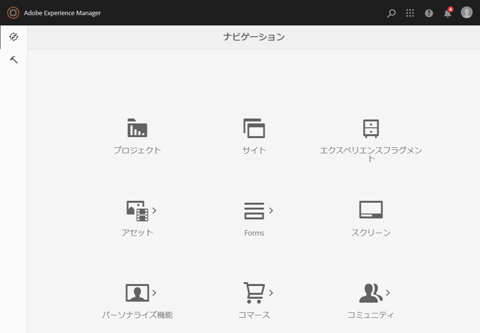
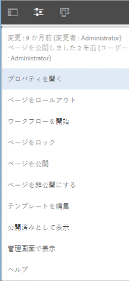

# UI の選択{#selecting-your-ui}

タッチ対応 UI が標準 UI になり、サイトの管理と編集はほぼ同等の機能を持つようになりましたが、[クラシック UI](/help/sites-classic-ui-authoring/classicui.md) に切り替えたくなることもあるでしょう。そのためのオプションがいくつか用意されています。

>[!NOTE]
>
>クラシック UI の機能の同一性の状況について詳しくは、[タッチ UI 機能の同一性](/help/release-notes/touch-ui-features-status.md)のドキュメントを参照してください。

様々な場所で、使用する UI を定義できます。

* [ユーザーのインスタンス用のデフォルト UI の設定](#configuring-the-default-ui-for-your-instance)ユーザーのログイン時にデフォルトで表示する UI を設定します。ただし、ユーザーはこの設定を上書きしたり、自分のアカウントまたは現在のセッション用に別の UI を選択したりできます。

* [ユーザーのアカウント用のクラシック UI オーサリングの設定](/help/sites-authoring/select-ui.md#setting-classic-ui-authoring-for-your-account)ページの編集時にデフォルトで使用する UI を設定します。ただし、ユーザーはこの設定を上書きしたり、自分のアカウントまたは現在のセッション用に別の UI を選択したりできます。

* [現在のセッションでのクラシック UI への切り替え](#switching-to-classic-ui-for-the-current-session)現在のセッション用にクラシック UI に切り替えます。

* [ページのオーサリング時には、状況に応じて、UI が自動的に上書きされます](#ui-overrides-for-the-editor)。

>[!CAUTION]
>
>クラシック UI に切り替えるための様々なオプションは、そのまますぐに使用することはできません。使用しているインスタンス用に設定する必要があります。
>
>See [Enabling Access to Classic UI](/help/sites-administering/enable-classic-ui.md) for more information.

>[!NOTE]
>
>以前のバージョンからアップグレードされたインスタンスでは、ページオーサリング用にクラシック UI が保持されます。
>
>After upgrade, page authoring will not be automatically switched to the touch-enabled UI, but you can configure this using the [OSGi configuration](/help/sites-deploying/configuring-osgi.md) of the **WCM Authoring UI Mode Service** ( `AuthoringUIMode` service). [エディターの UI 上書き](#ui-overrides-for-the-editor)を参照してください。

## ユーザーのインスタンス用のデフォルト UI の設定 {#configuring-the-default-ui-for-your-instance}

システム管理者は、[ルートマッピング](/help/sites-deploying/osgi-configuration-settings.md#daycqrootmapping)を使用して、起動時およびログイン時に表示される UI を設定できます。

この設定はユーザーデフォルトまたはセッション設定によって上書きできます。

## ユーザーのアカウント用のクラシック UI オーサリングの設定 {#setting-classic-ui-authoring-for-your-account}

各ユーザーは、[ユーザーの環境設定](/help/sites-authoring/user-properties.md#userpreferences)にアクセスして、ページオーサリング用に（デフォルト UI の代わりに）クラシック UI を使用するかどうかを定義できます。

この設定はセッション設定によって上書きできます。

## 現在のセッションでのクラシック UI への切り替え {#switching-to-classic-ui-for-the-current-session}

タッチ対応 UI を使用しているデスクトップユーザーは、必要に応じてクラシック UI（デスクトップ専用）に戻すことができます。現在のセッション用にクラシック UI に切り替えるには、複数の方法があります。

* **ナビゲーションリンク**

   >[!CAUTION]
   >
   >クラシック UI に切り替えるためのこのオプションは、そのまますぐに使用することはできません。使用しているインスタンス用に設定する必要があります。
   >
   >
   >See [Enabling Access to Classic UI](/help/sites-administering/enable-classic-ui.md) for more information.

   これが有効な場合、該当するコンソールの上にマウスポインターを置くたびに、アイコン（モニターのシンボル）が表示され、これをタップ／クリックすると、適切な場所がクラシック UI で開きます。

   例えば、**サイト**&#x200B;から **siteadmin** へのリンクなどです。

   

* **URL**

   The classic UI can be accessed using the URL for the welcome screen at `welcome.html`. For example:

   `https://localhost:4502/welcome.html`

   >[!NOTE]
   >
   >タッチ対応 UI には、`sites.html` 経由でアクセスできます。次に例を示します。
   >
   >
   >`https://localhost:4502/sites.html`

### ページ編集時のクラシック UI への切り替え {#switching-to-classic-ui-when-editing-a-page}

>[!CAUTION]
>
>クラシック UI に切り替えるためのこのオプションは、そのまますぐに使用することはできません。使用しているインスタンス用に設定する必要があります。
>
>See [Enabling Access to Classic UI](/help/sites-administering/enable-classic-ui.md) for more information.

有効な場合は、**ページ情報**&#x200B;ダイアログで&#x200B;**クラシック UI を開く**&#x200B;が使用可能です。

### エディターの UI 上書き {#ui-overrides-for-the-editor}

ページのオーサリング時には、ユーザーまたはシステム管理者が定義した設定がシステムによって上書きされることがあります。

* ページのオーサリング時には次のようになります。

   * Use of the classic editor is forced when accessing the page using `cf#` in the URL. 次に例を示します。
      `https://localhost:4502/cf#/content/geometrixx/en/products/triangle.html`

   * Use of the touch-enabled editor is forced when using `/editor.html` in the URL or when using a touch device. 次に例を示します。
      `https://localhost:4502/editor.html/content/geometrixx/en/products/triangle.html`

* 強制は一時的なものであり、ブラウザーセッションでのみ有効です。

   * A cookie set will be set dependent on whether touch-enabled ( `editor.html`) or classic ( `cf#`) is used.

* `siteadmin` を使用してページを開くと、以下が存在するかがチェックされます。

   * Cookie
   * ユーザーの環境設定
   * どちらも存在しない場合は、[WCM オーサリング UI モードサービス](/help/sites-deploying/configuring-osgi.md)（**サービス）の** OSGi 設定`AuthoringUIMode`で指定された定義がデフォルトで使用されます。

>[!NOTE]
>
>[ユーザーが既にページオーサリング用の環境設定を定義している](#settingthedefaultauthoringuiforyouraccount)場合は、OSGi プロパティの変更によってその設定が上書きされることはありません。

>[!CAUTION]
>
>既に説明したように、Cookie を使用しているので、次の操作はお勧めしません。
>
>* URL の手動編集 - 非標準の URL を使用すると予期しない状況となり、機能しなくなる可能性があります。
>* 両方のエディターを同時に開く - 例えば、別のウィンドウなど。

