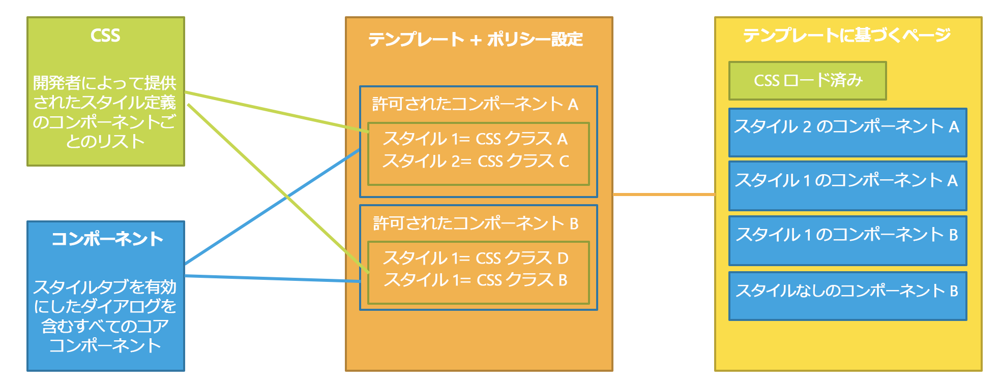
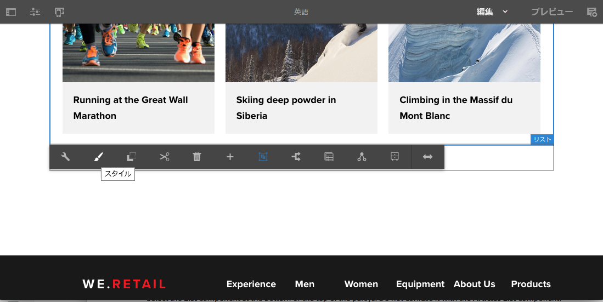
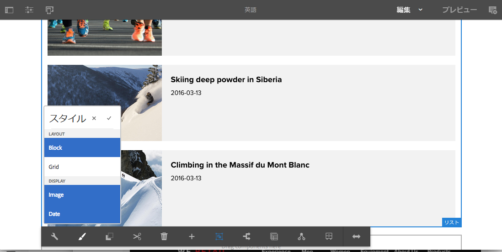
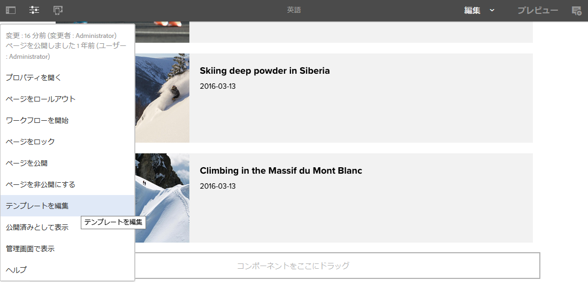
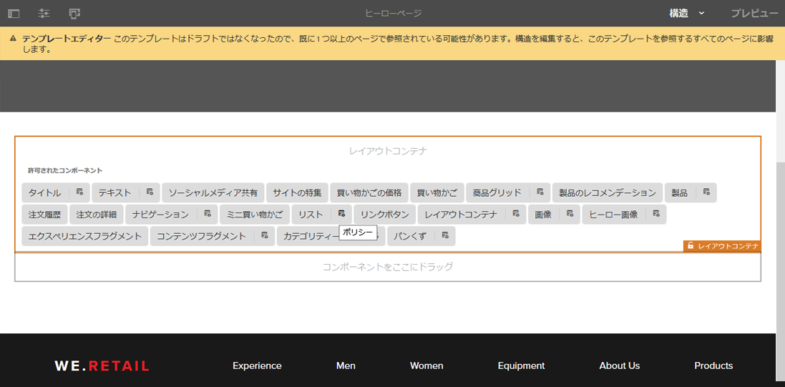
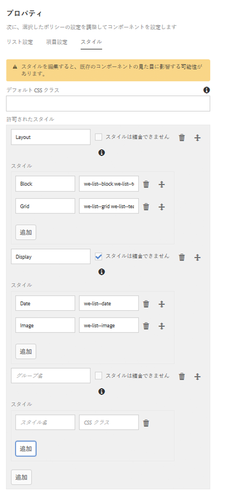

# スタイルシステム{#style-system}

スタイルシステムを使用すると、テンプレート作成者がコンポーネントのコンテンツポリシーのスタイルクラスを定義し、コンテンツ作成者がページでのコンポーネントの編集時にそのスタイルクラスを選択できます。これらのスタイルは、1 つのコンポーネントの別の視覚的バリエーションとして使用することができるので、コンポーネントがより柔軟で扱いやすいものになります。

このため、スタイルごとにカスタムコンポーネントを開発したり、スタイル機能を有効化するためにコンポーネントのダイアログをカスタマイズする必要がなくなりました。これにより、AEM のバックエンド開発をしなくてもそのまま再利用可能な、コンテンツ作成者のニーズにすばやく簡単に応えることができるコンポーネントの数が増加します。

## 使用例 {#use-case}

テンプレート作成者には、コンテンツ作成者がコンポーネントを操作するときの動作を設定する能力だけでなく、1 つのコンポーネントに複数の別の視覚的バリエーションを設定するための能力も必要です。

同様に、コンテンツ作成者には、コンテンツを構築して調整する能力だけでなく、コンテンツの視覚的な表示方法を選択する能力も必要です。

スタイルシステムでは、テンプレート作成者とコンテンツ作成者の双方の要件に対応する統一ソリューションを提供します。

* テンプレート作成者は、コンポーネントのコンテンツポリシーのスタイルクラスを定義できます。
* 次にコンテンツ作成者は、ページでのコンポーネント編集時にドロップダウンからこれらのクラスを選択し、対応するスタイルを適用できます。

その後、スタイルクラスはコンポーネントの装飾ラッパー要素に挿入されるので、コンポーネント開発者は CSS ルールを作成する以外にスタイルを処理する必要はありません。

## 概要 {#overview}

スタイルシステムの使用は通常、次のようにおこなわれます。

1. Web デザイナーは 1 つのコンポーネントに対し様々な視覚的バリエーションを作成します。

1. HTML 開発者にはコンポーネントの HTML 出力と、実装する必要な視覚的バリエーションが提供されます。

1. HTML開発者は、各視覚的なバリエーションに対応し、コンポーネントをラップする要素に挿入されるCSSクラスを定義します。

1. HTML開発者は、各ビジュアルバリエーションに対応するCSSコード（およびオプションでJSコード）を、定義どおりに表示されるように実装します。

1. AEM 開発者は、提供された CSS を（オプションで JS も）[クライアントライブラリ](/help/sites-developing/clientlibs.md)に配置し、デプロイします。

1. AEM開発者またはテンプレート作成者は、ページテンプレートを設定し、各スタイルコンポーネントのポリシーを編集し、定義されたCSSクラスを追加し、各スタイルにわかりやすい名前を付け、結合できるスタイルを示します。

1. 次に AEM ページ作成者は、ページエディターでコンポーネントのツールバーのスタイルメニューからデザイン済みのスタイルを選択できます。

最後の 3 つの手順のみが AEM で実際に実行されます。つまり、必要な CSS と Javascript のすべての開発は AEM なしでおこなうことができます。

実際にスタイルの実装で必要となるのは、AEM へのデプロイメント、および必要なテンプレートのコンポーネント内で選択することのみです。

次の図は、スタイルシステムのアーキテクチャを示しています。

## 使用方法 {#use}

機能を試してみるには、スタイルをコンポーネントに対して作成する必要があります。コアコンポーネントの[リストコンポーネント](https://helpx.adobe.com/experience-manager/core-components/using/list.html)の [We.Retail](/help/sites-developing/we-retail.md) の実装を基盤として使用し、スタイルが含まれている添付パッケージをインストールしてその機能の機能性を確認できます。

スタイルシステム [デモパッケージのダウンロード](assets/package_-_style_systemdemo.zip)

>[!NOTE]
>
>デモパッケージは、スタイルシステムの使用方法を作成者に示すことを目的としており、スタイルシステムの最適な実装方法を示しているわけではありません。
>
>このパッケージが必要となるのは、We.Retail で組み込みの例とベストプラクティスの実装が提供されるまでです。

次の節の[コンテンツ作成者として](/help/sites-authoring/style-system.md#as-a-content-author)と[テンプレート作成者として](/help/sites-authoring/style-system.md#as-a-template-author)では、We.Retail でスタイルシステムデモパッケージを使用してスタイルシステムの機能をテストする方法について説明します。

スタイルシステムを独自のコンポーネントに使用する場合は、次の手順に従います。

1. [概要](/help/sites-authoring/style-system.md#overview)の節の説明に従って、CSS をクライアントライブラリとしてインストールします。
1. [テンプレート作成者として](/help/sites-authoring/style-system.md#as-a-template-author)の節の説明に従って、コンテンツ作成者が使用できるようにする CSS クラスを設定します。
1. この後、コンテンツ作成者は[コンテンツ作成者として](/help/sites-authoring/style-system.md#as-a-content-author)の節の説明に従ってスタイルを使用できます。

### コンテンツ作成者として {#as-a-content-author}

1. After installing the style system demo package, navigate to We.Retail&#39;s English language master home page at `http://localhost:4502/sites.html/content/we-retail/language-masters/en` and edit the page.
1. parsys の下部または上部で&#x200B;**リスト**&#x200B;コンポーネントを選択します。Do not confuse it with the **Articles List** component.

   

1. **リスト**&#x200B;コンポーネントのツールバーで「**スタイル**」ボタンをタップまたはクリックしてスタイルメニューを開き、コンポーネントの外観を変更します。

   

   >[!NOTE]
   >
   >In this example, the **Layout** styles (**Block** and **Grid**) are mutually exclusive, while the **Display** options (**Image** or **Date**) can be combined. これは、[テンプレート作成者としてテンプレートで設定可能](/help/sites-authoring/style-system.md#as-a-template-author)です。

### テンプレート作成者として {#as-a-template-author}

1. While editing We.Retail&#39;s English language master home page at `http://localhost:4502/sites.html/content/we-retail/language-masters/en`, edit the template of the page via **Page Information -> Edit Template**.

   

1. コンポーネントの「**ポリシー**」ボタンをタップまたはクリックして、**リスト**&#x200B;コンポーネントのポリシーを編集します。これを&#x200B;**記事のリスト**&#x200B;コンポーネントと混同しないでください。

   

1. プロパティの「スタイル」タブで、スタイルがどのように設定されているかを確認できます。

   

   * **グループ名：**&#x200B;スタイルは、コンポーネントのスタイルの設定時にコンテンツ作成者に表示されるスタイルメニュー内にまとめてグループ化できます。
   * **スタイルは結合できません：**&#x200B;そのグループ内の複数のスタイルを一度に選択できます。
   * **スタイル名：**&#x200B;コンポーネントのスタイルの設定時にコンテンツ作成者に表示されるスタイルの説明。
   * **CSS クラス：**&#x200B;スタイルと関連付けられている CSS クラスの実際の名前。
   ドラッグハンドルを使用して、グループの順序やグループ内のスタイルを調整します。追加アイコンや削除アイコンを使用して、グループやグループ内のスタイルを追加したり削除したりします。

>[!CAUTION]
>
>The CSS classes (as well as any necessary Javascript) configured as style properties of a component&#39;s policy must be deployed as [Client Libraries](/help/sites-developing/clientlibs.md) in order to work.

## セットアップ {#setup}

>[!NOTE]
>
>コアコンポーネントのバージョン 2 はスタイルシステムの活用に完全に対応しているので、追加の設定は不要です。
>
>スタイルシステムを独自のカスタムコンポーネントで有効にする場合、またはコアコンポーネントのバージョン 1 を拡張して機能を使用する場合は、次の手順に従います。

コンポーネントが AEM のスタイルシステムと連動し、デザインダイアログに「スタイル」タブが表示されるようにするには、コンポーネント開発者はコンポーネントに次の設定をおこなうことによって製品から「スタイル」タブを含める必要があります。

* `path = "/mnt/overlay/cq/gui/components/authoring/dialog/style/tab_design/styletab"`
* `sling:resourceType = "granite/ui/components/coral/foundation/include"`

コンポーネントが設定されると、すべての編集可能なコンポーネントを自動的にラップする装飾要素に、ページ作成者が設定したスタイルが自動的に挿入されます。この他にコンポーネント自体でおこなう必要があることはありません。

### 要素名を持つスタイル {#styles-with-element-names}

開発者は `cq:styleElements` 文字列配列プロパティを使用して、コンポーネントのスタイルに使用できる要素名のリストを設定することもできます。その後、テンプレート作成者はデザインダイアログのポリシーの「スタイル」タブで各スタイルに設定する要素名を選択することもできます。これにより、ラッパー要素の要素名が設定されます。

This property is set on the `cq:Component` node. 次に例を示します。

* `/apps/weretail/components/content/list@cq:styleElements=[div,section,span]`

>[!CAUTION]
>
>組み合わせ可能なスタイルに要素名は定義しないでください。複数の要素名を定義した場合、優先順位は次のようになります。
>
>1. HTLは、次のすべての要素よりも優先されます。 `data-sly-resource="${'path/to/resource' @ decorationTagName='span'}`
>1. 次に、複数のアクティブなスタイルの中で、コンポーネントのポリシーで設定されたスタイルのリストの最初のスタイルが優先されます。
>1. Finally, the component&#39;s `cq:htmlTag`/ `cq:tagName` will be considered as a fallback value.
>

スタイル名を定義するこの機能は、レイアウトコンテナやコンテンツフラグメントコンポーネントなどの非常に一般的なコンポーネントに意味を追加できます。

For instance it allows a Layout Container to be given semantics like `<main>`, `<aside>`, `<nav>`, etc.
