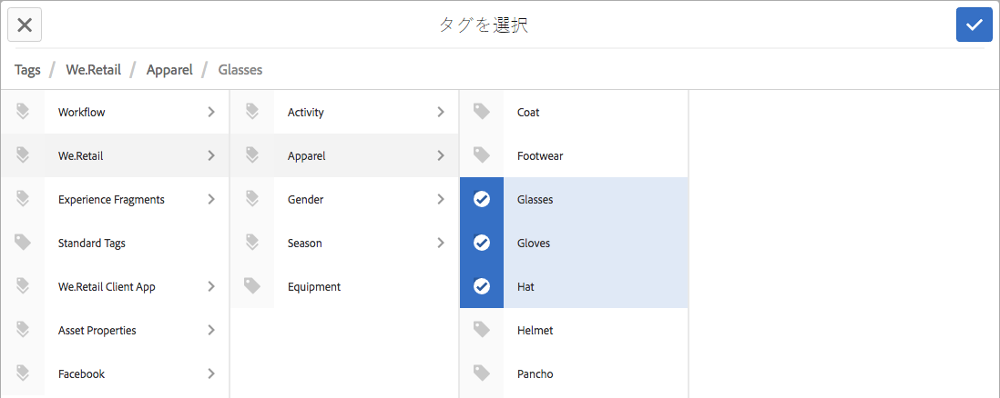

# タグの使用{#using-tags}

タグを使用すると、Web サイト内のコンテンツをすばやく簡単に分類できます。タグはキーワードやラベルとしてページ、アセット、その他のコンテンツに添付し、コンテンツや関連コンテンツを検索できます。

* See [Administering Tags](/help/sites-administering/tags.md) for information about creating and managing tags, as well as to which content tags have been applied.
* See [Tagging for Developers](/help/sites-developing/tags.md) for information about the tagging framework as well as including and extending tags in custom applications.

## タグを使用する 10 の理由 {#ten-reasons-to-use-tagging}

1. **コンテンツの整理** - タグを使用すると、作成者が少しの労力でコンテンツをすばやく整理できます。
1. **タグの整理** - タグによってコンテンツが整理され、階層の分類／名前空間によってタグが整理されます。
1. **細かく整理されたタグ** - タグおよびサブタグの作成機能を使用すると、用語、サブ用語および用語同士の関係を含め、分類システム全体を表現できるようになります。これにより、正式な階層に合わせてコンテンツの二次（または三次）階層を作成できます。
1. **タグ付けの制御** - タグ付けは、タグや名前空間にタグの作成や適用を制御する権限を付与することで制御できます。
1. **柔軟なタグ付け** - タグ、分類用語、カテゴリ、ラベル、その他多くの名前や項目をタグに設定できます。タグのコンテンツモデルや使用方法は自由です。例えば、ターゲット層に説明を付けたり、コンテンツの分類や評価をおこなうとき、またはコンテンツの二次階層を作成するために使用できます。
1. **検索機能の向上** - AEM のデフォルトの検索コンポーネントには作成および適用済みのタグが幅広く含まれ、フィルターを適用して結果を関連性のあるものに絞り込むことができます。
1. **SEO の有効化** - ページのプロパティとして適用されたタグはページのメタタグに自動的に表示され、検索エンジンで確認できるようになります。
1. **簡単操作** - タグはボタンのタッチにより単語から簡単に作成できます。その後、タイトルや説明のほか、ラベルを制限なく追加してタグにセマンティクスをさらに追加できます。
1. **一貫したコア** - タグ付けシステムは AEM のコアコンポーネントであり、AEM のすべての機能でコンテンツの分類に使用されます。さらに、開発者はタグ付け API を使用して、同じ分類にアクセス可能な、タグ付けが有効化されたアプリケーションを作成できます。
1. **構造化と柔軟性の結合** - AEM はページやパスをネストできるので、構造化された情報の処理に最適です。フルテキスト検索機能が組み込まれているので、非構造化の情報の処理する際にも力を発揮します。タグ付けは構造化と柔軟性の両方の利点を結び付けます。

サイトのコンテンツ構造やアセットのメタデータスキーマを設計する際には、タグ付け機能が提供する軽量でアクセス可能なアプローチを検討してください。

## タグの適用 {#applying-tags}

オーサー環境では、作成者はページのプロパティにアクセスし、「**タグ／キーワード**」フィールドに 1 つ以上のタグを入力することでタグを適用できます。

To apply [pre-defined tags](/help/sites-administering/tags.md), in the **Page Properties** window use the **Tags** field and the **Select Tags** window. 「**標準タグ**」タブがデフォルトの名前空間です。これは、分類にプレフィックスされている `namespace-string:` がないことを意味します。

### タグの公開 {#publishing-tags}

ページと同様、タグや名前空間に次の操作を実行できます。

**アクティベート**

* 個々のタグをアクティベートします。

   ページと同様、新しく作成されたタグは、パブリッシュ環境で使用可能となる前にアクティベートする必要があります。

>[!NOTE]
>
>ページをアクティブ化すると、ダイアログが自動的に開き、そのページに属するアクティブ化されていないタグをアクティブ化できます。

**アクティベートを解除**

* 選択したタグのアクティベートを解除します。
