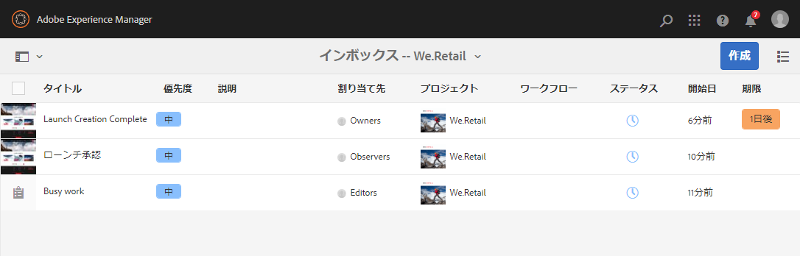

# タスクの操作 {#working-with-tasks}

タスクは、コンテンツに関して実行する作業項目を表します。タスクが割り当てられると、ワークフローインボックスに表示されます。タスク項目とワークフロー項目は、「**タイプ**」列の値によって区別することができます。

タスクは、プロジェクトの完了レベルを決定するために、プロジェクトでも使用されます。

## プロジェクトの進行状況のトラッキング {#tracking-project-progress}

**タスク**&#x200B;タイルで表されるプロジェクト内部のアクティブなタスクまたは完了したタスクを監視することによって、プロジェクトの進行状況をトラックできます。プロジェクトの進行状況は、次のもので判断できます。

* **タスクタイル：**&#x200B;プロジェクトの全体的な進行状況は、プロジェクトの詳細ページに表示されるタスクタイルに表示されます。

* **タスクリスト：**&#x200B;タスクタイルをクリックすると、タスクのリストが表示されます。このリストには、プロジェクトに関連するすべてのタスクの詳細情報が含まれます。

ワークフロータスクと、タスクタイルで直接作成したタスクの両方のオプションが表示されます。

### タスクタイル {#task-tile}

プロジェクトに関連タスクがある場合、プロジェクト内にタスクタイルが表示されます。タスクタイルは、プロジェクトの現在のステータスを示します。このステータスは、ワークフロー内の既存タスクに基づいています。ワークフローの進行に伴って今後作成されるタスクは含まれていません。タスクタイルには、次の情報が表示されます。

* 完了したタスクの割合
* アクティブなタスクの割合
* 期限切れのタスクの割合

### プロジェクト内のタスクの表示または変更 {#viewing-or-modifying-the-tasks-in-a-project}

進行状況のトラッキングに加えて、プロジェクトに関する追加情報を表示または変更することもできます。

#### タスクリスト {#task-list}

タスクタイルの右下にある省略記号ボタンをクリックすると、プロジェクトに関連するタスクでフィルタリングされたインボックスが表示されます。期限、担当者、優先度、ステータスなどのメタデータと共に、タスクの詳細が表示されます。

#### タスクの詳細 {#task-details}

特定のタスクの詳細を表示するには、インボックスでタスクをクリックして選択し、ツールバーの「**開く**」をクリックします。

様々なタブで、タスクの詳細を表示、編集または追加できます。

* **タスク** - タスクの一般情報
* **プロジェクト情報** - タスクが関連付けられているプロジェクトの概要
* **ワークフロー情報** - タスクが関連付けられているワークフローの概要（該当する場合）
* **コメント** - タスク自体に対する一般的なコメント

### タスクの追加 {#adding-tasks}

新しいタスクをプロジェクトに追加できます。これらのタスクはタスクタイルに表示され、通知インボックスで使用できるので、未処理のタスクを把握できます。

タスクを追加するには：

1. プロジェクト内で、**タスク**&#x200B;タイルを探します。
1. タイルの右上にある下向きの山形記号をクリックし、「**タスクを作成**」を選択します。
1. **タスクを追加**&#x200B;ウィンドウで、タスクの詳細（優先度、担当者、期限など）を指定します。

   

1. 「**送信**」をクリックします。

## インボックス内でのタスクの使用 {#working-with-tasks-in-the-inbox}

プロジェクト自体からプロジェクトタスクにアクセスする代わりに、インボックスから直接アクセスできます。インボックスには、ワークフロー全体を理解できるよう、プロジェクト全体のタスクの概要が表示されます。

インボックスからタスクを開き、タスクのステータスを設定できます。所属するユーザーグループにタスクが割り当てられた場合も、そのタスクがインボックスに表示されます。この場合、グループのいずれかのメンバーが作業を実行し、タスクを完了できます。

タスクを完了するには、タスクを選択して「**完了**」をクリックします。タスクに情報を追加して、「**完了**」をクリックします。詳しくは、[インボックス](/help/sites-authoring/inbox.md)を参照してください。
