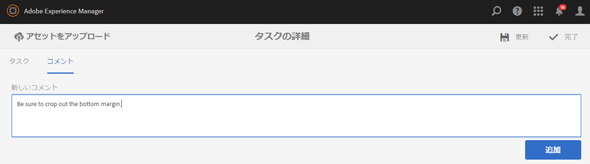

# タスクの操作{#working-with-tasks}

タスクは、コンテンツ上でおこなう作業の項目を表します。タスクが割り当てられると、ワークフローインボックスに表示されます。タスク項目は、「種類」列に task の値があります。

タスクは、プロジェクトでワークフロータスクなどの現在のタスクの完了レベルを判断するためにも使用します。

## プロジェクトの進行状況の追跡 {#tracking-project-progress}

**タスク**&#x200B;タイルで表されるプロジェクト内部のアクティブなタスクまたは完了したタスクを監視することによって、プロジェクトの進行状況を追跡できます。プロジェクトの進行状況は、次のもので判断できます。

* **タスクタイル：**&#x200B;プロジェクトの全体的な進行状況は、プロジェクトの詳細ページに表示されるタスクタイルに表示されます。

* **タスクリスト：**&#x200B;タスクタイルをクリックすると、タスクのリストが表示されます。このリストには、プロジェクトに関連するすべてのタスクの詳細情報が含まれます。

ワークフロータスクと、**タスク**&#x200B;タイルで直接作成したタスクの両方が表示されます。

### タスクタイル {#task-tile}

プロジェクトに関連タスクがある場合、プロジェクト内にタスクタイルが表示されます。タスクタイルは、プロジェクトの現在のステータスを示します。このステータスは、ワークフロー内の既存タスクに基づいています。ワークフローの進行に伴って今後作成されるタスクは含まれていません。タスクタイルには、次の情報が表示されます。

* 完了したタスクの割合
* アクティブなタスクの割合
* 期限切れのタスクの割合

### プロジェクト内のタスクの表示または変更 {#viewing-or-modifying-the-tasks-in-a-project}

進行状況の追跡に加えて、プロジェクトに関する追加情報を表示または変更することもできます。

#### タスクリスト {#task-list}

タスクタイルの省略記号（...）をクリックすると、プロジェクトに関連するタスクのリストが表示されます。タスクは親ワークフロー別に分けられます。期限、担当者、優先度、ステータスなどのメタデータと共に、タスクの詳細が表示されます。

#### タスクの詳細 {#task-details}

特定のタスクの詳細を表示するには、タスクリストでタスクをタップまたはクリックして、**タスクの詳細**&#x200B;を開きます。

### タスクのコメントの表示および変更 {#viewing-and-modifying-task-comments}

タスクの詳細で、コメントを編集または追加できます。プロジェクトに追加されたすべてのコメントは、「コメント」領域に表示されます。

### タスクの追加 {#adding-tasks}

新しいタスクをプロジェクトに追加できます。追加したタスクはタスクタイルに表示され、通知インボックスでそのタスクに対してアクションを実行できるようになります。

タスクを追加するには：

1. プロジェクトの&#x200B;**タスク**&#x200B;タイルで、「+」アイコンをタップまたはクリックします。**タスクを追加**&#x200B;ウィンドウが開きます。
1. タスクに関する情報を入力します。タスクのタイトルと、そのタスクを割り当てるグループは必須です。コンテンツのパス、説明、タスクの優先度、期限などの追加情報はオプションです。さらに、「**詳細**」タブを選択して、URL の命名に使用するタスク名を入力できます。

   

1. 「**作成**」をタップまたはクリックします。

## インボックス内でのタスクの使用 {#working-with-tasks-in-the-inbox}

タスクにアクセスするもう 1 つの方法は、インボックスからアクセスすることです。インボックスからコンテンツを開いて、必要な変更を実行することができます。変更が完了したら、タスクのステータスを「完了」に変更します。所属するユーザーグループにタスクが割り当てられた場合も、そのタスクがインボックスに表示されます。この場合、グループのいずれかのメンバーが作業を実行し、タスクを完了することができます。

タスクを完了するには、タスクを選択して「**完了**」をクリックします。タスクに情報を追加して、「**完了**」をクリックします。詳しくは、[インボックス](/help/sites-authoring/inbox.md)を参照してください。

