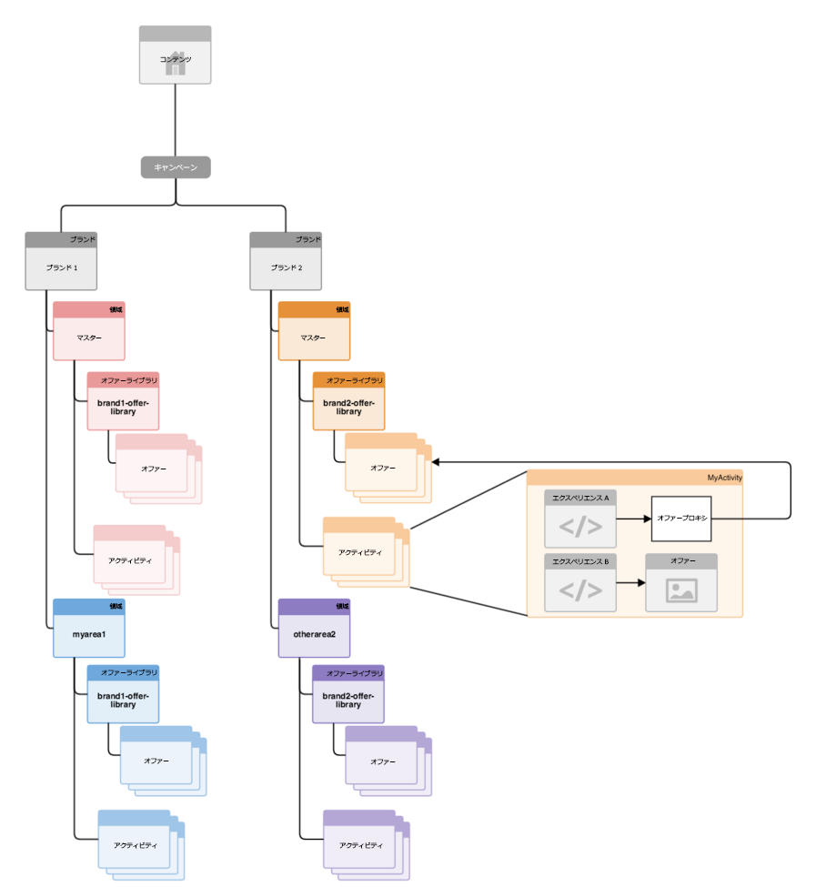
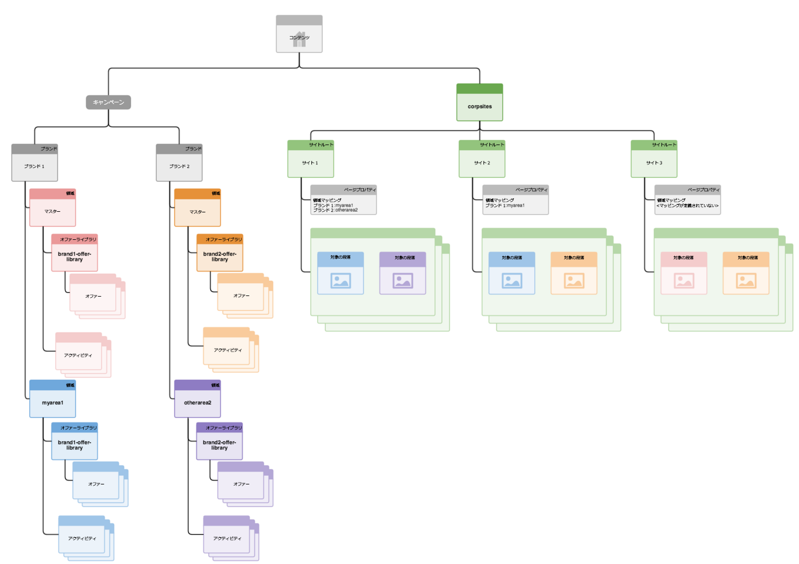

# ターゲットコンテンツ用マルチサイト管理の構造{#how-multisite-management-for-targeted-content-is-structured}

以下の図は、ターゲットコンテンツ用マルチサイト管理の構造を示しています。

領域は **/content/campaigns/&lt;brand>** の下に表示され、デフォルトでは、ブランドごとに自動作成されるマスター領域が 1 つあります。各領域には、独自のアクティビティ、エクスペリエンスおよびオファーのセットが含まれます。

ターゲットコンテンツを参照するために、ページまたはサイトを領域にマップできます。設定されている領域がない場合、AEM はこの特定のブランドのマスター領域にフォールバックします。

以下の図は、site1、site2、site3 という 3 つのサイトに対してロジックがどのように機能するかを示したものです。

* 領域マッピングに基づいて、site1 は、brand1 用として myarea1 領域を、brand2 用として otherarea2 領域を参照します。
* brand1 用の領域マッピングのみが定義されているので、site2 は brand1 用として myarea1 領域を、brand2 用としてマスター領域を参照します。
* site3 に対してはマスター領域以外の領域マッピングがまったく定義されていないので、site3 は brand1 用と brand2 用としてマスター領域を参照します。

