# ページテンプレートの作成{#creating-page-templates}

ページを作成するとき、テンプレートを選択する必要があります。これは新しいページを作成するための基本として使用されます。テンプレートは、作成されるページの構造、初期コンテンツ、および使用できるコンポーネントを定義します。

**テンプレートエディター**&#x200B;により、テンプレートを作成して管理することは、開発者のみのタスクではなくなりました。ある種のパワーユーザーも、**テンプレート作成者**&#x200B;と呼ばれ、関与することができます。環境の設定、クライアントライブラリの作成、使用されるコンポーネントの作成は今でも開発者がおこなう必要がありますが、これら基本となる部分が一度配置されると、**テンプレート作成者**&#x200B;が開発プロジェクトなしにテンプレートを作成して構成できるようになります。

**テンプレートコンソール**&#x200B;により、テンプレート作成者は次のことができます。

* 新しいテンプレートを作成したり、既存のテンプレートをコピーしたりします。
* テンプレートのライフサイクルを管理します。

**テンプレートエディター**&#x200B;により、テンプレート作成者は次のことができます。

* コンポーネントをテンプレートに追加して、それらをレスポンシブグリッドに配置します。
* コンポーネントを事前に設定します。
* テンプレートで作成されたページで、どのコンポーネントを編集できるかを定義します。

このドキュメントでは、**テンプレート作成者**&#x200B;がテンプレートコンソールおよびエディターを使用して、編集可能なテンプレートを作成および管理する方法を説明します。

編集可能なテンプレートが技術レベルで機能する方法について詳しくは、開発者ドキュメント「[ページテンプレート - 編集可能](/help/sites-developing/page-templates-editable.md)」を参照してください。

>[!NOTE]
>
>**テンプレートエディター**&#x200B;は、テンプレートレベルで直接ターゲット設定をサポートしません。編集可能テンプレートに基づいて作成されたページは、ターゲット設定できますが、テンプレート自体はできません。

>[!CAUTION]
>
>Pages and templates created with the **Templates Console** are not meant to be used with the classic UI and such use is not supported.

## 始める前に {#before-you-start}

>[!NOTE]
>
>管理者は、**設定ブラウザー**&#x200B;でテンプレートフォルダーを設定し、テンプレート作成者がそのフォルダーにテンプレートを作成できるように、適切な権限を適用する必要があります。

以下のポイントは、開始する前に考慮すべき重要なものです。

* 新しいテンプレートの作成では共同作業が必要です。この理由から、[役割](#roles)がそれぞれのタスクに示されます。

* インスタンスの設定方法によっては、[テンプレートの 2 つの基本タイプ](/help/sites-authoring/templates.md#editable-and-static-templates)が AEM で現在提供されていることを把握しておくと便利です。これは、実際に[テンプレートを使用してページを作成する](#using-a-template-to-create-a-page)方法に影響を与えませんが、作成できるテンプレートの種類およびページがそのテンプレートに関係する方法には影響を与えます。

### 役割 {#roles}

**テンプレートコンソール**&#x200B;および&#x200B;**テンプレートエディター**&#x200B;を使用する新しいテンプレートの作成では、次の役割の間の共同作業が必要です。

* **管理者**：

   * `admin` 権限が必要なテンプレートのために新しいフォルダーを作成します。

   * こうしたタスクは、多くの場合開発者がおこなうことができます。

* **開発者**：

   * 技術的／内部的詳細に集中します。
   * 開発環境の経験が必要です。
   * テンプレート作成者に必要な情報を提供します。

* **テンプレート作成者**：

   * グループ `template-authors` のメンバーである特定の作成者です。

      * 必要な特権および権限を割り当てます。
   * コンポーネントおよび次のものを必要とするその他の高レベルの使用法を設定できます。

      * 一部の技術的知識

         * 例えば、パスを定義するときのパターンの使用。
      * 開発者からの技術情報。

一部タスク（フォルダーの作成など）の性質により、開発環境が必要です。これには知識と経験が必要です。

このドキュメントで説明されるタスクは、それらの実行を担当する役割とともにリストされています。

### 編集可能および静的テンプレート {#editable-and-static-templates}

AEM には、次の 2 つのタイプの基本テンプレートが用意されています。

* [編集可能なテンプレート](/help/sites-authoring/templates.md#creatingandmanagingnewtemplates)

   * **テンプレート**&#x200B;コンソールおよびエディターを使用して、テンプレート作成者が[作成](#creatinganewtemplate)および[編集](#editingatemplate)できます。**テンプレート**&#x200B;コンソールは、**ツール**&#x200B;コンソールの&#x200B;**一般**&#x200B;セクションでアクセスできます。

   * 新しいページが作成された後も、ページとテンプレートの間で動的な接続が維持されます。つまり、テンプレート構造やロックされたコンテンツに変更を加えると、そのテンプレートを使用して作成されたすべてのページに反映されます。ロックが解除された（初期）コンテンツに対する変更は反映されません。
   * コンテンツポリシーを使用します。これでデザインプロパティを永続させるために、テンプレートエディターからそれらを定義できます。ページエディター内のデザインモードは、編集可能なテンプレートでは今後使用できません。

* 静的テンプレート

   * 静的テンプレートは、AEM の複数のバージョンで使用できました。
   * これらは[開発者によって提供されているため、](/help/sites-developing/page-templates-static.md)作成者が作成および変更することはできません。
   * 新しいページはテンプレートをコピーして作成されるので、動的接続は存在しません（ただし、情報としてテンプレート名は登録されます）。
   * 設計プロパティを保持するには、[デザインモード](/help/sites-authoring/default-components-designmode.md)を使用します。
   * Because editing static templates is the exclusive task of a developer, please see the developer document [Page Templates - Static](/help/sites-developing/page-templates-static.md) for more information.

定義により、テンプレートコンソールおよびテンプレートエディターでは、編集可能なテンプレートの作成および編集だけが可能です。このため、このドキュメントは、編集可能なテンプレートだけにフォーカスします。

### テンプレートを使用してページを作成する {#using-a-template-to-create-a-page}

テンプレートを[新しいページを作成](/help/sites-authoring/managing-pages.md#creating-a-new-page)するために使用するときは、静的テンプレートと編集可能なテンプレートの間に視覚的な違いはありません。ページの作成者にとって、この処理は透過的です。

## テンプレートの作成と管理 {#creating-and-managing-templates}

新しい編集可能テンプレートを作成する場合は、次の手順を実行します。

* **テンプレート**&#x200B;コンソールを使用します。これは、**ツール**&#x200B;コンソールの&#x200B;**一般**&#x200B;セクションにあります。

   * または直接アクセスします：[https://localhost:4502/libs/wcm/core/content/sites/templates.html/conf](https://localhost:4502/libs/wcm/core/content/sites/templates.html/conf)

* 必要に応じて、[テンプレート用のフォルダーを作成](#creating-a-template-folder-admin)できます。
* [新しいテンプレートを作成します](#creatinganewtemplateauthor)（最初は空の状態です）。 

* （必要に応じて）テンプレートの[追加プロパティを定義](#definingtemplatepropertiesauthor)します。
* [テンプレートを編集](#editingtemplates)して次の要素を定義します。

   * [構造](#editingatemplatestructureauthor) - テンプレートで作成されたページでは変更できない定義済みのコンテンツ。
   * [初期コンテンツ](#editing-a-template-initial-content-author) - テンプレートで作成されたページで変更可能な定義済みのコンテンツ。
   * [レイアウト](#editingatemplatelayoutauthor) - 広範なデバイスに対応させるために使用します。
   * [スタイル](/help/sites-authoring/style-system.md) - テンプレートおよびそのコンポーネントで使用されるスタイルを定義します。

* ページ作成時に使用するために[テンプレートを有効化します](#enablingatemplateauthor)。
* Web サイトの必要なページまたはブランチのために[テンプレートを許可します。](#allowing-a-template-author)
* 公開環境で利用できるようにするために[テンプレートを公開します。](#publishingatemplateauthor)

>[!NOTE]
>
>多くの場合、**許可されたテンプレート**&#x200B;は Web サイトが最初に設定されたときに事前定義されています。

>[!CAUTION]
>
>テンプレートには[国際化](/help/sites-developing/i18n.md)が必要な情報は絶対に入れないようにしてください。

### テンプレートフォルダーの作成 - 管理者 {#creating-a-template-folder-admin}

テンプレートフォルダーは、プロジェクト固有のテンプレートを保持するためプロジェクトで作成する必要があります。これは、管理者タスクであり、ドキュメント「[ページテンプレート - 編集可能](/help/sites-developing/page-templates-editable.md#template-folders)」で説明しています。

### 新しいテンプレートの作成 - テンプレート作成者 {#creating-a-new-template-template-author}

1. **テンプレートコンソール**&#x200B;を（**ツール**／**一般**&#x200B;から）開き、必要なフォルダーに移動します。

   >[!NOTE]
   >
   >標準の AEM インスタンスでは、テンプレートコンソールに既に&#x200B;**グローバル**&#x200B;フォルダーが存在します。この中にデフォルトのテンプレートが格納されており、現在のフォルダーにポリシーやテンプレートタイプがない場合にはフォールバックとして機能します。
   >
   >
   >[プロジェクトで作成されたテンプレートフォルダー](/help/sites-developing/page-templates-editable.md#template-folders)を使用することが推奨されるベストプラクティスです。

1. 「**作成**」、「**テンプレートを作成**」を選択し、ウィザードを開きます。

1. 「**テンプレートタイプ**」を選択してから、「**次へ**」を選択します。

   >[!NOTE]
   >
   >テンプレートタイプは、定義済みのテンプレートレイアウトであり、テンプレートのためのテンプレートであると見なすことができます。これらは、開発者またはシステム管理者が事前定義します。詳しくは、開発者ドキュメント「[ページテンプレート - 編集可能](/help/sites-developing/page-templates-editable.md#template-type)」を参照してください。

1. 次の「**テンプレート詳細**」を入力します。

   * **テンプレート名**
   * **説明**

1. 「**作成**」を選択します。確認メッセージが表示されます。テンプレートの編集を開始するには「**開く**」、テンプレートコンソールに戻るには「**完了**」を選択します。

   >[!NOTE]
   >
   >新しく作成されたテンプレートは、コンソールで&#x200B;**ドラフト**&#x200B;とマークされます。これは、ページ作成者がまだテンプレートを使用できないことを示します。

### テンプレートプロパティの定義 - テンプレート作成者 {#defining-template-properties-template-author}

テンプレートには、次のプロパティを指定できます。

* 画像

   * 画像は[テンプレートのサムネール](/help/sites-authoring/templates.md#template-thumbnail-image)として「ページを作成」ウィザードなどで選択を容易にするために使用します。

      * アップロード可能
      * テンプレートコンテンツに基づいて生成可能

* タイトル

   * タイトルは「**ページを作成**」ウィザードなどでテンプレートを識別するために使用します。

* 説明

   * 説明では「**ページの作成**」ウィザードなどで表示できるテンプレートとその用途に関する詳細情報を追加します。

プロパティを表示または編集するには：

1. **テンプレートコンソール**&#x200B;で、テンプレートを選択します。
1. ツールバーまたはクイックオプションから「**プロパティを表示**」を選択してダイアログを開きます。
1. これでテンプレートのプロパティを表示または編集できます。

>[!NOTE]
>
>テンプレートのステータス（ドラフト、有効、無効）は、コンソールに示されます。

#### テンプレートサムネールの画像 {#template-thumbnail-image}

テンプレートサムネールを定義するには：

1. テンプレートのプロパティを編集します。
1. サムネールをアップロードするか、テンプレートコンテンツから生成するかを選びます。

   * サムネールをアップロードする場合は、「**画像をアップロード**」をクリックまたはタップします。
   * サムネールを生成する場合は、「**プレビューを生成**」をタップまたはクリックします。

1. どちらの方法でも、サムネールのプレビューが表示されます。

   このサムネールで満足できない場合は、**クリア**&#x200B;をタップまたはクリックして、他の画像をアップロードするか、サムネールを再生成します。

1. 満足できる場合は、「**保存して閉じる**」をクリックまたはタップします。

### テンプレートの有効化および許可 - テンプレート作成者 {#enabling-and-allowing-a-template-template-author}

ページを作成するときにテンプレートを使用するには、以下の作業が必要です。

* [テンプレートの有効化](#enablingatemplate)で、ページを作成するときに使用できるようにします。
* [テンプレートの許可](#allowingatemplate)でテンプレートを使用できるコンテンツブランチを指定します。

#### テンプレートの有効化 - テンプレート作成者 {#enabling-a-template-template-author}

テンプレートを有効化または無効化して、「**ページを作成**」ウィザードで使用できるようにするか、使用できないようにします。

>[!CAUTION]
>
>テンプレートを有効化すると、テンプレート作成者がテンプレートをさらに更新しようとするときに警告が表示されます。これは、テンプレートが参照されている可能性があること、変更するとテンプレートを参照しているページに影響が及ぶ可能性があることをユーザーに通知するためのものです。

1. **テンプレートコンソール**&#x200B;で、テンプレートを選択します。
1. ツールバーから「**有効**」または「**無効**」を選択して、確認ダイアログで再び選択します。
1. これで[新しいページを作成する](/help/sites-authoring/managing-pages.md#creating-a-new-page)ときにテンプレートを使用できます。ただし、ほとんどの場合は要件に従って[テンプレートを編集する](#editingatemplate)必要があります。

>[!NOTE]
>
>テンプレートのステータス（ドラフト、有効、無効）は、コンソールに示されます。

#### テンプレートの許可 - 作成者 {#allowing-a-template-author}

テンプレートは、特定のページブランチに対して使用可能または使用不可にすることができます。

1. テンプレートを使用できるようにするブランチのルートページの[ページプロパティ](/help/sites-authoring/editing-page-properties.md)を開きます。

1. 「**詳細**」タブを開きます。

1. **テンプレート設定**&#x200B;で「**フィールドを追加**」を使用してテンプレートへのパスを指定します。

   パスは直接入力またはパターンを使用できます。例えば、次のように指定します。

   `/conf/<your-folder>/settings/wcm/templates/.*`

   パスの順序は無関係で、すべてのパスがスキャンされ、あらゆるテンプレートが取得されます。

   >[!NOTE]
   >
   >**許可されたテンプレート**&#x200B;のリストが空の場合、値／リストが見つかるまでツリーを上に移動します。
   >
   >
   >See [Template Availability](/help/sites-developing/templates.md#template-availability) - the principles for allowed templates remain the same.

1. 「**保存**」をクリックして、ページプロパティの変更を保存します。

>[!NOTE]
>
>多くの場合、許可されたテンプレートはサイト設定されたときにサイト全体に対して事前定義されています。

### テンプレートの公開 - テンプレート作成者 {#publishing-a-template-template-author}

ページが表示されるときにテンプレートが参照される場合、テンプレートをパブリッシュ環境で使用できるようにするには、（完全に設定された）テンプレートを公開する必要があります。

1. **テンプレートコンソール**&#x200B;で、テンプレートを選択します。
1. ツールバーから「**公開**」を選択してウィザードを開きます。
1. 連携して公開される&#x200B;**コンテンツポリシー**&#x200B;を選択します。

1. ツールバーから「**公開**」を選択してアクションを完了します。

## テンプレートの編集- テンプレート作成者 {#editing-templates-template-authors}

テンプレートを作成（または編集）するときに、様々な側面を定義できます。テンプレートの編集は、ページのオーサリングに似ています。

テンプレートの以下の要素を編集できます。

* [構造](#editingatemplatestructure)

   ページ作成者は、ここで追加されたコンポーネントを結果ページから移動および削除できません。ページ作成者がコンポーネントを結果ページに移動またはコンポーネントを削除するには、テンプレートに段落システムを追加する必要があります。

   コンポーネントがロックされているとコンテンツは追加できますが、ページ作成者はこれを編集できません。コンポーネントのロックを解除して、[初期コンテンツ](#editingatemplateinitialcontent)を定義できます。

   >[!NOTE]
   >
   >構造モードで、ロックが解除されたコンポーネントの親コンポーネントは移動、切り取り、削除できません。

* [初期コンテンツ](#editingatemplateinitialcontent)

   コンポーネントのロックが解除されていると、結果ページにコピーされる、テンプレートから作成された初期コンテンツを定義できます。これらのロックが解除されたコンポーネントは結果ページで編集できます。

   >[!NOTE]
   >
   >**初期コンテンツ**&#x200B;モードおよび結果ページで、アクセス可能な親を持つ、ロックが解除されたすべてのコンポーネント（例：レイアウトコンテナ内のコンポーネント）は削除できます。

* [レイアウト](#editingatemplatelayout)

   ここでは、必要なデバイスの形式に合わせたテンプレートのレイアウトを事前定義できます。テンプレートオーサリングの&#x200B;**レイアウト**&#x200B;モードにはページオーサリングの&#x200B;[**レイアウト**&#x200B;モードと同じ機能があります](/help/sites-authoring/responsive-layout.md#defining-layouts-layout-mode)。

* [ページポリシー](#editingatemplatepagepolicies)

   ページポリシーの下で、定義済みのページポリシーをページに接続できます。これらのページポリシーは、様々なデザイン設定を定義します。

* [スタイル](/help/sites-authoring/style-system.md)

   スタイルシステムを使用すると、テンプレート作成者がコンポーネントのコンテンツポリシーのスタイルクラスを定義し、コンテンツ作成者がページでのコンポーネントの編集時にそのスタイルクラスを選択できます。これらのスタイルは、1 つのコンポーネントの別の視覚的バリエーションとして使用することができるので、コンポーネントがより柔軟で扱いやすいものになります。

   詳しくは、[スタイルシステムのドキュメント](/help/sites-authoring/style-system.md)を参照してください。

ツールバーの&#x200B;**モード**&#x200B;セレクターを使用すると、テンプレートの適切な外観を選択して編集できます。

* [構造](#editingatemplatestructure)
* [初期コンテンツ](#editingatemplateinitialcontent)
* [レイアウト](#editingatemplatelayout)

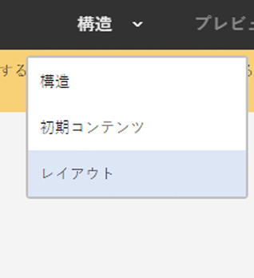

**ページ情報**&#x200B;メニューの「**ページポリシー**」オプションを使用すると、[必要なページポリシーを選択](#editingatemplatepagepolicies)できます。

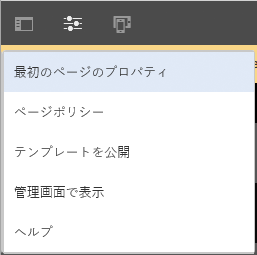

>[!CAUTION]
>
>作成者が既に有効化されているテンプレートの編集を開始すると、警告が表示されます。これは、テンプレートが参照されている可能性があること、変更するとテンプレートを参照しているページに影響が及ぶ可能性があることをユーザーに通知するためのものです。

### テンプレートの編集 - 構造 - テンプレート作成者 {#editing-a-template-structure-template-author}

**構造**&#x200B;モードで、テンプレートのコンポーネントおよびコンテンツを定義し、テンプレートおよびそのコンポーネントのポリシーを定義できます。

* テンプレート構造で定義されたコンポーネントは、結果ページに移動することも、結果ページから削除することもできません。
* ページ作成者がコンポーネントを追加または削除するには、テンプレートに段落システムを追加する必要があります。
* コンポーネントのロックを解除（再度ロックできます）して、[初期コンテンツ](#editingatemplateinitialcontent)を定義できます。

* コンポーネントおよびページのデザインポリシーが定義されます。

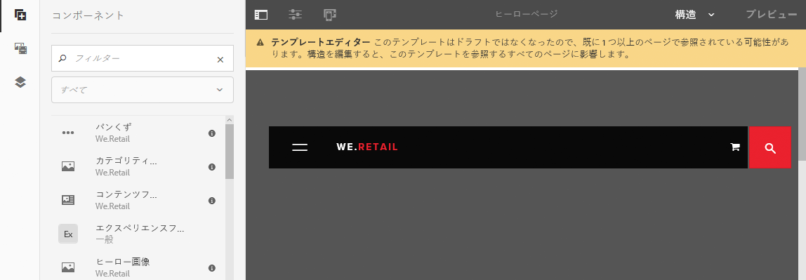

テンプレートエディターの&#x200B;**構造**&#x200B;モードでは、次の操作を実行できます。

* **コンポーネントの追加**

   テンプレートにコンポーネントを追加する方法はいくつか用意されています。

   * サイドパネルの&#x200B;**コンポーネント**&#x200B;ブラウザーを使用します。
   * テンプレートに既に存在するコンポーネントのツールバーにある「**コンポーネントを挿入**」オプション（**+** アイコン）または&#x200B;**コンポーネントをここにドラッグ**&#x200B;ボックスを使用します。

   * （サイドパネルの&#x200B;**アセット**&#x200B;ブラウザーから）アセットをテンプレートに直接ドラッグしてサイトに適切なコンポーネントを生成します。

   追加すると、各コンポーネントは次の要素でマーキングされます。

   * 境界線
   * コンポーネントの種類を示すマーカー
   * コンポーネントのロックが解除されていることを示すマーカー

   >[!NOTE]
   >
   >テンプレートに（最初から用意されている）**タイトル**&#x200B;コンポーネントを追加すると、デフォルトのテキスト&#x200B;**構造**&#x200B;が含まれます。
   >
   >
   >これを変更し、独自のテキストを追加すると、テンプレートからページが作成されるときにこの更新されたテキストが使用されます。
   >
   >
   >デフォルトのテキスト（構造）のままにすると、タイトルはデフォルトで後続のページの名前になります。

   >[!NOTE]
   >
   >まったく同じではありませんが、テンプレートにコンポーネントやアセットを追加する操作は、[ページをオーサリングする](/help/sites-authoring/editing-content.md)ときのアクションと数多くの類似点があります。

* **コンポーネントのアクション**

   コンポーネントがテンプレートに追加されると、コンポーネントでアクションが実行されます。個々のインスタンスにはそれぞれ、使用可能なアクションにアクセスできるツールバーが用意されています。ツールバーはコンポーネントの種類によって異なります。

   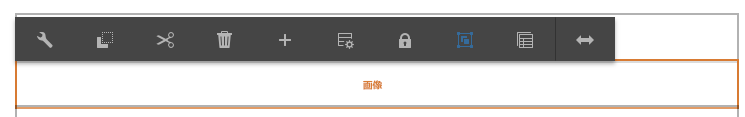

   また、実行されるアクションに依存します。例えば、コンポーネントのポリシーが関連付けられていると、デザイン設定アイコンが使用できるようになります。

* **編集と設定**

   これら 2 つのアクションにより、コンポーネントにコンテンツを追加できます。

* **構造を示す境界線**

   **構造**&#x200B;モードで、オレンジ色の境界線は現在選択されているコンポーネントを示します。また、点線は親コンポーネントを示します。

   例えば、下のスクリーンショットでは&#x200B;**レイアウトコンテナ**（responsivegrid）内で&#x200B;**テキスト**&#x200B;コンポーネントが選択されています。

   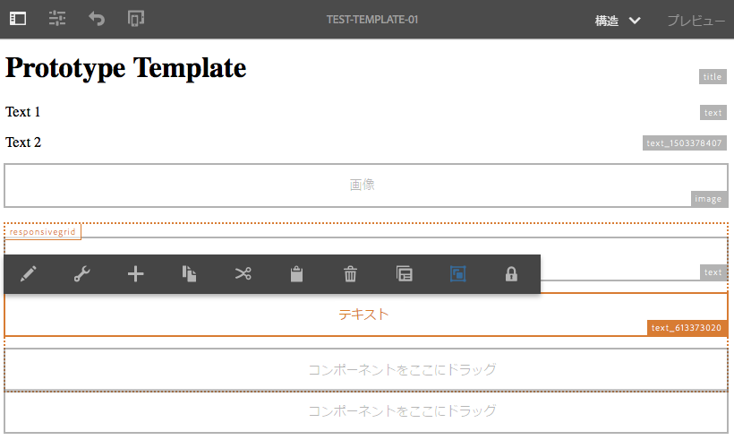

* **ポリシーおよびプロパティ（一般）**

   コンテンツ（またはデザイン）ポリシーにより、コンポーネントのデザインプロパティが定義されます。例えば、使用可能なコンポーネントまたは最小／最大寸法です。これらのポリシーは、テンプレートと、そのテンプレートを使用して作成されるページに適用されます。

   コンポーネントのコンテンツポリシーを作成するか、既存のポリシーを選択します。これにより、デザイン詳細を定義できます。

    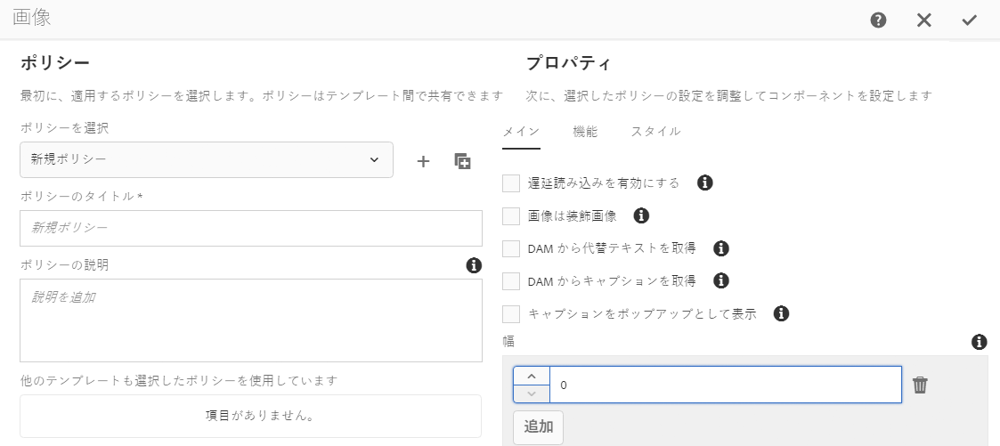

   設定ウィンドウは 2 つに分割されます。

   * **ポリシー**&#x200B;の下のダイアログの左側では、既存のポリシーを選択したり、既存のものを選択したりすることができます。
   * **プロパティ**&#x200B;の下のダイアログの右側では、コンポーネントタイプ固有のプロパティを設定できます。

   利用できるプロパティは選択されたコンポーネントに依存します。例えば、テキストコンポーネントのプロパティでは、コピー＆ペーストのオプション、フォーマットのオプション、パラグラフスタイルなどが定義されます。

   ***ポリシー***

   コンテンツ（またはデザイン）ポリシーにより、コンポーネントのデザインプロパティが定義されます。例えば、使用可能なコンポーネントまたは最小／最大寸法です。これらのポリシーは、テンプレートと、そのテンプレートを使用して作成されるページに適用されます。

   **ポリシー**&#x200B;の下で、既存のポリシーを選択して、ドロップダウンからコンポーネントに適用できます。

   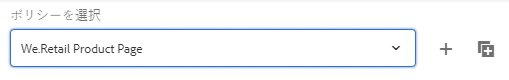

   新しいポリシーは、**ポリシーの選択**&#x200B;ドロップダウンの横にある追加ボタンを選択して追加できます。新しいタイトルを「**ポリシーのタイトル**」フィールドに入力します。

   

   **ポリシーの選択**&#x200B;ドロップダウンで選択された既存のポリシーは、ドロップダウンの横にあるコピーボタンを使用して、新規ポリシーにコピーできます。新しいタイトルを「**ポリシーのタイトル**」フィールドに入力します。デフォルトで、コピーされたポリシーは「**X のコピー**」というタイトルになります。ここで X はコピーされたポリシーのタイトルです。

   

   ポリシーの説明は、「**ポリシーの説明**」フィールドにオプションで入力できます。

   「**他のテンプレートも選択したポリシーを使用しています**」セクションでは、「**ポリシーの選択**」ドロップダウンで選択したポリシーを、他のどのテンプレートが使用しているかを簡単に確認できます。

   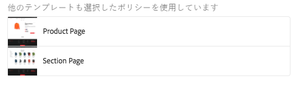

   >[!NOTE]
   >
   >同じタイプの複数のコンポーネントが初期コンテンツとして追加される場合は、同じポリシーがすべてのコンポーネントに適用されます。これは、静的テンプレートの&#x200B;[**デザインモード**&#x200B;の同じ制限を反映します](/help/sites-authoring/default-components-designmode.md)。

   ***プロパティ***

   **プロパティ**&#x200B;の見出しの下で、コンポーネントの設定を定義できます。見出しには次の 2 つのタブがあります。

   * メイン
   * 機能

   *メイン*

   **メイン**&#x200B;タブでは、コンポーネントの最も重要な設定が定義されます。

   例えば、画像コンポーネントでは、許容される幅は、レイジーローディングを有効にするとともに定義できます。

   設定で複数の設定が許される場合は、「**追加**」ボタンをクリックまたはタップして、他の設定を追加します。

   

   設定を削除するには、設定の右にある「**削除**」ボタンをクリックまたはタップします。

   設定を削除するには、「**削除**」ボタンをクリックまたはタップします。

   

   *特長*

   「**機能**」タブを使用すると、コンポーネントの追加の機能を有効または無効にできます。

   例えば、画像コンポーネントでは、切り抜き比率、許容される画像の方向、およびアップロードを許可するかどうかを定義できます。

   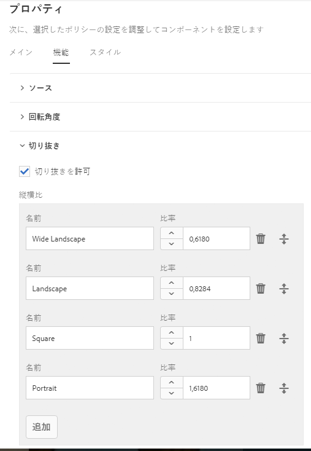

   >[!CAUTION]
   >
   >AEM のトリミング比率は、**高さ/幅**&#x200B;で定義されます。これは、幅／高さの従来の定義と異なり、レガシー互換性の理由でおこなわれます。ページオーサリングユーザーは、**名前**&#x200B;を明確に定義していれば、これが UI に表示されるので、違いに気が付きません。

   >[!NOTE]
   >
   >リッチテキストエディターを実装するコンポーネントのコンテンツポリシーは、UI 設定を通じて RTE で提供されるオプションに対してのみ定義できます。

* **ポリシーおよびプロパティ（レイアウトコンテナ）**

   レイアウトコンテナのポリシーおよびプロパティ設定は、一般使用の場合と似ていますが、いくつか違いがあります。

   >[!NOTE]
   >
   >ポリシーの設定はコンテナコンポーネントでは必須です。これにより、コンテナで使用できるコンポーネントを定義できるからです。

   ウィンドウの一般使用の場合と同じく、設定ウィンドウは 2 つに分割されます。

   ***ポリシー***

   コンテンツ（またはデザイン）ポリシーにより、コンポーネントのデザインプロパティが定義されます。例えば、使用可能なコンポーネントまたは最小／最大寸法です。これらのポリシーは、テンプレートと、そのテンプレートを使用して作成されるページに適用されます。

   **ポリシー**&#x200B;の下で、既存のポリシーを選択して、ドロップダウンからコンポーネントに適用できます。これは、ウィンドウの一般使用の場合と同じく機能します。

   ***プロパティ***

   **プロパティ**&#x200B;見出しの下で、レイアウトコンテナのために使用できるコンポーネントを選択して、それらの設定を定義することができます。見出しには次の 3 つのタブがあります。

   * 許可されたコンポーネント
   * デフォルトのコンポーネント
   * レスポンシブ設定

   *許可されたコンポーネント*

   **許可されたコンポーネント**&#x200B;タブで、レイアウトコンテナのために使用できるコンポーネントを判断できます。

   * コンポーネントは、コンポーネントグループ別にグループ化されています。それらのグループは、展開したり折りたたんだりできます。
   * グループ名にチェックマークを付けることでグループ全体を選択でき、またチェックマークを外すことですべて選択解除できます。
   * マイナス記号はグループの中のすべてではなく少なくとも 1 つが選択されることを示します。
   * 名前でコンポーネントをフィルターするために、検索を使用できます。
   * コンポーネントグループ名の右側に示されるカウントは、フィルターに関係なく、そのグループで選択されているコンポーネントの総数を表します。

   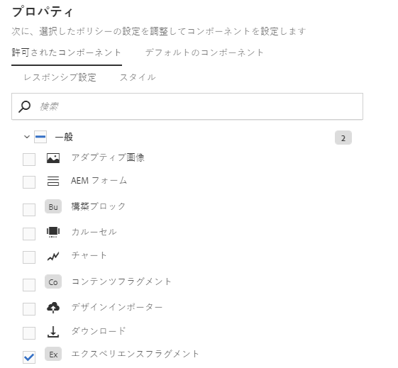

   *デフォルトのコンポーネント*

   **デフォルトのコンポーネント**&#x200B;タブで、与えられたメディアタイプに自動的に関連付けられるコンポーネントを定義できるので、作成者がアセットをアセットブラウザーからドラッグするとき、AEM にはそれに関連付けられるコンポーネントがわかります。ドロップゾーンのあるコンポーネントだけが、こうした設定のために使用できます。

   「**マッピングの追加**」をクリックまたはタップして、完全に新しいコンポーネントおよび MIME タイプマッピングを追加します。

   リストの中のコンポーネントを選択し、「**タイプの追加**」をクリックまたはタップして、既にマップされているコンポーネントに追加の MIME タイプを追加します。「**削除**」アイコンをクリックして、MIME タイプを削除します。

   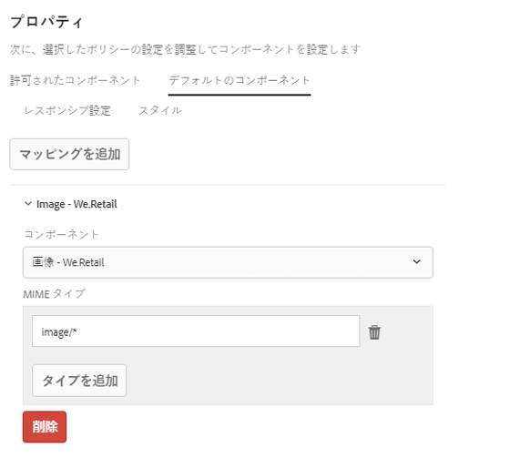

   *レスポンシブ設定*

   **レスポンシブ設定**&#x200B;タブで、レイアウトコンテナの結果グリッドの列数を設定できます。

* **コンポーネントのロック／ロック解除**

   コンポーネントをロックまたはロック解除することで、コンテンツを&#x200B;**初期コンテンツ**&#x200B;モードで変更できるかどうかを定義します。

   コンポーネントのロックが解除されているときは、次のようになります。

   * 境界線に開いている鍵アイコンのインジケーターが表示されます。
   * コンポーネントツールバーが適宜調整されます。
   * 既に入力されているコンテンツは、**構造**&#x200B;モードではもはや表示されなくなります。

      * 既に入力されているコンテンツは、初期コンテンツと見なされて、**初期コンテンツ**&#x200B;モードだけで表示されます。
   * ロックが解除されたコンポーネントの親コンポーネントは移動、切り取り、削除できません。

   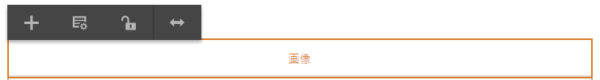

   これには、ロック解除コンテナコンポーネントも含まれるので、**初期コンテンツ**&#x200B;モードまたは結果ページのいずれかに、さらにコンポーネントを追加できます。ロック解除前にコンテナにコンポーネント／コンテンツを既に追加している場合は、これらは今後&#x200B;**構造**&#x200B;モードでは表示されなくなりますが、**初期コンテンツ**&#x200B;モードでは表示されます。**構造**&#x200B;モードでは、コンテナコンポーネント自体だけがその&#x200B;**許容コンポーネント**&#x200B;のリストとともに表示されます。

   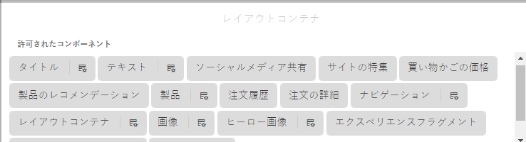

   スペースを節約するため、レイアウトコンテナは、許可されたコンポーネントのリストが収まるように拡大されません。代わりにコンテナがスクロールできるリストになります。

   設定できるコンポーネントは、「**ポリシー**」アイコン付きで表示され、それをタップまたはクリックすると、そのコンポーネントのポリシーおよびプロパティを編集できます。

   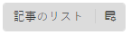

* **既存ページとの関係性**

   構造が、テンプレートに基づいてページを作成した後で更新される場合、これらのページはテンプレートの変更を反映します。ツールバーに警告が表示されて、この事実が確認ダイアログとともに示されます。

   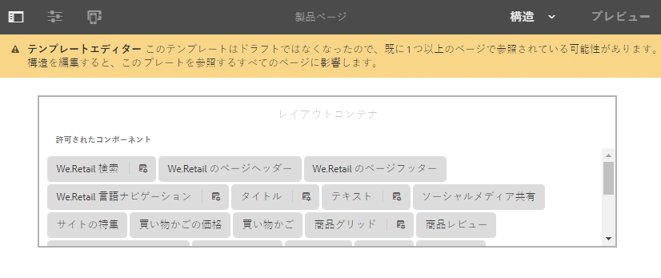

### テンプレートの編集 - 初期コンテンツ - 作成者 {#editing-a-template-initial-content-author}

**初期コンテンツ**&#x200B;モードは、テンプレートに基づいてページが最初に作成されるときに、表示されるコンテンツを定義するために使用されます。その後初期コンテンツはページ作成者が編集できます。

**構造**&#x200B;モードで作成されたすべてのコンテンツは&#x200B;**初期コンテンツ**&#x200B;に表示されますが、選択および編集できるのはロックが解除されているコンポーネントのみです。

>[!NOTE]
>
>**初期コンテンツ**&#x200B;モードは、そのテンプレートで作成されたページの編集モードと考えることができます。このため、ポリシーは、**初期コンテンツ**&#x200B;モードで定義されず、[**構造**&#x200B;モードで定義されます](/help/sites-authoring/templates.md#editing-a-template-structure-template-author)。

* 編集可能なロックが解除されたコンポーネントはマーキングされています。選択すると、青い境界線が表示されます。

   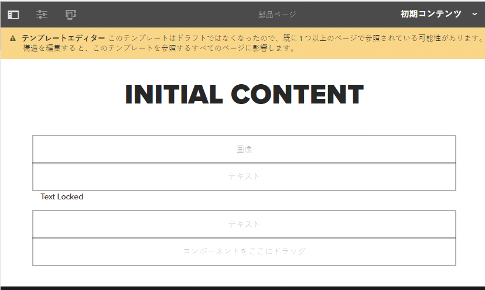

* ロックが解除されたコンポーネントにはツールバーがあり、コンテンツを編集および設定できます。

   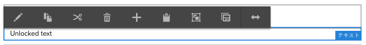

* （**構造**&#x200B;モードで）コンテナコンポーネントのロックが解除されている場合、（**初期コンテンツ**&#x200B;モードで）新しいコンポーネントをコンテナに追加できます。**初期コンテンツ**&#x200B;モードに追加されるコンポーネントは、結果ページに移動したり、そこから削除したりできます。

   コンポーネントは、**コンポーネントをここにドラッグ**&#x200B;領域を使用するか、適切なコンテナのツールバーから「**新規コンポーネントを挿入**」オプションを使用して追加できます。

    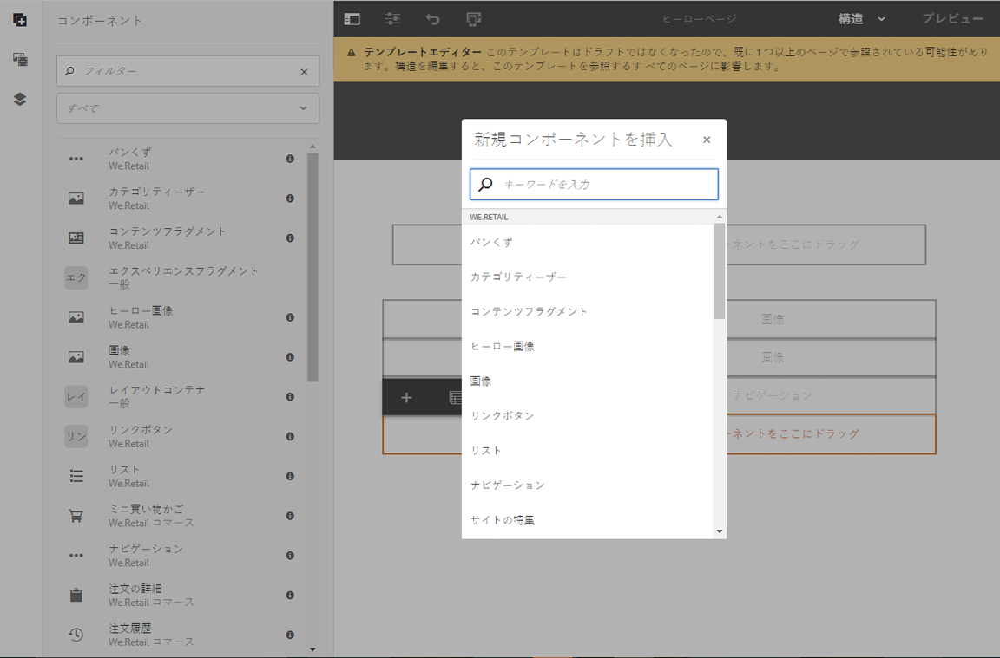

* テンプレートに基づいてページを作成した後に、テンプレートの初期コンテンツを更新しても、これらのページはテンプレートの初期コンテンツの変更により影響を受けません。

>[!NOTE]
>
>初期コンテンツは、コンテンツを作成するための出発点となるコンポーネントおよびページレイアウトを準備するためのものです。そのまま残す実際のコンテンツとなるものではありません。そのため、初期コンテンツは変換できません。
>
>ヘッダーやフッターなど、翻訳可能なテキストをテンプレートに含める必要がある場合は、[コアコンポーネントのローカライゼーション機能](https://docs.adobe.com/content/help/ja-JP/experience-manager-core-components/using/get-started/localization.html)を使用できます。

### テンプレートの編集 - レイアウト - テンプレート作成者 {#editing-a-template-layout-template-author}

デバイスの形式に合わせてテンプレートのレイアウトを定義できます。[テンプレートがページオーサリングと同じように動作するには、レスポンシブレイアウトを使用します。](/help/sites-authoring/responsive-layout.md)

>[!NOTE]
>
>レイアウトの変更は&#x200B;**初期コンテンツ**&#x200B;モードには反映されますが、**構造**&#x200B;モードには反映されません。

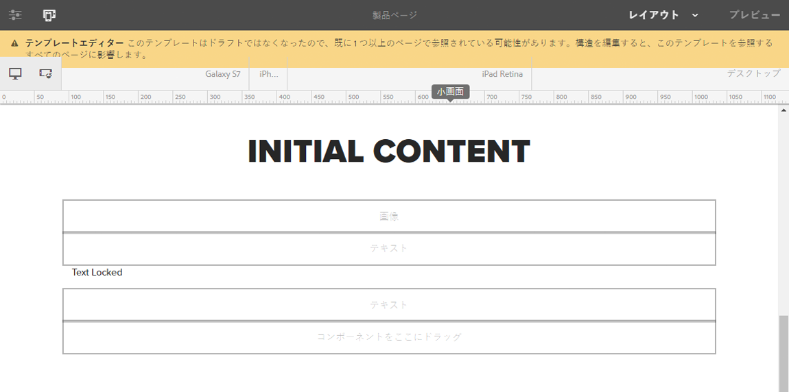

### テンプレートの編集 - ページデザイン - テンプレート作成者／開発者 {#editing-a-template-page-design-template-author-developer}

必要なクライアント側ライブラリおよびページポリシーを含むページデザインは、**ページ情報**&#x200B;メニューの「**ページデザイン**」オプションの下に維持されます。

**ページデザイン**&#x200B;ダイアログにアクセスするには

1. From the **Template Editor**, select **Page Information** from the toolbar, then **Page Design** to open the dialog.
1. **ページデザイン**&#x200B;ダイアログが開いて、次の 2 つのセクションに分割されます。

   * 左半分は、[ページポリシー](/help/sites-authoring/templates.md#page-policies)を定義します。
   * 右半分は、[ページプロパティ](/help/sites-authoring/templates.md#page-properties)を定義します。

   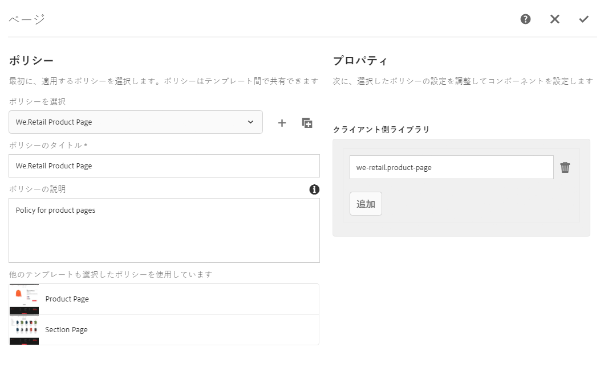

#### ページポリシー {#page-policies}

テンプレートまたは結果ページのいずれかにコンテンツポリシーを適用できます。これにより、ページ上の主段落システムのコンテンツポリシーが定義されます。

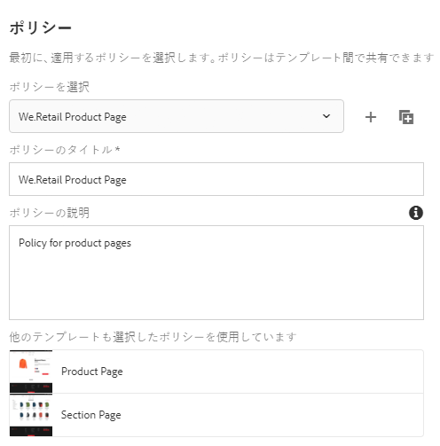

* **ポリシーの選択**&#x200B;ドロップダウンからページ用の既存のポリシーを選択できます。

   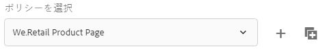

   新しいポリシーは、**ポリシーの選択**&#x200B;ドロップダウンの横にある追加ボタンを選択して追加できます。新しいタイトルを「**ポリシーのタイトル**」フィールドに入力します。

   

   **ポリシーの選択**&#x200B;ドロップダウンで選択された既存のポリシーは、ドロップダウンの横にあるコピーボタンを使用して、新規ポリシーにコピーできます。新しいタイトルを「**ポリシーのタイトル**」フィールドに入力します。デフォルトで、コピーされたポリシーは「**X のコピー**」というタイトルになります。ここで X はコピーされたポリシーのタイトルです。

   

* ポリシーのタイトルを「**ポリシーのタイトル**」フィールドで定義します。ポリシーにはタイトルを指定する必要がありますが、これは&#x200B;**ポリシーの選択**&#x200B;ドロップダウンから簡単に選択できます。

   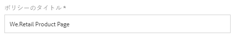

* ポリシーの説明は、「**ポリシーの説明**」フィールドにオプションで入力できます。
* 「**他のテンプレートも選択したポリシーを使用しています**」セクションでは、「**ポリシーの選択**」ドロップダウンで選択したポリシーを、他のどのテンプレートが使用しているかを簡単に確認できます。

   

#### ページプロパティ {#page-properties}

ページのプロパティを使用し、「**ページデザイン**」ダイアログを使用して、必要なクライアント側ライブラリを定義できます。これらのクライアント側ライブラリには、テンプレートおよびそのテンプレートで作成されたページとともにロードされるスタイルシートおよび JavaScript が含まれます。

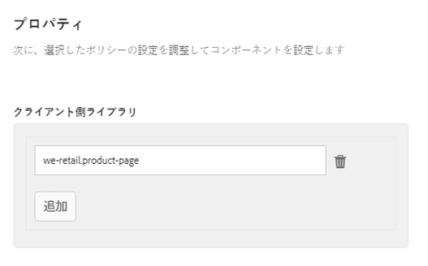

* このテンプレートで作成されるページに対して適用するクライアント側ライブラリを指定します。**クライアント側ライブラリ**&#x200B;セクションのテキストフィールドにライブラリ名を入力します。

   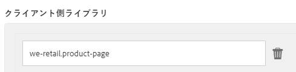

* 複数のライブラリが必要な場合は、「追加」ボタンをクリックして、ライブラリ名のために追加のテキストフィールドを追加します。

   

   クライアント側ライブラリで必要なだけいくつでも任意の数のテキストフィールドを追加します。

   

* 必要に応じて、ドラッグハンドルを使用してフィールドをドラッグすることで、ライブラリの相対位置を定義します。

   

>[!NOTE]
>
>テンプレート作成者が、テンプレートにページポリシーを指定できる一方、その作成者は開発者から適切なクライアント側ライブラリの詳細を得る必要があります。

### テンプレートの編集 - 最初のページのプロパティ - 作成者 {#editing-a-template-initial-page-properties-author}

「**最初のページのプロパティ**」オプションを使用して、結果ページの作成時に使用される最初の[ページプロパティ](/help/sites-authoring/editing-page-properties.md)を定義できます。

1. テンプレートエディターのツールバーで、**ページ情報**／**最初のページのプロパティ**&#x200B;と選択してダイアログを開きます。

1. ダイアログで、このテンプレートで作成されるページに対して適用するプロパティを定義できます。

   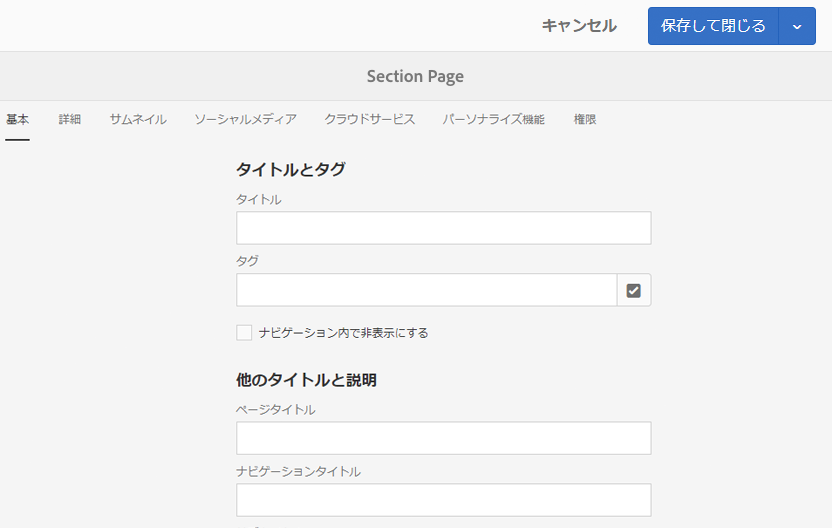

1. 「**完了**」で定義を確認します。

## ベストプラクティス {#best-practices}

新しいテンプレートを作成するときには、次の点を考慮してください。

1. テンプレートに対する変更がそのテンプレートを使用して作成されたページに及ぼす影響。

   テンプレートに対しておこなうことができる各種操作と、その操作が結果ページに与える影響を次に示します。

   * 構造の変更

      * これらは、結果ページにすぐに適用されます。
      * 訪問者が変更を見るために、変更されたテンプレートの公開がやはり必要です。
   * コンテンツポリシーおよびデザイン設定の変更

      * これらは、結果ページにすぐに適用されます。
      * 訪問者が変更を見るために、変更の公開が必要です。
   * 初期コンテンツの変更

      * これらは、テンプレートへの変更後に作成されたページにのみ適用されます。
   * レイアウトに対する変更：変更されるコンポーネントが次のいずれであるかによって変わります。

      * 構造のみ - すぐに適用されます
      * 初期コンテンツが含まれる - 変更後に作成されたページに対してのみ

   以下の場合は特別に注意します。

   * 有効化されたテンプレートでのコンポーネントのロックまたはロック解除
   * 既存のページが既にそれを使用している可能性があるので、これにより副作用が起こる可能性があります。一般的に、以下のようになります。

      * （ロックされていた）コンポーネントのロックを解除すると既存のページに表示されなくなります。
      * （編集可能だった）コンポーネントをロックするとそのコンテンツがページに表示されることを防ぎます。

   >[!NOTE]
   >
   >ドラフトでなくなったテンプレートのコンポーネントのロック状態を変更すると、AEM は明示的に警告します。

1. サイト固有のテンプレートに[独自のフォルダーを作成](#creatingatemplatefolderdeveloper)します。
1. **テンプレート**&#x200B;コンソールから[独自のテンプレートを公開](#publishingatemplateauthor)します。
