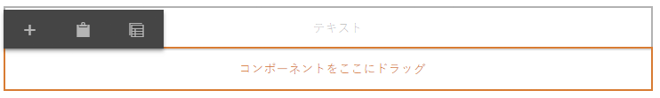

# ページテンプレートの作成{#creating-page-templates}

ページを作成する際は、新しいページを作成する際の基礎として使用するテンプレートを選択する必要があります。 テンプレートは、結果ページの構造、初期コンテンツ、使用可能なコンポーネントを定義します。

**テンプレートエディター**&#x200B;により、テンプレートを作成して管理することは、開発者のみのタスクではなくなりました。ある種のパワーユーザーも、**テンプレート作成者**&#x200B;と呼ばれ、関与することができます。環境の設定、クライアントライブラリの作成、使用されるコンポーネントの作成は今でも開発者が行う必要がありますが、これら基本となる部分が一度配置されると、**テンプレート作成者**&#x200B;が開発プロジェクトなしにテンプレートを作成して構成できるようになります。

The **テンプレートコンソール** テンプレート作成者が次の操作を実行できるようにします。

* 新しいテンプレートを作成したり、既存のテンプレートをコピーしたりします。
* テンプレートのライフサイクルを管理します。

The **テンプレートエディター** テンプレート作成者が次の操作を実行できるようにします。

* テンプレートにコンポーネントを追加し、レスポンシブグリッドに配置します。
* コンポーネントを事前に設定します。
* テンプレートで作成されたページで編集可能なコンポーネントを定義します。

このドキュメントでは、 **テンプレート作成者** テンプレートコンソールとエディターを使用して、編集可能なテンプレートを作成および管理できます。

編集可能なテンプレートが技術レベルで機能する方法について詳しくは、開発者向けドキュメントを参照してください。 [ページテンプレート — 編集可能](/help/sites-developing/page-templates-editable.md) を参照してください。

>[!NOTE]
>
>**テンプレートエディター**&#x200B;は、テンプレートレベルで直接ターゲット設定をサポートしません。編集可能なテンプレートに基づいて作成されたページは、ターゲット設定できますが、テンプレート自体はできません。

>[!CAUTION]
>
>**テンプレートコンソール**&#x200B;で作成されたページおよびテンプレートは、クラシック UI で使用することを意図しておらず、そうした使用はサポートされていません。

## 始める前に {#before-you-start}

>[!NOTE]
>
>管理者は、**設定ブラウザー**&#x200B;でテンプレートフォルダーを設定し、テンプレート作成者がそのフォルダーにテンプレートを作成できるように、適切な権限を適用する必要があります。

開始する前に考慮すべき重要なポイントは次のとおりです。

* 新しいテンプレートを作成するには、共同作業が必要です。 この理由から、[ロール](#roles)がそれぞれのタスクに示されます。

* インスタンスの設定方法によっては、AEMでが提供されることを認識しておくと便利です [2 つの基本的なタイプのテンプレート](/help/sites-authoring/templates.md#editable-and-static-templates). これは、実際の [テンプレートを使用したページの作成](#using-a-template-to-create-a-page)作成できるテンプレートのタイプと、ページとテンプレートとの関係は変わりません。

### ロール {#roles}

**テンプレートコンソール**&#x200B;および&#x200B;**テンプレートエディター**&#x200B;を使用する新しいテンプレートの作成では、次の役割の間の共同作業が必要です。

* **管理者**:

   * `admin` 権限が必要なテンプレートのために新しいフォルダーを作成します。

   * こうしたタスクは、多くの場合開発者が行うことができます。

* **開発者**：

   * 技術的/内部的な詳細に集中
   * 開発環境の経験が必要です。
   * テンプレート作成者に必要な情報を提供します。

* **テンプレート作成者**：

   * グループ `template-authors` のメンバーである特定の作成者です。

      * 必要な特権および権限を割り当てます。

   * 次の要件を満たすコンポーネントやその他の高度な詳細の使用を設定できます。

      * 技術的な知識

         * 例えば、パスを定義する際にパターンを使用します。

      * 開発者からの技術情報。

フォルダーの作成など、一部のタスクの性質上、開発環境が必要です。これには知識と経験が必要です。

このドキュメントで説明されるタスクは、それらの実行を担当するロールとともにリストされています。

### 編集可能および静的テンプレート {#editable-and-static-templates}

AEMには、次の 2 つの基本的なタイプのテンプレートが用意されました。

* [編集可能なテンプレート](/help/sites-authoring/templates.md#creatingandmanagingnewtemplates)

   * **テンプレート**&#x200B;コンソールおよびエディターを使用して、テンプレート作成者が[作成](#creatinganewtemplate)および[編集](#editingatemplate)できます。**テンプレート**&#x200B;コンソールは、**ツール**&#x200B;コンソールの&#x200B;**一般**&#x200B;セクションでアクセスできます。

   * 新しいページが作成されると、ページとテンプレートの間に動的な接続が維持されます。 つまり、テンプレート構造やロックされたコンテンツに対する変更は、そのテンプレートで作成されたすべてのページに反映されます。 ロック解除された（初期の）コンテンツに対する変更は反映されません。
   * コンテンツポリシーを使用して、デザインプロパティを保持します。コンテンツポリシーは、テンプレートエディターで定義できます。 ページエディター内のデザインモードは、編集可能なテンプレートには使用されなくなりました。

* 静的テンプレート

   * 静的テンプレートは、AEM の複数のバージョンで使用できます。
   * これらは[開発者によって提供](/help/sites-developing/page-templates-static.md)されているため、作成者が作成および編集することはできません。
   * 新しいページはテンプレートをコピーして作成されるので、動的接続は存在しません（ただし、情報としてテンプレート名は登録されます）。
   * デザインプロパティを保持するには、[デザインモード](/help/sites-authoring/default-components-designmode.md)を使用します。
   * 静的テンプレートの編集は開発者だけが行うタスクなので、詳しくは開発者ドキュメント「[ページテンプレート - 静的](/help/sites-developing/page-templates-static.md)」を参照してください。

定義により、テンプレートコンソールとテンプレートエディターでは、編集可能なテンプレートの作成と編集のみが可能です。 したがって、このドキュメントでは、編集可能なテンプレートにのみ焦点を当てています。

### テンプレートを使用したページの作成 {#using-a-template-to-create-a-page}

テンプレートを使用して [新しいページを作成](/help/sites-authoring/managing-pages.md#creating-a-new-page) 静的テンプレートと編集可能テンプレートの間には、目に見える違いはなく、表示もありません。 ページの作成者にとって、この処理は透過的です。

## テンプレートの作成と管理 {#creating-and-managing-templates}

新しい編集可能テンプレートを作成する場合は、次の手順を実行します。

* 以下を使用します。 **テンプレート** コンソール。 これは、 **一般** のセクション **ツール** コンソール。

   * または、直接アクセスします（例：[https://localhost:4502/libs/wcm/core/content/sites/templates.html/conf](https://localhost:4502/libs/wcm/core/content/sites/templates.html/conf)）。

* 必要に応じて、[テンプレート用のフォルダーを作成](#creating-a-template-folder-admin)できます。
* [新しいテンプレートを作成します](#creatinganewtemplateauthor)（最初は空の状態です）。

* [追加のプロパティを定義する](#definingtemplatepropertiesauthor) （必要に応じて）テンプレート用
* [テンプレートの編集](#editingtemplates) を定義するには、次の手順に従います。

   * [構造](#editingatemplatestructureauthor) - テンプレートで作成されたページでは変更できない定義済みのコンテンツ。
   * [初期コンテンツ](#editing-a-template-initial-content-author) - テンプレートで作成されたページで変更可能な定義済みのコンテンツ。
   * [レイアウト](#editingatemplatelayoutauthor) - 広範なデバイスに対応させるために使用します。
   * [スタイル](/help/sites-authoring/style-system.md) - テンプレートおよびそのコンポーネントで使用されるスタイルを定義します。

* [テンプレートを有効にする](#enablingatemplateauthor) （ページを作成する際に使用）
* Web サイトの必要なページまたはブランチのために[テンプレートを許可します。](#allowing-a-template-author)
* [テンプレートを公開します](#publishingatemplateauthor) パブリッシュ環境で使用できるようにするには

>[!NOTE]
>
>多くの場合、**許可されたテンプレート**&#x200B;は Web サイトが最初に設定されたときに事前定義されています。

>[!CAUTION]
>
>テンプレートには[国際化](/help/sites-developing/i18n.md)が必要な情報は絶対に入れないようにしてください。国際化のためには、[コアコンポーネントのローカライゼーション機能](https://experienceleague.adobe.com/docs/experience-manager-core-components/using/get-started/localization.html?lang=ja)の利用をお勧めします。

### テンプレートフォルダーの作成 - 管理者 {#creating-a-template-folder-admin}

テンプレートフォルダーは、プロジェクト固有のテンプレートを保持するためプロジェクトで作成する必要があります。これは管理者タスクであり、ドキュメントで説明されています。 [ページテンプレート — 編集可能](/help/sites-developing/page-templates-editable.md#template-folders).

### 新しいテンプレートの作成 - テンプレート作成者 {#creating-a-new-template-template-author}

1. **テンプレートコンソール**&#x200B;を（**ツール**／**一般**&#x200B;から）開き、必要なフォルダーに移動します。

   >[!NOTE]
   >
   >標準の AEM インスタンスでは、テンプレートコンソールに既に&#x200B;**グローバル**&#x200B;フォルダーが存在します。この中にデフォルトのテンプレートが格納されており、現在のフォルダーにポリシーやテンプレートタイプがない場合にはフォールバックとして機能します。
   >
   >
   >ベストプラクティスとして、 [プロジェクト用に作成されたテンプレートフォルダー](/help/sites-developing/page-templates-editable.md#template-folders).

1. 「**作成**」、「**テンプレートを作成**」を選択し、ウィザードを開きます。

1. を選択します。 **テンプレートタイプ**&#x200B;を選択し、「 **次へ**.

   >[!NOTE]
   >
   >テンプレートタイプは定義済みのテンプレートレイアウトで、テンプレートのテンプレートと考えることができます。 これらは、開発者またはシステム管理者が事前に定義したものです。 詳しくは、開発者向けドキュメントを参照してください。 [ページテンプレート — 編集可能](/help/sites-developing/page-templates-editable.md#template-type).

1. 次を完了： **テンプレートの詳細**:

   * **テンプレート名**
   * **説明**

1. 「**作成**」を選択します。確認メッセージが表示されます。[テンプレートの編集](#editingatemplate)を開始するには「**開く**」、テンプレートコンソールに戻るには「**完了**」を選択します。

   >[!NOTE]
   >
   >新しく作成されたテンプレートは、コンソールで&#x200B;**ドラフト**&#x200B;とマークされます。これは、ページ作成者がまだテンプレートを使用できないことを示します。

### テンプレートプロパティの定義 - テンプレート作成者 {#defining-template-properties-template-author}

テンプレートには、次のプロパティを設定できます。

* 画像

   * 画像は[テンプレートのサムネール](/help/sites-authoring/templates.md#template-thumbnail-image)として「ページを作成」ウィザードなどで選択を容易にするために使用します。

      * アップロード可能
      * テンプレートのコンテンツに基づいて生成できます

* タイトル

   * テンプレートを識別するために使用されるタイトル ( 例： **ページを作成** ウィザード。

* 説明

   * 説明では「**ページの作成**」ウィザードなどで表示できるテンプレートとその用途に関する詳細情報を追加します。

プロパティを表示または編集するには：

1. **テンプレートコンソール**&#x200B;で、テンプレートを選択します。
1. ツールバーまたはクイックオプションから「**プロパティを表示**」を選択してダイアログを開きます。
1. これでテンプレートのプロパティを表示または編集できます。

>[!NOTE]
>
>テンプレートは、ページ作成ワークフローを効率化する強力なツールです。ただし、テンプレートが多すぎると作成者が圧倒され、ページ作成がを混乱するおそれがあります。経験上、テンプレートの数を 100 未満に抑えるのがよいでしょう。
>
>パフォーマンスに影響が及ぶ可能性があるので、1000 個を超えるテンプレートを用意することはお勧めしません。

>[!NOTE]
>
>テンプレートのステータス（ドラフト、有効、無効）は、コンソールに示されます。

#### テンプレートサムネールの画像 {#template-thumbnail-image}

テンプレートサムネールを定義するには：

1. テンプレートのプロパティを編集します。
1. サムネールをアップロードするか、テンプレートコンテンツから生成するかを選びます。

   * サムネールをアップロードする場合は、「**画像をアップロード**」をクリックまたはタップします。
   * サムネールを生成する場合は、「**プレビューを生成**」をタップまたはクリックします。

1. どちらの方法でも、サムネールのプレビューが表示されます。

   このサムネールで満足できない場合は、**クリア**&#x200B;をタップまたはクリックして、他の画像をアップロードするか、サムネールを再生成します。

1. サムネールの設定が完了したら、「 」をクリックまたはタップします。 **保存して閉じる**.

### テンプレートの有効化と許可 — テンプレート作成者 {#enabling-and-allowing-a-template-template-author}

ページを作成するときにテンプレートを使用するには、以下の作業が必要です。

* [テンプレートの有効化](#enablingatemplate)で、ページを作成するときに使用できるようにします。
* [テンプレートの許可](#allowingatemplate)でテンプレートを使用できるコンテンツブランチを指定します。

#### テンプレートの有効化 - テンプレート作成者 {#enabling-a-template-template-author}

テンプレートを有効または無効にして、で使用できるようにしたり、使用できなくしたりできます。 **ページを作成** ウィザード。

>[!CAUTION]
>
>テンプレートを有効にすると、テンプレート作成者がテンプレートの更新を開始したときに警告が表示されます。 これは、テンプレートが参照されている可能性があることをユーザーに通知するためのもので、変更は、テンプレートを参照するページに影響を与える可能性があります。

1. **テンプレートコンソール**&#x200B;で、テンプレートを選択します。
1. ツールバーから「**有効**」または「**無効**」を選択して、確認ダイアログで再び選択します。
1. これで[新しいページを作成する](/help/sites-authoring/managing-pages.md#creating-a-new-page)ときにテンプレートを使用できます。ただし、ほとんどの場合は要件に従って[テンプレートを編集する](#editingatemplate)必要があります。

>[!NOTE]
>
>テンプレートのステータス（ドラフト、有効、無効）は、コンソールに示されます。

#### テンプレートの許可 - 作成者 {#allowing-a-template-author}

テンプレートは、特定のページブランチに対して使用可能または使用不可にすることができます。

1. テンプレートを使用できるようにするブランチのルートページの[ページプロパティ](/help/sites-authoring/editing-page-properties.md)を開きます。

1. 「**詳細**」タブを開きます。

1. の下 **テンプレート設定** use **フィールドを追加** をクリックして、テンプレートへのパスを指定します。

   パスは直接入力またはパターンを使用できます。例えば、次のように指定します。

   `/conf/<your-folder>/settings/wcm/templates/.*`

   パスの順序は無関係で、すべてのパスがスキャンされ、取得したすべてのテンプレートがスキャンされます。

   >[!NOTE]
   >
   >次の場合、 **許可されたテンプレート** リストが空の場合、値/リストが見つかるまでツリーが上に移動します。
   >
   >
   >[使用可能なテンプレート](/help/sites-developing/templates.md#template-availability)を参照してください。許可されたテンプレートの原則は保たれます。

1. 「**保存**」をクリックして、ページプロパティの変更を保存します。

>[!NOTE]
>
>多くの場合、許可されたテンプレートはサイト設定されたときにサイト全体に対して事前定義されています。

### テンプレートの公開 - テンプレート作成者 {#publishing-a-template-template-author}

ページが表示されるときにテンプレートが参照される場合、テンプレートをパブリッシュ環境で使用できるようにするには、（完全に設定された）テンプレートを公開する必要があります。

1. **テンプレートコンソール**&#x200B;で、テンプレートを選択します。
1. ツールバーから「**公開**」を選択してウィザードを開きます。
1. 連携して公開される&#x200B;**コンテンツポリシー**&#x200B;を選択します。

1. 選択 **公開** ツールバーからアクションを完了します。

## テンプレートの編集 — テンプレート作成者 {#editing-templates-template-authors}

テンプレートを作成または編集する際に、様々な要素を定義できます。 テンプレートの編集は、ページのオーサリングと似ています。

テンプレートの次の側面を編集できます。

* [構造](#editingatemplatestructure)

  ここに追加されたコンポーネントは、ページ作成者が結果ページから移動または削除することはできません。 ページ作成者がコンポーネントを結果ページに移動またはコンポーネントを削除するには、テンプレートに段落システムを追加する必要があります。

  コンポーネントがロックされている場合は、コンテンツを追加できます。コンテンツはページ作成者が編集できません。 コンポーネントのロックを解除して、 [初期コンテンツ](#editingatemplateinitialcontent).

  >[!NOTE]
  >
  >構造モードでは、ロック解除されたコンポーネントの親コンポーネントは移動、切り取り、削除できません。

* [初期コンテンツ](#editingatemplateinitialcontent)

  コンポーネントのロックが解除されていると、結果ページにコピーされる、テンプレートから作成された初期コンテンツを定義できます。これらのロックが解除されたコンポーネントは結果ページで編集できます。

  >[!NOTE]
  >
  >**初期コンテンツ**&#x200B;モードおよび結果ページで、アクセス可能な親を持つ、ロックが解除されたすべてのコンポーネント（例：レイアウトコンテナ内のコンポーネント）は削除できます。

* [レイアウト](#editingatemplatelayout)

  ここでは、必要なデバイスの形式に合わせたテンプレートのレイアウトを事前定義できます。テンプレートオーサリングの&#x200B;**レイアウト**&#x200B;モードには、ページオーサリングの&#x200B;[**レイアウト**&#x200B;モードと同じ機能があります](/help/sites-authoring/responsive-layout.md#defining-layouts-layout-mode)。

* [ページポリシー](#editingatemplatepagepolicies)

  ページポリシーの下で、定義済みのページポリシーをページに接続できます。 これらのページポリシーは、様々なデザイン設定を定義します。

* [スタイル](/help/sites-authoring/style-system.md)

  スタイルシステムを使用すると、テンプレート作成者がコンポーネントのコンテンツポリシーのスタイルクラスを定義し、コンテンツ作成者がページでのコンポーネントの編集時にそのスタイルクラスを選択できます。これらのスタイルは、1 つのコンポーネントの別の視覚的バリエーションとして使用することができるので、コンポーネントがより柔軟で扱いやすいものになります。

  詳しくは、[スタイルシステムのドキュメント](/help/sites-authoring/style-system.md)を参照してください。

The **モード** ツールバーのセレクターを使用すると、テンプレートの適切な側面を選択して編集できます。

* [構造](#editingatemplatestructure)
* [初期コンテンツ](#editingatemplateinitialcontent)
* [レイアウト](#editingatemplatelayout)

また、 **ページポリシー** オプションを **ページ情報** メニューを使用して、 [必要なページポリシーを選択します。](#editingatemplatepagepolicies):

>[!CAUTION]
>
>作成者が既に有効になっているテンプレートの編集を開始すると、警告が表示されます。 これは、テンプレートが参照されている可能性があることをユーザーに通知するためのもので、変更は、テンプレートを参照するページに影響を与える可能性があります。

### テンプレートの編集 - 構造 - テンプレート作成者 {#editing-a-template-structure-template-author}

**構造**&#x200B;モードで、テンプレートのコンポーネントおよびコンテンツを定義し、テンプレートおよびそのコンポーネントのポリシーを定義できます。

* テンプレート構造で定義されたコンポーネントは、結果ページに移動することも、結果ページから削除することもできません。
* ページ作成者がコンポーネントを追加または削除するには、テンプレートに段落システムを追加する必要があります。
* コンポーネントのロックを解除（再度ロックできます）して、ユーザーが定義できます [初期コンテンツ](#editingatemplateinitialcontent).

* コンポーネントおよびページのデザインポリシーが定義されます。

In **構造** テンプレートエディターのモード：

* **コンポーネントを追加**

  テンプレートにコンポーネントを追加するメカニズムはいくつかあります。

   * 次から： **コンポーネント** ブラウザーを使用して表示されます。
   * テンプレートに既に存在するコンポーネントのツールバーにある「**コンポーネントを挿入**」オプション（**+** アイコン）または「**コンポーネントをここにドラッグ**」ボックスを使用します。

   * アセットを ( **Assets** ブラウザー（サイドパネル内）をテンプレート上に直接配置し、適切なコンポーネントをその場で生成します。

  追加が完了すると、各コンポーネントに次のマークが付きます。

   * 境界線
   * コンポーネントタイプを示すマーカー
   * コンポーネントがロック解除されたときに表示するマーカー

  >[!NOTE]
  >
  >テンプレートに（最初から用意されている）**タイトル**&#x200B;コンポーネントを追加すると、デフォルトのテキスト&#x200B;**構造**&#x200B;が含まれます。
  >
  >
  >これを変更し、独自のテキストを追加すると、テンプレートからページが作成されるときにこの更新されたテキストが使用されます。
  >
  >
  >デフォルトのテキスト（構造）のままにすると、タイトルはデフォルトで後続のページの名前になります。

  >[!NOTE]
  >
  >まったく同じではありませんが、テンプレートにコンポーネントやアセットを追加する操作は、[ページをオーサリングする](/help/sites-authoring/editing-content.md)ときのアクションと数多くの類似点があります。

* **コンポーネントのアクション**

  テンプレートに追加されたコンポーネントに対してアクションを実行します。 個々のインスタンスには、使用可能なアクションにアクセスできるツールバーがあり、ツールバーはコンポーネントタイプに応じて異なります。

  

  また、実行されるアクションに依存します。例えば、コンポーネントにポリシーが関連付けられていると、デザイン設定アイコンが使用できるようになります。

* **編集と設定**

  これら 2 つのアクションにより、コンポーネントにコンテンツを追加できます。

* **構造を示す境界線**

  で作業する場合 **構造** mode オレンジ色の境界線は、現在選択されているコンポーネントを示します。 点線は親コンポーネントも示します。

  例えば、下のスクリーンショットでは&#x200B;**レイアウトコンテナ**（responsivegrid）内で&#x200B;**テキスト**&#x200B;コンポーネントが選択されています。

  

* **ポリシーおよびプロパティ（一般）**

  コンテンツ（またはデザイン）ポリシーは、コンポーネントのデザインプロパティを定義します。 例えば、使用できるコンポーネントや最小／最大サイズを定義できます。これらは、テンプレート（およびテンプレートを使用して作成されたページ）に適用できます。

  コンポーネントのコンテンツポリシーを作成するか、既存のポリシーを選択します。これにより、デザインの詳細を定義できます。

   

  設定ウィンドウは 2 つに分割されます。

   * **ポリシー**&#x200B;の下のダイアログの左側では、既存のポリシーを選択したり、既存のものを選択したりすることができます。
   * **プロパティ**&#x200B;の下のダイアログの右側では、コンポーネントタイプ固有のプロパティを設定できます。

  使用できるプロパティは、選択したコンポーネントによって異なります。 例えば、テキストコンポーネントの場合、プロパティは、コピーと貼り付けのオプション、書式設定のオプション、段落スタイルなどのオプションを定義します。

  ***ポリシー***

  コンテンツ（またはデザイン）ポリシーは、コンポーネントのデザインプロパティを定義します。 例えば、使用できるコンポーネントや最小／最大サイズを定義できます。これらは、テンプレート（およびテンプレートを使用して作成されたページ）に適用できます。

  **ポリシー**&#x200B;の下で、既存のポリシーを選択して、ドロップダウンからコンポーネントに適用できます。

  

  新しいポリシーは、**ポリシーの選択**&#x200B;ドロップダウンの横にある追加ボタンを選択して追加できます。新しいタイトルを「**ポリシーのタイトル**」フィールドに入力します。

  

  **ポリシーの選択**&#x200B;ドロップダウンで選択された既存のポリシーは、ドロップダウンの横にあるコピーボタンを使用して、新規ポリシーにコピーできます。新しいタイトルを「**ポリシーのタイトル**」フィールドに入力します。デフォルトで、コピーされたポリシーは「**X のコピー**」というタイトルになります。ここで X はコピーされたポリシーのタイトルです。

  

  ポリシーの説明は、「**ポリシーの説明**」フィールドにオプションで入力できます。

  「**他のテンプレートも選択したポリシーを使用しています**」セクションでは、「**ポリシーの選択**」ドロップダウンで選択したポリシーを、他のどのテンプレートが使用しているかを簡単に確認できます。

  

  >[!NOTE]
  >
  >同じタイプの複数のコンポーネントが初期コンテンツとして追加される場合は、同じポリシーがすべてのコンポーネントに適用されます。これは、静的テンプレートの&#x200B;[**デザインモード**&#x200B;と同じ制限を反映します](/help/sites-authoring/default-components-designmode.md)。

  ***プロパティ***

  の下 **プロパティ** 見出しコンポーネントの設定を定義できます。 見出しには次の 2 つのタブがあります。

   * メイン
   * 機能

  *メイン*

  次の日： **メイン** 「 」タブでは、コンポーネントの最も重要な設定を定義できます。

  例えば、画像コンポーネントの場合、遅延読み込みを有効にすると共に、許可される幅を定義できます。

  設定で複数の設定が許可されている場合は、「 **追加** ボタンをクリックして別の設定を追加します。

  

  設定を削除するには、設定の右にある「**削除**」ボタンをクリックまたはタップします。

  設定を削除するには、「**削除**」ボタンをクリックまたはタップします。

  

  *機能*

  The **機能** 「 」タブでは、コンポーネントの追加機能を有効または無効にできます。

  例えば、画像コンポーネントの場合は、切り抜き比率、許可される画像の向き、アップロードが許可される場合はを定義できます。

  

  >[!CAUTION]
  >
  >AEM のトリミング比率は、**高さ/幅**&#x200B;で定義されます。これは従来の定義である「幅/高さ」とは異なり、レガシー互換性のための設定です。ページオーサリングユーザーは、**名前**&#x200B;を明確に定義していれば、これが UI に表示されるので、違いに気が付きません。

  >[!NOTE]
  >
  >[リッチテキストエディターを実装するコンポーネントのコンテンツポリシー](/help/sites-administering/rich-text-editor.md#main-pars-header-206036638)は、UI 設定を通じて RTE で提供されるオプションに対してのみ定義できます。   

* **ポリシーおよびプロパティ（レイアウトコンテナ）**

  レイアウトコンテナのポリシーおよびプロパティ設定は、一般的な使用方法に似ていますが、いくつか違いがあります。

  >[!NOTE]
  >
  >ポリシーの設定は、コンテナコンポーネントで必須です。これにより、コンテナで使用できるコンポーネントを定義できるからです。

  設定ウィンドウは、ウィンドウの一般的な使用と同様に、2 つに分割されます。

  ***ポリシー***

  コンテンツ（またはデザイン）ポリシーは、コンポーネントのデザインプロパティを定義します。 例えば、使用できるコンポーネントや最小／最大サイズを定義できます。これらは、テンプレート（およびテンプレートを使用して作成されたページ）に適用できます。

  **ポリシー**&#x200B;の下で、既存のポリシーを選択して、ドロップダウンからコンポーネントに適用できます。これは、ウィンドウの一般使用の場合と同じく機能します。

  ***プロパティ***

  の下 **プロパティ** 見出しレイアウトコンテナで使用できるコンポーネントを選択し、その設定を定義できます。 見出しには次の 3 つのタブがあります。

   * 許可されたコンポーネント
   * デフォルトのコンポーネント
   * レスポンシブ設定

  *許可されたコンポーネント*

  次の日： **許可されたコンポーネント** 「 」タブでは、レイアウトコンテナで使用できるコンポーネントを定義できます。

   * コンポーネントはコンポーネントグループでグループ化され、展開する、または折りたたむことができます。
   * グループ全体を選択するにはグループ名をチェックし、すべてを選択解除するにはチェックをオフにします。
   * マイナス記号は、グループのすべてではなく少なくとも 1 つの項目が選択されていることを表します。
   * 名前でコンポーネントをフィルターするために、検索を使用できます。
   * コンポーネントグループ名の右側に一覧されるカウントは、フィルターにかかわらずそれらのグループの中の選択されたコンポーネントの合計数を示します。

  

  *デフォルトのコンポーネント*

  次の日： **デフォルトのコンポーネント** 「 」タブを使用して、特定のメディアタイプに自動的に関連付けるコンポーネントを定義し、作成者がアセットブラウザーからアセットをドラッグしたときに、AEMが関連付けるコンポーネントを把握できるようにします。 このような設定では、ドロップゾーンを持つコンポーネントのみを使用できます。

  クリックまたはタップ **マッピングを追加** ：まったく新しいコンポーネントと MIME タイプマッピングを追加します。

  リストの中のコンポーネントを選択し、「**タイプの追加**」をクリックまたはタップして、既にマップされているコンポーネントに追加の MIME タイプを追加します。「**削除**」アイコンをクリックして、MIME タイプを削除します。

  

  *レスポンシブ設定*

  「**レスポンシブ設定**」タブで、レイアウトコンテナの結果グリッドの列数を設定できます。

* **コンポーネントのロック解除/ロック**

  コンポーネントのロックを解除/ロックして、コンテンツをで変更できるかどうかを定義します **初期コンテンツ** モード。

  コンポーネントのロックが解除された場合：

   * 開いた南京錠アイコンが枠に表示されます。
   * コンポーネントツールバーは、それに応じて調整されます。
   * 既に入力されたコンテンツは、 **構造** モード。

      * 既に入力されているコンテンツは、初期コンテンツと見なされて、**初期コンテンツ**&#x200B;モードだけで表示されます。

   * ロックが解除されたコンポーネントの親コンポーネントは移動、切り取り、削除できません。

  

  これには、ロック解除コンテナコンポーネントも含まれるので、**初期コンテンツ**&#x200B;モードまたは結果ページのいずれかに、さらにコンポーネントを追加できます。ロック解除前にコンテナにコンポーネント／コンテンツを既に追加している場合は、これらは今後&#x200B;**構造**&#x200B;モードでは表示されなくなりますが、**初期コンテンツ**&#x200B;モードでは表示されます。**構造**&#x200B;モードでは、コンテナコンポーネント自体だけがその&#x200B;**許容コンポーネント**&#x200B;のリストとともに表示されます。

  

  スペースを節約するため、レイアウトコンテナは、許可されたコンポーネントのリストが収まるように拡大されません。代わりに、コンテナはスクロール可能なリストになります。

  設定できるコンポーネントは、「**ポリシー**」アイコン付きで表示され、それをタップまたはクリックすると、そのコンポーネントのポリシーおよびプロパティを編集できます。

  

* **既存ページとの関係性**

  構造が、テンプレートに基づいてページを作成した後で更新される場合、これらのページはテンプレートの変更を反映します。ツールバーに警告が表示されて、この事実が確認ダイアログとともに示されます。

  

### テンプレートの編集 - 初期コンテンツ - 作成者 {#editing-a-template-initial-content-author}

**初期コンテンツ** モードは、テンプレートに基づいてページが最初に作成されたときに表示されるコンテンツを定義するために使用します。 その後、ページ作成者が初期コンテンツを編集できます。

**構造**&#x200B;モードで作成されたすべてのコンテンツは&#x200B;**初期コンテンツ**&#x200B;に表示されますが、選択および編集できるのはロックが解除されているコンポーネントのみです。

>[!NOTE]
>
>**初期コンテンツ**&#x200B;モードは、そのテンプレートで作成されたページの編集モードと考えることができます。このため、ポリシーは、**初期コンテンツ**&#x200B;モードで定義されず、[**構造**&#x200B;モードで定義されます](/help/sites-authoring/templates.md#editing-a-template-structure-template-author)。

* 編集可能なロックが解除されたコンポーネントは、マークが付きます。 選択すると、青い境界線が表示されます。

  

* ロックが解除されたコンポーネントにはツールバーがあり、コンテンツを編集および設定できます。

  

* （**構造**&#x200B;モードで）コンテナコンポーネントのロックが解除されている場合、（**初期コンテンツ**&#x200B;モードで）新しいコンポーネントをコンテナに追加できます。**初期コンテンツ**&#x200B;モードに追加されるコンポーネントは、結果ページに移動したり、そこから削除したりできます。

  コンポーネントは、**コンポーネントをここにドラッグ**&#x200B;領域を使用するか、適切なコンテナのツールバーから「**新規コンポーネントを挿入**」オプションを使用して追加できます。

   

* テンプレートに基づいてページを作成した後に、テンプレートの初期コンテンツを更新しても、これらのページはテンプレートの初期コンテンツの変更により影響を受けません。

>[!NOTE]
>
>初期コンテンツは、コンポーネントの準備と、コンテンツの作成の出発点となるページレイアウトを目的としています。 実際にそのまま残るコンテンツであることは意図されていません。 このため、初期コンテンツは翻訳できません。
>
>ヘッダーやフッターなど、翻訳可能なテキストをテンプレートに含める必要がある場合は、[コアコンポーネントのローカライゼーション機能](https://experienceleague.adobe.com/docs/experience-manager-core-components/using/get-started/localization.html?lang=ja)を使用できます。

### テンプレートの編集 - レイアウト - テンプレート作成者 {#editing-a-template-layout-template-author}

デバイスの形式に合わせてテンプレートのレイアウトを定義できます。[テンプレートがページオーサリングと同じように動作するには、レスポンシブレイアウトを使用します。](/help/sites-authoring/responsive-layout.md)

>[!NOTE]
>
>レイアウトの変更は&#x200B;**初期コンテンツ**&#x200B;モードには反映されますが、**構造**&#x200B;モードには反映されません。

### テンプレートの編集 - ページデザイン - テンプレート作成者／開発者 {#editing-a-template-page-design-template-author-developer}

ページデザインは、クライアントサイドのライブラリとページポリシーが必須で含まれ、**ページ情報**&#x200B;メニューの「**ページデザイン**」オプションに保存されています。

**ページデザイン**&#x200B;ダイアログにアクセスするには

1. **テンプレートエディター**&#x200B;のツールバーで&#x200B;**ページ情報**／**ページデザイン**&#x200B;を選択してダイアログを開きます。
1. The **ページデザイン** ダイアログが開き、次の 2 つのセクションに分割されます。

   * 左半分が [ページポリシー](/help/sites-authoring/templates.md#page-policies)
   * 右半分は、 [ページのプロパティ](/help/sites-authoring/templates.md#page-properties)

   

#### ページポリシー {#page-policies}

テンプレートまたは結果ページのいずれかにコンテンツポリシーを適用できます。これにより、ページ上の主段落システムのコンテンツポリシーが定義されます。

* **ポリシーの選択**&#x200B;ドロップダウンからページ用の既存のポリシーを選択できます。

  

  新しいポリシーは、**ポリシーの選択**&#x200B;ドロップダウンの横にある追加ボタンを選択して追加できます。新しいタイトルを「**ポリシーのタイトル**」フィールドに入力します。

  

  **ポリシーの選択**&#x200B;ドロップダウンで選択された既存のポリシーは、ドロップダウンの横にあるコピーボタンを使用して、新規ポリシーにコピーできます。新しいタイトルを「**ポリシーのタイトル**」フィールドに入力します。デフォルトで、コピーされたポリシーは「**X のコピー**」というタイトルになります。ここで X はコピーされたポリシーのタイトルです。

  

* ポリシーのタイトルを「**ポリシーのタイトル**」フィールドで定義します。ポリシーにはタイトルを指定する必要がありますが、これは&#x200B;**ポリシーの選択**&#x200B;ドロップダウンから簡単に選択できます。

  

* ポリシーの説明は、「**ポリシーの説明**」フィールドにオプションで入力できます。
* 「**他のテンプレートも選択したポリシーを使用しています**」セクションでは、「**ポリシーの選択**」ドロップダウンで選択したポリシーを、他のどのテンプレートが使用しているかを簡単に確認できます。

  

#### ページプロパティ {#page-properties}

ページのプロパティを使用し、「**ページデザイン**」ダイアログを使用して、必要なクライアントサイドライブラリを定義できます。これらのクライアントサイドライブラリには、テンプレートおよびそのテンプレートで作成されたページとともにロードされるスタイルシートおよび JavaScript が含まれます。

* このテンプレートで作成されるページに対して適用するクライアントサイドライブラリを指定します。のテキストフィールドにライブラリの名前を入力する **クライアント側ライブラリ** 」セクションに入力します。

  

* 複数のライブラリが必要な場合は、「追加」ボタンをクリックして、ライブラリ名のために追加のテキストフィールドを追加します。

  

  クライアントサイドライブラリで必要なだけいくつでも任意の数のテキストフィールドを追加します。

  

* 必要に応じて、ドラッグハンドルを使用してフィールドをドラッグすることで、ライブラリの相対位置を定義します。

  

>[!NOTE]
>
>テンプレート作成者は、テンプレートにページポリシーを指定できるますが、開発者から適切なクライアントサイドライブラリの詳細を得る必要があります。

### テンプレートの編集 - 最初のページのプロパティ - 作成者 {#editing-a-template-initial-page-properties-author}

「**最初のページのプロパティ**」オプションを使用して、結果ページの作成時に使用される最初の[ページプロパティ](/help/sites-authoring/editing-page-properties.md)を定義できます。

1. テンプレートエディターのツールバーで、**ページ情報**／**最初のページのプロパティ**&#x200B;と選択してダイアログを開きます。

1. ダイアログで、このテンプレートで作成されるページに対して適用するプロパティを定義できます。

   

1. 「**完了**」で定義を確認します。

## ベストプラクティス {#best-practices}

テンプレートを作成する際は、次の点を考慮する必要があります。

1. テンプレートからページを作成した後に、そのテンプレートに加えられる変更の影響。

   テンプレートに対して行うことができる各種操作と、その操作が結果ページに与える影響を次に示します。

   * 構造の変更：

      * これらは、結果ページに直ちに適用されます。
      * 訪問者が変更を確認するには、変更したテンプレートを公開する必要があります。

   * コンテンツポリシーおよびデザイン設定に対する変更：

      * これらは、結果ページに直ちに適用されます。
      * 訪問者が変更を確認するには、変更を公開する必要があります。

   * 初期コンテンツに対する変更：

      * これらは、テンプレートの変更後に作成されたページにのみ適用されます。

   * レイアウトの変更は、変更したコンポーネントが以下のコンポーネントに含まれているかどうかによって異なります。

      * 構造のみ — 即座に適用
      * 初期コンテンツを含む — 変更後に作成されたページでのみ

   次の場合は特に注意が必要です。

   * 有効なテンプレートでのコンポーネントのロックまたはロック解除
   * 既存のページが既にそれを使用している可能性があるので、これにより副作用が起こる可能性があります。一般的に、以下のようになります。

      * （ロックされた）コンポーネントのロック解除は、既存のページに表示されません。
      * （編集可能だった）コンポーネントをロックすると、そのコンテンツがページに表示されなくなります。

   >[!NOTE]
   >
   >ドラフトでなくなったテンプレートのコンポーネントのロックステータスを変更する際に、AEMで明示的な警告が表示されます。

1. [独自のフォルダーの作成](#creatingatemplatefolderdeveloper) サイト固有のテンプレート用に作成されます。
1. [テンプレートを公開する](#publishingatemplateauthor) から **テンプレート** コンソール。
