# プロジェクトの管理  {#managing-projects}

内 **プロジェクト** コンソールで、プロジェクトにアクセスして管理します。

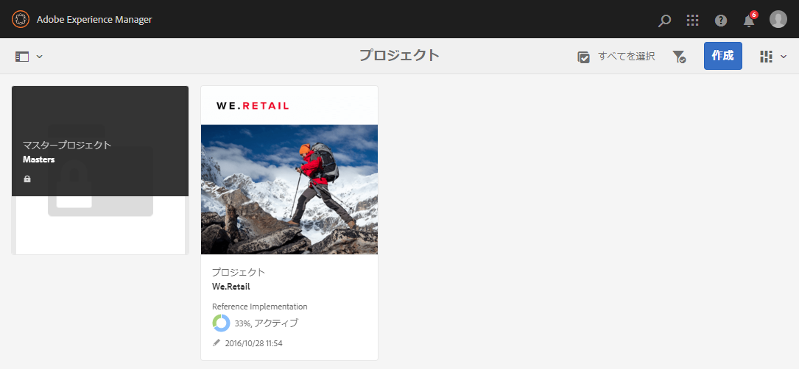

コンソールを使用して、プロジェクトを作成したり、プロジェクトにリソースを関連付けたり、プロジェクトまたはリソースリンクを削除したりできます。

## アクセス要件 {#access-requirements}

標準のAEM機能をプロジェクトするので、追加の設定は必要ありません。

ただし、プロジェクトのユーザーがプロジェクトの作成、タスク/ワークフローの作成、チームの表示と管理など、プロジェクトの使用中に他のユーザー/グループを表示するには、ユーザーが `/home/users` および `/home/groups`.

これを行う最も簡単な方法は、 **projects-users** グループへの読み取りアクセス `/home/users` および `/home/groups`.

## プロジェクトの作成 {#creating-a-project}

新しいプロジェクトを作成するには、次の手順に従います。

1. 内 **プロジェクト** コンソールで、をタップまたはクリックします。 **作成** 開く **プロジェクトを作成** ウィザード。
1. テンプレートを選択して、「**次へ**」をクリックします。標準プロジェクトテンプレートの詳細については、 [こちら。](/help/sites-authoring/projects.md#project-templates)

   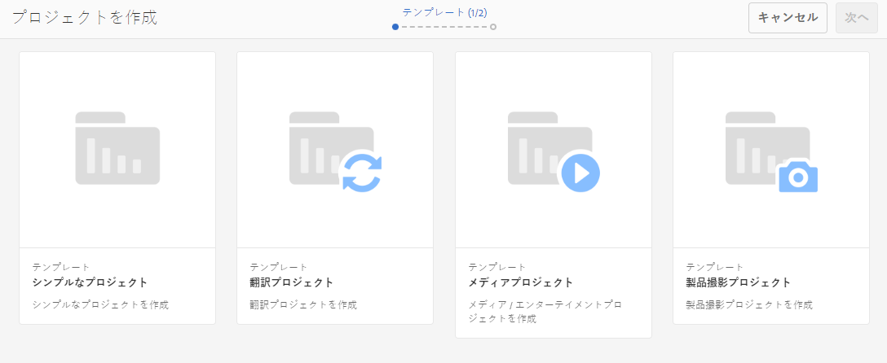

1. 「**タイトル**」と「**説明**」を定義し、必要に応じて「**サムネール**」画像を追加します。ユーザーおよびユーザーが属するグループを追加または削除することもできます。

   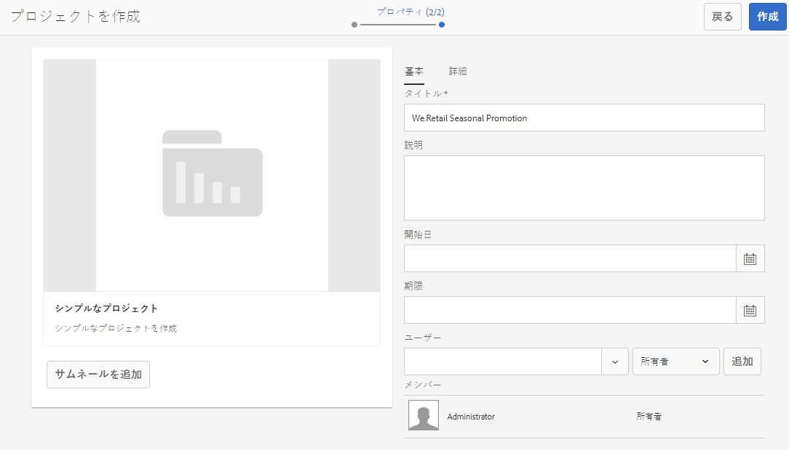

1. 「**作成**」をタップまたはクリックします。新しいプロジェクトを開くか、コンソールに戻るかを確認するメッセージが表示されます。

プロジェクトを作成する手順は、すべてのプロジェクトテンプレートで同じです。 プロジェクトのタイプ間の違いは、使用可能なものに関係します [ユーザーの役割](/help/sites-authoring/projects.md) および [ワークフロー。](/help/sites-authoring/projects-with-workflows.md)

### プロジェクトへのリソースの関連付け {#associating-resources-with-your-project}

プロジェクトでは、リソースを 1 つのエンティティにグループ化して、全体として管理できます。 したがって、リソースをプロジェクトに関連付ける必要があります。 これらのリソースは、 **タイル**. 追加できるリソースのタイプについては、[プロジェクトタイル](/help/sites-authoring/projects.md#project-tiles)で説明します。

リソースとプロジェクトを関連付けるには：

1. **プロジェクト**&#x200B;コンソールからプロジェクトを開きます。
1. 「**タイルを追加**」をタップまたはクリックして、プロジェクトにリンクするタイルを選択します。複数のタイプのタイルを選択できます。

   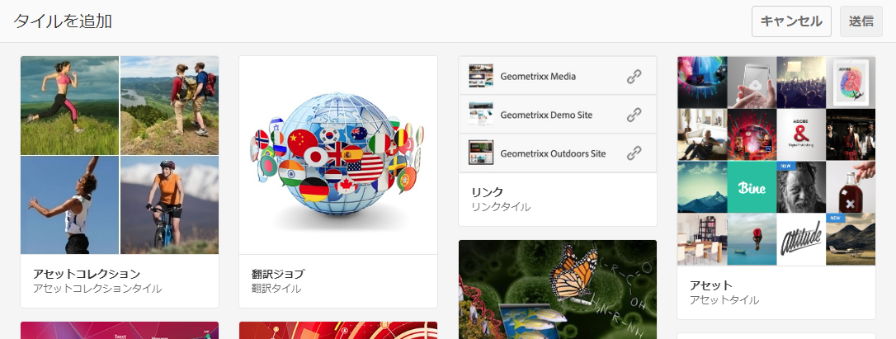

1. 「**作成**」をタップまたはクリックします。リソースがプロジェクトにリンクされ、今後はそのプロジェクトからアクセスできるようになります。

### タイルへの項目の追加 {#adding-items-to-a-tile}

タイルによっては、複数の項目を追加できます。例えば、一度に複数のワークフローを実行したり、複数のエクスペリエンスを持ったりすることができます。

タイルに項目を追加するには：

1. In **プロジェクト**&#x200B;をクリックし、プロジェクトに移動し、アイテムを追加するタイルの右上にある下向きの山形アイコンをクリックし、適切なオプションを選択します。

   * このオプションは、タイルのタイプによって異なります。 例えば、 **タスクを作成** の **タスク** タイルまたは **ワークフローを開始** の **ワークフロー** タイル。

   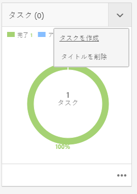

1. 新しいタイルを作成する際と同様に、タイルに項目を追加します。 プロジェクトタイルについて説明します [こちら。](/help/sites-authoring/projects.md#project-tiles)

## プロジェクト情報の表示 {#viewing-project-info}

プロジェクトの主な目的は、関連する情報を 1 か所にグループ化して、アクセスしやすくアクションにつながるようにすることです。 この情報にアクセスする方法は多数あります。

### タイルを開く {#opening-a-tile}

現在のタイルにどのような項目が含まれているかを表示したり、タイル内の項目を変更または削除したりできます。

項目を表示または変更するためにタイルを開くには：

1. タイルの右下にある省略記号アイコンをタップまたはクリックします。

   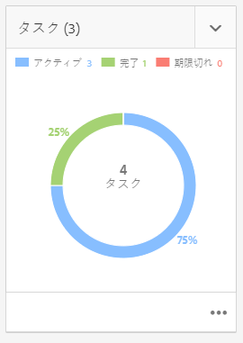

1. AEMは、選択したプロジェクトに基づいて、タイルに関連付けられた項目のタイプのコンソールを開き、フィルターを設定します。

   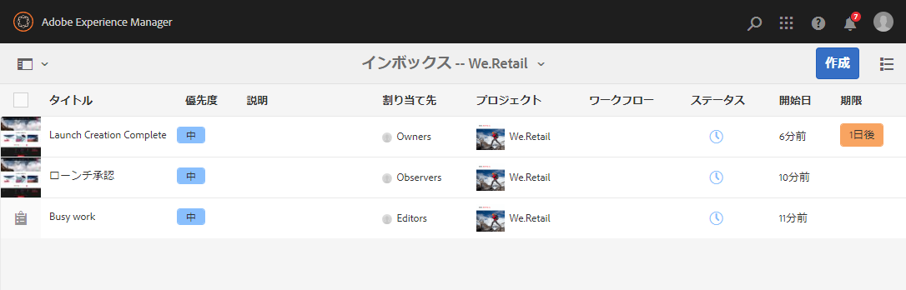

### プロジェクトタイムラインの表示 {#viewing-a-project-timeline}

プロジェクトタイムラインは、プロジェクト内のアセットが最後にいつ使用されたかを示します。プロジェクトタイムラインを表示するには、次の手順に従います。

1. 内 **プロジェクト** コンソールをクリックまたはタップします。 **タイムライン** （コンソールの左上にあるパネルセレクター）
   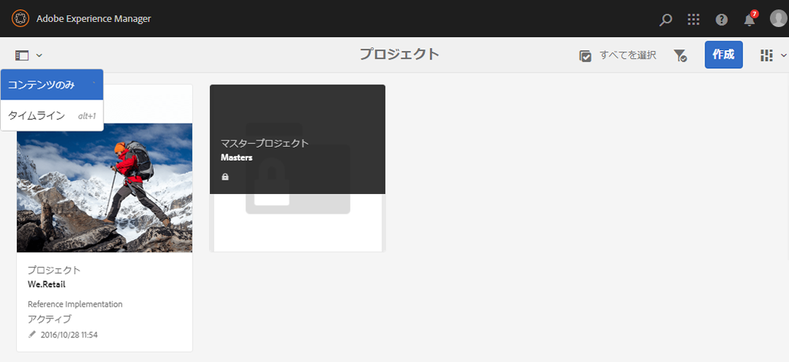
2. コンソールで、タイムラインを表示するプロジェクトを選択します。
   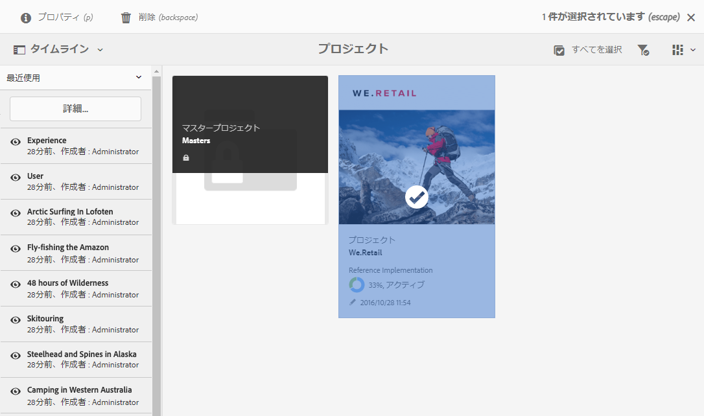

アセットがレールに表示されます。 終了したら、レールセレクターを使用して通常の表示に戻ります。

### 非アクティブなプロジェクトの表示 {#viewing-active-inactive-projects}

アクティブとを切り替えるには [非アクティブなプロジェクト](#making-projects-inactive-or-active) 内 **プロジェクト** コンソールで、 **アクティブなプロジェクトを切り替え** アイコンをクリックします。

デフォルトでは、コンソールにアクティブなプロジェクトが表示されます。 次をクリック： **アクティブなプロジェクトを切り替え** アイコンを 1 回クリックすると、非アクティブなプロジェクトの表示に切り替わります。 もう一度クリックすると、アクティブなプロジェクトに切り替わります。

## プロジェクトの整理 {#organizing-projects}

プロジェクトの整理で **プロジェクト** コンソールを管理可能。

### プロジェクトフォルダ {#project-folders}

フォルダーは、 **プロジェクト** コンソールを使用して、類似のプロジェクトをグループ化および整理します。

1. 内 **プロジェクト** コンソールをタップまたはクリック **作成** その後 **フォルダーを作成**.

   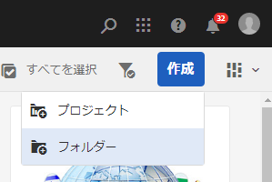

1. フォルダーにタイトルを付け、「 」をクリックします。 **作成**.

1. フォルダーがコンソールに追加されます。

これで、フォルダー内にプロジェクトを作成できます。 複数のフォルダーを作成したり、フォルダーをネストしたりできます。

### プロジェクトの無効化 {#making-projects-inactive-or-active}

プロジェクトが完了しても、そのプロジェクトに関する情報を保持したい場合は、プロジェクトを非アクティブにするように設定できます。 [非アクティブなプロジェクトが表示されるようになりました](#viewing-active-inactive-projects) デフォルトでは **プロジェクト** コンソール。

プロジェクトを非アクティブにするには、次の手順に従います。

1. を開きます。 **プロジェクトのプロパティ** プロジェクトのウィンドウ。
   * これは、プロジェクトを選択するか、プロジェクト内から、 **プロジェクト情報** タイル。
1. 内 **プロジェクトのプロパティ** ウィンドウ、 **プロジェクトステータス** ～からのスライダー **アクティブ** から **非アクティブ**.

   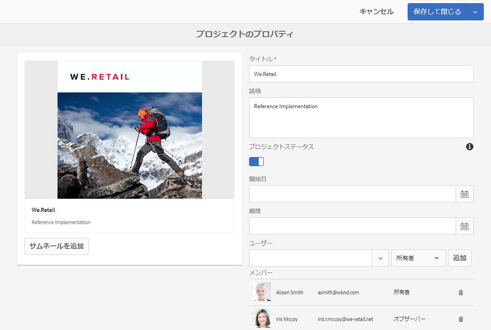

1. タップまたはクリック **保存して閉じる** 変更を保存します。

### プロジェクトの削除 {#deleting-a-project}

以下の手順に従って、プロジェクトを削除します。

1. の最上位レベルに移動します。 **プロジェクト** コンソール。
1. コンソールでプロジェクトを選択します。
1. タップまたはクリック **削除** 」と入力します。
1. AEMは、プロジェクトの削除時に、関連するプロジェクトデータを削除または変更できます。 必要なオプションを **プロジェクトを削除** ダイアログ。
   * プロジェクトのグループと役割を削除
   * プロジェクトアセットフォルダを削除
   * プロジェクトのワークフローを終了

   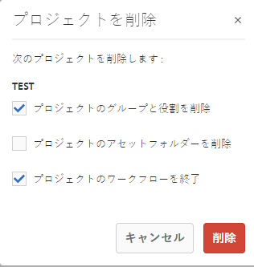
1. タップまたはクリック **削除** 選択したオプションでプロジェクトを削除する場合。

プロジェクトで自動的に作成されるグループについて詳しくは、 [グループの自動作成](/help/sites-authoring/projects.md#auto-group-creation) 」を参照してください。
