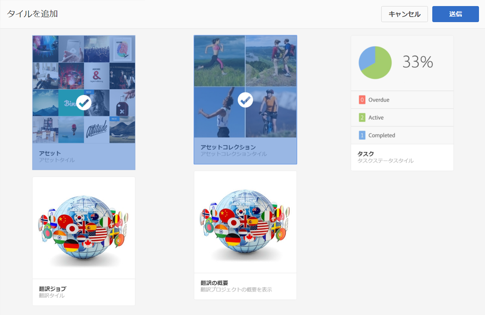
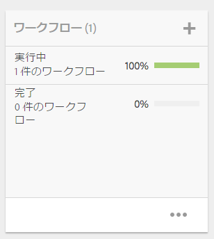
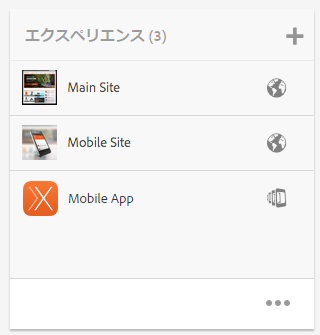
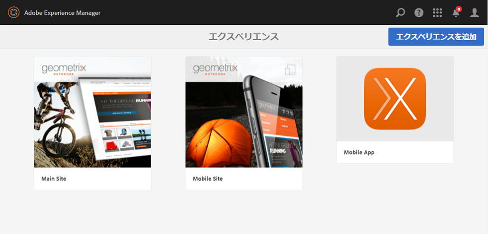
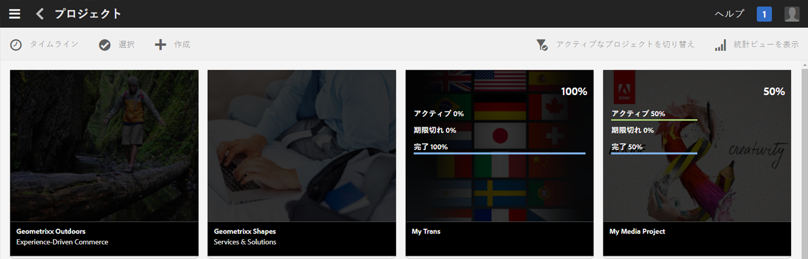
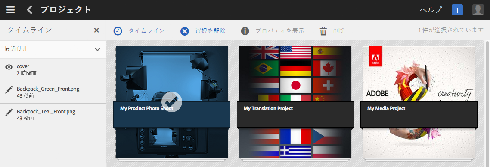
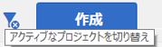
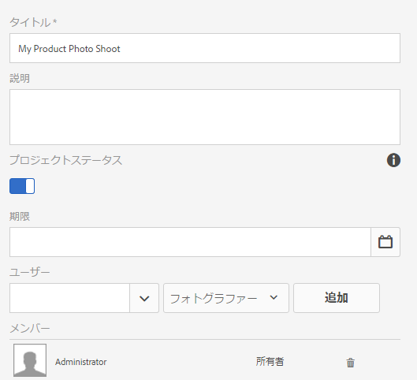

# プロジェクトの管理{#managing-projects}

プロジェクトを使用すると、リソースを 1 つのエンティティにグループ化して整理できます。

**プロジェクト**&#x200B;コンソールで、プロジェクトにアクセスし、アクションを実行することができます。

プロジェクトコンソールでは、プロジェクトを作成し、リソースとプロジェクトを関連付け、プロジェクトまたはリソースリンクを削除することもできます。タイルを開いてその内容を表示したり、アイテムをタイルに追加したりできます。このトピックで詳しい手順を説明します。

>[!NOTE]
>
>AEM 6.2 では、プロジェクトをフォルダーに整理する機能が導入されました。プロジェクトページで、プロジェクトまたはフォルダーを作成できます。
>
>フォルダーを作成した場合は、そのフォルダー内に別のフォルダーまたはプロジェクトを作成できます。この機能を使用して、製品キャンペーン、場所、翻訳言語などのカテゴリに基づいてプロジェクトをフォルダーに整理できます。
>
>プロジェクトとフォルダーは、リスト形式で表示することも、検索することもできます。

>[!CAUTION]
>
>For users in projects to see other users/groups while using Projects functionality like creating projects, creating tasks/workflows, seeing and managing the team, those users need to have read access on **/home/users** and **/home/groups**. The easiest way to implement this is to give the **projects-users** group read access to **/home/users** and **/home/groups**.

## プロジェクトの作成 {#creating-a-project}

AEM には次の既製のテンプレートが用意されていて、プロジェクトの作成時に選択できます。

* シンプルなプロジェクト
* メディアプロジェクト
* 製品撮影プロジェクト
* 翻訳プロジェクト

プロジェクトの作成手順は、どのプロジェクトでも同じです。プロジェクトのタイプによって異なるものとしては、使用可能な[ユーザーの役割](/help/sites-authoring/projects.md)と[ワークフロー](/help/sites-authoring/projects-with-workflows.md)があります。新しいプロジェクトを作成するには、次の手順を実行します。

1. **プロジェクト**&#x200B;で「**作成**」をタップまたはクリックして「**プロジェクトを作成**」ウィザードを開きます。
1. テンプレートを選択します。Out of the box, Simple Project, Media Project, [Translation Project](/help/sites-administering/tc-manage.md), and [Product Photo Shoot Product](/help/sites-authoring/managing-product-information.md) are available and click **Next**.

   

1. 「**タイトル**」と「**説明**」を定義し、必要に応じて「**サムネール**」画像を追加します。ユーザーおよびユーザーが属するグループを追加または削除することもできます。さらに、「**詳細**」をクリックして、URL で使用する名前を追加します。

   

1. 「**作成**」をタップまたはクリックします。新しいプロジェクトを開くか、コンソールに戻るかを確認するメッセージが表示されます。

### リソースとプロジェクトの関連付け {#associating-resources-with-your-project}

プロジェクトではリソースを 1 つのエンティティにグループ化できるので、リソースをプロジェクトに関連付けできます。これらのリソースは「**タイル**」と呼ばれます。追加できるリソースのタイプについては、[プロジェクトタイル](/help/sites-authoring/projects.md#project-tiles)で説明します。

リソースとプロジェクトを関連付けるには：

1. **プロジェクト**&#x200B;コンソールからプロジェクトを開きます。
1. 「**タイルを追加**」をタップまたはクリックして、プロジェクトにリンクするタイルを選択します。複数のタイプのタイルを選択できます。

   

   >[!NOTE]
   >
   >プロジェクトに関連付けることができるプロジェクトタイルの詳細については、[プロジェクトタイル](/help/sites-authoring/projects.md#project-tiles)で説明します。

1. 「**作成**」をタップまたはクリックします。リソースがプロジェクトにリンクされ、今後はそのプロジェクトからアクセスできるようになります。

### プロジェクトまたはリソースリンクの削除 {#deleting-a-project-or-resource-link}

同じ方法を使用して、プロジェクトをコンソールから削除したり、リンクされたリソースをプロジェクトから削除したりすることができます。

1. 該当する場所に移動します。

   * プロジェクトを削除するには、**プロジェクト**&#x200B;コンソールの最上位レベルに移動します。
   * プロジェクト内のリソースリンクを削除するには、**プロジェクト**&#x200B;コンソールでプロジェクトを開きます。

1. 「**選択**」をクリックし、プロジェクトまたはリソースリンクを選択して、選択モードに入ります。
1. 「**削除**」をタップまたはクリックします。

1. 削除を確定するかどうかを確認するダイアログが表示されます。確定すると、プロジェクトまたはリソースリンクが削除されます。「**選択を解除**」をタップまたはクリックし、選択モードを終了します。

>[!NOTE]
>
>プロジェクトを作成してユーザーを様々な役割に追加すると、関連する権限を管理するため、プロジェクトに関連付けられたグループが自動的に作成されます。例えば、「Myproject」というプロジェクトには **Myproject Owners**、**Myproject Editors**、**Myproject Observers** という 3 つのグループがあります。ただし、プロジェクトを削除しても、これらのグループは自動的には削除されません。管理者は、**ツール**／**セキュリティ**／**グループ**&#x200B;から、手動でグループを削除する必要があります。

### タイルへの項目の追加 {#adding-items-to-a-tile}

タイルによっては、複数の項目を追加できます。例えば、一度に複数のワークフローを実行したり、複数のエクスペリエンスを持ったりすることができます。

タイルに項目を追加するには：

1. **プロジェクト**&#x200B;で、プロジェクトに移動し、項目を追加するタイル上の追加（+）アイコンをクリックします。

   

1. 新しいタイルの作成時と同様にして、タイルに項目を追加します。プロジェクトタイルについては、[こちら](/help/sites-authoring/projects.md#project-tiles)で説明します。この例では、別のワークフローが 1 つ追加されました。

   

### タイルを開く {#opening-a-tile}

現在のタイルにどのような項目が含まれているかを表示したり、タイル内の項目を変更または削除したりできます。

項目を表示または変更するためにタイルを開くには：

1. プロジェクトコンソールで、省略記号（...）をタップまたはクリックします。

   

1. そのタイル内の項目が表示されます。選択モードに入って、項目を変更または削除できます。

   

## プロジェクト統計の表示 {#viewing-project-statistics}

プロジェクト統計を表示するには、**プロジェクト**&#x200B;コンソールで「**統計ビューを表示**」をクリックします。各プロジェクトの完了レベルが表示されます。「**統計ビューを表示**」を再度クリックして、**プロジェクト**&#x200B;コンソールに移動します。

### プロジェクトタイムラインの表示 {#viewing-a-project-timeline}

プロジェクトタイムラインは、プロジェクト内のアセットが最後にいつ使用されたかを示します。プロジェクトタイムラインを表示するには、「**タイムライン**」をクリックまたはタップしてから、選択モードに入ってプロジェクトを選択します。アセットが左パネルに表示されます。「**タイムライン**」をクリックまたはタップして、**プロジェクト**&#x200B;コンソールに戻ります。

### アクティブ／非アクティブなプロジェクトの表示 {#viewing-active-inactive-projects}

アクティブなプロジェクトと非アクティブなプロジェクトを切り替えるには、**プロジェクト**&#x200B;コンソールで「**アクティブなプロジェクトを切り替え**」をクリックします。アイコンの横にチェックマークがある場合は、アクティブなプロジェクトが表示されています。

アイコンの横に「x」がある場合は、非アクティブなプロジェクトが表示されています。

## プロジェクトの非アクティブ化またはアクティブ化 {#making-projects-inactive-or-active}

プロジェクトが完了しても、そのプロジェクトに関する情報をまだ保持する必要がある場合は、プロジェクトを非アクティブにすることができます。

プロジェクトを非アクティブ（またはアクティブ）にするには：

1. **プロジェクト**&#x200B;コンソールで、プロジェクトを開き、**プロジェクト情報**&#x200B;タイルを探します。

   >[!NOTE]
   このタイルがプロジェクトにまだない場合は、追加する必要があります。[タイルの追加](#adding-items-to-a-tile)を参照してください。

1. 「**編集**」をタップまたはクリックします。
1. セレクターを「**アクティブ**」から「**非アクティブ**」（またはその逆）に変更します。

   

1. 「**完了**」をタップまたはクリックして、変更内容を保存します。

