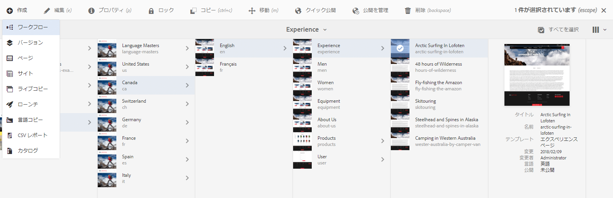
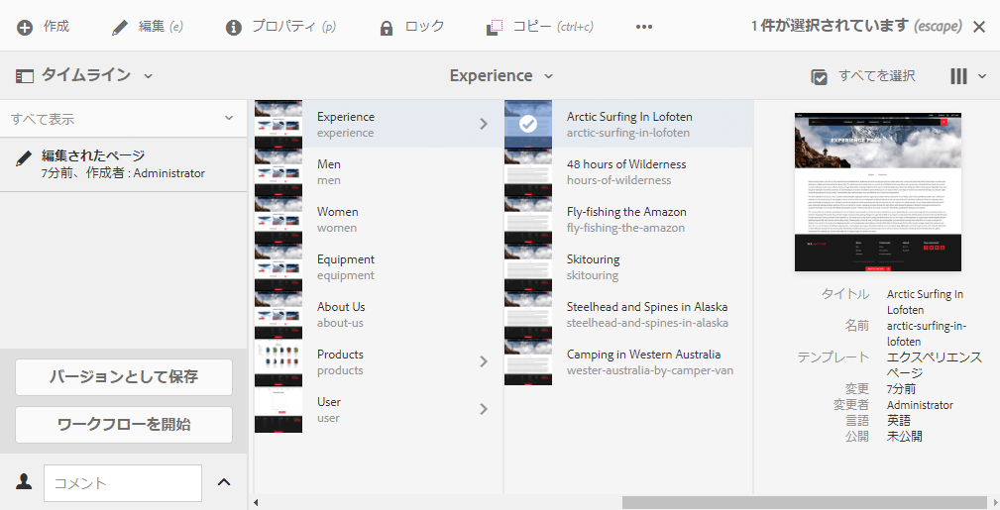
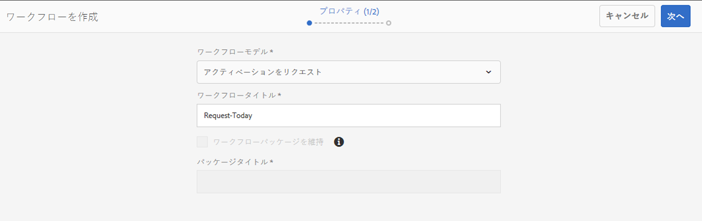
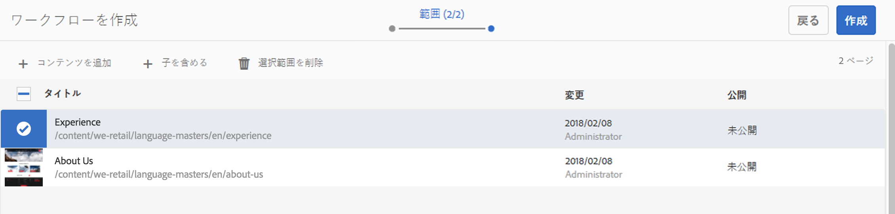
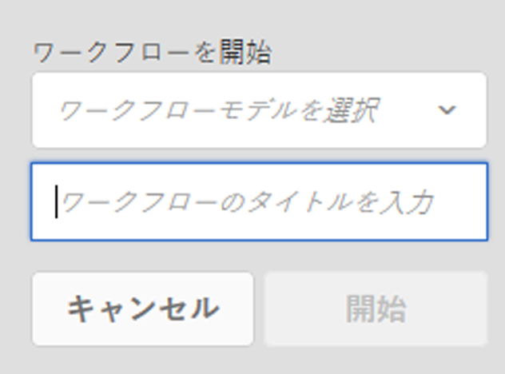

# ページへのワークフローの適用{#applying-workflows-to-pages}

オーサリングでは、ワークフローを呼び出して、ページにアクションを実行することができます。複数のワークフローを適用することもできます。

ワークフローを適用する際には、次の情報を指定します。

* 適用されるワークフロー。 （AEM 管理者によって割り当てられた、アクセス権限がある）任意のワークフローを適用できます。
* オプションで、ユーザーのインボックス内のワークフローインスタンスの特定に役立つタイトル。
* ワークフローペイロード。これは 1 つ以上のページにできます。

ワークフローは以下のものから開始できます。

* [サイトコンソール](#starting-a-workflow-from-the-sites-console)。
* [ページの編集中に「ページ情報](#starting-a-workflow-from-the-page-editor)」から。

>[!NOTE]
>
>関連トピック：
>
>* [DAM アセットにワークフローを適用する方法](/help/assets/assets-workflow.md)
>* [プロジェクトワークフローの操作](/help/sites-authoring/projects-with-workflows.md)

>

>[!NOTE]
>
>AEM 管理者は[他のいくつかの方法を使用してワークフローを開始できます](/help/sites-administering/workflows-starting.md)。

## サイトコンソールからのワークフローの開始 {#starting-a-workflow-from-the-sites-console}

ワークフローは以下のいずれかから開始できます。

* [サイトツールバーの「作成」オプション](#starting-a-workflow-from-the-sites-toolbar)。
* [サイトコンソールのタイムラインレール](#starting-a-workflow-from-the-timeline)。

両方の場合で、以下の作業が必要です。

* [ワークフローの作成ウィザードでワークフロー詳細を指定](#specifying-workflow-details-in-the-create-workflow-wizard)

### サイトツールバーからのワークフローの開始 {#starting-a-workflow-from-the-sites-toolbar}

**サイト**&#x200B;コンソールのツールバーからワークフローを開始できます。

1. 必要なページに移動して選択します。

1. これでツールバーの「**作成**」オプションで「**ワークフロー**」を選択できます。

   

1. **ワークフローの作成**&#x200B;ウィザードは、[ワークフローの詳細を指定](#specifying-workflow-details-in-the-create-workflow-wizard)するために役立ちます。

### タイムラインからのワークフローの開始 {#starting-a-workflow-from-the-timeline}

**タイムライン**&#x200B;から、選択したリソースに適用されるワークフローを開始できます。

1. [リソースを選択](/help/sites-authoring/basic-handling.md#viewingandselectingyourresources)し、[タイムライン](/help/sites-authoring/basic-handling.md#timeline)を開きます（またはタイムラインを開いてからリソースを選択します）。
1. コメントフィールドの横にある矢印を使用すると、「**ワークフローを開始**」が表示されます。

   

1. **ワークフローの作成**&#x200B;ウィザードは、[ワークフローの詳細を指定](#specifying-workflow-details-in-the-create-workflow-wizard)するために役立ちます。

### ワークフローの作成ウィザードでのワークフローの詳細の指定 {#specifying-workflow-details-in-the-create-workflow-wizard}

**ワークフローの作成**&#x200B;ウィザードは、ワークフローを選択し、必要な詳細を指定するために役立ちます。

**ワークフローの作成**&#x200B;ウィザードを以下のいずれかから開いた後

* [サイトツールバーの「作成」オプション](#starting-a-workflow-from-the-sites-toolbar)。
* [サイトコンソールのタイムラインレール](#starting-a-workflow-from-the-timeline)。

以下のように詳細を指定できます。

1. **プロパティ**&#x200B;手順で、ワークフローの基本オプションを次のように定義します。

   * **ワークフローモデル**
   * **ワークフロータイトル**

      * このインスタンスのタイトルを指定して、後の段階でそれを識別するために役立てることができます。

   ワークフローモデルによっては、以下のオプションも使用できます。これらにより、ペイロードとして作成されたパッケージは、ワークフローが完成した後も維持されます。

   * **ワークフローパッケージを維持**
   * **パッケージタイトル**

      * 識別を容易にするために、パッケージのタイトルを指定できます。
   >[!NOTE]
   >
   >ワークフローがマルチリソースサポートのために設定されており、複数のリソースが選択されている場合は、**ワークフローパッケージを維持**&#x200B;オプションが使用できます。

   完了したら、「**次へ**」を使用して続行します。

   

1. **スコープ**&#x200B;ステップで、以下のものを選択できます。

   * 「**コンテンツを追加**」で[パスブラウザー](/help/sites-authoring/author-environment-tools.md#path-browser)を開き、追加リソースを選択します。ブラウザーでは、「**選択**」をクリックまたはタップして、コンテンツをワークフローインスタンスに追加します。

   * 追加のアクションを表示するための既存のリソース

      * 「**子を含める**」で、ワークフローに含まれるそのリソースの子を指定します。ダイアログが開いて、以下のものに従って選択を絞り込むことができます。

         * 直近の子のみを含める。
         * 変更されたページのみを含める。
         * 既に公開済みのページのみを含める。

         指定された子は、ワークフローが適用されるリソースのリストに追加されます。

      * 「**選択範囲を削除**」は、そのリソースをワークフローから削除します。

   

   >[!NOTE]
   >
   >追加リソースを追加する場合は、「**戻る**」を使用して、**プロパティ**&#x200B;ステップで「**ワークフローパッケージを維持**」の設定を調整できます。

1. 「**作成**」を使用して、ウィザードを閉じ、ワークフローインスタンスを作成します。通知はサイトコンソールに表示されます。

## ページエディターからのワークフローの開始 {#starting-a-workflow-from-the-page-editor}

ページの編集中にツールバーから「**ページ情報**」を選択できます。ドロップダウンメニューに「**ワークフローで開始**」オプションがあります。これによりダイアログが開き、必要なワークフローと必要な場合はタイトルを指定できます。

