# ワークフローへの参加{#participating-in-workflows}

ワークフローには通常、ページまたはアセットでユーザーがアクティビティを実行する必要があるステップが含まれています。ワークフローでアクティビティを実行するユーザーまたはグループを選択し、その人物やグループに作業項目を割り当てます。ユーザーは通知を受け取ると、次のような適切なアクションを実行できます。

* [通知の表示](#notifications-of-available-workflow-actions)
* [参加者ステップの完了](#completing-a-participant-step)
* [参加者ステップの委任](#delegating-a-participant-step)
* [参加者ステップでの前のステップの実行](#performing-step-back-on-a-participant-step)
* [ワークフロー項目を開いて、詳細を表示（またはアクションを実行）](#opening-a-workflow-item-to-view-details-and-take-actions)
* [ワークロードペイロード（複数のリソース）を表示](#viewing-the-workflow-payload-multiple-resources)

## 使用可能なワークフローアクションの通知 {#notifications-of-available-workflow-actions}

作業項目（**コンテンツを承認**&#x200B;など）が割り当てられると、様々なアラートや通知が表示されます。

* [通知](/help/sites-authoring/inbox.md)インジケーター（ツールバー）が増分されます。

  

* 通知[インボックス](/help/sites-authoring/inbox.md)に項目がリストされます

  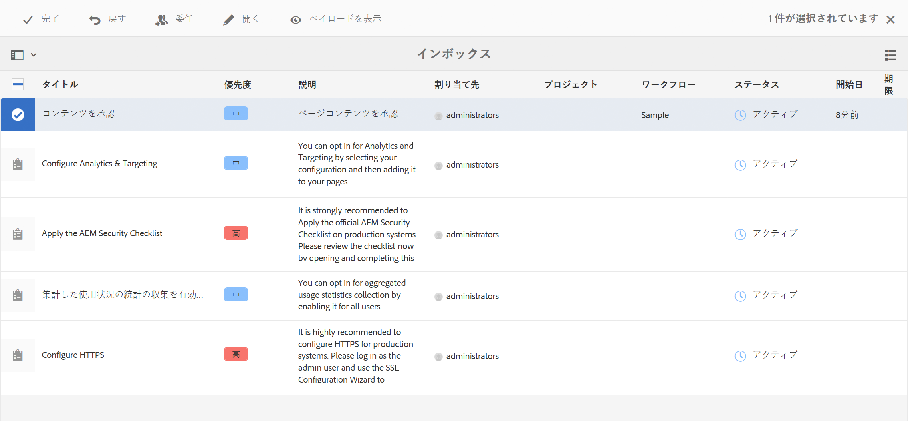

* ページエディターを使用している場合、ステータスバーには次の情報が表示されます。

   * ページに適用されるワークフローの名前（「アクティベーションのリクエスト」など）。
   * 完了、委任、詳細表示など、ワークフローの現在のステップで現在のユーザーが使用できる何らかのアクション。
   * ページに関与するワークフローの数。以下の操作を実行できます。

      * 左／右の矢印を使用して、様々なワークフローのステータス情報を参照します。
      * 実際の数字をクリックまたはタップして、該当するすべてのワークフローのドロップダウンリストを開き、ステータスバーに表示するワークフローを選択します。

  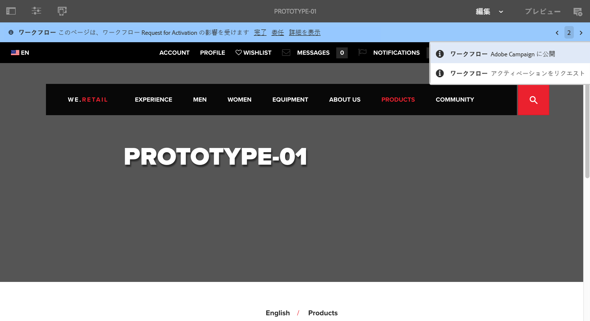

  >[!NOTE]
  >
  >ステータスバーは、例えば `workflow-users` グループのメンバーなど、ワークフロー特権のあるユーザーだけに表示されます。
  >
  >
  >現在のユーザーがワークフローの現在の手順に直接関与している場合、アクションが表示されます。

* リソースの&#x200B;**タイムライン**&#x200B;が開いている場合、ワークフローステップが表示されます。アラートバナーをクリックまたはタップすると、使用可能なアクションも表示されます。

  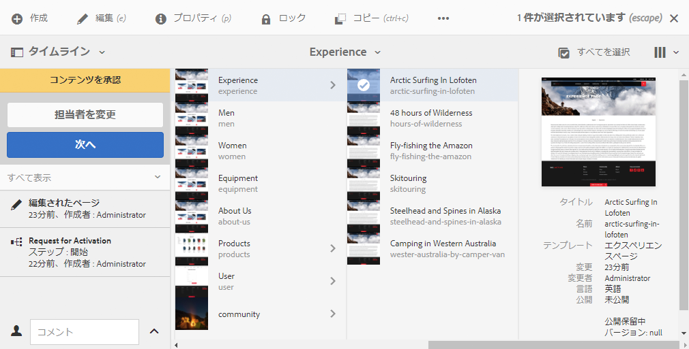

### 参加者ステップの完了 {#completing-a-participant-step}

項目を完了して、ワークフローを次の手順に進めることができます。

このアクションでは、以下を指定できます。

* **次の手順**：次に取るべき手順。表示されるリストから選択できます。
* **コメント**：必要に応じて

次のいずれかで参加者ステップを完了できます。

* [インボックス ](#completing-a-participant-step-inbox)
* [ページエディター](#completing-a-participant-step-page-editor)
* [タイムライン](#completing-a-participant-step-timeline)
* [ワークフロー項目を開いて詳細を表示する](#opening-a-workflow-item-to-view-details-and-take-actions)場合。

#### 参加者ステップの完了 - インボックス {#completing-a-participant-step-inbox}

作業項目を完了するには、次の手順を実行します。

1. **[AEM インボックスx](/help/sites-authoring/inbox.md)**&#x200B;を開きます。
1. アクションを実行するワークフロー項目を選択します（サムネールをタップまたはクリック）。
1. ツールバーの「**完了**」を選択します。
1. The **作業項目を完了** ダイアログボックスが開きます。 ドロップダウンセレクターで「**次の手順**」を選択し、必要に応じて&#x200B;**コメント**&#x200B;を追加します。
1. 「**OK**」を使用して手順を完了します（または「**キャンセル**」を使用してアクションを中止します）。

#### 参加者ステップの完了 - ページエディター {#completing-a-participant-step-page-editor}

作業項目を完了するには、次の手順を実行します。

1. [編集するページ](/help/sites-authoring/managing-pages.md#opening-a-page-for-editing).を開きます。
1. 上部のステータスバーの「**完了**」を選択します。
1. The **作業項目を完了** ダイアログボックスが開きます。 ドロップダウンセレクターで「**次の手順**」を選択し、必要に応じて&#x200B;**コメント**&#x200B;を追加します。
1. 「**OK**」を使用してステップを完了します（または「**キャンセル**」を使用してアクションを中止します）。

#### 参加者ステップの完了 - タイムライン {#completing-a-participant-step-timeline}

タイムラインを使用してステップを完了または進めることもできます。

1. 必要なページを選択して&#x200B;**タイムライン**&#x200B;を開きます（または&#x200B;**タイムライン**&#x200B;を開いてからページを選択します）。

   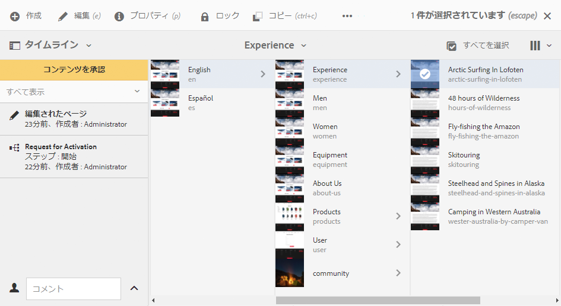

1. アラートバナーをクリックまたはタップすると、使用可能なアクションが表示されます。「**進む**」を選択します。

   

1. ワークフローによっては、次のステップを選択できます。

   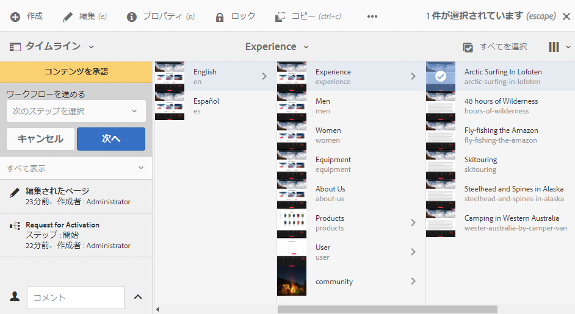

1. 「**次へ**」を選択して、アクションを確定します。

### 参加者ステップの委任 {#delegating-a-participant-step}

手順が割り当てられているが、何らかの理由によってアクションを実行できない場合、その手順を別のユーザーまたはグループに委任できます。

委任できるユーザーは、作業項目の割り当て先によって異なります。

* 作業項目がグループに割り当てられた場合、グループメンバーに委任できます。
* 作業項目がグループに割り当てられ、ユーザーに委任された場合、グループメンバーおよびグループに委任できます。
* 作業項目が 1 人のユーザーに割り当てられた場合、作業項目を委任することはできません。

このアクションでは、以下を指定できます。

* **ユーザー**：委任先のユーザー。表示されるリストから選択できます
* **コメント**：必要に応じて

参加者ステップは次のいずれかから委任できます。

* [インボックス ](#delegating-a-participant-step-inbox)
* [ページエディター](#delegating-a-participant-step-page-editor)
* [タイムライン](#delegating-a-participant-step-timeline)
* [ワークフロー項目を開いて詳細を表示する](#opening-a-workflow-item-to-view-details-and-take-actions)場合。

#### 参加者ステップの委任 - インボックス {#delegating-a-participant-step-inbox}

作業項目を委任するには、次の手順を実行します。

1. **[AEM インボックス](/help/sites-authoring/inbox.md)**&#x200B;を開きます。
1. アクションを実行するワークフロー項目を選択します（サムネールをタップまたはクリック）。
1. ツールバーの「**委任**」を選択します。
1. ダイアログボックスが開きます。 ドロップダウンセレクターから「**ユーザー**」（グループも可）を指定し、必要に応じて&#x200B;**コメント**&#x200B;を追加します。
1. 「**OK**」を使用して手順を完了します（または「**キャンセル**」を使用してアクションを中止します）。

#### 参加者ステップの委任 - ページエディター {#delegating-a-participant-step-page-editor}

作業項目を委任するには、次の手順を実行します。

1. [編集するページ](/help/sites-authoring/managing-pages.md#opening-a-page-for-editing)を開きます。
1. 上部のステータスバーの「**委任**」を選択します。
1. ダイアログボックスが開きます。 ドロップダウンセレクターから「**ユーザー**」（グループも可）を指定し、必要に応じて&#x200B;**コメント**&#x200B;を追加します。
1. 「**OK**」を使用して手順を完了します（または「**キャンセル**」を使用してアクションを中止します）。

#### 参加者ステップの委任 - タイムライン {#delegating-a-participant-step-timeline}

タイムラインを使用してステップを委任または割り当てることもできます。

1. 必要なページを選択して&#x200B;**タイムライン**&#x200B;を開きます（または&#x200B;**タイムライン**&#x200B;を開いてからページを選択します）。
1. アラートバナーをクリックまたはタップすると、使用可能なアクションが表示されます。「**担当者を変更**」を選択します。

   

1. 新しい割り当て先を指定します。

   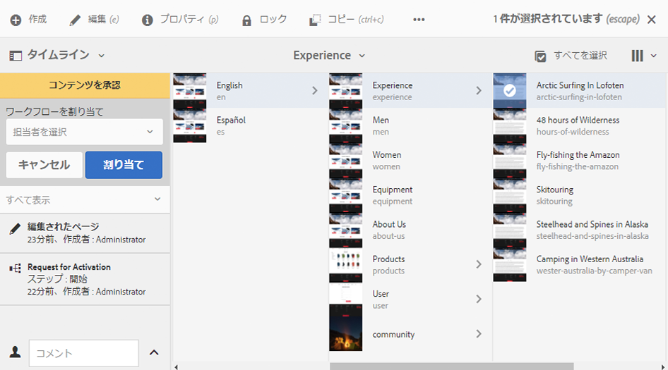

1. 「**割り当て**」を選択して、アクションを確定します。

### 参加者ステップでの前のステップの実行 {#performing-step-back-on-a-participant-step}

ある手順または一連の手順を繰り返す必要がある場合は、前の手順に戻ることができます。これにより、ワークフロー内で前に発生した再処理のステップを選択できます。 指定した手順にワークフローが戻り、そこから続行します。

このアクションでは、以下を指定できます。

* **前のステップ**：戻り先のステップ。表示されるリストから選択できます
* **コメント**：必要に応じて

次のいずれかから、参加者ステップで前のステップを実行できます。

* [インボックス ](#performing-step-back-on-a-participant-step-inbox)
* [ページエディター](#performing-step-back-on-a-participant-step-page-editor)
* [タイムライン](#performing-step-back-on-a-participant-step-timeline)
* [ワークフロー項目を開いて詳細を表示する](#opening-a-workflow-item-to-view-details-and-take-actions)場合。

#### 参加者ステップでの前のステップの実行 - インボックス {#performing-step-back-on-a-participant-step-inbox}

次の手順を使用して、前のステップに戻ります。

1. **[AEM インボックス](/help/sites-authoring/inbox.md)**&#x200B;を開きます。
1. アクションを実行するワークフロー項目を選択します（サムネールをタップまたはクリック）。
1. 「**ステップバック**」を選択して、ダイアログを開きます。

1. 「**前のステップ**」を指定し、必要に応じて&#x200B;**コメント**&#x200B;を追加します。
1. 「**OK**」を使用してステップを完了します（または「**キャンセル**」を使用してアクションを中止します）。

#### 参加者ステップでの前のステップの実行 - ページエディター {#performing-step-back-on-a-participant-step-page-editor}

次の手順を使用して、前のステップに戻ります。

1. [編集するページ](/help/sites-authoring/managing-pages.md#opening-a-page-for-editing)を開きます。
1. 上部のステータスバーの「**前のステップ**」を選択します。
1. 「**前のステップ**」を指定し、必要に応じて&#x200B;**コメント**&#x200B;を追加します。
1. 「**OK**」を使用してステップを完了します（または「**キャンセル**」を使用してアクションを中止します）。

#### 参加者ステップでの前のステップの実行 - タイムライン {#performing-step-back-on-a-participant-step-timeline}

タイムラインを使用して前のステップにロール（ステップ）バックすることもできます。

1. 必要なページを選択して&#x200B;**タイムライン**&#x200B;を開きます（または&#x200B;**タイムライン**&#x200B;を開いてからページを選択します）。
1. アラートバナーをクリックまたはタップすると、使用可能なアクションが表示されます。「**ロールバック**」を選択します。

   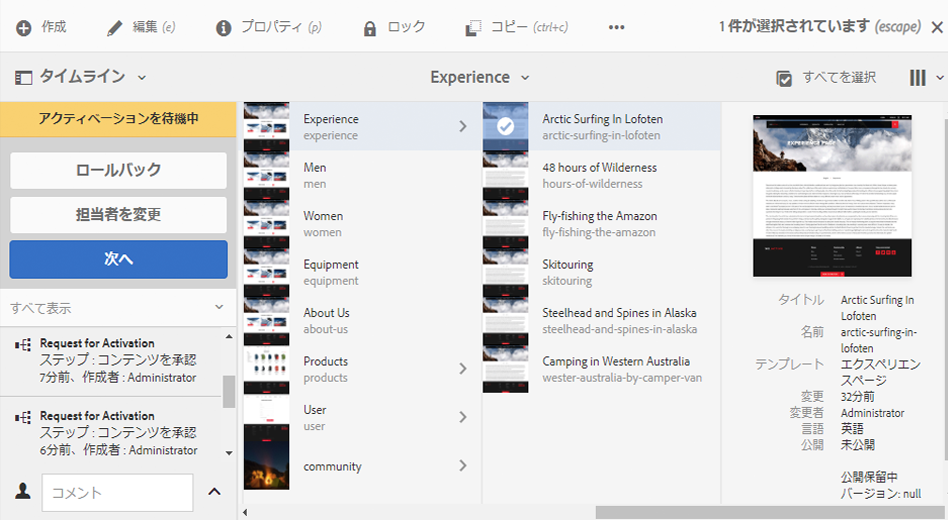

1. ワークフローの戻し先のステップを指定します。

   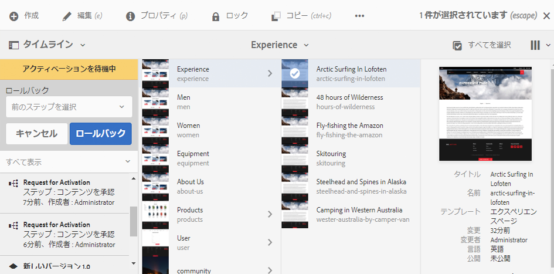

1. 「**ロールバック**」を選択して、アクションを確定します。

### ワークフロー項目を開いて詳細を表示（およびアクションを実行） {#opening-a-workflow-item-to-view-details-and-take-actions}

ワークフロー作業項目の詳細を表示して、適切なアクションを実行します。

ワークフロー詳細がタブに表示され、適切なアクションがツールバーに表示されます。

* 「**作業項目**」タブ

  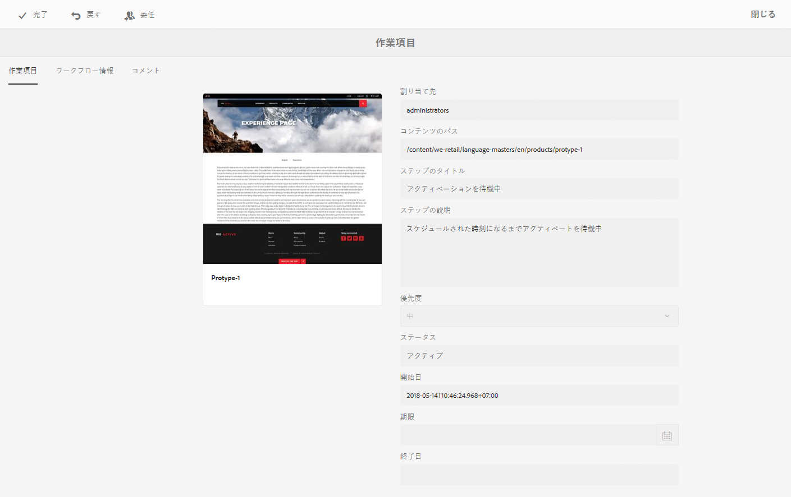

* 「**ワークフロー情報**」タブ：

  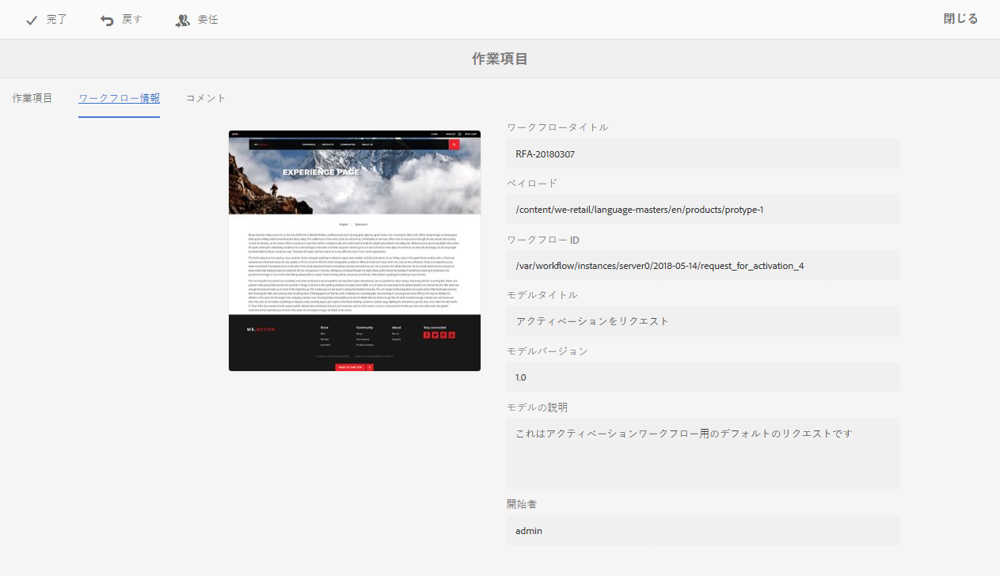

  [ワークフローステージ](/help/sites-developing/workflows.md#workflow-stages)がモデルに設定されている場合は、これらに従って進行状況を表示できます。

  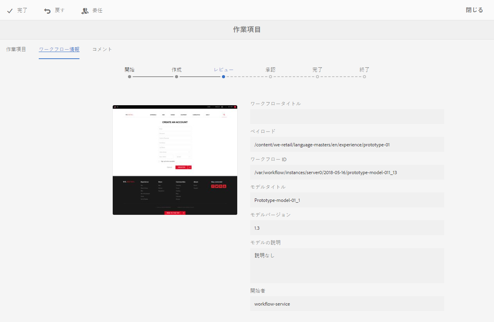

* 「**コメント**」タブ：

  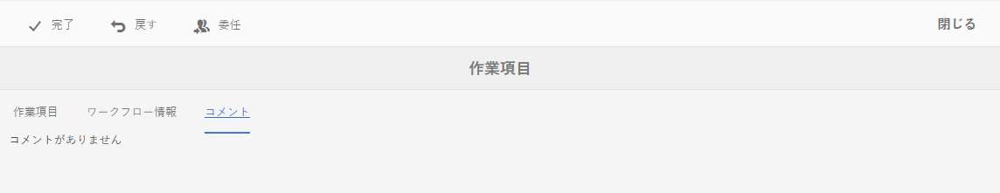

以下のいずれかから作業項目の詳細を開くことができます。

* [インボックス ](#performing-step-back-on-a-participant-step-inbox)
* [ページエディター](#performing-step-back-on-a-participant-step-page-editor)

#### ワークフロー詳細を開く - インボックス {#opening-workflow-details-inbox}

ワークフロー項目を開いて詳細を表示するには：

1. **[AEM インボックス](/help/sites-authoring/inbox.md)**&#x200B;を開きます。
1. アクションを実行するワークフロー項目を選択します（サムネールをタップまたはクリック）。
1. 「**開く**」を選択して、「情報」タブを開きます。

1. 必要に応じて、適切なアクションを選択し、詳細を入力して「**OK**」（または「**キャンセル**」）で確認します。
1. 「**保存**」または「**キャンセル**」を使用して終了します。

#### ワークフロー詳細を開く - ページエディター {#opening-workflow-details-page-editor}

ワークフロー項目を開いて詳細を表示するには：

1. [編集するページ](/help/sites-authoring/managing-pages.md#opening-a-page-for-editing)を開きます。
1. ステータスバーの「**詳細の表示**」を選択して、「情報」タブを開きます。

1. 必要に応じて、適切なアクションを選択し、詳細を入力して「**OK**」（または「**キャンセル**」）で確認します。
1. 「**保存**」または「**キャンセル**」を使用して終了します。

### ワークフローペイロード（複数リソース）の表示  {#viewing-the-workflow-payload-multiple-resources}

ワークフローインスタンスに関連付けられているペイロードの詳細を表示できます。最初にパッケージ内のリソースが表示されるので、ドリルダウンして、個々のページを表示できます。

ワークフローインスタンスのペイロードおよびリソースを表示するには：

1. **[AEM インボックス](/help/sites-authoring/inbox.md)**&#x200B;を開きます。
1. アクションを実行するワークフロー項目を選択します（サムネールをタップまたはクリック）。
1. ツールバーの「**ペイロードを表示**」を選択して、ダイアログを開きます。

   ワークフローパッケージは単にリポジトリー内のパスへのポインターのコレクションなので、ここでエントリを追加／削除／変更して、ワークフローパッケージから参照されるものを調整できます。**リソース定義**&#x200B;コンポーネントを使用して、新しいエントリを追加します。

   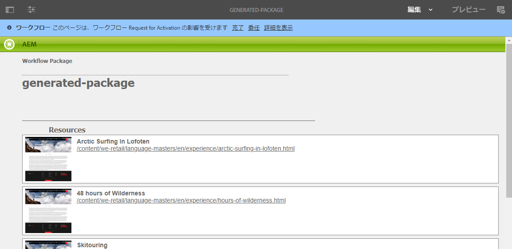

1. リンクは、個別のページを開くために使用できます。
