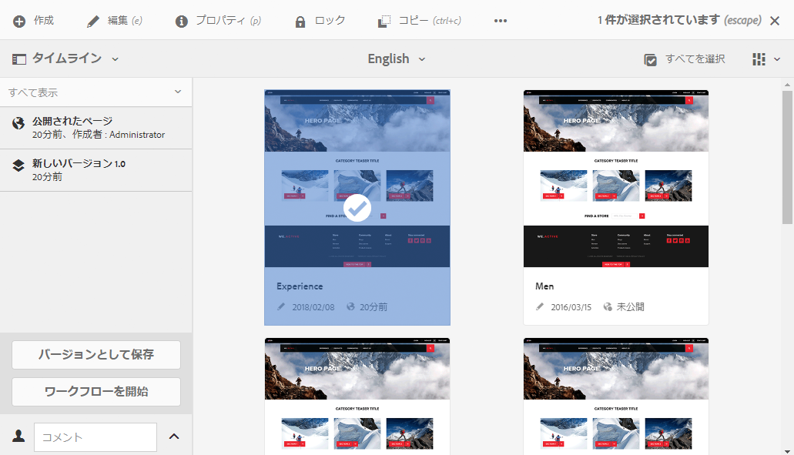
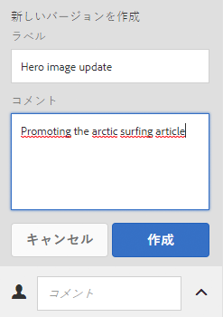
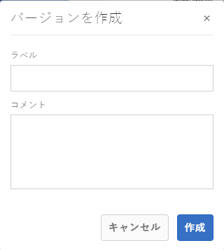
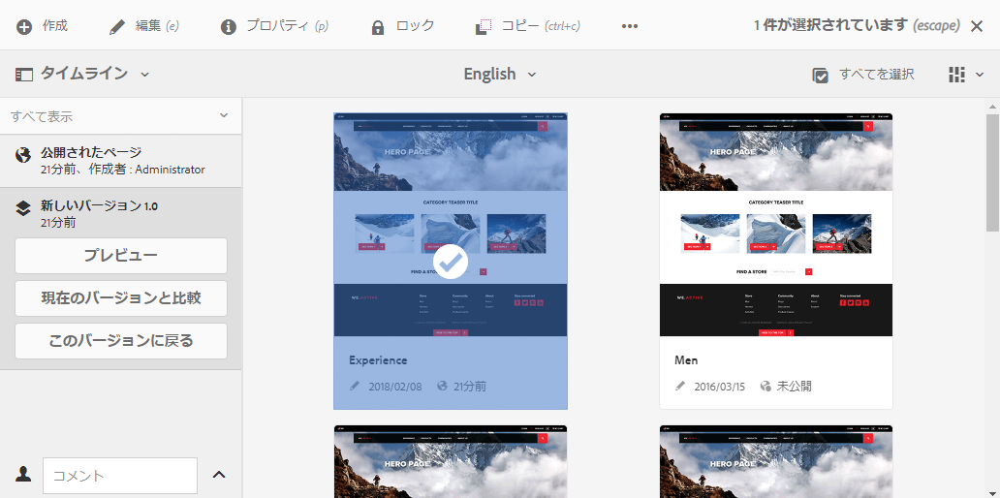
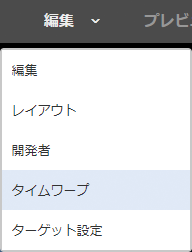
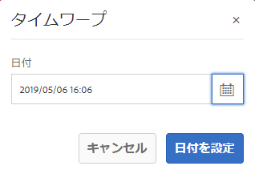
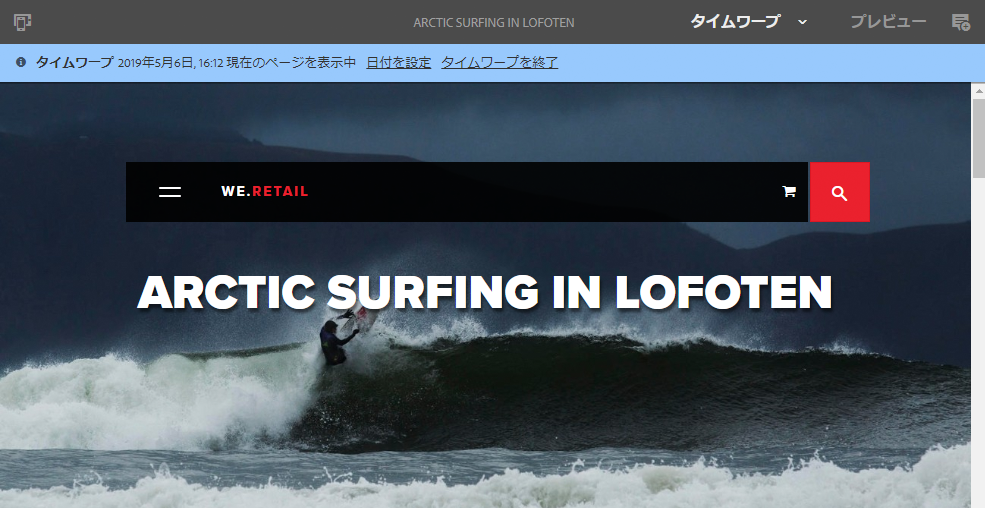

# ページバージョンの処理 {#working-with-page-versions}

バージョン管理では、特定の時点でのページの「スナップショット」を作成します。バージョン管理を使用すると、次の操作を実行できます。

* ページのバージョンを作成します。
* ページを以前のバージョンに復元します。例：
   * をクリックして、ページに対して行った変更を取り消します。
* ページの現在のバージョンを以前のバージョンと比較する：
   * を使用して、テキストと画像の違いを強調表示します。

## 新しいバージョンの作成 {#creating-a-new-version}

リソースのバージョンは、次の場所から作成できます。

* [タイムラインパネル](#creating-a-new-version-timeline)
* 「[作成](#creating-a-new-version-create-with-a-selected-resource)」オプション（リソースが選択されている場合）

### 新しいバージョンの作成 - タイムライン {#creating-a-new-version-timeline}

1. バージョンを作成するページに移動して、そのページを表示します。
1. [選択モード](/help/sites-authoring/basic-handling.md#viewing-and-selecting-resources)でページを選択します。
1. **タイムライン**&#x200B;列を開きます。
1. コメントフィールドの横にある矢印をクリックまたはタップして、オプションを表示します。

   

1. 「**バージョンとして保存**」を選択します。
1. を入力します。 **ラベル** および **コメント** 必要に応じて。

   

1. 「**作成**」で新しいバージョンを確定します。

   タイムラインの情報が、新しいバージョンを示すように更新されます。

### 新しいバージョンの作成 - 選択したリソースで作成 {#creating-a-new-version-create-with-a-selected-resource}

1. バージョンを作成するページに移動して、そのページを表示します。
1. [選択モード](/help/sites-authoring/basic-handling.md#viewing-and-selecting-resources)でページを選択します。
1. を選択します。 **作成** 」オプションを使用して、ダイアログを開きます。
1. ダイアログボックスで、 **ラベル** および **コメント**（必要に応じて）

   

1. 「**作成**」で新しいバージョンを確定します。

   タイムラインが開き、新しいバージョンを示すように情報が更新されます。

## バージョンの回復 {#reinstating-versions}

ページのバージョンを作成した後、以前のバージョンを回復する様々な方法があります。

* [タイムライン](/help/sites-authoring/basic-handling.md#timeline)パネルの「**このバージョンに戻る**」オプション

  選択したページの以前のバージョンを回復します。

* 上部の[アクションツールバー](/help/sites-authoring/basic-handling.md#actions-toolbar)の「**復元**」オプション

   * **バージョンを復元**

     現在選択されているフォルダー内の指定されたページのバージョンを回復します。これには、以前削除したページの復元も含むことができます。

   * **ツリーを復元**

     ツリー全体のバージョンを指定した日時に回復します。これには、以前削除したページを含むことができます。

>[!NOTE]
>
>ページを回復すると、作成されたバージョンが新しいブランチの一部になります。
>
>この処理は次のようになります。
>
>1. 任意のページのバージョンを作成します。
>1. 最初のラベルとバージョンノードの名前は、1.0、1.1、1.2 などです。
>1. 最初のバージョンを回復します。この場合は 1.0 です。
>1. バージョンを再度作成します。
>1. 生成されるラベルおよびノード名は、1.0.0、1.0.1、1.0.2 などになります。

### 特定のバージョンに戻す {#revert-to-a-version}

選択したページの以前のバージョンを&#x200B;**復帰**&#x200B;させるには、次の手順に従います。

1. 以前のバージョンに戻すページに移動して、そのページを表示します。
1. [選択モード](/help/sites-authoring/basic-handling.md#viewing-and-selecting-resources)でページを選択します。
1. 「**タイムライン**」列を開き、「**すべて表示**」または「**バージョン**」を選択します。選択したページのページバージョンが一覧表示されます。
1. 戻すバージョンを選択します。選択可能なオプションは次のとおりです。

   

1. 「**このバージョンに戻る**」を選択します。選択したバージョンが復元され、タイムラインの情報が更新されます。

### バージョンの復元 {#restore-version}

このメソッドは、現在のフォルダー内の指定されたページのバージョンを復元するために使用できます。これには、以前削除したページの復元も含むことができます。

1. 必要なフォルダーに移動して[選択](/help/sites-authoring/basic-handling.md#viewing-and-selecting-resources)します。

1. 「**復元**」を選択し、上部の[アクションツールバー&#x200B;**で「**&#x200B;バージョンを復元](/help/sites-authoring/basic-handling.md#actions-toolbar)」を選択します。

   >[!NOTE]
   >
   >次のいずれかの場合：
   >
   >* 子ページを持たない単一のページを選択した。
   >* フォルダー内のどのページにもバージョンがない
   >
   >該当するバージョンがないので、表示は空になります。

1. 使用可能なバージョンが表示されます。

   

1. 特定のページに対して、「**復元後のバージョン**」ドロップダウンセレクターを使用して、そのページに必要なバージョンを選択します。

   

1. メインディスプレイで、復元する必要のあるページを選択します。

   

1. 選択したページの選択したバージョンを現在のバージョンとして復元するには、「**復元**」を選択します。

>[!NOTE]
>
>必要なページと関連するバージョンを選択する順序は入れ替え可能です。

### ツリーの復元 {#restore-tree}

このメソッドは、指定した日時にツリーのバージョンを復元する場合に使用できます。これには、以前削除したページを含めることができます。

1. 必要なフォルダーに移動して[選択](/help/sites-authoring/basic-handling.md#viewing-and-selecting-resources)します。

1. 「**復元**」を選択し、上部の[アクションツールバー](/help/sites-authoring/basic-handling.md#actions-toolbar)から「**ツリーを復元**」を選択します。ツリーの最新バージョンが表示されます。

   

1. 「**最新バージョンの日付**」で、日時セレクターを使用して、復元するツリーの別のバージョンを選択します。

1. 必要に応じて、「**バージョン管理されないページを維持**」フラグを設定します。

   * アクティブ（選択）の場合、バージョン管理されないページはすべて維持され、復元の影響を受けません。

   * 非アクティブ（選択されていない）場合、バージョン管理されないページは、バージョン管理されたツリーに存在しなかったので、削除されます。

1. 選択したバージョンのツリーを&#x200B;**現在**&#x200B;のバージョンとして復元する場合は、「*復元*」を選択します。

## バージョンのプレビュー {#previewing-a-version}

次の手順で特定のバージョンをプレビューできます。

1. 比較するページに移動して、そのページを表示します。
1. [選択モード](/help/sites-authoring/basic-handling.md#viewing-and-selecting-resources)でページを選択します。
1. 「**タイムライン**」列を開き、「**すべて表示**」または「**バージョン**」を選択します。
1. ページのバージョンが表示されます。プレビューするバージョンを選択します。

   

1. **プレビュー**&#x200B;を選択します。ページが新しいタブに表示されます。

   >[!CAUTION]
   >
   >ページを移動すると、移動前に作成したバージョンのプレビューを実行できなくなります。
   >
   >* プレビューで問題が発生した場合は、ページの [タイムライン](/help/sites-authoring/basic-handling.md#timeline)を調べて、ページを移動したかどうかを確認します。

## 特定のバージョンと現在のページとの比較 {#comparing-a-version-with-current-page}

以前のバージョンを現在のページと比較するには、次の手順を実行します。

1. 比較するページに移動して、そのページを表示します。
1. [選択モード](/help/sites-authoring/basic-handling.md#viewing-and-selecting-resources)でページを選択します。
1. 「**タイムライン**」列を開き、「**すべて表示**」または「**バージョン**」を選択します。
1. ページのバージョンが表示されます。比較するバージョンを選択します。

   

1. 「**現在のバージョンと比較**」を選択します。The [ページの差分](/help/sites-authoring/page-diff.md) が開き、違いが表示されます。

## タイムワープ {#timewarp}

タイムワープは、過去の特定の時間にページが&#x200B;*公開された*&#x200B;状態をシミュレートするために設計された機能です。

>[!TIP]
>
>AEM 6.5.10.0 以降を実行している場合、[タイムワープをローンチと組み合わせて使用して、未来をプレビューすることもできます](/help/sites-authoring/launches.md)。

コンテンツの作成は、継続的な共同作業プロセスです。 タイムワープの目的は、作成者が公開済みの Web サイトを経時的に追跡し、コンテンツの変化を理解できるようにすることです。 この機能では、ページのバージョンを使用してパブリッシュ環境の状態を判断します。

* 選択した時間にアクティブであったページバージョンが検索されます。
   * このページバージョンは作成済み/アクティベート済みです *前* タイムワープで選択した時点。
* 削除されたページに移動する場合も、そのページの古いバージョンがリポジトリで引き続き使用できる限り、ページのレンダリングがおこなわれます。
* 公開されたバージョンが見つからない場合、オーサー環境で現在のページの状態に戻ります ( これは、閲覧を妨げるエラー（404 ページ）を防ぐためです )。

### タイムワープの使用 {#using-timewarp}

タイムワープは、ページエディターの[モード](/help/sites-authoring/author-environment-tools.md#page-modes)です。開始するには、他のモードに切り替えるときと同様にタイムワープモードに切り替えます。

1. タイムワープを開始するページのエディターを起動し、モード選択で&#x200B;**タイムワープ**&#x200B;を選択します。

   

1. ダイアログで、目的の日時を設定し、「 」をクリックまたはタップします。 **日付を設定**. 時間を選択しない場合、現在の時間がデフォルトとして使用されます。

   

1. ページは、日付設定に基づいて表示されます。タイムワープモードは、ウィンドウの上部にある青いステータスバーで示されます。ステータスバーのリンクを使用すると、対象とする新しい日付を選択したり、タイムワープモードを終了したりできます。

   

### タイムワープの制限事項 {#timewarp-limitations}

タイムワープでは、選択した時点のページを再現するために最大限の努力をします。ただし、AEMでのコンテンツの継続的なオーサリングは複雑な作業なので、これが常に可能とは限りません。 タイムワープを使用する際は、以下の制限事項に留意してください。

* **タイムワープは、公開されたページに基づいて機能する** - タイムワープは事前にページを公開した場合にのみ完全に機能します。表示されない場合、オーサー環境の現在のページがタイムワープに表示されます。
* **タイムワープはページのバージョンを使用する** - リポジトリから削除されたページに移動する場合、このページの古いバージョンがリポジトリ内に残っていれば、正しくレンダリングされます。
* **削除されたバージョンがタイムワープに影響を及ぼす** - バージョンがリポジトリーから削除された場合、タイムワープで正しい表示を行うことができません。

* **タイムワープは読み取り専用** - ページの古いバージョンを編集することはできません。古いバージョンは表示のみ可能です。古いバージョンを復元する場合は、 [復元](#reverting-to-a-page-version).

* **タイムワープはページの内容にのみ基づく** - Web サイトのレンダリングの要素が変更された場合、これらの項目はリポジトリ内でバージョン管理されないので、ビューは元のビューとは異なります。 このような要素には、コード、CSS、アセット/画像などが含まれます。

>[!CAUTION]
>
>タイムワープは、作成者によるコンテンツの把握と作成を支援するツールとして設計されています。監査ログや法的な目的のためのものではありません。
