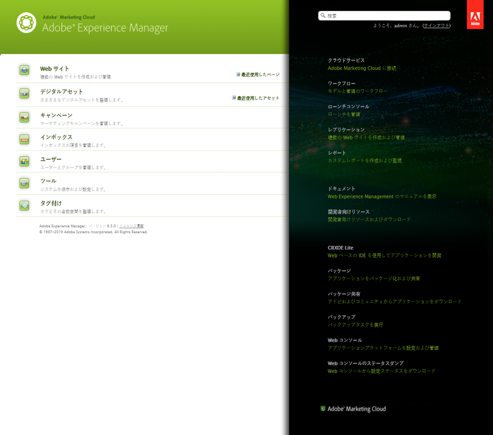
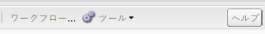
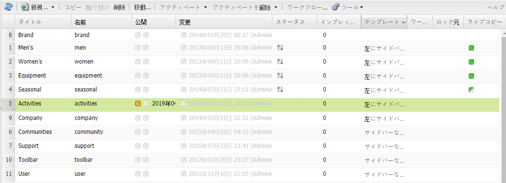
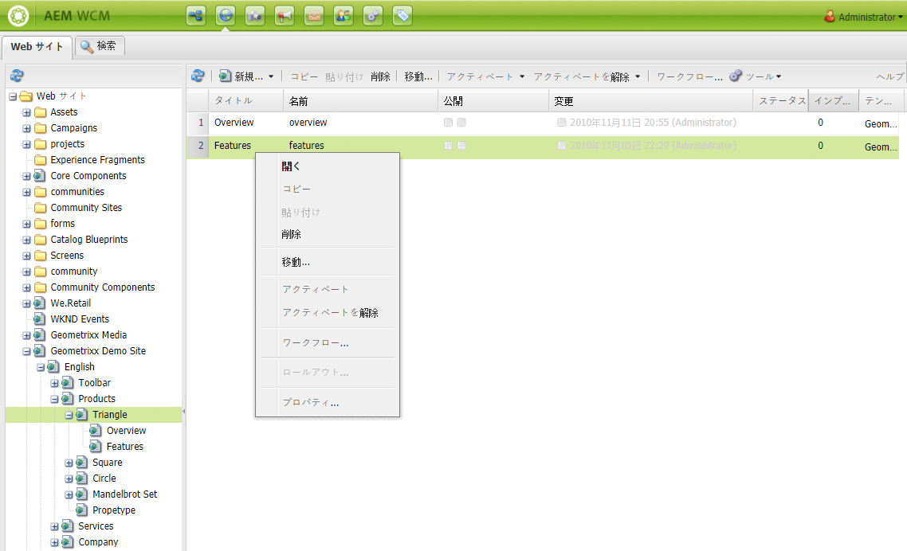

# 基本操作{#basic-handling}

>[!NOTE]
>
>* このページには、AEM オーサー環境を使用する際の基本操作の概要をまとめています。これは&#x200B;**サイト**&#x200B;コンソールを基礎として使用します。
   >
   >
* 一部の機能はすべてのコンソールでは使用できず、一部のコンソールにしかない機能もあります。個別のコンソールや関連する機能に関する固有情報については、他のページで詳しく取り上げます。
>* AEM 全体で（特に、[コンソールを使用する](/help/sites-classic-ui-authoring/author-env-keyboard-shortcuts.md)場合と[ページを編集する](/help/sites-classic-ui-authoring/classic-page-author-keyboard-shortcuts.md)場合に）、キーボードショートカットを利用できます。

>

## ようこそ画面 {#the-welcome-screen}

クラシック UI には様々なコンソールがあり、クリック、ダブルクリック、[コンテキストメニュー](#context-menus)などの馴染みのあるメカニズムを使用して移動やアクションの開始をおこなうことができます。

ログインすると、ようこそ画面が表示されます。ここにはコンソールやサービスへのリンクの一覧が表示されます。

## コンソール {#consoles}

主なコンソールは次のとおりです。

<table>
 <tbody>
  <tr>
   <td><strong>コンソール</strong></td>
   <td><strong>目的</strong></td>
  </tr>
  <tr>
   <td><strong>ようこそ</strong></td>
   <td>概要を示し、AEM の主要機能に（リンク経由で）直接アクセスできます。</td>
  </tr>
  <tr>
   <td><strong>デジタルアセット</strong>  </td>
   <td>これらのコンソールでは、画像、ビデオ、ドキュメント、オーディオファイルなどのデジタルアセットを読み込んで、それらの<a href="/help/sites-classic-ui-authoring/classicui-assets.md">デジタルアセットを管理</a>できます。これにより、これらのアセットは、同じ AEM インスタンス上で実行されているすべての Web サイトで使用できます。 </td>
  </tr>
  <tr>
   <td><strong>ローンチ</strong></td>
   <td>This helps you manage your <a href="/help/sites-classic-ui-authoring/classic-launches.md">launches</a>; these enable you to develop the content for a future release of one or more activated web pages.  <i>注意：タッチ対応UIでは、参照レールと共に、サイトコンソールでも同じ機能のほとんどが使用できます。</i> <i>必要に応じて、このコンソールはツールコンソールから使用できます。「操作」、「起動」の順に選択します。</i></td>
  </tr>
  <tr>
   <td><strong>インボックス </strong></td>
   <td>多くの場合、ワークフローのサブタスクには多くの参加者が関わっており、各参加者は、その手順を完了してから次の参加者に作業を引き継ぐ必要があります。インボックスを使用すると、それらのタスクに関連付けられた通知を確認できます。詳しくは、<a href="/help/sites-administering/workflows.md">ワークフローの操作</a>を参照してください。  </td>
  </tr>
  <tr>
   <td><strong>タグ付け</strong></td>
   <td>タグ付けコンソールを使用すると、タグを管理できます。タグは、コンテンツを構成する各部分を分類したり、それらの各部分に注釈を付けたりするために使用できる、短い名前またはフレーズです。タグによって、検索や整理がより簡単になります。詳しくは、<a href="/help/sites-classic-ui-authoring/classic-feature-tags.md">タグの使用と管理</a>を参照してください。</td>
  </tr>
  <tr>
   <td><strong>ツール</strong></td>
   <td><a href="/help/sites-administering/tools-consoles.md">ツールコンソール</a>を使用して、Web サイト、デジタルアセット、およびコンテンツリポジトリのその他の要素の管理に役立つ、数多くの専用ツールおよびコンソールにアクセスできます。</td>
  </tr>
  <tr>
   <td><strong>ユーザー</strong></td>
   <td>これらのコンソールを使用すると、ユーザーとグループのアクセス権を管理できます。詳しくは、<a href="/help/sites-administering/security.md">ユーザー管理とセキュリティ</a>を参照してください。  </td>
  </tr>
  <tr>
   <td><strong>Web サイト</strong></td>
   <td>サイト／Web サイトコンソールでは、AEM インスタンス上で実行される <a href="/help/sites-classic-ui-authoring/classic-page-author.md">Web サイトを作成、参照および管理</a>できます。これらのコンソールを通じて、Web サイトページの作成、コピー、移動および削除や、ワークフローの開始、ページのアクティベート（公開）を行うことができます。また、ページを編集用に開くこともできます。  </td>
  </tr>
  <tr>
   <td><strong>ワークフロー</strong></td>
   <td>ワークフローは、あるタスクを完了するまでの処理を記述した、定義済みの一連の手順です。多くの場合、あるタスクには多くの参加者が関わっており、各参加者は、その手順を完了してから次の参加者に作業を引き継ぐ必要があります。ワークフローコンソールを使用すると、ワークフローモデルを構築でき、実行中のワークフローインスタンスを管理できます。詳しくは、<a href="/help/sites-administering/workflows.md">ワークフローの操作</a>を参照してください。  </td>
  </tr>
 </tbody>
</table>

**Web サイト**&#x200B;コンソールには、ページの移動や管理のための 2 つのパネルが表示されます。

* 左側のウィンドウ

   これにより、Webサイトのツリー構造と、そのWebサイト内のページが表示されます。

   また、プロジェクト、設計図、アセットなど、その他の側面やAEMに関する情報も表示されます。

* 右側のウィンドウ

   これは、ページ（左側のペインで選択した場所）を表示し、アクションの実行に使用できます。

ここから、ツールバーやコンテキストメニューを使用するか、ページを開いて追加のアクションを実行することで、[ページを管理](/help/sites-authoring/managing-pages.md)できます。

>[!NOTE]
>
>基本操作はすべてのコンソールで同じです。ここでは、オーサリング時に主に使用されるコンソールである **Web サイト**&#x200B;コンソールを取り上げます。

## ヘルプへのアクセス {#accessing-help}

様々なコンソール（Web サイトなど）で「**ヘルプ**」ボタンも使用できます。このボタンにより、パッケージ共有またはドキュメントのサイトが開きます。

ページを編集する際には、[サイドキックにもヘルプにアクセスするためのボタンが表示](/help/sites-classic-ui-authoring/classic-page-author-env-tools.md#accessing-help)されます。

## Web サイトコンソールでのナビゲーション {#navigating-with-the-websites-console}

**Web サイト**&#x200B;コンソールには、コンテンツのページがツリー構造（左側のウィンドウ）で表示されます。ツリー構造のセクションは、簡単に移動できるように、必要に応じて展開（+）や折りたたみ（-）ができます。

* ページ名（左側のウィンドウ）で 1 回クリックすると、

   * 右側のウィンドウで子ページが表示されます。
   * また、左側のウィンドウで構造が展開されます。

      パフォーマンスの問題があるので、このアクションは子ノードの数によって左右されます。標準インストールでは、この展開方式は子ノードが `30` 個以下の場合に機能します。

* ページ名（左側のウィンドウ）をダブルクリックした場合もツリーが展開されますが、同時にページが開くので、ツリーの展開がはっきりとは見えません。

>[!NOTE]
>
>次のように、アプリケーション特有の siteadmin ウィジェットの設定で、使用するコンソールごとにデフォルト値（`30`）を変更できます。
>
>siteadmin ノードの場合：
>
>次のプロパティの値を設定します。
>`treeAutoExpandMax`
>次の場所にあります。
>`/apps/wcm/core/content/siteadmin`
>
>テーマでグローバルに設定する場合：
>次のプロパティの値を設定します。
>`TREE_AUTOEXPAND_MAX`
>次の場所にあります。
>`/apps/cq/ui/widgets/themes/default/widgets/wcm/SiteAdmin.js`
>
>詳しくは、[CQ Widget API の SiteAdmin](https://helpx.adobe.com/experience-manager/6-5/sites/developing/using/reference-materials/widgets-api/index.html?class=CQ.wcm.SiteAdmin) を参照してください。

## Web サイトコンソールでのページ情報 {#page-information-on-the-websites-console}

**Web サイト**&#x200B;コンソールの右側のパネルでは、ページに関する情報が次のようにリスト表示されます。

利用可能なフィールドを次に示します。これらのフィールドの一部がデフォルトとして表示されます。

<table>
 <tbody>
  <tr>
   <td><strong>列</strong></td>
   <td><strong>説明</strong></td>
  </tr>
  <tr>
   <td>サムネール</td>
   <td>ページのサムネールを表示します。</td>
  </tr>
  <tr>
   <td>タイトル</td>
   <td>ページに表示されるタイトルです。</td>
  </tr>
  <tr>
   <td>名前</td>
   <td>AEM が参照するページの名前です。</td>
  </tr>
  <tr>
   <td>公開済み</td>
   <td>ページが公開済みかどうか、および公開日時を示します。</td>
  </tr>
  <tr>
   <td>変更済み</td>
   <td>ページに変更があったかどうか、および変更日時を示します。変更を保存するには、ページをアクティベートする必要があります。</td>
  </tr>
  <tr>
   <td>Scene7 発行</td>
   <td>ページが Scene7 に公開されたかどうかを示します。  </td>
  </tr>
  <tr>
   <td>ステータス</td>
   <td>ページの現在のステータス（ページがワークフローまたはライブコピーに含まれているか、ページが現在ロックされているかなど）を示します。</td>
  </tr>
  <tr>
   <td>インプレッション数</td>
   <td>ページのアクティビティをヒット数で示します。</td>
  </tr>
  <tr>
   <td>テンプレート</td>
   <td>ページのベースとなるテンプレートを示します。</td>
  </tr>
  <tr>
   <td>ワークフロー内</td>
   <td>ページがワークフロー内にある場合にそのことを示します。</td>
  </tr>
  <tr>
   <td>ロック元</td>
   <td>ページがロックされている場合に、ロックしたユーザーアカウントを示します。</td>
  </tr>
  <tr>
   <td>ライブコピー</td>
   <td>ページがライブコピーに含まれている場合にそのことを示します。</td>
  </tr>
 </tbody>
</table>

>[!NOTE]
>
>表示されている列を選択するには、列のタイトルの上にマウスを置きます。ドロップダウンメニューが表示され、このメニューから「**列**」オプションを使用できます。

ページの横の「**発行済み**」列と「**変更済み**」列にある色は、パブリケーションのステータスを示します。

| **列** | **カラー** | **説明** |
|---|---|---|
| 公開済み | グリーン | パブリケーションが成功しました。コンテンツが公開されました。 |
| 公開済み | 黄 | パブリケーションは保留中です。パブリケーションの確認をまだシステムから受け取っていません。 |
| 公開済み | レッド | パブリケーションが失敗しました。パブリッシュインスタンスとは接続されていません。これは、コンテンツがアクティベート解除されたことも表します。 |
| 公開済み | 空白&#x200B;** | このページは公開されたことがありません。 |
| 変更済み | ブルー | ページが最後のパブリケーション以降に変更されました。 |
| 変更済み | 空白&#x200B;** | このページは変更されたことがないか、最後のパブリケーション以降に変更されていません。 |

## コンテキストメニュー {#context-menus}

クラシック UI では、クリック、ダブルクリックなどの馴染みのあるメカニズムを使用して移動やアクションの開始をおこなうことができます。現在の状況に応じて、様々なコンテキストメニュー（通常はマウスの右クリックにより開く）も利用できます。

