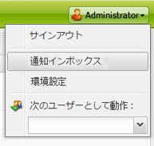
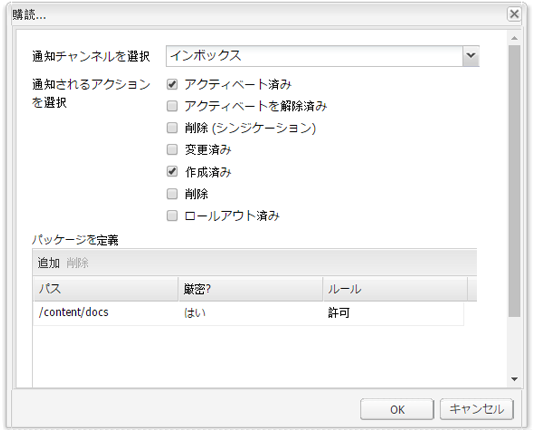

# インボックス{#your-inbox}

AEM の様々な領域から通知を受け取ることができます。例えば、ページコンテンツに対して実行する必要のあるアクションを表す作業項目やタスクに関する通知を受け取ります。

通知のタイプで分類される 2 つのインボックスにこれらの通知を受け取ります。

* 購読の結果として受け取る通知が表示されるインボックスについては、次のセクションで説明します。
* ワークフローアイテム用の特殊なインボックスについては、「[ワークフローへの参加](/help/sites-classic-ui-authoring/classic-workflows-participating.md)」ドキュメントで説明しています。

## 通知の表示 {#viewing-your-notifications}

通知を表示するには：

1. 通知インボックスを開きます。**Web サイト**&#x200B;コンソールで、右上隅のユーザーボタンをクリックして、「**通知インボックス**」を選択します。

   

   >[!NOTE]
   >
   >ブラウザーで直接コンソールにアクセスすることもできます。例えば、次のように指定します。
   >
   >
   >` https://<host>:<port>/libs/wcm/core/content/inbox.html`

1. 通知がリストに表示されます。必要に応じて次のアクションを実行できます。

   * [通知の購読](#subscribing-to-notifications)
   * [通知の処理](#processing-your-notifications)

   

## 通知の購読 {#subscribing-to-notifications}

通知にサブスクライブするには：

1. 通知インボックスを開きます。**Web サイト**&#x200B;コンソールで、右上隅にあるユーザーボタンをクリックして、「**通知インボックス**」を選択します。

   

   >[!NOTE]
   >
   >ブラウザーで直接コンソールにアクセスすることもできます。例えば、次のように指定します。
   >
   >
   >`https://<host>:<port>/libs/wcm/core/content/inbox.html`

1. 左上隅の「**設定**」をクリックして、設定ダイアログを開きます。

   

1. 通知チャネルを選択します。

   * **インボックス**：通知が AEM インボックスに表示されます。
   * **電子メール**：通知が、ユーザープロファイルで定義された電子メールアドレスに送信されます。

   >[!NOTE]
   >
   >電子メールで通知するには、いくつかの設定項目を設定する必要があります。また、電子メールテンプレートをカスタマイズしたり、新しい言語の電子メールテンプレートを追加したりすることもできます。AEM で電子メール通知を設定するには、[電子メール通知の設定](/help/sites-administering/notification.md#configuringemailnotification)を参照してください。

1. 通知するページのアクションを選択します。

   * アクティベート済み：ページがアクティベートされている場合。
   * アクティベートを解除済み：ページのアクティベートが解除されている場合。
   * 削除 (シンジケーション)：ページの削除がレプリケートされている場合（例えば、ページに対して実行された削除アクションがレプリケートされている場合）。ページが削除または移動されると、削除アクションが自動的にレプリケートされます。削除アクションが実行されたソースインスタンス、およびレプリケーションエージェントによって定義された宛先インスタンスではページが削除されます。

   * 変更済み：ページが変更されている場合。
   * 作成済み：ページが作成されている場合。
   * 削除：ページ削除アクションによってページが削除されている場合。
   * ロールアウト済み：ページがロールアウトされている場合。

1. 通知するページのパスを定義します。

   * 「**追加**」をクリックして、テーブルに新しい行を追加します。
   * **パス**&#x200B;テーブルセルをクリックし、パスを入力します(例：`/content/docs`。

   * サブツリーに属しているすべてのページについて通知するには、「**厳密?**」を「**いいえ**」に設定します。パスで定義されているページに対するアクションのみについて通知するには、「**厳密?**」を「**はい**」に設定します。

   * ルールを許可するには、「**ルール**」を「**許可**」に設定します。「**拒否**」に設定されていると、ルールは拒否されますが削除はされません。後で許可することができます。

   定義を削除するには、テーブルのセルをクリックして行を選択し、「**削除**」をクリックします。

1. 「**OK**」をクリックして設定を保存します。

## 通知の処理  {#processing-your-notifications}

AEM インボックスに通知を受信するように選択すると、インボックスに通知が入るようになります。[通知を参照](#viewing-your-notifications)し、必要な通知を選択して、次の操作を実行できます。

* 「**承認**」をクリックして承認する：「**読み取り**」列の値は **true** に設定されます。

* 「**削除**」をクリックして、通知を削除します。

