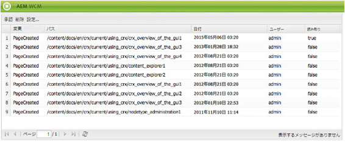

# インボックス {#your-inbox}

AEMの様々な領域から通知を受け取ることができます。例えば、作業項目に関する通知や、ページコンテンツに対して実行する必要のあるアクションを表すタスクなどです。

これらの通知は、2 つの受信ボックスで受け取ります。受信ボックスは、通知のタイプで区切られます。

* 購読の結果として受け取る通知を確認できるインボックスについては、次の節で説明します。
* ワークフロー項目専用のインボックスについては、[ワークフローへの参加](/help/sites-classic-ui-authoring/classic-workflows-participating.md)のドキュメントを参照してください。

## 通知の表示 {#viewing-your-notifications}

通知を表示するには：

1. 通知インボックスを開きます。内 **Web サイト** コンソールで、右上隅のユーザーボタンをクリックし、 **通知インボックス**.

   

   >[!NOTE]
   >
   >ブラウザーで直接コンソールにアクセスすることもできます。例えば、次のように指定します。
   >
   >
   >` https://<host>:<port>/libs/wcm/core/content/inbox.html`

1. 通知が表示されます。 必要に応じて、次の操作を実行できます。

   * [通知の購読](#subscribing-to-notifications)
   * [通知の処理](#processing-your-notifications)

   

## 通知の購読 {#subscribing-to-notifications}

通知を購読するには：

1. 通知インボックスを開きます。内 **Web サイト** コンソールで、右上隅のユーザーボタンをクリックし、 **通知インボックス**.

   

   >[!NOTE]
   >
   >ブラウザーで直接コンソールにアクセスすることもできます。例えば、次のように指定します。
   >
   >
   >`https://<host>:<port>/libs/wcm/core/content/inbox.html`

1. 左上隅の「**設定**」をクリックして、設定ダイアログを開きます。

   

1. 通知チャネルを選択します。

   * **インボックス**:通知がAEMインボックスに表示されます。
   * **電子メール**:通知は、ユーザープロファイルで定義された E メールアドレスに電子メールで送信されます。

   >[!NOTE]
   >
   >電子メールで通知を受け取るには、いくつかの設定が必要です。 また、電子メールテンプレートをカスタマイズしたり、新しい言語用の電子メールテンプレートを追加したりすることもできます。 詳しくは、 [電子メール通知の設定](/help/sites-administering/notification.md#configuringemailnotification) AEMで電子メール通知を設定する場合。

1. 通知を受け取るページアクションを選択します。

   * 有効化済み：（ページがアクティベートされたとき）
   * 非アクティブ：（ページが非アクティブ化されている場合）
   * 削除 （シンジケーション）：ページの削除がレプリケートされている場合（例えば、ページに対して実行された削除アクションがレプリケートされている場合）。
ページが削除または移動されると、削除アクションが自動的にレプリケートされます。削除アクションが実行されたソースインスタンスと、レプリケーションエージェントによって定義された宛先インスタンスで、ページが削除されます。

   * 変更日：（ページが変更された場合）
   * 作成日：（ページが作成されたとき）
   * 削除済み：（ページの削除アクションによってページが削除された場合）
   * ロールアウト済み：（ページがロールアウトされた場合）

1. 通知を受け取るページのパスを定義します。

   * クリック **追加** をクリックして、新しい行をテーブルに追加します。
   * 「**パス**」テーブルのセルをクリックし、パスを入力します（例：`/content/docs`）。

   * サブツリーに属しているすべてのページについて通知するには、「**厳密?**」を「**いいえ**」に設定します。
パスで定義されているページに対するアクションのみについて通知するには、「**厳密?** から **はい**.

   * ルールを許可するには、 **ルール** から **許可**. 次に設定した場合： **拒否**&#x200B;に設定されている場合、ルールは拒否されますが削除されず、後で許可することができます。

   定義を削除するには、テーブルのセルをクリックして行を選択し、 **削除**.

1. クリック **OK** 設定を保存します。

## 通知の処理 {#processing-your-notifications}

AEMインボックスで通知を受信することを選択した場合は、インボックスに通知がいっぱいになります。 以下が可能です。 [通知を表示](#viewing-your-notifications) 次に、必要な通知を選択します。

* 「 」をクリックして承認します **承認**:値 **読み取り** 列が **true**.

* 「 **削除**.

