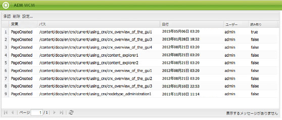

# インボックス {#your-inbox}

AEM の様々な領域から通知を受信できます。例えば、作業項目に関する通知またはページコンテンツに対して実行する必要のあるアクションを表すタスクなどです。

これらの通知は、通知のタイプによってわけられた次の 2 つのインボックスで受信しますす。

* 購読の結果として受け取る通知が表示されるインボックスについては、次の節で説明します。
* ワークフロー項目専用のインボックスについては、[ワークフローへの参加](/help/sites-classic-ui-authoring/classic-workflows-participating.md)のドキュメントを参照してください。

## 通知の表示 {#viewing-your-notifications}

通知を表示するには、次の手順に従います。

1. 通知インボックスを開く：**Web サイト**&#x200B;のコンソールで、右上隅のユーザーボタンをクリックし、「**通知インボックス**」を選択します。

   

   >[!NOTE]
   >
   >ブラウザーで直接コンソールにアクセスすることもできます。例えば、次のように指定します。
   >
   >
   >` https://<host>:<port>/libs/wcm/core/content/inbox.html`

1. 通知が表示されます。必要に応じて、次の操作を実行できます。

   * [通知の購読](#subscribing-to-notifications)
   * [通知の処理](#processing-your-notifications)

   

## 通知の購読 {#subscribing-to-notifications}

通知を購読するには、次の手順に従います。

1. 通知インボックスを開く：**Web サイト**&#x200B;のコンソールで、右上隅のユーザーボタンをクリックし、「**通知インボックス**」を選択します。

   

   >[!NOTE]
   >
   >ブラウザーで直接コンソールにアクセスすることもできます。例えば、次のように指定します。
   >
   >
   >`https://<host>:<port>/libs/wcm/core/content/inbox.html`

1. 左上隅の「**設定**」をクリックして、設定ダイアログを開きます。

   

1. 通知チャネルを選択します。

   * **インボックス**：通知が AEM インボックスに表示されます。
   * **メール**：通知は、ユーザープロファイルで定義したメールアドレスにメールで送信されます。

   >[!NOTE]
   >
   >メールで通知を受け取るには、いくつかの設定が必要です。また、メールテンプレートのカスタマイズや新しい言語用のメールテンプレートの追加もできます。AEM でメール通知を設定するには、[メール通知の設定](/help/sites-administering/notification.md#configuringemailnotification)を参照してください。

1. 通知を受け取るページアクションを選択します。

   * アクティベート済み：ページがアクティベートされている場合。
   * アクティベートを解除済み：ページのアクティベートが解除されている場合。
   * 削除 （シンジケーション）：ページの削除がレプリケートされている場合（例えば、ページに対して実行された削除アクションがレプリケートされている場合）。
ページが削除または移動されると、削除アクションが自動的にレプリケートされます。削除アクションが実行されたソースインスタンスおよびレプリケーションエージェントによって定義された宛先インスタンスで、ページが削除されます。

   * 変更済み：ページが変更されている場合。
   * 作成済み：ページが作成されている場合。
   * 削除済み：ページ削除アクションによってページが削除されている場合。
   * ロールアウト済み：ページがロールアウトされている場合。

1. 通知を受け取るページのパスを定義します。

   * 「**追加**」をクリックして、新しい行をテーブルに追加します。
   * 「**パス**」テーブルのセルをクリックし、パスを入力します（例：`/content/docs`）。

   * サブツリーに属しているすべてのページについて通知するには、「**厳密?**」を「**いいえ**」に設定します。
パスで定義されているページに対するアクションのみについて通知するには、「**厳密? 「**」を「**はい**」に設定します。

   * ルールを許可するには、「**ルール**」を「**許可**」に設定します。「**拒否**」に設定されている場合、ルールは拒否されますが削除されず、後で許可することができます。

   定義を削除するには、テーブルのセルをクリックして行を選択し、「**削除**」をクリックします。

1. 「**OK**」をクリックして、設定を保存します。

## 通知の処理 {#processing-your-notifications}

AEM インボックスで通知を受信することを選択した場合は、インボックスが通知でいっぱいになります。[通知を表示](#viewing-your-notifications)して、次に対して必要な通知を選択します。

* 「**承認**」をクリックして承認します。**読み取り**&#x200B;列の値は **true** に設定します。

* 「**削除**」をクリックして削除します。

