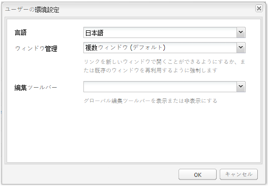

# アカウント環境の設定{#configuring-your-account-environment}

Adobe Experience Manager（AEM）では、アカウントとオーサー環境の特定項目を設定できます。

[アカウント設定](#account-settings)と[ユーザーの環境設定](#user-preferences)を使用して、次のオプションと環境設定を定義できます。

* **ツールバーの編集**
グローバル編集ツールバーが必要かどうかを選択します。ブラウザーウィンドウの上部に表示されるこのツールバーには、そのページの段落コンポーネントに使用できる**コピー**、**切り取り**、**貼り付け**、**削除**&#x200B;の各ボタンがあります。

   * 必要な場合に表示（デフォルト）
   * 常に表示
   * 非表示の状態を維持

* **次のユーザーとして実行**
[次のユーザーとして実行](/help/sites-administering/security.md#impersonating-another-user)の機能を使用すると、ユーザーは別のユーザーに成り代わって作業を行うことができます。

* **言語**
オーサリング環境の UI に使用する言語です。使用可能なリストから必要な言語を選択します。

* **ウィンドウ管理**
次のいずれかを選択します。

   * 複数ウィンドウ（デフォルト）
新しいウィンドウでページが開きます。
   * 単一ウィンドウ
現在のウィンドウでページが開きます。

## アカウント設定 {#account-settings}

ユーザーアイコンを使用すると、次のオプションにアクセスできます。

* ログアウト
* [次のユーザーとして実行](/help/sites-administering/security.md#impersonating-another-user)
* [ユーザーの環境設定](#user-preferences)
* [通知インボックス](/help/sites-classic-ui-authoring/author-env-inbox.md)

### ユーザーの環境設定 {#user-preferences}

各ユーザーは、自分自身に特定のプロパティを設定できます。これは、コンソールの右上隅にある&#x200B;**環境設定**&#x200B;ダイアログボックスで行うことができます。

このダイアログには次のオプションがあります。

