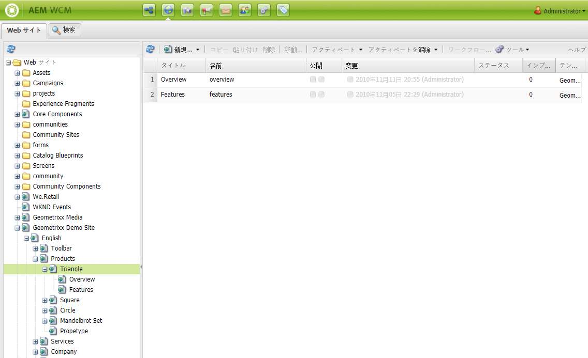
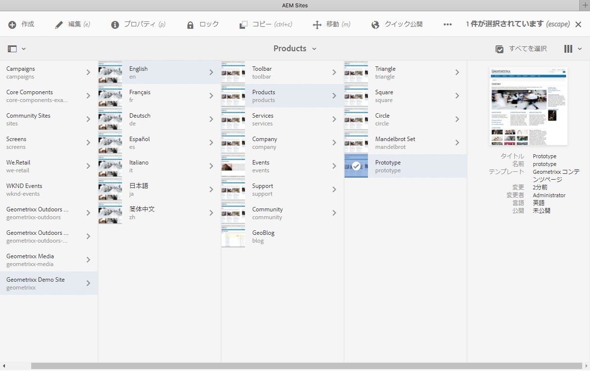
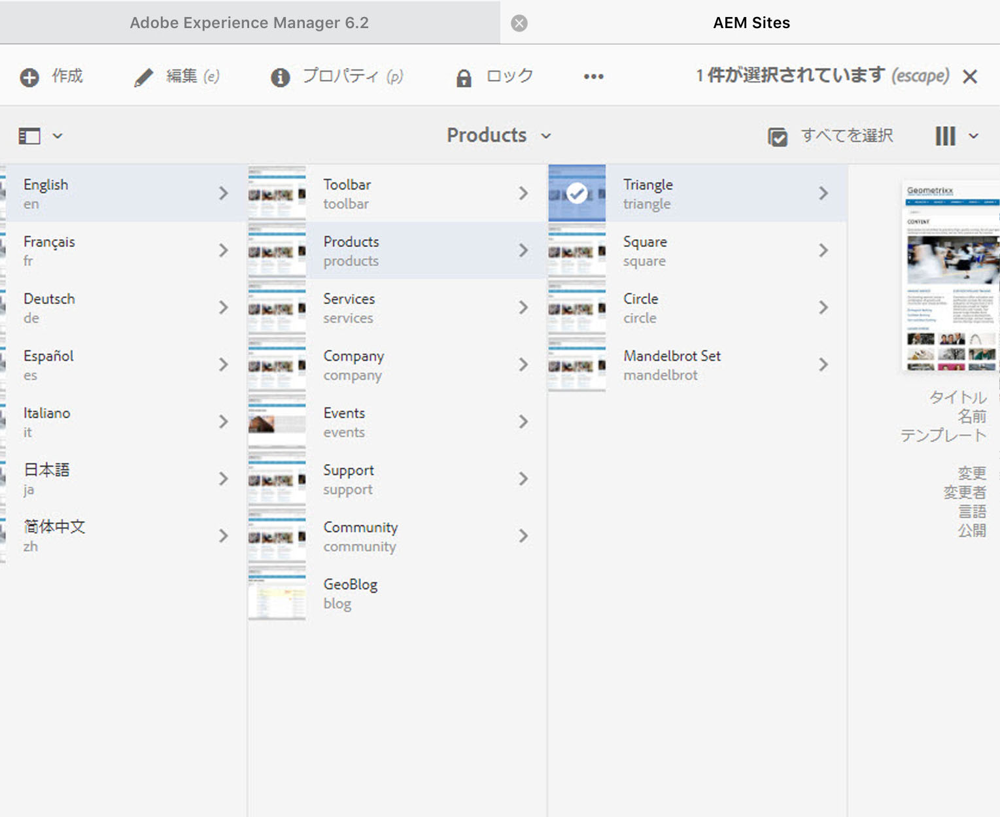

# オーサー環境の操作{#working-with-the-author-environment}

>[!NOTE]
>
>以下のドキュメントでは、クラシック UI に焦点を当てています。For information about authoring in the modern, touch-enabled UI, see the [standard Authoring documentation](/help/assets/assets.md).

オーサー環境では、以下に関連するタスクを実行できます。

* [オーサリング](/help/sites-authoring/author.md) ( [ページオーサリング](/help/sites-authoring/qg-page-authoring.md) 、アセット [の管理を含む](/help/assets/assets.md))

* Web サイトでのコンテンツの生成および管理の際に必要になる[管理](/help/sites-administering/administer-best-practices.md)タスク

これらの操作のために次の 2 つのグラフィカルユーザーインターフェイスが提供されており、最近のすべてのブラウザーからアクセスできます。

1. クラシック UI

   * この UI は長年、常に AEM で使用可能でした。
   * 緑色を基調としています。
   * デスクトップデバイス向けに設計されています。
   * もうメンテナンスはおこなわれていません。
   * 以下のドキュメントでは、このクラシック UI に焦点を当てています。最新のタッチベースの UI でのオーサリングについて詳しくは、[標準オーサリングのドキュメント](/help/sites-authoring/author.md)を参照してください。

   

1. タッチ操作向け UI

   * これは AEM の最新の標準 UI です。
   * 灰色を基調としており、クリーンでフラットなインターフェイスになっています。
   * タッチデバイスとデスクトップデバイスの両方で使用できるようにデザインされています（タッチ操作向けに最適化されています）。ルックアンドフィールはすべてのデバイスで同じですが、[リソースの表示と選択](/help/sites-authoring/basic-handling.md)の操作がやや異なります（タップとクリックの違い）。
   * See the [standard Authoring documentation](/help/sites-authoring/author.md) for further details on how to author using the touch-based UI. 以下のドキュメントでは、クラシック UI に焦点を当てています。

   * デスクトップ：

   

   * タブレットデバイス（または幅 1024 ピクセル未満のデスクトップ）。

   

