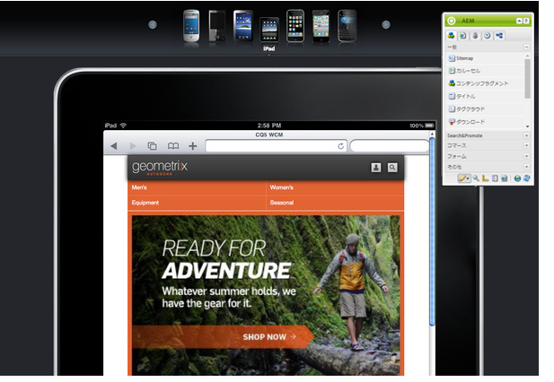

# モバイルデバイス用のページのオーサリング{#authoring-a-page-for-mobile-devices}

モバイルページをオーサリングする場合、ページはモバイルデバイスをエミュレートする方法で表示されます。ページのオーサリング時に、いくつかのエミュレーターを切り替えて、エンドユーザーがページにアクセスしたときの表示を確認できます。

ページをレンダリングするデバイスの機能に従って、デバイスはカテゴリ機能、スマートおよびタッチにグループ分けされます。エンドユーザーがモバイルページにアクセスするときは、AEM はデバイスを検出して、そのデバイスグループに対応する表現を送信します。

>[!NOTE]
>
>既存の標準サイトに基づいたモバイルサイトを作成するには、標準サイトのライブコピーを作成します。(See [Creating a Live Copy for Different Channels](/help/sites-administering/msm-livecopy.md).)
>
>AEM 開発者は、新しいデバイスグループを作成できます。(See [Creating Device Group Filters.](/help/sites-developing/groupfilters.md))

次の手順を使用して、モバイルページをオーサリングします。

1. ブラウザーで、**サイト管理者コンソール**&#x200B;に移動します。
1. **Web サイト**／**Geometrixx モバイルデモサイト**／**日本語**&#x200B;の下の&#x200B;**製品**&#x200B;ページを開きます。

1. 別のエミュレーターに切り替えます。それには、次のいずれかを行います。

   * ページの上部にあるデバイスアイコンをクリックします。
   * **サイドキック**&#x200B;の「**編集**」ボタンをクリックし、ドロップダウンメニューでデバイスを選択します。

1. **テキストと画像**&#x200B;コンポーネントを、サイドキックの「モバイル」タブからページにドラッグ＆ドロップします。
1. コンポーネントを編集し、テキストを追加します。「**OK**」をクリックし、変更を保存します。

ページは以下のようになります。

>[!NOTE]
>
>オーサーインスタンスのページがモバイルデバイスから要求されると、エミュレーターは無効になります。その後、タッチ操作対応UIを使用してオーサリングを行うことができます。

