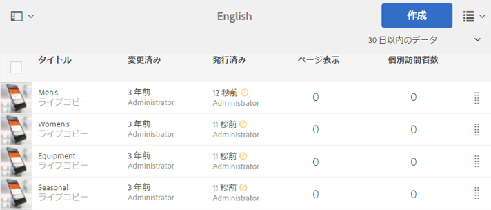

# ページ分析データの表示{#seeing-page-analytics-data}

ページ分析データを使用すると、ページコンテンツの効果を測定できます。

ページ分析データはサイトコンソールに表示されます。サイトがリスト形式で表示されているとき、デフォルトでは次の列が表示されます。

* ページ表示
* 個別訪問者数
* ページ滞在時間

>[!NOTE]
>
>サイトの分析データを直接コンソールに表示できるのは、タッチ操作向け UI の場合のみです。See [Seeing Page Analytics Data](/help/sites-authoring/page-analytics-using.md) in the standard authoring documentation for details.
