# 基礎モード{#scaffolding}

同じ構造を共有しながらコンテンツは異なるページを大量に作成する必要がある場合があります。標準的な AEM インターフェイスを使用する場合は、各ページを作成し、ページに適切なコンポーネントをドラッグして、それぞれのコンポーネントに内容を入力する必要があります。

基礎モードを使用すると、ページに必要な構造を反映したフィールドを使用してフォーム（基礎）を作成し、このフォームを使用して必要な構造に基づいたページを簡単に作成できます。

>[!NOTE]
>
>基礎モード（クラシック UI）では、[MSM の継承が考慮](#scaffolding-with-msm-inheritance)されます。

## 基礎モードの機能 {#how-scaffolding-works}

Scaffolds are stored in the **Tools** console of the site admin.

* **ツール**&#x200B;コンソールを開き、「**デフォルトのページの基礎モード**」をクリックします。
* 「**geometrixx**」をクリックします。
* 「**geometrixx**」で、「**ニュース**」という名前の基礎モードページ&#x200B;**&#x200B;を探し、ダブルクリックしてこのページを開きます。

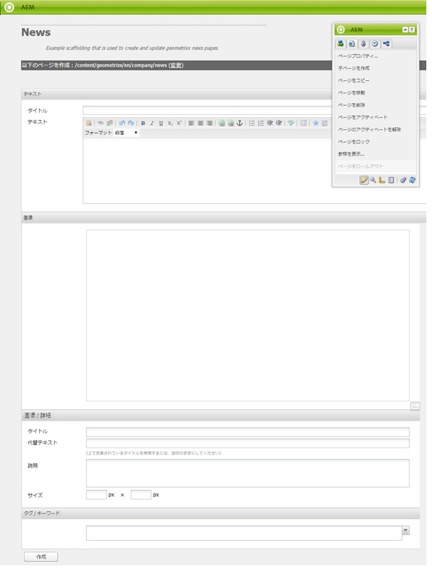

The scaffold consists of a form with a field for each piece of content that will make up the page to be created and four important parameters which are accessed through the **Page Properties** of the scaffold page.

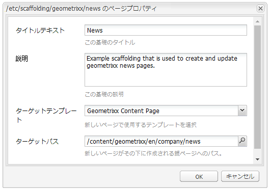

基礎モードページのプロパティを以下に示します。

* **タイトルテキスト**：この基礎モードページの名前です。この例では、「ニュース」です。
* **説明**：基礎モードページのタイトルの下に表示されます。
* **ターゲットテンプレート**：この基礎モードで新しいページを作成する際に使用するテンプレートです。この例では、Geometrixx コンテンツページ&#x200B;**&#x200B;テンプレートが使用されます。
* **ターゲットパス**：親ページのパスです。この基礎モードは、その親ページの下に新しいページを作成します。In this example the path is */content/geometrixx/en/news*.

基礎モードの本文はフォームに入力します。ユーザーが基礎モードを使用してページを作成する場合、ユーザーは、フォームに入力して、下部にある「作成」**&#x200B;をクリックします。In the **News** example above the form has the following fields:

* **タイトル**：作成するページの名前です。このフィールドは、常にすべての基礎モードに表示されます。
* **テキスト**：このフィールドは、生成されるページのテキストコンポーネントに対応します。
* **画像**:このフィールドは、結果のページの画像コンポーネントに対応します。
* **画像 / 詳細**：**タイトル**：画像のタイトルです。
* **画像 / 詳細**：**代替テキスト**：画像の代替テキストです。
* **Image/Advanced**: **説明**:画像の説明。
* **画像 / 詳細**：**サイズ**：画像のサイズです。
* **タグ / キーワード**：このページに割り当てられるメタデータです。このフィールドは、常にすべての基礎モードに表示されます。

### 基礎モードの作成 {#creating-a-scaffold}

To create a new scaffold go to the **Tools** console, then **Default Page Scaffolding** and create a new page. A single page template type will be available, the *Scaffolding Template.*

Go to the **Page Properties** of the new page and set the *Title Text*, *Description*, *Target Template* and *Target Path*, as described above.

次に、このスキャフォールドから作成されるページの構造を定義する必要があります。To do this go into **[design mode](/help/sites-authoring/page-authoring.md#sidekick)** on the scaffold page. リンクが表示され、**ダイアログエディター**&#x200B;でスキャフォールドを編集できます。

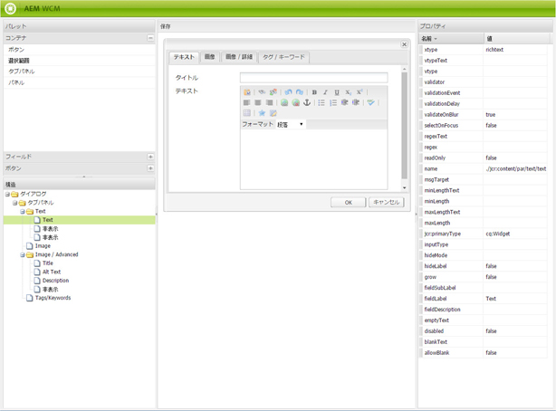

このダイアログエディターを使用すると、この基礎モードを使用して新しいページを作成するたびに作成されるプロパティを指定できます。

基礎モードのダイアログの定義は、コンポーネントのダイアログの定義と同じように機能します（[コンポーネント](/help/sites-developing/components.md)を参照）。ただし、以下のように、いくつかの重要な違いがあります。

* コンポーネントダイアログの定義は、通常のダイアログボックスとしてレンダリングされます（例えば、ダイアログエディターの中央のウィンドウに表示されます）。一方、基礎モードダイアログの定義は、ダイアログエディターで通常のダイアログボックスとして表示されますが、基礎モードフォームとして基礎モードページにレンダリングされます（前述の&#x200B;**ニュース**&#x200B;基礎モードのように表示されます）。
* コンポーネントダイアログでは、特定の単一コンポーネントのコンテンツ定義で値の設定が必要な場合のみ、フィールドが提供されます。基礎モードダイアログでは、作成されるページの各段落のプロパティごとにフィールドが提供される必要があります。
* コンポーネントダイアログの場合、特定のコンテンツのレンダリングに使用されるコンポーネントは暗黙的に指定されるので、この段落の `sling:resourceType` プロパティは段落の作成時に自動的に指定されます。基礎モードの場合、特定の段落に対して、コンテンツおよび割り当てるコンポーネントに関するすべての定義内容をダイアログで指定する必要があります。基礎モードダイアログでは、非表示&#x200B;**&#x200B;フィールドを使用してこの内容を指定し、ページの作成時にこの内容が送信されるようにする必要があります。

ダイアログエディターの&#x200B;**ニュース**&#x200B;基礎モードダイアログの例で、この動作を確認できます。基礎モードページでデザインモードに切り替えて、ダイアログエディターのリンクをクリックします。

Now, click on the dialog field **Dialog > Tab Panel > Text > Text**, like this:

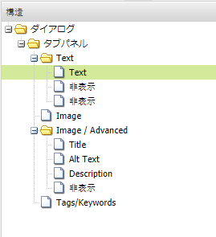

このフィールドのプロパティリストは、次のように、ダイアログエディターの右側に表示されます。

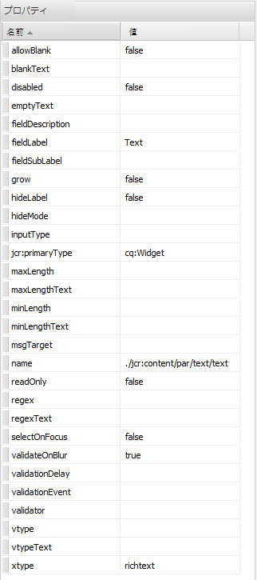

このフィールドの name プロパティを確認してください。以下の値が設定されています。

`./jcr:content/par/text/text`

これは、基礎モードを使用してページが作成されるときに、このフィールドのコンテンツが書き込まれるプロパティの名前です。このプロパティは、作成されるページを表すノードからの相対パスとして指定されます。この値は、page ノードの下の jcr:content ノードの子である par ノードの下にある、text ノードの下の text プロパティを指定しています。

このプロパティによって、このフィールドに入力されるテキストのコンテンツ格納場所が定義されます。さらに、このコンテンツに次の 2 つの属性を指定する必要があります。

* ここに格納された文字列は「リッチテキスト」**&#x200B;として解釈される必要があるということ、および
* 生成されるページにこのコンテンツをレンダリングするときに使用するコンポーネント

通常のコンポーネントダイアログでは、このダイアログが既に特定のコンポーネントにバインドされていることが暗黙的に定義されているので、この情報を指定する必要がないことに注意してください。

これら 2 つの情報を指定するには、非表示フィールドを使用します。Click on the first hidden field **Dialog > Tab Panel > Text > Hidden**, like this:

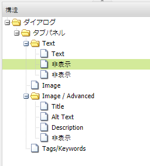

この非表示フィールドのプロパティを以下に示します。

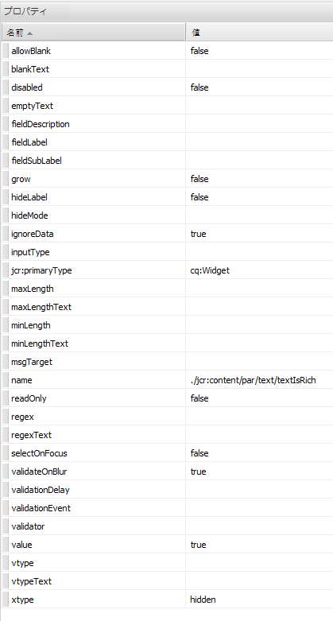

この非表示フィールドの name プロパティには以下の値が指定されています。

`./jcr:content/par/text/textIsRich`

This is a boolean property used to interpret the text string stored at `./jcr:content/par/text/text`.

テキストはリッチテキストとして解釈する必要があるので、このフィールドの `value` プロパティを `true` に指定します。

>[!CAUTION]
>
>The dialog editor allows the user to change the values of *existing* properties in the dialog definition. 新しいプロパティを追加するには、[CRXDE Lite](/help/sites-developing/developing-with-crxde-lite.md) を使用する必要があります。例えば、ダイアログエディターを使用して新しい非表示フィールドをダイアログ定義に追加したとき、*value* プロパティ（つまり、「value」という名前のプロパティ）はありません。この非表示フィールドにデフォルトの *value* プロパティを設定する必要がある場合、いずれかの CRX ツールを使用して、このプロパティを手動で追加する必要があります。ダイアログエディターのみを使用する場合は、この value プロパティを追加できません。ただし、プロパティを追加したら、その値はダイアログエディターで編集できます。

2 つ目の非表示フィールドは、以下のようにクリックして表示できます。

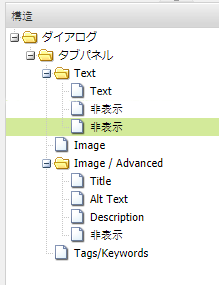

この非表示フィールドのプロパティを以下に示します。

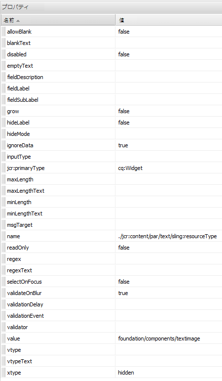

この非表示フィールドの name プロパティには以下の値が指定されています。

`./jcr:content/par/text/sling:resourceType`

また、このプロパティに次の固定値が指定されています。

`foundation/components/textimage`

これは、この段落のテキストコンテンツのレンダリングに使用するコンポーネントがテキスト画像&#x200B;**&#x200B;コンポーネントであることを指定しています。Using with the `isRichText` boolean specified in the other hidden field, the component can render the actual text string stored at `./jcr:content/par/text/text` in the desired way.

### MSM の継承による基礎モード {#scaffolding-with-msm-inheritance}

クラシック UI では、基礎モードは MSM 継承が完全に統合されています（該当する場合）。

（サイドキックの下部にあるアイコンを使用して）ページを&#x200B;**基礎モード**&#x200B;モードで開くと、継承の対象となるすべてのコンポーネントは次のように示されます。

* ロック記号（テキストやタイトルなどのほとんどのコンポーネントの場合）
* テキスト「**クリックして継承をキャンセル**」と記載されたマスク（画像コンポーネントの場合）

これらは、継承がキャンセルされるまでコンポーネントを編集できないことを示します。

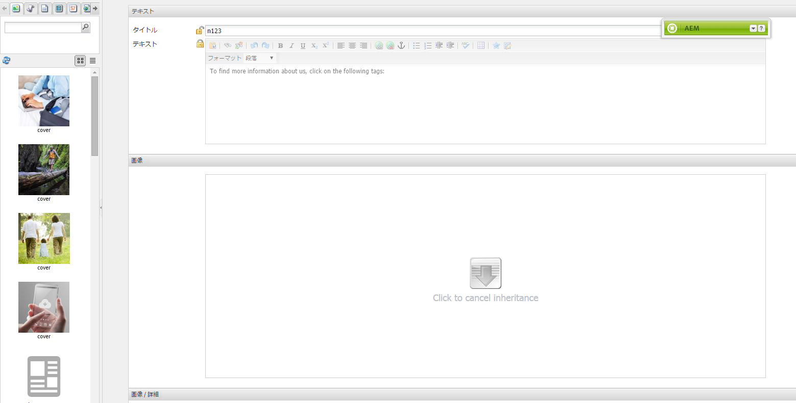

>[!NOTE]
>
>これは、[ページコンテンツを編集するときの継承されたコンポーネント](/help/sites-authoring/editing-content.md#inheritedcomponentsclassicui)に類似しています。

ロック記号または画像アイコンのいずれかをクリックすると、継承が解除されます。

* 記号が開かれた南京錠に変わります。
* ロックを解除したら、コンテンツを編集できます。

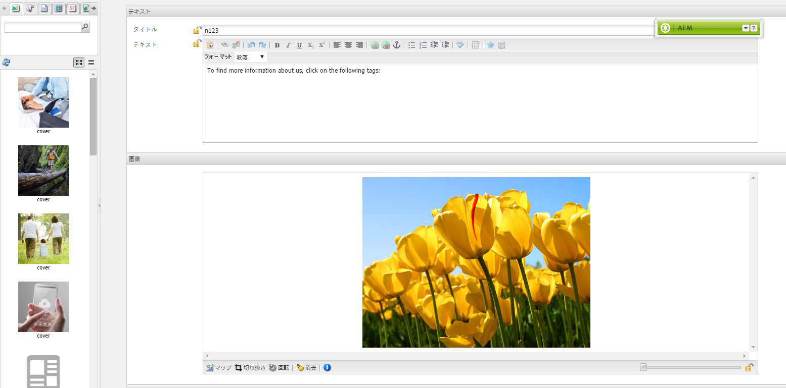

ロックを解除した後は、ロックが解除された南京錠の記号をクリックすることで継承を復元できます。これにより、加えた変更がすべて破棄されます。

>[!NOTE]
>
>If the inheritance is canceled at the page level (from the Livecopy tab of Page Properties) then all components will be editable in **Scaffolding** mode (they will be shown in unlocked state).
