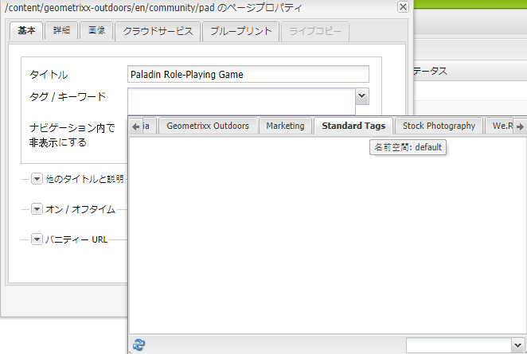
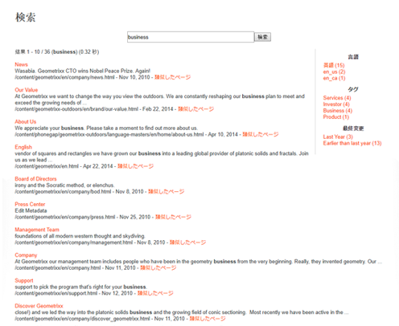

# タグの使用 {#using-tags}

タグを使用すると、web サイト内のコンテンツを素早く簡単に分類できます。タグをキーワードやラベルとしてページ、アセット、その他のコンテンツに添付して、コンテンツや関連コンテンツを検索できます。

* タグの作成および管理や、タグが適用されるコンテンツについては、[タグの管理](/help/sites-administering/tags.md)を参照してください。
* タグ付けのフレームワークと、カスタムアプリケーションにタグの追加と拡張を行う方法について詳しくは、[開発者向けタグ付け](/help/sites-developing/tags.md)を参照してください。

## タグを使用する 10 の理由 {#ten-reasons-to-use-tagging}

1. コンテンツの整理：タグを使用すると、作成者が少ない労力でコンテンツを素早く整理できます。
1. タグの整理：タグによってコンテンツが整理され、階層の分類／名前空間によってタグが整理されます。
1. 細かく整理されたタグ：タグおよびサブタグの作成機能を使用すると、用語、サブ用語および用語同士の関係を含め、分類システム全体を表現できるようになります。これにより、正式な階層に合わせてコンテンツの二次（または三次）階層を作成できます。
1. タグ付けの制御：タグ付けは、タグや名前空間にタグの作成や適用を制御する権限を付与することで制御できます。
1. 柔軟なタグ付け：タグ、分類用語、カテゴリ、ラベル、その他多くの名前や項目をタグに設定できます。タグのコンテンツモデルや使用方法には柔軟性があります。例えば、ターゲット層に説明を付けたり、コンテンツの分類や評価を行うとき、またはコンテンツの二次階層を作成するために使用できます。
1. 検索機能の向上：AEM のデフォルトの検索コンポーネントには作成済みのタグおよび適用済みのタグが幅広く含まれ、フィルターを適用して結果を関連性のあるものに絞り込むことができます。
1. SEO の有効化：ページのプロパティとして適用されたタグはページのメタタグに自動的に表示され、検索エンジンで確認できるようになります。
1. 簡単操作：タグは単語やボタンのタッチから簡単に作成できます。その後、タイトルや説明のほか、ラベルを制限なく追加してタグにさらに意味を持たせることができます。
1. 一貫したコア：タグ付けシステムは AEM のコアコンポーネントであり、AEM のすべての機能でコンテンツの分類に使用されます。さらに、開発者はタグ付け API を使用して、同じ分類にアクセス可能な、タグ付けが有効化されたアプリケーションを作成できます。
1. 構造化と柔軟性の結合：AEM はページやパスをネストできるので、構造化された情報の取り扱いに最適です。フルテキスト検索機能が組み込まれているので、非構造化の情報の処理にも力を発揮します。タグ付けは構造化と柔軟性の両方の利点を結び付けます。

サイトのコンテンツ構造やアセットのメタデータスキーマを設計する際には、タグ付け機能が提供する軽量でアクセス可能なアプローチを検討してください。

## タグの適用 {#applying-tags}

オーサー環境では、作成者はページのプロパティにアクセスし、「**タグ／キーワード**」フィールドに 1 つまたは複数のタグを入力することでタグを適用できます。

[事前定義済みのタグ](/help/sites-administering/tags.md)を適用するには、**ページプロパティ**&#x200B;ウィンドウで、「`Tags/Keywords`」フィールドのプルダウンを使用して、ページで許可されたタグの一覧から選択します。「**標準タグ**」タブがデフォルトの名前空間です。つまり、分類にプレフィックスされている `namespace-string:` はありません。

### タグの公開 {#publishing-tags}

ページと同様、タグや名前空間に次の操作を実行できます。

**アクティベート**

* 個々のタグをアクティベートします。

  ページと同様、新しく作成されたタグはパブリッシュ環境で使用可能になる前にアクティブ化する必要があります。

>[!NOTE]
>
>ページをアクティベートすると、自動的にダイアログが開き、そのページに属するアクティベートされていないタグをアクティベートできます。

**アクティベートを解除**

* 選択したタグのアクティベートを解除します。

## タグクラウド {#tag-clouds}

タグクラウドは、現在のページ、web サイト全体または最も一般的にアクセスされたものに対して、タグのクラウドを表示します。タグクラウドの用途は、ユーザーが現在興味のある（または過去に興味のあった）事柄を強調表示することです。タグの表示に使用されるテキストのサイズは、用途によって変わります。

[タグクラウド](/help/sites-classic-ui-authoring/classic-page-author-edit-mode.md#tag-cloud)コンポーネント（一般コンポーネントグループ）は、ページにタグクラウドを追加するために使用します。

## タグの検索 {#searching-on-tags}

オーサー環境およびパブリッシュ環境の両方でタグを検索できます。

### 検索コンポーネントの使用 {#using-search-component}

[検索コンポーネント](/help/sites-classic-ui-authoring/classic-page-author-edit-mode.md#search)をページに追加すると、検索機能を使用できるようになります。検索機能ではタグを使用できるほか、オーサー環境とパブリッシュ環境の両方で使用できます。

