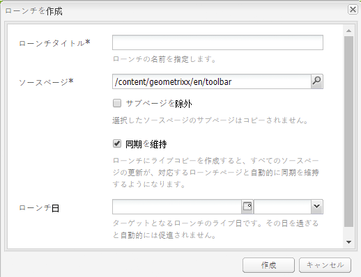
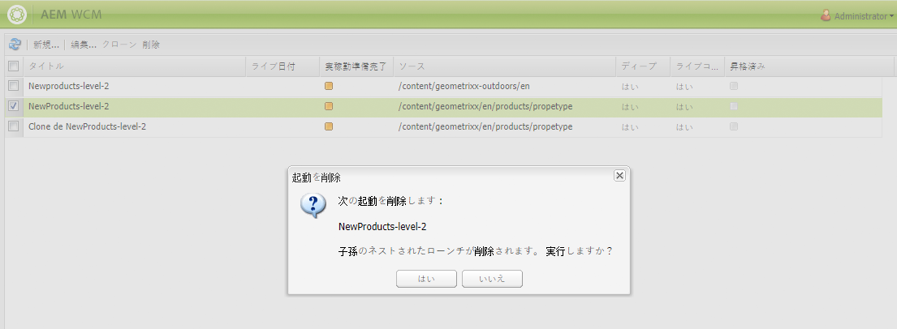

# ローンチの作成{#creating-launches}

ローンチを作成し、今後のアクティベートのために既存の Web ページの新しいバージョンを更新できるようにします。ローンチを作成する際は、タイトルとソースページを指定します。

* The title appears in the **Sidekick**, from where authors can access them to work on them.
* デフォルトで、ソースページの子ページがローンチに含まれています。希望に応じて、ソースページのみを使用することもできます。
* デフォルトでは、[ライブコピー](/help/sites-administering/msm.md)によってソースページの変更に合わせてローンチページが自動的に更新されます。静的なコピーを作成して自動更新をおこなわないように指定できます。

オプションとして、**ローンチ日**（と時間）を指定して、ローンチページを昇格およびアクティベートするタイミングを定義できます。ただし、**ローンチ日**&#x200B;は&#x200B;**実稼動準備完了**&#x200B;フラグと組み合わせた場合のみ機能します（[ローンチ設定の編集](/help/sites-classic-ui-authoring/classic-launches-editing.md#editing-a-launch-configuration)を参照）。アクションが実際に自動的におこなわれるようにするには、両方を設定する必要があります。

## ローンチの作成 {#creating-a-launch}

次の手順を使用して、ローンチを作成します。

1. Open the Website administration page ([http://localhost:4502/siteadmin](http://localhost:4502/siteadmin)).
1. 「**新規...**」をクリックし、「**新しいローンチ...**」をクリックします。
1. **ローンチを作成**&#x200B;ダイアログで、次のプロパティの値を指定します。

   * **ローンチタイトル**：ローンチの名前。作成者にとって意味のある名前にしてください。
   * **ソースページ**：ローンチを作成するページのパス。デフォルトでは、すべての子ページが含まれます。
   * **サブページを除外**：ソースページのみのローンチを作成し、子ページのローンチを作成しない場合は、このオプションを選択します。デフォルトでは、このオプションは選択されていません。
   * ****&#x200B;同期を維持：ソースページに変更があったときにローンチページのコンテンツを自動的に更新する場合は、このオプションを選択します。これは、ローンチを[ライブコピー](/help/sites-administering/msm.md)にすることで達成します。
   * **ローンチ日**：ローンチコピーがアクティベートされる日付と時間（「**実稼動準備完了**」フラグによって変わります。[ローンチ - イベントの順序](/help/sites-authoring/launches.md#launches-the-order-of-events)を参照してください）。

   

1. 「**作成**」をクリックします。

## ローンチの削除 {#deleting-a-launch}

ローンチを削除することもできます。

1. [ローンチコンソール](/help/sites-classic-ui-authoring/classic-launches.md)で、必要なローンチを選択します。
1. 「**削除**」をクリックします。確認を求められます。

   

   >[!CAUTION]
   >
   >ネストされたローンチを削除する場合は、先に下のレベルのローンチを削除する必要があります。

