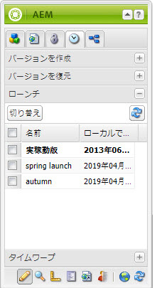
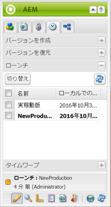

# ローンチの編集{#editing-launches}

## ローンチページの編集 {#editing-launch-pages}

ページ（またはページのセット）にローンチが作成されている場合、ページのローンチコピーのコンテンツを編集できます。

1. 編集するページを開きます。
1. サイドキックで「**バージョン管理**」タブを選択し、「**ローンチ**」グループを展開します。現在編集中のローンチのタイトルには太字フォントが使用されています。

   

1. 作業対象とするローンチを選択し、「**切り替え**」をクリックします。
1. 編集を開始します。

   >[!NOTE]
   >
   >サイドキックの「**ページ**」タブを使用して、**子ページを作成**&#x200B;するなどのアクションを実行できます。

## ローンチの設定の編集 {#editing-a-launch-configuration}

ローンチの作成後、ローンチ名およびローンチ日を変更できます。また、ローンチに関連付ける画像を指定できます。

1. ローンチの管理ページ（[http://localhost:4502/libs/launches/content/admin.html](http://localhost:4502/libs/launches/content/admin.html)）を開きます。

1. 必要なローンチを選択し、「**編集**」をクリックしてダイアログを開きます。

   * 「**一般**」タブで、次の情報を編集できます。

      * **タイトル**
      * **ライブ日付**：ローンチ日と同じ
      * **実稼動準備完了**

      これらのフィールドの目的とインタラクションについて詳しくは、[ローンチ - イベントの順序](/help/sites-authoring/launches.md#launches-the-order-of-events)を参照してください。

   * 「**画像**」タブで、画像ファイルをアップロードできます。

1. 「**保存**」をクリックします。

## ページのローンチステータスの確認  {#discovering-the-launch-status-of-a-page}

ページのローンチの編集時、ローンチについての情報がサイドキックの「**バージョン管理**」タブの下部に表示されます。

* ローンチの名前。
* 最後の変更からの時間。
* 最後の変更を実行したユーザー。
* 「**実稼動準備完了**」フラグのステータス（オレンジ = 未設定、緑 = 設定済み）。

