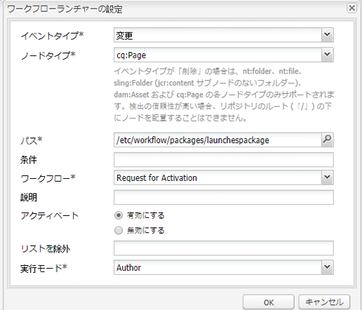

# ローンチの昇格{#promoting-launches}

コンテンツを公開する前にソース（実稼動）に戻すには、ローンチページを昇格させる必要があります。ローンチページが昇格されると、ソースページの対応するページが、昇格済みのページのコンテンツに置き換わります。ローンチページを昇格させるときには、次のオプションを使用できます。

* 現在のページのみを昇格させるか、ローンチ全体を昇格させるか。
* 現在のページの子ページを昇格するかどうか。
* すべてのローンチを昇格させるか、変更したページのみを昇格させるか。

## ローンチページの昇格 {#promoting-launch-pages}

ページを昇格させるには、昇格させるローンチページの編集中に、次の手順を実行します。

1. サイドキックの「**ページ**」タブで、「**ローンチを昇格**」をクリックします。
1. 昇格するページを指定します。

   * (Default) To promote only the current page, select **Promote Page Changes To Production Version**.
   * To also promote the child pages of the current page, select **Include Sub Pages**.
   * ローンチ内のすべてのページを昇格させるには、「**完全なローンチを実稼動版に昇格**」を選択します。

1. 実稼動版ページをワークフローパッケージに追加する場合は、「**ワークフローパッケージに追加**」を選択してワークフローパッケージを選択します。
1. 「**昇格**」をクリックします。

## AEM ワークフローを使用した昇格済みページの処理 {#processing-promoted-pages-using-aem-workflow}

次のワークフローモデルを使用して、昇格済みのローンチページの一括処理をおこないます。

1. ワークフローパッケージを作成します。
1. 作成者がローンチページを昇格するとき、ワークフローパッケージにローンチページを保存します。
1. このパッケージをペイロードとして使用し、ワークフローモデルを開始します。

ページが昇格されたときに自動的にワークフローを開始するには、パッケージノードの[ワークフローランチャーを設定](/help/sites-administering/workflows-starting.md#workflows-launchers)します。

例えば、作成者がローンチページを昇格したとき、ページのアクティベートのリクエストを自動的に生成することができます。パッケージノードが変更されたときにリクエストのアクティベートワークフローを開始するよう、ワークフローランチャーを設定します。

