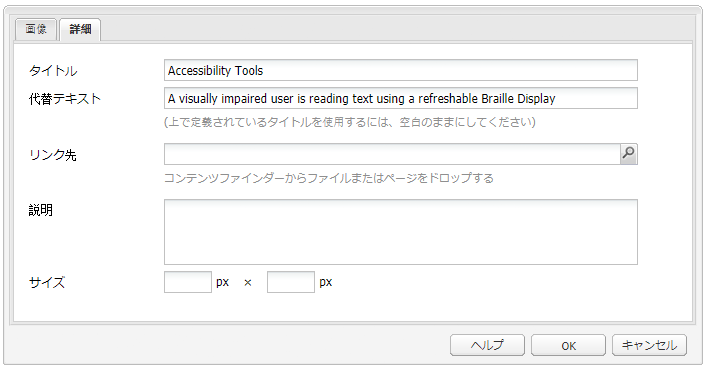
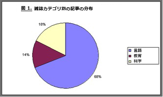
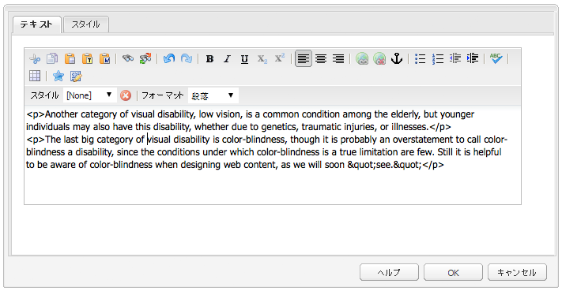
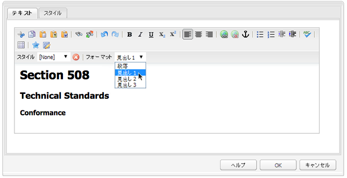
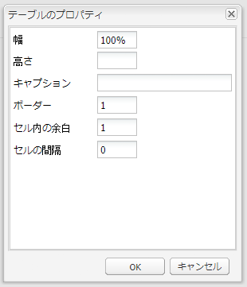
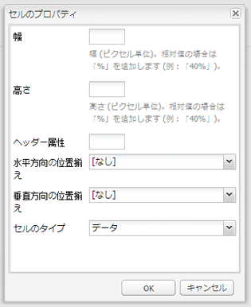
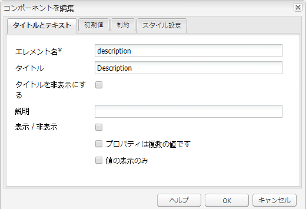
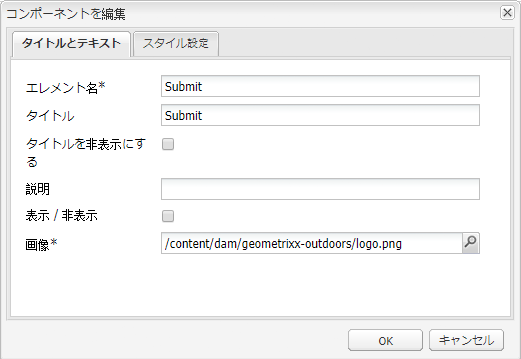
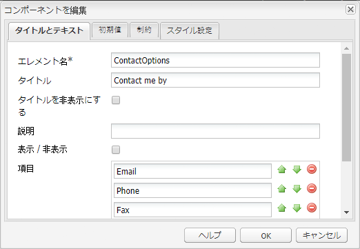
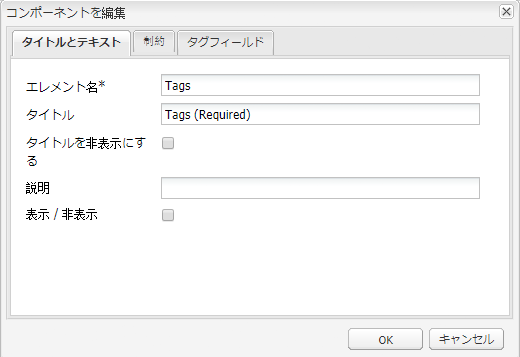

# アクセシブルなコンテンツ（WCAG 2.0 適合）の作成 {#creating-accessible-content-wcag-conformance}

>[!CAUTION]
>
>AEM 6.4 ではクラシック UI が非推奨となったので、このページのコンテンツは WCAG 2.1 向けに更新されていません。
>
>AEM と WCAG 2.1 について詳しくは、次のページを参照してください。
>
>* [AEM と web アクセシビリティのガイドライン](/help/managing/web-accessibility.md)
>* [WCAG 2.1 クイックガイド](/help/managing/qg-wcag.md)
>* [アクセシブルなコンテンツ（WCAG 2.1 適合）の作成](/help/sites-authoring/creating-accessible-content.md)

WCAG 2.0 は、障碍のあるユーザーが Web コンテンツにアクセスして利用できるようにするための、テクノロジーから独立した一連のガイドラインおよび達成基準で構成されます。

>[!NOTE]
>
>関連トピック：
>
>* [WCAG 2.0 のクイックガイド](/help/managing/qg-wcag.md)
>* [アクセスシブルなコンテンツを生成するためのリッチテキストエディターの設定](/help/sites-administering/rte-accessible-content.md)
>

これらのガイドラインは 3 つの適合レベル（レベル A（最低）、レベル AA、レベル AAA（最高））に分けられます。各レベルの簡単な定義を次に示します。

* **レベル A：**&#x200B;サイトのアクセシビリティ基本的な最低レベルに達しています。このレベルに達するには、レベル A の達成基準をすべて満たしている必要があります。
* **レベル AA：**&#x200B;理想的なレベルのアクセシビリティです。ほとんどの状況において、ほとんどのテクノロジーを使用して、ほとんどのユーザーがアクセスできるように、サイトのアクセシビリティが強化されています。このレベルに達するには、レベル A とレベル AA の達成基準をすべて満たしている必要があります。
* **レベル AAA：**&#x200B;サイトのアクセシビリティが非常に高いレベルに達しています。このレベルに達するには、レベル A、レベル AA、およびレベル AAA の達成基準をすべて満たしている必要があります。

サイトを作成する際は、サイトが準拠する全体的なレベルを決めておく必要があります。

次の節では、[WCAG 2.0 のガイドライン](https://www.w3.org/TR/WCAG20/#guidelines)および[適合レベル](https://www.w3.org/TR/UNDERSTANDING-WCAG20/conformance.html) A および AA の関連する達成基準を示します。

>[!NOTE]
>
>特定のタイプのコンテンツでは、レベル AAA のすべての達成基準を満たすことができないので、このレベルの適合を一般的なポリシーの要件とすることはお勧めしません。

>[!NOTE]
>
>このドキュメントでは、次を使用します。
>
>* [WCAG 2.0 のガイドライン](https://www.w3.org/TR/WCAG20/#guidelines)用の省略名。
>* WCAG の Web サイトとの相互参照を目的として [WCAG 2.0 のガイドライン](https://www.w3.org/TR/WCAG20/#guidelines)で使用されている番号。
>

## 原則 1：知覚可能 {#principle-perceivable}

[原則 1：知覚可能 - 情報およびユーザーインターフェイスコンポーネントは、ユーザーが知覚できる方法でユーザーに提示可能でなければならない。](https://www.w3.org/TR/WCAG20/#perceivable)

### 代替テキスト（1.1） {#text-alternatives}

[ガイドライン 1.1 代替テキスト：テキスト以外のコンテンツにはすべて、拡大印刷、点字、音声、シンボル、平易な言葉などの人物が必要とする形式に変換できるように、代替テキストを提供すること。](https://www.w3.org/TR/WCAG20/#text-equiv)

### 非テキストコンテンツ (1.1.1) {#non-text-content}

* 達成基準 1.1.1
* レベル A
* テキスト以外のコンテンツ：ユーザーに提示されるすべてのテキスト以外のコンテンツには、同等の目的を果たす代替テキストが提供されます。ただし、次の場合は除きます。

#### 目的 - テキスト以外のコンテンツ（1.1.1） {#purpose-non-text-content}

Web ページ上の情報はテキスト以外の様々な形式（写真、ビデオ、アニメーション、チャート、グラフなど）で指定できます。視覚に障碍のあるユーザーは、テキスト以外のコンテンツを見ることができませんが、スクリーンリーダーによる読み上げや、触覚で感知可能な点字表示デバイスを使用すれば、テキストコンテンツにアクセスできます。したがって、グラフィカルな形式のコンテンツに代替テキストを提供すれば、そのコンテンツを見ることのできないユーザーであっても、コンテンツが提供する同等のバージョンの情報にアクセスできます。

代替テキストを使用すると、検索エンジン技術によって非テキストコンテンツのインデックスを作成できるという利点もあります。

#### 達成方法 - 非テキストコンテンツ（1.1.1） {#how-to-meet-non-text-content}

静的なグラフィックの場合、そのグラフィックと同等の代替テキストを指定することが基本的な要件です。そのメソッドは、「**代替テキスト**」フィールドで行われます。

>[!NOTE]
>
>**カルーセル**&#x200B;や&#x200B;**スライドショー**&#x200B;など、あらかじめ用意されている一部のコンポーネントには、代替テキストの説明を画像に追加する手段が用意されていません。お使いの AEM インスタンスに対してこれらのコンポーネントのバージョンを実装する場合、開発チームは、対象のコンポーネントを設定して、`alt` 属性をサポートする必要があります。それにより、作成者がコンテンツに追加できるようになります（[追加の HTML 要素および属性のサポートの追加](/help/sites-administering/rte-accessible-content.md#add-support-for-more-html-elements-and-attributes)を参照してください）。

「**代替テキスト**」フィールドは、**画像**&#x200B;コンポーネントダイアログの「**詳細**」画像プロパティタブに表示されます。



AEM では、「**代替テキスト**」がデフォルトで画像に追加されます。クラシック UI の場合、デフォルトの属性は次の 2 つのシナリオで作成できます（デフォルト値が代替テキストとして不十分な場合は、「**詳細**&#x200B;画像プロパティ」タブで編集が必要になる場合があります）。

* ファイル：

  ユーザーのハードドライブから画像がアップロードされます。画像コンポーネントをページに追加して、ハードドライブまたは別のソースから画像を選択する場合、「**代替テキスト**」のデフォルト値は `file` です。この値を「**詳細**」画像プロパティタブで変更する必要があります。前述のとおり、この値は「**代替テキスト**」フィールドには表示されませんが、値を変更すると、新しい値がフィールドに表示されます。

* アセット：

  デジタルアセットのリポジトリから画像が追加されます。デジタルアセットのリポジトリから web ページに画像をドラッグすると、その画像の&#x200B;**タイトル**&#x200B;と&#x200B;**代替テキスト**&#x200B;の値が画像のメタデータから取得されます。

>[!NOTE]
>
>前述の 2 つのシナリオでは、「**代替テキスト**」のデフォルト値が「**詳細画像プロパティ**」タブに表示されません。デフォルト値を変更するには、「**代替テキスト**」フィールドに新しい値を入力します。

>[!NOTE]
>
>画像が単なる装飾画像の場合（[適切な代替テキストの作成](#creating-good-text-alternatives)を参照）、スペースバーを使用すると、**代替テキスト**&#x200B;フィールドにスペースを入力できます。これにより、スクリーンリーダーに対して画像を無視するように求める、空の `alt` 属性が作成されます。

#### 適切な代替テキストの作成 {#creating-good-text-alternatives}

非テキストのコンテンツには様々な形式があるので、代替テキストの値は、web ページにおけるグラフィックの役割に応じて異なります。一般的な経験則から、次のものが含まれます。

* 代替テキストは、簡潔にしつつ、非テキストコンテンツが提供する基本情報を明確に示す必要があります。
* 長い説明（100 文字を超える）は避けてください。代替テキストに詳細が必要な場合は、次のようにします。

   * 代替テキストで短い説明を提示する
   * テキストでの長い説明は、同じページの別の場所、または別の web ページに含めます。画像をリンクにするか、画像の横にテキストリンクを配置することで、この個別の説明へのリンクを設定します。

* 代替テキストは、同じページの近くにあるテキスト形式のコンテンツと重複しないようにします。画像の多くは、ページのテキストで既にカバーされている要点を示す図なので、詳細な代替テキストが既に存在する場合があります。
* 非テキストコンテンツが別のページやドキュメントへのリンクであり、同じリンクを構成するテキストが他にない場合は、画像の代替テキストでリンク先を示す必要があります。その画像の説明にはしないでください。
* テキスト以外のコンテンツがボタン要素に含まれていて、同じボタンを形成するテキストがない場合、画像の代替テキストは、画像を説明するものではなく、ボタンの機能を示すものにする必要があります。
* 画像に空（null）の代替テキストを指定しても問題ありません（その画像に代替テキストがない場合に限られます）。例えば、純粋な装飾用のグラフィックです。または、同等のテキストがページテキストに既に存在する場合です。

[W3C ドラフト：HTML5: Techniques for providing useful text alternatives](https://html.spec.whatwg.org/multipage/images.html#alt) には、様々なタイプの画像に適切な代替テキストプロビジョンの詳細と例が記載されています。

代替テキストが必要な、テキスト以外のコンテンツには、以下のようなタイプがあります。

* 説明写真：

  人、物、場所の画像です。ページ内の写真の役割を考えます。対応する適切なテキストは「*[オブジェクト]*&#x200B;の写真」などになりますが、周囲のテキストによって異なる場合があります。

* アイコン：

  具体的な情報を伝える小さいピクトグラム（グラフィック）です。ページおよびサイト全体で一貫して使用する必要があります。1 つのページまたはサイト上の同じアイコンにはすべて、短く簡潔な同じ代替テキストを含める必要があります。ただし、そうすることにより、隣接するテキストと不要な重複が発生する場合を除きます。

* チャートとグラフ：

  通常は数値データを表します。そのため、代替テキストを提供する 1 つのオプションとしては、チャートまたはグラフィックで示されている主なトレンドの簡単な概要を含めることがあります。必要に応じて、「**詳細画像プロパティ**」タブの「**説明**」フィールドを使用して、詳細な説明をテキストで提供します。さらに、ページまたはサイトの別の場所で、ソースデータを表形式で提供することもできます。

  

  このチャート例に代替テキストを提供するには、画像自体に簡略化した `alt` テキストを追加して、画像の後に完全な代替テキストを入力します。

  ```xml
  <p></p>
  <p> Figure 1. Distribution of Articles by Journal Category.
  Pie chart: Language=68%, Education=14% and Science=18%.</p>
  ```

  >[!NOTE]
  >
  >上記のスニペットは、順序を説明するためだけに使用されています。**画像**&#x200B;コンポーネントを、上記で使用している `img src` 参照の代わりに使用します。

  [達成方法 - テキスト以外のコンテンツ（1.1.1）](#how-to-meet-non-text-content)に示すように、AEM では、画像の設定ダイアログの「**代替テキスト**」フィールドと「**説明**」フィールドを組み合わせて使用できます。

* マップ、図、フローチャート：

  空間データを提供するグラフィック（例：オブジェクト間の関係やプロセスを説明する目的など）の場合は、重要メッセージをテキスト形式で指定します。地図の場合、完全に同等なテキストを提供することは困難な場合が多いものの、特定の場所への行き方を見つける手段として地図が提供されている場合は、地図画像の代替テキストで「*X の地図*」と簡単に示し、ページ内の別の場所または&#x200B;**画像**&#x200B;コンポーネントの「**詳細**」タブの「**説明**」フィールドで、目的の場所への道案内を提供します。

* CAPTCHA：

  CAPTCHA は、*Completely Automated Public Turing test to tell Computers and Humans Apart*（コンピューターと人間を区別するための、完全に自動化された公開チューリングテスト）の略です。Web ページで人間と悪意のあるソフトウェアを区別するために使用されるセキュリティチェックですが、アクセス障害の原因となる可能性があります。セキュリティテストに合格するには、ユーザーが、それらの画像に何が表示されているかを説明する必要があります。この画像の代替テキストを提供することはできないので、代替となる非グラフィックソリューションを検討する必要があります。

  W3C は、次のようないくつかの提案を提供しています。これらのアプローチにはそれぞれ独自のメリットと欠点があります。

   * 論理パズル
   * 画像の代わりにサウンド出力を使用
   * アカウントおよびスパムフィルターの使用制限

* 背景画像：

  これらの画像は、HTML ではなくカスケーディングスタイルシート（CSS）を使用して表示できます。代替テキスト値の指定は不可能です。したがって、背景画像では重要なテキスト情報を提供しないでください。提供する場合は、同じ情報をページのテキストでも提供する必要があります。

  ただし、画像を表示できないときに代替の背景を表示することは重要です。

  >[!NOTE]
  >
  >背景と前景テキストの間には適切なレベルのコントラストが必要です。このコントラストについては、[コントラスト（最低限）（1.4.3）](#contrast-minimum)を参照してください。

#### 詳細情報 - 非テキストコンテンツ（1.1.1） {#more-information-non-text-content}

* [達成基準 1.1.1 について](https://www.w3.org/TR/UNDERSTANDING-WCAG20/text-equiv-all.html)
* [達成基準 1.1.1 の達成方法](https://www.w3.org/WAI/WCAG21/quickref/?versions=2.0#text-alternatives)
* [W3C：HTML5：有効な代替テキストを提供するためのテクニック](https://html.spec.whatwg.org/multipage/images.html#alt)
* [W3C による CAPTCHA の説明と代替手段](https://www.w3.org/TR/turingtest/)

### 時間依存メディア（1.2） {#time-based-media}

[ガイドライン 1.2 時間依存メディア：時間依存メディアには代替コンテンツを提供すること。](https://www.w3.org/TR/WCAG20/#text-equiv)

この情報では、*時間ベース*&#x200B;の web コンテンツについて説明します。これには、ユーザーが再生できるコンテンツ（ビデオ、オーディオ、アニメーションコンテンツなど）が含まれており、収録済みである場合やライブストリームである場合があります。

### オーディオのみおよびビデオのみ（収録済み）（1.2.1） {#audio-only-and-video-only-pre-recorded}

* 達成基準 1.2.1
* レベル A
* 音声のみおよび映像のみ（収録済み）：事前に収録された音声のみおよび映像のみのメディアには、以下が該当します。ただし、音声または映像がテキストの代替であり、その旨の明確なラベルが付けられている場合を除きます。

   * 収録済みのオーディオのみ：収録済みのオーディオのみのコンテンツと同等の情報を提示する、時間ベースのメディアの代替手段が提供されます。
   * 収録済みのビデオのみ：収録済みのビデオのみのコンテンツと同等の情報を提示する、時間ベースのメディアの代替コンテンツまたはオーディオトラックのいずれかが提供されます。

#### 目的 - オーディオのみおよびビデオのみ（収録済み）（1.2.1） {#purpose-audio-only-and-video-only-pre-recorded}

音声と映像のアクセシビリティの問題は、次のようなユーザーに発生する場合があります。

* 視覚障碍のあるユーザー（音声がまったくない場合や、映像またはアニメーションの内容が音声で十分に伝えられていない場合）
* 聴覚障害のあるユーザー（耳が聞こえない、または音声トラックを聞くことができないユーザー）
* 音声を聞くことはできるが、内容を理解できないユーザー（理解できない言語が使用されている場合など）

映像または音声は、Adobe Flash など特定のメディア形式のコンテンツ再生をサポートしていないブラウザーやデバイスを使用しているユーザーも使用できない場合があります。

この情報を別の形式（テキストや、音声なしの映像に音声を付けるなど）で提供すると、元のコンテンツにアクセスできないユーザーがアクセスできるようになります。

#### 達成方法 - オーディオのみおよびビデオのみ（収録済み）（1.2.1） {#how-to-meet-audio-only-and-video-only-pre-recorded}

* 映像なしの収録済み音声コンテンツ（ポッドキャストなど）の場合：

   * コンテンツの直前または直後に、オーディオコンテンツの字幕へのリンクを提供します。

     字幕は、すべての音声コンテンツと音声以外の重要なコンテンツに相当するテキストを含む HTML ページである必要があります。また、話者、設定の説明、声の表現、その他の重要なオーディオの説明を示す必要があります。

* オーディオなしのアニメーションまたは収録済みビデオコンテンツの場合：

   * 映像で提供されている情報に相当するテキスト説明のリンクをコンテンツの直前または直後に提示します。
   * または、MP3 など一般的に使用されている音声形式で、相当する音声解説のリンクを提示します。

>[!NOTE]
>
>オーディオコンテンツまたはビデオコンテンツが、web ページ上に別の形式で存在するコンテンツの代替として提供される場合、上記の要件に従う必要はありません。例えば、ビデオでテキストの説明のリストが示されている場合は、テキストの説明が既にビデオの代替として機能しているので、このビデオの代替コンテンツは必要ありません。

マルチメディア、具体的には Flash コンテンツを AEM web ページに挿入することは、画像の挿入と類似しています。ただし、マルチメディアコンテンツには静止画像より多くの情報が含まれており、マルチメディアの再生方法を制御するための設定やオプションが多数あります。

>[!NOTE]
>
>情報提供のためのコンテンツでマルチメディアを使用する場合は、代替のリンクも作成する必要があります。例えば、字幕を含めるには、字幕を表示するための HTML ページを作成してから、音声コンテンツの横または下にリンクを追加します。

#### 詳細情報 - 音声のみおよび映像のみ（収録済み）（1.2.1） {#more-information-audio-only-and-video-only-pre-recorded}

* [達成基準 1.2.1 について](https://www.w3.org/TR/UNDERSTANDING-WCAG20/media-equiv-av-only-alt.html)
* [達成基準 1.2.1 の達成方法](https://www.w3.org/WAI/WCAG21/quickref/?versions=2.0#time-based-media)

### キャプション（収録済み）（1.2.2） {#captions-pre-recorded}

* 達成基準 1.2.2
* レベル A
* キャプション（収録済み）：同期されたメディアに含まれるすべての収録済み音声コンテンツに対してキャプションが提供されます。ただし、そのメディアがテキストの代替メディアであり、その旨の明確なラベルが付けられている場合を除きます。

#### 目的 - キャプション（収録済み）（1.2.2） {#purpose-captions-pre-recorded}

耳が不自由なユーザーは、オーディオコンテンツにアクセスできないか、アクセスするのが非常に困難です。キャプションは、ビデオの適切なタイミングで画面に表示される、音声や、音声以外のオーディオの代わりとなるテキストです。音声を聞くことができないユーザーが、ビデオの情報を理解するのに役立ちます。

>[!NOTE]
>
>ビデオやアニメーションと同じページに、適切なテキストまたはテキスト以外の同等の情報（同等の情報を直接提供するもの）が表示されている場合、キャプションは不要です。

#### 達成方法 - キャプション（収録済み）（1.2.2） {#how-to-meet-captions-pre-recorded}

キャプションは、次のいずれかの状態に設定できます。

* オープン：映像再生時に常に表示
* クローズド：ユーザーがキャプションのオン、オフを切り替え可能

可能な限りクローズドキャプションを使用します。キャプションを表示するかどうかをユーザーが選択できるようにします。

クローズドキャプションの場合は、[SMIL](https://www.w3.org/AudioVideo/) などの適切な形式の同期キャプションファイルを作成してビデオファイルと一緒に提供します。

[詳細情報 - キャプション（収録済み）（1.2.2）](#more-information-captions-pre-recorded)でチュートリアルを参照してください。必ずメモを提供し、ビデオでキャプションを利用できることをユーザーに知らせてください。

オープンキャプションを使用する必要がある場合は、テキストをビデオトラックに埋め込みます。このメソッドを実践するには、ビデオにタイトルをオーバーレイできるビデオ編集アプリケーションを使用します。

#### 詳細情報 - キャプション（収録済み）（1.2.2） {#more-information-captions-pre-recorded}

* [達成基準 1.2.2 について](https://www.w3.org/TR/UNDERSTANDING-WCAG20/media-equiv-captions.html)：
* [達成基準 1.2.2 の達成方法](https://www.w3.org/WAI/WCAG21/quickref/?versions=2.0#time-based-media)
* [W3C：Synchronized Multimedia](https://www.w3.org/AudioVideo/)
* [Captions, Transcripts, and Audio Descriptions（WebAIM）](https://webaim.org/techniques/captions/)

### 音声解説または代替メディア（収録済み）（1.2.3） {#audio-description-or-media-alternative-pre-recorded}

* 達成基準 1.2.3
* レベル A
* 音声解説または代替メディア（収録済み）：同期されたメディアに関しては、時間ベースのメディアまたは事前に録音されたビデオコンテンツの音声解説が提供されます。ただし、メディアがテキストの代替メディアであり、そのように明確にラベル付けされている場合には提供されません。

#### 目的 - 音声解説または代替メディア（収録済み）（1.2.3） {#purpose-audio-description-or-media-alternative-pre-recorded}

映像やアニメーションの情報が視覚的にのみ提供されている場合、視覚障がいのあるユーザーにアクセシビリティの問題が発生します。または、音声で提供されている情報が映像の内容を視覚的に理解するのに十分でない場合に、問題が発生します。

#### 達成方法 - 音声解説または代替メディア（収録済み）（1.2.3） {#how-to-meet-audio-description-or-media-alternative-pre-recorded}

この達成基準を満たすために採用できる方法は 2 つあります。次のいずれかを使用できます。

1. ビデオコンテンツに音声解説を追加します。この方法は、次の 3 つの方法のいずれかで実現できます。

   * 既存のボイスの休止部分で、既存の音声トラックでは提示されていないシーンの変化に関する情報を提供します。
   * 元の音声だけでなくシーンの変化に関する音声情報も含む、新しいオプションの音声トラックを追加で提供します。

      * ユーザーは既存の音声トラック（音声解説を&#x200B;*含まない*）と新しい音声トラック（音声解説を&#x200B;*含む*）を切り替えることができます。
      * この方法では、追加の説明が不要なユーザーの混乱を防ぐことができます。

   * 音声解説を拡張できるように、2 つ目のバージョンのビデオコンテンツを作成します。これにより、適切な時点で音声と映像を一時的に停止できるので、既存の対話の合間に詳細な音声解説を提供することに関連する困難な作業を軽減できます。その結果、アクションが再開される前に、より長い音声解説を指定できます。前の例と同様に、追加の説明を必要としないユーザーが混乱しないように、このコンテンツはオプションのオーディオトラックとして追加するのが最適です。

1. ビデオまたはアニメーションのオーディオや視覚要素に対応する、適切なテキストの字幕を提供します。適宜、話者が誰であるか、状況の説明、声の表情を含めてください。字幕は長さによって、ビデオやアニメーションと同じページに配置するか、別のページに配置することができます。別のページに配置する場合は、ビデオやアニメーションのすぐ近くに字幕へのリンクを提示してください。

音声解説付きビデオの作成方法に関する正確な詳細は、本ガイドの範囲外です。映像および音声解説の作成には長時間を要する可能性がありますが、他のアドビ製品が役に立つ場合があります。Adobe Flash Professional でコンテンツを作成する場合は、適切なプラグインのダウンロードをユーザーに促すスクリプトを作成し、`<noscript>` 要素を使用して代替テキストを指定する必要があります。

#### 詳細情報 - 音声解説または代替メディア（収録済み）（1.2.3） {#more-information-audio-description-or-media-alternative-pre-recorded}

* [達成基準 1.2.3 について](https://www.w3.org/TR/UNDERSTANDING-WCAG20/media-equiv-audio-desc.html)：
* [達成基準 1.2.3 の達成方法](https://www.w3.org/WAI/WCAG21/quickref/?versions=2.0#qr-media-equiv-audio-desc)
* [Adobe Encore CS5](https://helpx.adobe.com/jp/premiere-pro/using/whats-new.html)

### キャプション（ライブ）（1.2.4）    {#captions-live}

* 達成基準 1.2.4
* レベル AA
* キャプション（ライブ）：同期されたメディアに含まれるすべてのライブ音声コンテンツに対してキャプションが提供されている。

#### 目的 - キャプション（ライブ）(1.2.4) {#purpose-captions-live}

この達成基準は、聴覚障害のあるユーザーのアクセシビリティに関する問題に対応する点で、[キャプション（収録済み）](#captions-pre-recorded)と同じです。ただし、この達成基準では web キャストなどライブのプレゼンテーションを扱う点が異なります。

#### 達成方法 - キャプション（ライブ）（1.2.4） {#how-to-meet-captions-live}

上記の[キャプション（収録済み）](#captions-pre-recorded)のガイダンスに従ってください。ただし、メディアがライブなので、キャプションは可能な限り短時間で、起こっていることに応じて作成する必要があります。そのため、リアルタイムキャプションツールまたは音声テキスト変換ツールの使用を検討する必要があります。

詳細な手順説明はこのドキュメントの範囲外ですが、次のリソースで役に立つ情報が提供されています。

* [WebAIM：Real Time Captioning](https://webaim.org/techniques/captions/realtime)
* [AccessIT（ワシントン大学）：Can captions be generated automatically using speech recognition?（音声認識を使用してキャプションを自動生成できるか？）](https://www.washington.edu/doit/programs/accessit?1209)

#### 詳細情報 - キャプション（ライブ）（1.2.4） {#more-information-captions-live}

* [達成基準 1.2.4 について](https://www.w3.org/TR/UNDERSTANDING-WCAG20/media-equiv-real-time-captions.html)
* [達成基準 1.2.4 の達成方法](https://www.w3.org/WAI/WCAG21/quickref/?versions=2.0#qr-media-equiv-real-time-captions)

### 音声解説（収録済み）（1.2.5）    {#audio-description-pre-recorded}

* 達成基準 1.2.5
* レベル AA
* 音声解説（収録済み）：同期されたメディアに含まれるすべての収録済み映像コンテンツに対して音声解説が提供されている。

#### 目的 - 音声解説（収録済み）（1.2.5） {#purpose-audio-description-pre-recorded}

この達成基準は、[音声解説または代替メディア（収録済み）](#audio-description-or-media-alternative-pre-recorded)と同じですが、作成者はレベル AA に準拠するためにより詳細なオーディオ解説を提供する必要があります。

#### 達成方法 - 音声解説（収録済み）（1.2.5） {#how-to-meet-audio-description-pre-recorded}

[音声解説または代替メディア（収録済み）](#audio-description-or-media-alternative-pre-recorded)のガイダンスに従ってください。

#### 詳細情報 - 音声解説（収録済み）（1.2.5） {#more-information-audio-description-pre-recorded}

* [達成基準 1.2.5 について](https://www.w3.org/TR/UNDERSTANDING-WCAG20/media-equiv-audio-desc-only.html)
* [達成基準 1.2.5 の達成方法](https://www.w3.org/WAI/WCAG21/quickref/?versions=2.0#qr-media-equiv-audio-desc-only)

### 適応可能 (1.3) {#adaptable}

[ガイドライン 1.3 適応可能：情報や構造を維持しながら、様々な方法（よりシンプルなレイアウトなど）で提示できるコンテンツを作成します。](https://www.w3.org/TR/WCAG20/#content-structure-separation)

このガイドラインは、次のようなユーザーのサポートに必要な要件に対応しています。

* *標準的な* 2 次元、複数列、カラーの web ページレイアウトで作成者が提示した情報にアクセスできない場合があるユーザー

* 音声のみ、または大きいテキストや高いコントラストなど、代替の視覚表示を使用する可能性のあるユーザー

### 情報および関係性（1.3.1）     {#info-and-relationships}

* 達成基準 1.3.1
* レベル A
* 情報および関係性：プレゼンテーションを通して伝えられる情報、構造および関係性を、プログラムによって特定できる、またはテキスト形式で利用できる。

#### 目的 - 情報および関係性（1.3.1） {#purpose-info-and-relationships}

障害のあるユーザーが使用する多くの支援テクノロジーは、コンテンツを効果的に表示または出力するために構造情報に依存しています。この構造的な情報は、ページの見出し、表の行や列の見出し、リストの種類などの形を取ることがあります。例えば、スクリーンリーダーを使用すれば、ページ内を見出しから見出しへと移動できます。ただし、ページコンテンツの構造が基になる HTML ではなく、視覚的なスタイルでのみ設定されているように見える場合、支援テクノロジーでは構造情報を利用できず、ブラウジングの操作性の向上を十分サポートできなくなります。

この達成基準の目的は、そのような構造情報が HTML 経由で提供されることを確認し、ブラウザーや支援テクノロジーで情報にアクセスして利用できるようにすることです。

#### 達成方法 - 情報および関係性（1.3.1） {#how-to-meet-info-and-relationships}

AEM では、適切な HTML 要素を使用することにより、web ページを簡単に構築できます。ページコンテンツを RTE（テキストコンポーネント）で開き、**フォーマット**&#x200B;メニューを使用して、適切な構造要素（段落や見出しなど）を指定します。

次の画像は、段落テキストとしてスタイル設定されたテキストを示しています。使用されているソースコードの表示から、適切な開始タグ&lt;p>と&lt;/p>終了タグが含まれていることがわかります。



次の方法で、web ページに適切な構造が指定されていることを確認します。

* **見出しの使用：**

  RTE のアクセシビリティ機能を有効にしている場合（[AEM とアクセシビリティ](/help/sites-administering/rte-accessible-content.md)を参照）、AEM では 3 つのレベルのページ見出しが提供されます。これらを使用して、コンテンツのセクションおよびサブセクションを識別できます。「見出し 1」は最上位の見出し、「見出し 3」は最下位の見出しです。システム管理者の設定により、使用可能な見出しレベルを増やすこともできます。

  次の図は、様々なタイプの見出しの例を示しています。

  

* **強調テキスト**：

  &lt;strong> 要素または &lt;em> 要素を使用して強調を示します。段落内のテキストをハイライト表示するために見出しを使用しないでください。

   * 強調するテキストをハイライト表示します。
   * 「**B**」アイコン（&lt;strong> に対応）または「**I**」アイコン（&lt;em> に対応）を、**プロパティ**&#x200B;パネルでクリックします（HTML が選択されていることを確認してください）。

  >[!NOTE]
  >
  >AEM の標準的なインストールに含まれる RTE は、次のように設定されています。
  >
  >* &lt;strong> の代わりに &lt;b> を使用
  >* &lt;em> の代わりに &lt;i> を使用
  >
  >それぞれ実質的には同じですが、意味的に正しい HTML である &lt;strong> と &lt;em> の使用をお勧めします。開発チームがプロジェクトインスタンスを作成する際に、&lt;b> と &lt;i> ではなく &lt;strong> と &lt;em> を使用するように RTE を設定できます。

* **リストの使用**：HTML を使用して、3 つの異なるタイプのリストを指定できます。

   * `<ul>` 要素は、*順序なし*&#x200B;のリスト（箇条書き）に使用します。個々のリスト項目は、`<li>` 要素を使用して識別されます。

     RTE では、「**箇条書きリスト**」アイコンを使用します。

   * `<ol>` 要素は、*番号付き*&#x200B;リストに使用します。個々のリスト項目は、`<li>` 要素を使用して識別されます。

     RTE では、「**番号付きリスト**」アイコンを使用します。

  既存のコンテンツを特定のリストタイプに変更する場合は、該当するテキストをハイライト表示し、適切なリストタイプを選択します。前述した段落テキストの入力方法を示す例と同様に、適切なリスト要素が HTML に自動的に追加されますが、これはソース編集ビューで表示できます。

  >[!NOTE]
  >
  >`<dl>` 要素は、RTE ではサポートされていません。

* **テーブルを使用**：

  データのテーブルは、HTML の table 要素を使用して識別する必要があります。

   * 1 つの `<table>` 要素
   * テーブルの行ごとに 1 つの `<tr>` 要素
   * 行および列の見出しごとに 1 つの `<th>` 要素
   * データセルごとに 1 つの `<td>` 要素

  >[!NOTE]
  >
  >テーブルは、**テーブル**&#x200B;コンポーネントを使用して作成する必要があります。テーブルはテキストコンポーネントで作成できますが、これはお勧めしません。

  また、アクセス可能なテーブルでは、次の要素と属性も使用します。

   * `<caption>` 要素は、テーブルの表示可能なキャプションを提供する際に使用します。キャプションは、デフォルトではテーブルの上に中央配置で表示されますが、CSS を使用して適切に配置できます。キャプションはプログラムによってテーブルに関連付けられるので、コンテンツを紹介する際に役立ちます。
   * `<h3 class="summary">` 要素は、目の見えるユーザーに見えているものの概要を提示することで、視覚障碍のあるユーザーがテーブル内の情報をより簡単に理解できるように支援します。これは、複雑な、型どおりでないテーブルレイアウトが使用されている場合に特に便利です（この属性はブラウザーには表示されません。支援テクノロジーに読み上げられるだけです）。
   * `<th>` 要素の `scope` 属性は、セルが特定の行のヘッダーを表すか、特定の列のヘッダーを表すかを示すために使用します。同様の方法として、データセルが 1 つ以上のヘッダーに関連付けられている複雑なテーブルで、header 属性と id 属性を使用することがあります。

  >[!NOTE]
  >
  >デフォルトでは、これらの要素や属性を直接は使用することはできませんが、システム管理者が&#x200B;**テーブルのプロパティ**&#x200B;ダイアログボックスでこれらの値のサポートを追加することは可能です（[追加の HTML 要素および属性のサポートの追加](/help/sites-administering/rte-accessible-content.md#add-support-for-more-html-elements-and-attributes)を参照）。

  **テーブル**&#x200B;を追加するときは、ダイアログを使用して&#x200B;**テーブルのプロパティ**&#x200B;を設定できます。

   * 適切な&#x200B;**キャプション**。
   * 理想としては、「**幅**」、「**高さ**」、「**ボーダー**」、「**セル内の余白**」、「**セルの間隔**」のデフォルト値をすべて削除します。これらのプロパティはグローバルスタイルシートで設定できるからです。

  

  次に、**セルのプロパティ**&#x200B;を使用して、セルがデータかヘッダーセルかを選択し、ヘッダーセルである場合は、行か列、またはその両方のいずれに関連しているかを選択します。

  

* **複雑なデータテーブル：** 

  レベルが 2 つ以上あるヘッダーを含む複雑なテーブルがある場合など、場合によっては、基本的なテーブルのプロパティでは必要な構造情報を十分に指定できないことがあります。このような複雑なテーブルの場合は、**header** 属性と **id** 属性を使用して、ヘッダーと関連セルとの間に直接の関係を作成する必要があります。例えば、以下に示すテーブルでは、支援テクノロジーユーザーのためのプログラムによる関連付けを作成するために、header と id が照合されています。

  >[!NOTE]
  >
  >id 属性は、標準のインストールでは使用できません。有効にするには、RTE で HTML ルールとシリアライザーを設定します。

  >[!NOTE]
  >
  >テーブルは、**テーブル**&#x200B;コンポーネントを使用して作成する必要があります。テーブルはテキストコンポーネントで作成できますが、これはお勧めしません。

  ```xml
  <table>
     <tr>
       <th rowspan="2" id="h">Homework</th>
       <th colspan="3" id="e">Exams</th>
       <th colspan="3" id="p">Projects</th>
     </tr>
     <tr>
       <th id="e1" headers="e">1</th>
       <th id="e2" headers="e">2</th>
       <th id="ef" headers="e">Final</th>
       <th id="p1" headers="p">1</th>
       <th id="p2" headers="p">2</th>
       <th id="pf" headers="p">Final</th>
     </tr>
     <tr>
      <td headers="h">15%</td>
      <td headers="e e1">15%</td>
      <td headers="e e2">15%</td>
      <td headers="e ef">20%</td>
      <td headers="p p1">10%</td>
      <td headers="p p2">10%</td>
      <td headers="p pf">15%</td>
     </tr>
    </table>
  ```

  AEM でこれを実現するには、ソース編集モードを使用してマークアップを直接追加する必要があります。

  >[!NOTE]
  >
  >この機能は、標準インストールではすぐには使用できません。RTE、HTML ルールおよびシリアライザーを設定する必要があります。

#### 詳細情報 - 情報および関係性（1.3.1） {#more-information-info-and-relationships}

* [達成基準 1.3.1 について](https://www.w3.org/TR/UNDERSTANDING-WCAG20/content-structure-separation-programmatic.html)
* [達成基準 1.3.1 の達成方法](https://www.w3.org/WAI/WCAG21/quickref/?versions=2.0#qr-content-structure-separation-programmatic)

### 感覚的な特徴（1.3.3）    {#sensory-characteristics}

* 達成基準 1.3.3
* レベル A
* 感覚的な特徴：コンテンツを理解および操作するために提供されている指示は、シェイプ、サイズ、視覚的な場所、方向、音声などの、コンポーネントの感覚的な特徴のみに依存していません。

#### 目的 - 感覚的な特徴（1.3.3） {#purpose-sensory-characteristics}

デザイナーは、情報を提示する際に、色、形状、テキストスタイル、コンテンツの絶対位置や相対位置など、視覚的なデザイン特性に注目することがよくあります。これらは、情報を伝えるうえで強力なデザイン手法になります。ただし、視覚障がいのあるユーザーは、位置や色、形状などの属性を視覚的に識別する必要のある情報にはアクセスできない場合があります。

同様に、異なる音声を区別する必要のある情報（話し手が男性または女性であるコンテンツなど）は、音声コンテンツの代替テキストに反映されていない場合、聴覚障害のあるユーザーにアクセシビリティの問題を引き起こします。

>[!NOTE]
>
>色の代替に関連する要件について詳しくは、[色の使用](#use-of-color)を参照してください。

#### 達成方法 - 感覚的な特徴（1.3.3） {#how-to-meet-sensory-characteristics}

ページコンテンツの視覚的特性に依存する情報も、別の形式で表示されるようにしてください。

* 視覚的な位置に依存して情報を提供しないでください。例えば、追加情報にアクセスするためにページの右側にあるメニューをユーザーに示す場合は、*右側のメニュー*&#x200B;とは言わずに、見出しを使用するなどしてメニューに名前を付けて、テキストではその名前で説明します。
* 情報を伝える唯一の方法として、テキストのスタイル設定（太字や斜体など）に依存しないようにします。

>[!NOTE]
>
>非視覚的なコンテキストで意味を持つと理解される場合は、説明的な用語を使用しても構いません。例えば、通常、「*上記*」や「*下記*」という表現の使用は許容されます。これらはそれぞれ、コンテンツの特定の項目の前後にあるコンテンツを示すためで、コンテンツを声に出して読み上げる場合でも意味をなします。

#### 詳細情報 - 感覚的な特徴（1.3.3） {#more-information-sensory-characteristics}

* [達成基準 1.3.3 について](https://www.w3.org/TR/UNDERSTANDING-WCAG20/content-structure-separation-understanding.html)
* [達成基準 1.3.3 の達成方法](https://www.w3.org/WAI/WCAG21/quickref/?versions=2.0#qr-content-structure-separation-understanding)

### 判別可能（1.4） {#distinguishable}

[ガイドライン 1.4 判別可能：コンテンツを、利用者にとって見やすく、聞きやすいものにします。これには、前景と背景を区別することも含む。](https://www.w3.org/TR/WCAG20/#visual-audio-contrast)

### 色の使用（1.4.1）  {#use-of-color}

* 達成基準 1.4.1
* レベル A
* 色の使用：色は、情報を伝達したり、アクションを示したり、応答を促したり、視覚要素を区別したりするために使用できる、唯一の視覚的方法ではありません。

>[!NOTE]
>
>この達成基準では、特に色覚について取り上げます。その他の知覚については、[適応可能（1.3）](#adaptable)で、カラーやその他の視覚的表現のコーディングへのプログラムによるアクセスを含めて説明しています。

#### 目的 - 色の使用（1.4.1） {#purpose-use-of-color}

色は、web ページの美的な魅力を高める効果的な方法であり、情報伝達にも役立ちます。しかし、視力障害や色覚異常などの様々な視覚障害があり、特定の色を区別できないユーザーもいます。この問題により、色分けは信頼できない情報提供方法になります。

例えば、赤緑の色覚障害を持つ人は、緑色と赤色を区別できません。両方の色を第 3 の色（茶色など）として認識してしまう可能性があり、その場合は、赤、緑、茶色が見分けられません。

また、ユーザーがテキストのみのブラウザーやモノクロ表示のデバイスを使用している場合や、ページの白黒印刷を表示する場合も、色は認識されません。

#### 達成方法 - 色の使用（1.4.1） {#how-to-meet-use-of-color}

色を使用して情報を伝達する場合は、色を見なくても情報を利用できるようにしてください。

例えば、色によって提供されている情報を、テキストでも明示的に提供します。以下の図は、色とテキストの両方で公演の空席情報を伝える場合を示しています。

<table>
 <tbody>
  <tr>
   <td><p><strong>パフォーマンス</strong></p> </td>
   <td><p><strong>入手方法</strong></p> </td>
  </tr>
  <tr>
   <td><p>3月16日（火）</p> </td>
   <td><p>空席あり</p> </td>
  </tr>
  <tr>
   <td><p>3月17日（水）</p> </td>
   <td><p>空席あり</p> </td>
  </tr>
  <tr>
   <td><p>3月18日（木）</p> </td>
   <td><p>完売</p> </td>
  </tr>
 </tbody>
</table>

情報提供のヒントとして色を使用する場合は、スタイル（太字、斜体など）やフォントの変更などの視覚的なヒントを追加する必要があります。これは、視力が悪い人や、色覚多様性を持つ人物が情報を特定するのに役立ちます。ただし、ページをまったく見ることのできないユーザーに対しては役に立たないので、この方法に完全に依存することはできません。

#### 詳細情報 - 色の使用（1.4.1） {#more-information-use-of-color}

* [達成基準 1.4.1 について](https://www.w3.org/TR/2008/NOTE-WCAG20-TECHS-20081211/working-examples/G183/link-contrast.html)
* [達成基準 1.4.1 の達成方法](https://www.w3.org/TR/2008/NOTE-WCAG20-TECHS-20081211/working-examples/G183/link-contrast.html)
* [3:1 のコントラスト比を満たすためのガイダンス（「Web に安全な」色のリストを含む）](https://www.w3.org/TR/2008/NOTE-WCAG20-TECHS-20081211/working-examples/G183/link-contrast.html)

### コントラスト（最低限）（1.4.3） {#contrast-minimum}

* 達成基準 1.4.3
* レベル AA
* コントラスト（最低限）：テキストと、テキストの画像は、以下の場合を除き、4.5:1 以上のコントラスト比で視覚的に表示されます。

   * 大きなテキスト：大きなテキストと大きなテキストの画像のコントラスト比は 3:1 以上です。
   * 付随的：テキストまたはテキストの画像が、非アクティブなユーザーインターフェイスコンポーネントの一部である場合、純粋な装飾である場合、誰にも表示されない場合、他の重要な視覚コンテンツが含まれている写真の一部である場合は、コントラストの要件はありません。
   * ロゴタイプ：ロゴまたはブランド名の一部であるテキストには、最低コントラストの要件はありません。

#### 目的 - コントラスト（最低限）（1.4.3） {#purpose-contrast-minimum}

特定の視覚障碍のあるユーザーは、特定の低コントラストの色のペアを区別できない場合があります。次のいずれかの場合に、このようなユーザーにアクセシビリティの問題が発生することがあります。

* テキストと背景色のコントラストが不十分な場合。
* 情報を区別する上で、テキスト（リンクテキスト、リンクされていないテキストなど）の色分けが重要な役割を果たしている場合。

>[!NOTE]
>
>装飾のみを目的として使用されるテキストは、この達成基準から除外されます。

#### 達成方法 - コントラスト（最低限）（1.4.3） {#how-to-meet-contrast-minimum}

テキストと背景のコントラストが十分であることを確認します。コントラスト比は、対象となるテキストのサイズとスタイルによって異なります。

* テキストのサイズが 18 ポイント（太字の場合は 14 ポイント）未満の場合、テキストまたはテキストの画像と背景の間のコントラスト比は 4.5:1 以上である必要があります。
* テキストのサイズが 18 ポイント（太字の場合は 14 ポイント）以上の場合、コントラスト比は 3:1 以上である必要があります。
* 背景にパターンを使用している場合は、テキスト周辺の背景に陰影を付けて、4.5:1 または 3:1 のコントラスト比を維持する必要があります。

コントラスト比を確認するには、[Paciello Group の Color Contrast Analyzer](https://www.paciellogroup.com/resources/contrast-analyser.html) や [WebAIM の Color Contrast Checker](https://webaim.org/resources/contrastchecker/) などのカラーコントラストツールを使用してください。これらのツールを使用すると、色のペアを確認し、コントラストの問題を報告できます。

また、ページの外観を重視しない場合は、テキストの背景色と前景色をを指定しないように選択できます。その場合、テキストや背景の色はユーザーのブラウザーによって決まるので、コントラストの確認は不要です。

推奨されるコントラストレベルを満たすことができない場合は、代わりとなる同等のページ（色のコントラストに関する問題がないページ）へのリンクを提供します。または、ユーザーが自分の要件に合わせてページの配色のコントラストを調整できるようにする必要があります。

#### 詳細情報 - コントラスト（最低限）（1.4.3） {#more-information-contrast-minimum}

* [達成基準 1.4.3 について](https://www.w3.org/TR/UNDERSTANDING-WCAG20/visual-audio-contrast-contrast.html)
* [達成基準 1.4.3 の達成方法](https://www.w3.org/WAI/WCAG21/quickref/?versions=2.0#qr-visual-audio-contrast-contrast)

### 文字画像（1.4.5） {#images-of-text}

* 達成基準 1.4.5
* レベル AA
* 文字画像：使用しているテクノロジーで視覚的表現を実現できる場合に、文字画像ではなくテキストを使用して情報を伝達している。ただし、次の場合を除く。

   * カスタマイズ可能：テキストの画像を、ユーザーの要件に合わせて視覚的にカスタマイズできる。
   * 必須：テキストの特定の表現が、伝達する情報にとって必須である。

>[!NOTE]
>
>ロゴタイプ（ロゴまたはブランド名の一部であるテキスト）は必須と見なされます。

#### 目的 - テキストの画像（1.4.5） {#purpose-images-of-text}

テキストの画像は、特定のスタイルのテキストが望ましい場合によく使用されます。例えば、ロゴタイプや、別のソースからテキストが生成された場合（紙のドキュメントをスキャンする場合など）です。 ただし、HTML で表示され、CSS を使用してスタイル設定されたテキストと比較すると、テキストの画像には、視覚障がいや読み取りが困難な人にとって必要なサイズや外観を変更するという柔軟性がありません。

#### 達成方法 - 文字画像（1.4.5） {#how-to-meet-images-of-text}

文字画像を使用する必要がある場合は、CSS を使用して、文字画像を同等の HTML テキストに置き換え、テキストをカスタマイズ可能にします。例については、[C30：CSS を使用してテキストをテキストの画像に置換し、変換用のユーザーインターフェイスコントロールを提供する](https://www.w3.org/TR/2008/NOTE-WCAG20-TECHS-20081211/C30)を参照してください。

#### 詳細情報 - 文字画像（1.4.5） {#more-information-images-of-text}

* [達成基準 1.4.5 について](https://www.w3.org/TR/UNDERSTANDING-WCAG20/visual-audio-contrast-text-presentation.html)
* [達成基準 1.4.5 の達成方法](https://www.w3.org/WAI/WCAG21/quickref/?versions=2.0#qr-visual-audio-contrast-text-presentation)

## 原則 2：操作可能 {#principle-operable}

[原則 2：操作可能 - ユーザーインターフェイスコンポーネントおよびナビゲーションは操作可能でなければならない。](https://www.w3.org/TR/WCAG20/#operable)

### 一時停止、停止、非表示（2.2.2）    {#pause-stop-hide}

* 達成基準 2.2.2
* レベル A
* 一時停止、停止、非表示：情報の移動、点滅、スクロールまたは自動更新について、以下が該当する。

   * 移動、点滅、スクロール：情報の次のような移動、点滅またはスクロールの場合。
      * (a) 自動的に始まる、
      * (b) 5 秒より長く持続する、
      * (c) 他のコンテンツと並行して提示される。 この場合は、移動、点滅またはスクロールがアクティビティの不可欠な一部でない限り、ユーザーが一時停止、停止または非表示にする仕組みがあります。
   * 自動更新：情報の次のような自動更新の場合。
      * (a) 自動的に始まる、
      * (b) 他のコンテンツと並行して提示される自動情報更新については、
自動更新がアクティビティの不可欠な一部でない限り、ユーザーが情報を一時停止、停止または非表示にしたり、更新の頻度を制御したりするメカニズムがあります。

注意点は次のとおりです。

1. コンテンツのちらつきや閃光に関連する要件については、[発作の防止：発作を引き起こすようなコンテンツを設計しないこと（2.3）](#seizures)を参照してください。
1. この達成基準を満たさないコンテンツがある場合は、ユーザーがページ全体を使用できない場合があるので、web ページ上のすべてのコンテンツ（他の達成基準を満たすために使用されているかどうかにかかわらず）が、この達成基準を満たす必要があります。[適合要件の「5. 非干渉」](https://www.w3.org/TR/WCAG20/#cc5)を参照してください。
1. ソフトウェアによって定期的に更新されるか、ユーザーエージェントにストリーミングされるコンテンツは、一時停止の開始と再開の間に生成または受け取った情報を保存または表示する必要はありません。これは技術的に不可能な場合があり、多くの場合、そうすると誤解を招く可能性があります。
1. すべてのユーザーにプリロードフェーズでインタラクションが発生しない場合や、進捗を表示しないとユーザーの混乱を招いたり、コンテンツがフリーズした、または壊れているとユーザーが思ってしまう場合、プリロードフェーズの一部として発生するアニメーションや同様の状況は、重要と見なすことができます。

#### 目的 - 一時停止、停止、非表示（2.2.2） {#purpose-pause-stop-hide}

ユーザーによっては、動くコンテンツが気を散らす原因となり、ページのそれ以外の部分に集中するのが難しくなると感じる場合があります。さらに、動くテキストを目で追うのに苦労するユーザーには、そのようなコンテンツは読みにくい場合もあります。

#### 達成方法 - 一時停止、停止、非表示（2.2.2） {#how-to-meet-pause-stop-hide}

移動、閃光、点滅の性質を持つコンテンツを含む web ページを作成する際には、コンテンツの性質に応じて、次のうち 1 つ以上の提案事項を適用できます。

* ユーザーが十分な時間をかけてコンテンツを読めるように、コンテンツのスクロールを一時停止する方法を提供します。例えば、ニュースティッカーや自動更新テキストなどです。
* 点滅するコンテンツが、5 秒後に点滅を停止するようにします。
* 適切なテクノロジーを使用して、ブラウザーによって無効にできる点滅コンテンツを表示します。例えば、GIF（Graphics Interchange Format）ファイルや APNG（Animated Portable Network Graphics）ファイルなどです。
* ユーザーがページ上の点滅コンテンツをすべて無効にできるように、Web ページにフォーム制御を提供します。
* 上記の方法のいずれかを提供できない場合は、すべてのコンテンツを含み、点滅のないページへのリンクを提供します。

#### 詳細情報 - 一時停止、停止、非表示（2.2.2） {#more-information-pause-stop-hide}

* [達成基準 2.2.2 について](https://www.w3.org/TR/UNDERSTANDING-WCAG20/time-limits-pause.html)
* [達成基準 2.2.2 の達成方法](https://www.w3.org/WAI/WCAG21/quickref/?versions=2.0#qr-time-limits-pause)

### 発作の防止（2.3） {#seizures}

[ガイドライン 2.3 発作の防止：発作を引き起こすようなコンテンツを設計しないこと。](https://www.w3.org/TR/WCAG20/#seizure)

### 3 回の閃光、またはしきい値以下（2.3.1） {#three-flashes-or-below-threshold}

* 達成基準 2.3.1
* レベル A
* 3 回の閃光、またはしきい値以下：1 秒間の閃光回数が 3 回を超えるものが web ページに含まれていません。または、閃光が一般閃光しきい値および赤色閃光しきい値を下回る。

>[!NOTE]
>
>この達成基準を満たさないコンテンツでは、、ユーザーがページ全体を使用できない恐れがあるため、web ページ上のすべてのコンテンツは（他の達成基準を満たすために使用されるかどうかにかかわらず）、この達成基準を満たす必要があります。[適合要件の「5. 非干渉」](https://www.w3.org/TR/WCAG20/#cc5)を参照してください。

#### 目的 - 3 回の閃光、またはしきい値以下（2.3.1） {#purpose-three-flashes-or-below-threshold}

場合によっては、コンテンツが放つ閃光によって光過敏性発作が発生する可能性があります。この達成基準を使用すると、閃光によるコンテンツを気にすることなく、すべてのコンテンツにアクセスして体験することができます。

#### 達成方法 - 3 回の閃光、またはしきい値以下（2.3.1） {#how-to-meet-three-flashes-or-below-threshold}

次の手順を実行して、次の手法が適用されていることを確認します。

* 1 秒間の間に 3 回を超えてコンポーネントが点滅しないようにします。
* 上記の条件を満たすことができない場合は、画面上のピクセル単位の&#x200B;*小さい安全な領域*&#x200B;内に、閃光コンテンツを表示します。この領域は、[G176：点滅領域を十分に小さく保つ](https://www.w3.org/TR/2008/NOTE-WCAG20-TECHS-20081211/G176)で説明している複雑な数式を使用して計算されるので、この技法を使用するのは、閃光コンテンツが必要な場合のみにする必要があります。

#### 詳細情報 - 3 回の閃光、またはしきい値以下（2.3.1） {#more-information-three-flashes-or-below-threshold}

* [達成基準 2.3.1 について](https://www.w3.org/TR/UNDERSTANDING-WCAG20/seizure-does-not-violate.html)
* [達成基準 2.3.1 の達成方法](https://www.w3.org/WAI/WCAG21/quickref/?versions=2.0#seizure)

### ページタイトル（2.4.2）    {#page-titled}

* 達成基準 2.4.2
* レベル A
* ページタイトル：web ページが、トピックまたは目的を説明するタイトルを持つ。

#### 目的 - ページタイトル（2.4.2） {#purpose-page-titled}

この達成基準は、特定の障害に関係なく、誰でも、ページを読み上げることなく、web ページのコンテンツをすばやく特定するのに役立ちます。このデザインは、複数の web ページがブラウザーのタブで開かれる場合に便利です。ページタイトルがタブに表示されるため、素早く見つけることができます。

#### 達成方法 - ページタイトル（2.4.2） {#how-to-meet-page-titled}

AEM で新しい HTML ページを作成する際には、ページタイトルを指定できます。コンテンツが自分のニーズに実際に関係があるかどうかを訪問者が素早く特定できるように、ページのコンテンツを適切に表現するタイトルにしてください。

ページの編集時にページタイトルを変更することもできます。これを行うには、**サイドキック**／「**ページ**」タブ／**ページプロパティ...** の順にアクセスします。

#### 詳細情報 - ページタイトル（2.4.2） {#more-information-page-titled}

* [達成基準 2.4.2 について](https://www.w3.org/TR/UNDERSTANDING-WCAG20/navigation-mechanisms-title.html)
* [達成基準 2.4.2 の達成方法](https://www.w3.org/WAI/WCAG21/quickref/?versions=2.0#qr-navigation-mechanisms-title)

### リンクの目的（コンテキスト内）（2.4.4）    {#link-purpose-in-context}

* 達成基準 2.4.4
* レベル A
* リンクの目的（コンテキスト内）：各リンクの目的が、リンクテキストのみから、またはリンクテキストとプログラムで特定したリンクコンテキストから特定できる。ただし、リンクの目的が一般的にユーザーにとってあいまいな場合を除く。

#### 目的 - リンクの目的（コンテキスト内）（2.4.4） {#purpose-link-purpose-in-context}

障害に関係なく、適切なリンクテキストを介したリンクの向きを明確に示すことが、すべてのユーザーにとって不可欠です。このデザインは、ユーザーが実際にリンクをたどるかどうかを判断するのに役立ちます。目の見えるユーザーにとって意味のあるリンクテキストは、ページ上に複数のリンクがある場合（特にページがテキストの重い場合）に役立ちます。意味のあるリンクテキストは、ターゲットページの機能をより明確に示します。支援テクノロジーのユーザーは、単一ページにすべてのリンクのリストを生成できるので、コンテキストからリンクテキストをより簡単に理解できます。

#### 達成方法 - リンクの目的（コンテキスト内）（2.4.4） {#how-to-meet-link-purpose-in-context}

何よりも、リンクの目的がリンクのテキスト内で明確に説明されていることを確認してください。

* 悪い例：

   * テキスト：2010 年秋の夜間クラスについて詳しくは、ここをクリックしてください。
   * 理由：リンク先が不明瞭で、あいまいに示されています。

* 良い例：

   * テキスト：2010 年秋の夜間クラス - 詳細。
   * 理由：テキストとリンク要素の位置をわずかに調整することにより、リンクテキストを改善できます。

リンクは複数ページにわたって一貫した表現にする必要があります。ナビゲーションバーの場合は特にそうです。例えば、特定のページへのリンクの名前を、あるページで&#x200B;**パブリケーション**&#x200B;とする場合は、一貫性を保つために、他のページでもそのテキストを使用します。

ただし、執筆時点では、タイトルの使用に関連した問題がいくつか発生しています。

* タイトル属性内に含まれるテキストは、マウスユーザーにツールチップのポップアップとして表示されるだけで、キーボードを使用してアクセスはできません。
* スクリーンリーダーは title 属性を読み上げることができますが、この機能はデフォルトでは有効になっていない場合があります。したがって、ユーザーは、title 属性が存在することに気付かない場合があります。
* タイトルテキストの外観を変更するのは難しいので、一部の人にとっては読むのが困難または不可能な場合があります。

そのため、title 属性を使用してリンクに追加のコンテキストを提供できますが、その制限事項に注意して、適切なリンクテキストの代わりに使用しないでください。

リンクが画像で構成されている場合は、画像の代替テキストでリンク先を説明してください。例えば、本棚の画像をある人物のパブリケーションへのリンクとして設定している場合は、代替テキストを **John Smith のパブリケーション**&#x200B;とします。**本棚**&#x200B;とはしないでください。

または、リンクアンカーに、画像要素に加えてリンクの目的を説明するテキストが含まれている場合（したがって、テキストが画像と一緒に表示される場合）、画像に空の alt 属性を使用します。

```xml
<a href="publications.html">

John Smith's publications
</a>
```

>[!NOTE]
>
>上記のスニペットは図です。**画像**&#x200B;コンポーネントを使用することをお勧めします。

追加のコンテキストを必要とせずにリンクの目的を識別するリンクテキストを提供することが望ましいものの、これが常に可能とは限らないことがわかっています。コンテキストのないリンクは、次の場合に使用できます。HTML の例は、[達成基準 2.4.4 の達成方法](https://www.w3.org/WAI/WCAG21/quickref/?versions=2.0#qr-navigation-mechanisms-refs)を参照してください。

* リンクテキストが、密接に関連するリンクのリストの一部であり、リンクを含むリスト項目で十分なコンテンツが提供されている場合。
* リンクの目的が、前の（後ろではない）段落テキストから明確に識別できる場合&#x200B;*。*
* リンクがデータテーブル内に含まれているので、関連する見出しから目的を明確に識別できる場合。
* リンクのリストが一連の見出し内に含まれており、見出し自体で適切なコンテキストが提供される場合。
* リンクのリストがネストされたリンク内に含まれており、ネストされたリンクの上の親リスト項目で適切なコンテキストが提供される場合。

1 つのページ上に複数のリンクがある場合（各リンクで提供される指示が複雑だが必要な詳細である場合）は、代替バージョンの web ページを提供することが妥当と言えます。代替バージョンは、まったく同じコンテンツを表示する一方で、リンクテキストはそれほど詳細ではありません。

また、スクリプトを使用して、リンク自体では最低限のテキストを使用します。しかし、ページの上部に向かって配置されている適切なコントロールをアクティベートすると、リンクテキストが&#x200B;*展開*&#x200B;され、詳細が表示されるように指定することもできます。同様の方法は、CSS を使用して目の見えるユーザーから完全なリンクを&#x200B;*隠す*&#x200B;ことですが、スクリーンリーダーのユーザーには完全なリンクを出力します。これはこのドキュメントの範囲外ですが、これを実現する方法の詳細については、「[詳細情報 - リンクの目的（コンテキスト内）（2.4.4）](#more-information-link-purpose-in-context)」節を参照してください。

#### 詳細情報 - リンクの目的（コンテキスト内）（2.4.4） {#more-information-link-purpose-in-context}

* [達成基準 2.4.4 について](https://www.w3.org/TR/UNDERSTANDING-WCAG20/navigation-mechanisms-refs.html)
* [達成基準 2.4.4 の達成方法](https://www.w3.org/WAI/WCAG21/quickref/?versions=2.0#qr-navigation-mechanisms-refs)
* [C7：CSS を使用して、リンクテキストの一部を非表示にする](https://www.w3.org/TR/2008/NOTE-WCAG20-TECHS-20081211/C7)

## 原則 3：理解可能 {#principle-understandable}

[原則 3：理解可能 - 情報とユーザーインターフェイスの操作は理解可能である必要があります。](https://www.w3.org/TR/WCAG20/#understandable)

### テキストコンテンツを読みやすく理解可能にする（3.1） {#make-text-content-readable-and-understandable}

[ガイドライン 3.1 読み取り可能：テキストコンテンツを読みやすく理解可能にします。](https://www.w3.org/TR/WCAG20/#meaning)

### ページの言語（3.1.1） {#language-of-page}

* 達成基準 3.1.1
* レベル A
* ページの言語：各 web ページのデフォルトの自然言語がどの言語であるか、プログラムによる特定ができる。

#### 目的 - ページの言語（3.1.1） {#purpose-language-of-page}

この達成基準の目的は、テキストやその他の言語コンテンツが正しくレンダリングされるようにすることです。スクリーンリーダーを使用しているユーザーの場合、これにより、コンテンツが正しく発音されるようになり、視覚的なブラウザーでも、特定の文字セットが正しく表示される可能性が高くなります。

#### 達成方法 - ページの言語（3.1.1） {#how-to-meet-language-of-page}

この達成基準を満たすために、ページ上部の `lang` 要素内で `<html>` 属性を使用して、web ページのデフォルト言語を識別できます。例：

* イギリス英語で書かれているページの場合、`<html>` 要素は次のようになります。

  `<html lang = "en-gb">`

* 一方で、米国英語でレンダリングされるページの場合は、次の規格を採用します。

  `<html lang = "en-us">`

AEM では、ページのデフォルト言語は、ページを作成する際に設定されますが、ページを編集する際に変更することも可能です（**サイドキック**／「**ページ**」タブ／**ページプロパティ**／「**詳細**」タブからアクセス可能）。

#### 詳細情報 - ページの言語（3.1.1） {#more-information-language-of-page}

* [達成基準 3.1.1 について](https://www.w3.org/TR/UNDERSTANDING-WCAG20/meaning-doc-lang-id.html)
* [達成基準 3.1.1 の達成方法](https://www.w3.org/WAI/WCAG21/quickref/?versions=2.0#qr-meaning-doc-lang-id)
* コードは ISO 639-1 に基づいています。各言語の詳細なコードリストについて詳しくは、[W3 Schools サイト](https://www.w3schools.com/tags/ref_language_codes.asp)を参照してください。

### 一部分の言語（3.1.2）  {#language-of-parts}

* 達成基準 3.1.2
* レベル AA
* 一部分の言語：コンテンツの一節、または語句の自然言語をプログラムによって判断できる（ただし、固有名詞、技術用語、不明な言語の単語、周囲のテキストに特有の表現の一部となっている単語やフレーズなどを除く）。

#### 目的 - 一部分の言語（3.1.2） {#purpose-language-of-parts}

この達成基準の目的は、[ページの言語](#language-of-page)の達成基準と類似していますが、単一のページに複数言語のコンテンツ（引用や一般的でない外来語）が含まれる web ページに適用される点が異なります。

この達成基準を適用するページでは、次のことが可能です。

* アクセント付き文字を挿入する点字翻訳ソフトウェア。
* スクリーンリーダーで、デフォルト言語にない単語を正確に発音。
* コンテンツを言語間で正しく翻訳するための翻訳ツール（Google Translate など）。

#### 達成方法 - 一部分の言語（3.1.2） {#how-to-meet-language-of-parts}

`lang` 属性を使用して、コンテンツの言語の変更を識別できます。例えば、ドイツ語（ISO 639-1 コード「de」）の引用は、次のように表示できます。

```xml
<blockquote cite = "John F. Kennedy" lang = "de">
     <p>Ich bin ein Berliner</p>
 </blockquote>
```

>[!NOTE]
>
>Blockquote は、標準のインスタンスではサポートされていません。この機能をサポートするカスタムコンポーネントを開発できます。

同様に、`span` 要素を次のように使用した場合は、一般的でない外来語やフレーズをブラウザーで正しくレンダリングできます。

```xml
<p>The only French phrase I know is <span lang = "fr">je ne sais quoi</span>.</p>
```

>[!NOTE]
>
>様々な言語の名前や都市名を含める場合や、デフォルトの言語で一般的になった外来語やフレーズ（英語の *schadenfreude* など）を使用する場合は、この達成基準に従う必要はありません。

span 要素を適切な言語で追加するには、RTE のソース編集モードで、上記の内容になるように HTML マークアップを手動で編集します。または、システム管理者が `lang` 属性を RTE に含めることもできます（[追加の HTML 要素および属性のサポートの追加](/help/sites-administering/rte-accessible-content.md#add-support-for-more-html-elements-and-attributes)を参照）。

#### 詳細情報 - 一部分の言語（3.1.2） {#more-information-language-of-parts}

* [達成基準 3.1.2 について](https://www.w3.org/TR/UNDERSTANDING-WCAG20/meaning-other-lang-id.html)
* [達成基準 3.1.2 の達成方法](https://www.w3.org/WAI/WCAG21/quickref/?versions=2.0#qr-meaning-other-lang-id)

### ユーザーによるミスの回避と修正の支援（3.3） {#help-users-avoid-and-correct-mistakes}

[ガイドライン 3.3 入力支援：利用者のミスを防ぎ、修正を支援すること。](https://www.w3.org/TR/WCAG20/#minimize-error)

### ラベルまたは説明（3.3.2） {#labels-or-instructions}

* 達成基準 3.3.2
* レベル A
* ラベルまたは説明：コンテンツにユーザー入力が必要な場合に、ラベルまたは説明が提供されている。

#### 目的 - ラベルまたは説明（3.3.2） {#purpose-labels-or-instructions}

フォームへの入力を支援する説明を提供することは、インターフェイスを使いやすくするための基本です。視覚や認知に障害を持つユーザーに特に役立ちます。これらのユーザーは、説明なしでは、フォームのレイアウトや、フォームの特定のフィールドで提供されているデータの種類を理解することが困難になります。

AEM では、「**テキストフィールド**」のようなフォームコンポーネントをページに追加すると、デフォルトのラベルがページに追加されます。このデフォルトのタイトルはコンポーネントのタイプによって異なります。そのフィールドの編集ダイアログの「**タイトルとテキスト**」タブに、独自のタイトルを追加できます。各フォームコンポーネントに関連付けられているデータをユーザーが理解できるようなラベルを指定することが重要です。



この「**タイトル**」フィールドは、支援テクノロジーで使用できるラベルを提供するので、フィールド要素用に使用する必要があります。フィールドの横のテキストにラベルを書き込むだけでは不十分です。

一部のフォームコンポーネントでは、「**タイトルを非表示にする**」チェックボックスを使用して、ラベルを視覚的に非表示にすることも可能です。この方法で非表示にされたラベルは、支援機能では利用可能ですが、画面には表示されません。状況によってはこの方法が適していることもありますが、通常は可能な限り視覚的なラベルを含めることをお勧めします。これは、一部のユーザーが画面の非常に小さな部分（一度に 1 つのフィールド）を表示し、フィールドを正しく識別するためのラベルが必要となる場合があるためです。

#### 画像ボタン {#image-buttons}

画像ボタンが使用されている場合（**画像ボタン**&#x200B;コンポーネントなど）、編集ダイアログの「**タイトルとテキスト**」タブの「**タイトル**」フィールドには、ラベルではなく、画像の代替テキストが実際に表示されます。以下の例では、`Submit` というテキストを持つ画像に、`Submit` という代替テキストが、編集ダイアログの「**タイトル**」フィールドを使用して追加されています。



#### フォームフィールドのグループ {#groups-of-form-fields}

**ラジオグループ**&#x200B;など、関連するコントロールのグループがある場合は、グループや個々のコントロールに対してタイトルが必要な場合があります。AEM でラジオボタンのセットを追加する場合、「**タイトル**」フィールドにはこのグループタイトルが表示されますが、個々のタイトルはラジオボタン（**項目**）の作成時に指定されます。



ただし、グループタイトルとラジオボタン自体との間には、プログラム的な関連付けはありません。テンプレートエディターでは、必要な `fieldset` タグと `legend` タグでタイトルを囲み、この関連付けを作成する必要があります。これは、ページのソースコードを編集することによってのみ可能です。また、システム管理者がこれらの要素のサポートを追加して、**フィールドのプロパティ**&#x200B;ダイアログに表示させることもできます（[追加の HTML 要素および属性のサポートの追加](/help/sites-administering/rte-accessible-content.md#add-support-for-more-html-elements-and-attributes)を参照）。

#### フォームに関するその他の考慮事項 {#additional-considerations-for-forms}

データを特定の形式で入力する必要がある場合は、ラベルテキストでそのことを明確に示します。例えば、日付を `DD-MM-YYYY` という形式で入力する場合は、ラベルの一部としてこのことを具体的に示します。つまり、スクリーンリーダーユーザーがフィールドに遭遇したとき、形式に関する追加情報も含めて、ラベルが自動的に読み上げられるということです。

入力が必須のフォームフィールドがある場合は、「必須」という単語をラベルの一部として使用して、このことを明確に示します。AEM では、必須のフィールドにはアスタリスクが追加されますが、「`required`」（必須）という単語をラベル自体に含めることが理想的です（編集ダイアログの「**タイトル**」フィールドを使用）。



ラベルの配置も、適切なフィールドを見つけるうえで役立つので（複雑なフォームの場合に特に）重要です。次の規則に従います。

* チェックボックスまたはラジオボタン：

  ラベルをフィールドのすぐ右に配置します。

* その他すべてのフォームコンポーネント（テキストボックス、コンボボックスなど）：

  ラベルをフィールドのすぐ上またはすぐ左に配置します。

機能がごく限られている簡単なフォームでは、`Submit` ボタンに適切にラベルを付けると、隣のフィールド（「`Search`」など）のラベルとしての役割を果たすことができます。これは、ラベルテキストのスペースを見つけることが困難な可能性のある場合に便利です。

#### 詳細情報 - ラベルまたは説明（3.3.2） {#more-information-labels-or-instructions}

* [達成基準 3.3.2 について](https://www.w3.org/TR/UNDERSTANDING-WCAG20/minimize-error-cues.html)
* [達成基準 3.3.2 の達成方法](https://www.w3.org/WAI/WCAG21/quickref/?versions=2.0#qr-minimize-error-cues)
