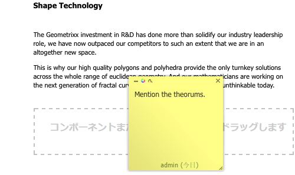
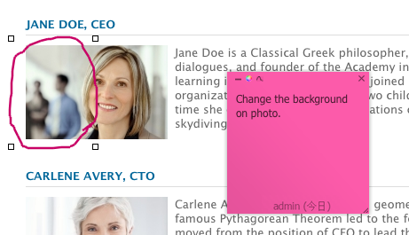

# ページ編集時の注釈{#annotations-when-editing-a-page}

Web サイトのページにコンテンツを追加すると、実際に公開する前に議論の対象となることが多くあります。このために、レイアウトなどではなく、コンテンツに直接関係するコンポーネントの多くに注釈を追加することができます。

注釈によりページ上に色付きのマーカーまたは付箋紙が配置されます。注釈を使用すれば、そのユーザー（または他のユーザー）がコメントや質問を他の作成者またはレビュー担当者に残すことができます。

>[!NOTE]
>
>個々のコンポーネントの種類の定義によって、そのコンポーネントのインスタンスに注釈を追加できるかどうかが決まります。

>[!NOTE]
>
>クラシック UI で作成された注釈もタッチ操作向け UI に表示されます。ただし、スケッチは UI 固有で、作成元の UI でのみ表示されます。

>[!CAUTION]
>
>リソース（段落など）を削除すると、そのリソースに添付されていた注釈およびスケッチが、ページ全体での位置に関係なく、すべて削除されます。

>[!NOTE]
>
>要件に応じて、注釈の追加、更新または削除時に通知を送信するワークフローを開発することもできます。

## 注釈 {#annotations}

段落のデザインによって、注釈は、コンテキストメニュー（通常は必要な段落の上で右クリックして表示）のオプションとして、または段落編集バーのボタンとして使用できます。

どちらの場合も、「**Annotate**」を選択します。色付き付箋紙の注釈が段落に適用されます。すぐに編集モードになるので、テキストを直接追加できます。

注釈は、ページ上の新しい位置に移動できます。上部の境界部分をクリックし、マウスボタンを押したまま、注釈を新しい位置までドラッグします。ページ上ならどこにでも移動できますが、通常は、何らかの方法で元の段落に関連付けておくことが重要です。

注釈（関連するスケッチも含む）は、添付先の段落で実行されるコピー、切り取り、削除のアクションにも含められます。コピーや切り取りのアクションでは、注釈（および関連するスケッチ）の位置は、元の段落と相対的な位置を保持します。

右下隅をドラッグして、注釈のサイズを拡大または縮小することもできます。

追跡に使用するため、フッター行に注釈を作成したユーザーと日付が表示されます。後続の作成者が、同じ注釈を編集したり（フッターは更新されます）、同じ段落に新しい注釈を作成したりできます。

注釈の削除を選択すると、確認を求められます（注釈を削除すると、その注釈に添付されているスケッチも削除されます）。

左上にある 3 つのアイコンを使用すると、注釈（および関連するスケッチ）を最小化したり、色を変更したり、スケッチを追加したりできます。

>[!NOTE]
>
>注釈は、オーサー環境の編集モードでのみ表示されます。
>
>発行環境、および作成者環境のプレビューモードやデザインモードでは表示されません。

>[!NOTE]
>
>別のユーザーによってロックされているページには、注釈を追加できません。

## 注釈のスケッチ {#annotation-sketches}

>[!NOTE]
>
>スケッチは、Internet Explorer では使用できません。したがって、
>
>* アイコンは表示されません。
>* 別のブラウザーで作成した既存のスケッチは表示されません。

>

スケッチは、注釈の機能の 1 つであり、ブラウザーウィンドウ（表示部分）のどこにでも、簡単な線図を作成できます。

* スケッチモードのとき、カーソルは十字型に変わります。複数の異なる線を描くことができます。
* スケッチ線は、注釈と同じ色で、次の 2 種類があります。

   * フリーハンド

      デフォルトのモードです。マウスボタンを放すと終了します。

   * 直線

      `ALT`を押しながら開始とエンドポイントをクリックします。重複クリックで終了します。

* スケッチモードの終了後、スケッチ線をクリックすると、そのスケッチが選択されます。
* スケッチを移動するには、スケッチを選択して、必要な位置までドラッグします。
* スケッチはコンテンツの上に重ねて表示されます。つまり、スケッチの 4 隅の内側では、下にある段落をクリックできません。段落の編集やリンクへのアクセスなどが必要な場合でも同様です。これが問題になる場合（スケッチがページの大部分を覆っている場合など）は、該当する注釈を最小化すると、関連するスケッチもすべて最小化され、下の領域に対する処理が可能になります。
* 個々のスケッチを削除するには、削除するスケッチを選択して、**Delete** キー（MAC の場合は **Fn** + **Backspace** キー）を押します。

* 段落を移動またはコピーすると、関連する注釈およびスケッチも移動またはコピーされます。段落に対する位置は変わりません。
* 注釈を削除すると、その注釈に添付されているスケッチもすべて削除されます。

