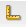
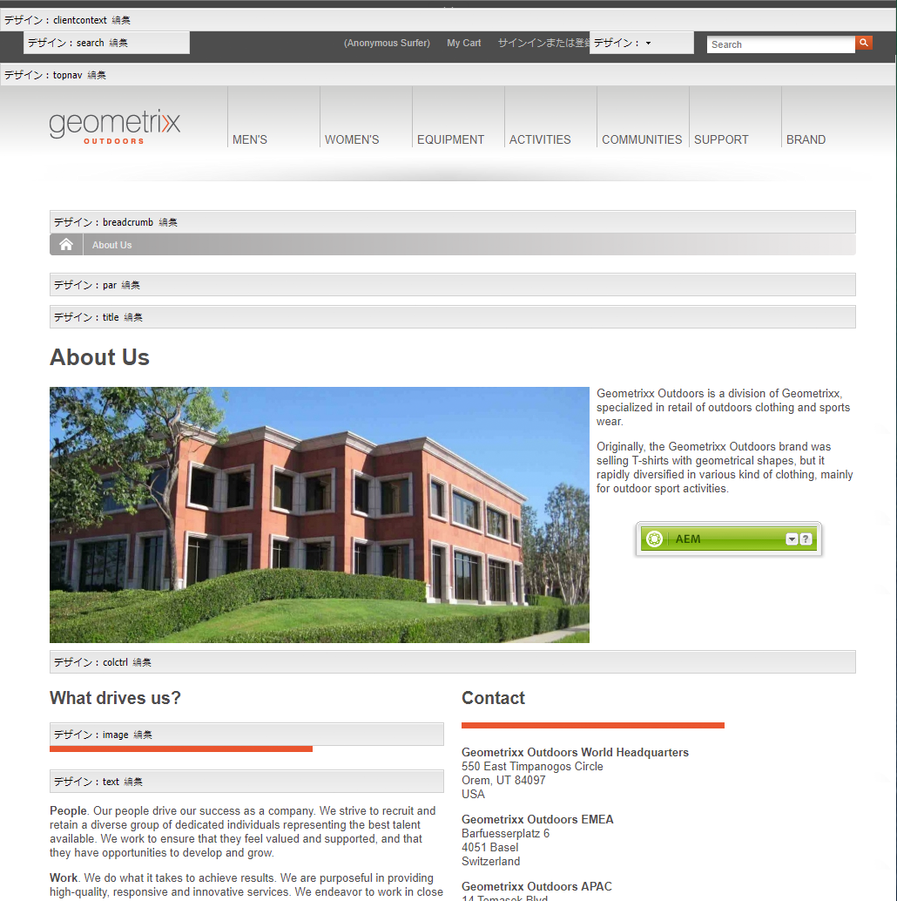
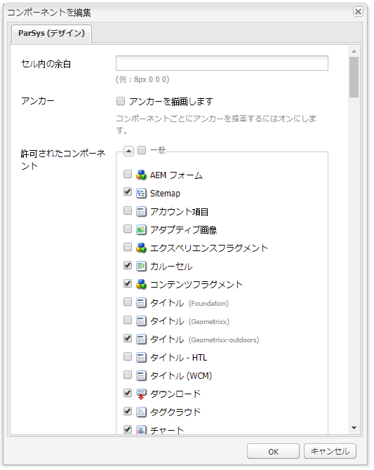
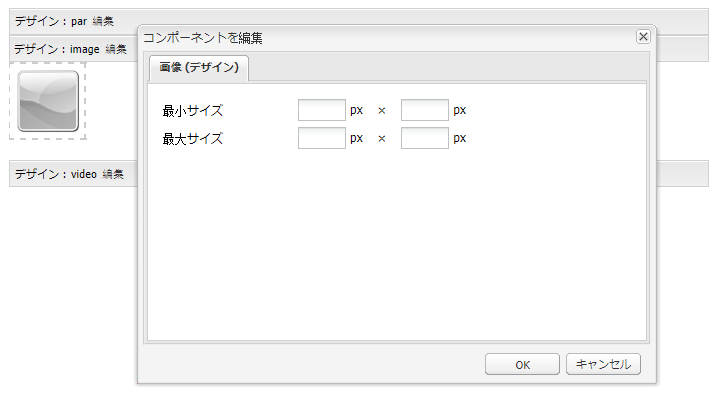

# デザインモードでのコンポーネントの設定{#configuring-components-in-design-mode}

AEM インスタンスを標準でインストールすると、サイドキックで直ちに様々なコンポーネントを使用できます。

これらのほかにも、さまざまなコンポーネントを利用できます。 デザインモードを使用して[このようなコンポーネントを有効または無効にできます](#enabledisablecomponentsusingdesignmode)。 ページ上で有効にして配置すると、デザインモードを使用して、属性パラメーターを編集してコンポーネントデザインの側面[&#128279;](#configuringcomponentsusingdesignmode)を設定できます。

>[!NOTE]
>
>これらのコンポーネントを編集する際は慎重に行う必要があります。 デザイン設定は、多くの場合、web サイト全体のデザインに不可欠な要素であるため、適切な権限（および経験）を持つユーザー（多くの場合、管理者または開発者）のみが変更する必要があります。 詳しくは、[コンポーネントの開発](/help/sites-developing/components.md)を参照してください。

具体的には、ページの段落システムで許可された構成要素を追加したり、削除したりすることです。 段落システム（`parsys`）は、他のすべての段落コンポーネントを含む複合コンポーネントです。 段落システムを使用すると、作成者は異なるタイプのコンポーネントを、他のすべての段落コンポーネントを含むページに追加できます。 各段落タイプは、コンポーネントとして表されます。

例えば、製品ページのコンテンツには、次の情報を含む段落システムを含めることができます。

* 製品の画像（画像または textimage 段落の形式）
* 製品の説明（テキスト段落として）
* 技術データを含むテーブル（表の段落として）
* ユーザー入力フォーム（フォーム開始、フォーム要素、フォーム終了の段落として）

>[!NOTE]
>
>[&#x200B; について詳しくは、](/help/sites-developing/components.md#paragraphsystem)コンポーネントの開発[および](/help/sites-developing/dev-guidelines-bestpractices.md#guidelines-for-using-templates-and-components)テンプレートとコンポーネントの使用に関するガイドライン`parsys`を参照してください。

## コンポーネントを有効／無効にする {#enable-disable-components}

デザインモードでは、サイドキックは最小化され、オーサリング用にアクセス可能なコンポーネントを設定できます。

1. デザインモードに入るには、編集するページを開き、サイドキックアイコンを使用します。

   

1. 段落システムの「**編集**」（**段落のデザイン**）をクリックします。

   

1. ダイアログが開き、サイドキックに表示されるコンポーネントグループと、それらが含む個々のコンポーネントが一覧表示されます。

   必要に応じて、サイドキックで使用可能なコンポーネントを追加または削除します。

   

1. デザインモードでは、サイドキックは最小化されます。 矢印をクリックすると、サイドキックを最大化して編集モードに戻ることができます。

   

## コンポーネントのデザインの設定 {#configuring-the-design-of-a-component}

デザインモードでは、個々のコンポーネントの属性を設定することもできます。 各コンポーネントには独自のパラメーターがあり、次の例では&#x200B;**画像**&#x200B;コンポーネントが表示されます。

1. デザインモードに入るには、編集するページを開き、サイドキックアイコンを使用します。

   

1. コンポーネントのデザインを設定できます。

   たとえば、画像コンポーネントの「**編集**」（**画像のデザイン**）をクリックすると、そのコンポーネント特有のパラメーターを設定できます。

   

1. 「**OK**」をクリックして、変更を保存します。

1. デザインモードでは、サイドキックは最小化されます。 矢印をクリックすると、サイドキックを最大化して編集モードに戻ることができます。

   
