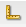

# デザインモードでのコンポーネントの設定{#configuring-components-in-design-mode}

AEM インスタンスが標準インストールされている場合、コンポーネントの選択はサイドキックですぐに使用できます。

これらに加えて、その他の様々なコンポーネントも使用できます。このような[コンポーネントを有効または無効にする](#enabledisablecomponentsusingdesignmode)には、デザインモードを使用します。コンポーネントを有効にしてページに配置したら、デザインモードを使用して属性パラメーターを編集することで[コンポーネントデザインの様々な要素を設定](#configuringcomponentsusingdesignmode)できます。

>[!NOTE]
>
>これらのコンポーネントを編集する際は慎重に行う必要があります。デザインの設定は、通常、Web サイト全体のデザインで重要な部分なので、適切な権限（と十分な経験）のあるユーザー（通常は管理者または開発者）のみが変更を行う必要があります。詳しくは、[コンポーネントの開発](/help/sites-developing/components.md)を参照してください。

実際には、ページの段落システムで許可されているコンポーネントの追加や削除が行われます。 段落システム（`parsys`）は、他のすべての段落コンポーネントを含む複合コンポーネントです。段落システムを使用すると、他のすべての段落コンポーネントを含んでいるので、作成者は、様々なタイプのコンポーネントをページに追加できます。それぞれの段落タイプはコンポーネントとして表されます。

例えば、商品ページのコンテンツに次の項目を保持する段落システムを含めることができます。

* 商品の画像（画像またはテキスト画像の段落として）
* 商品の説明（テキスト段落として）
* 技術データを含むテーブル（テーブル段落として）
* ユーザー入力フォーム（フォーム開始、フォーム要素、フォーム終了の段落として）

>[!NOTE]
>
>[ について詳しくは、](/help/sites-developing/components.md#paragraphsystem)コンポーネントの開発[および](/help/sites-developing/dev-guidelines-bestpractices.md#guidelines-for-using-templates-and-components)テンプレートとコンポーネントの使用に関するガイドライン`parsys`を参照してください。

## コンポーネントの有効化/無効化 {#enable-disable-components}

デザインモードではサイドキックは最小化され、オーサリング用にアクセス可能なコンポーネントを設定できます。

1. デザインモードに切り替えるには、編集用のページを開き、サイドキックアイコンを使用します。

   

1. Click **Edit** on the Paragraph system (**Design of par**).

   

1. ダイアログが開き、コンポーネントグループが、格納されている個々のコンポーネントと共にサイドキックに表示されます。

   サイドキックで使用するコンポーネントを必要に応じて追加または削除します。

   

1. デザインモードでは、サイドキックは最小化されます。矢印をクリックすると、サイドキックを最大化して編集モードに戻ることができます。

   

## コンポーネントのデザインの設定 {#configuring-the-design-of-a-component}

デザインモードでは、個々のコンポーネントの属性も設定できます。コンポーネントにはそれぞれ独自のパラメーターがあります。次に、**画像**&#x200B;コンポーネントの例を示します。

1. デザインモードに切り替えるには、編集用のページを開き、サイドキックアイコンを使用します。

   

1. コンポーネントのデザインを設定できます。

   For example, if you click **Edit** on the Image component (**Design of image**) you can configure the component specific parameters:

   

1. 「**OK**」をクリックして、変更を保存します。

1. デザインモードでは、サイドキックは最小化されます。矢印をクリックすると、サイドキックを最大化して編集モードに戻ることができます。

   
