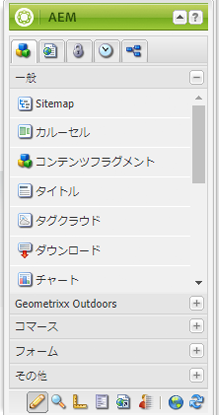
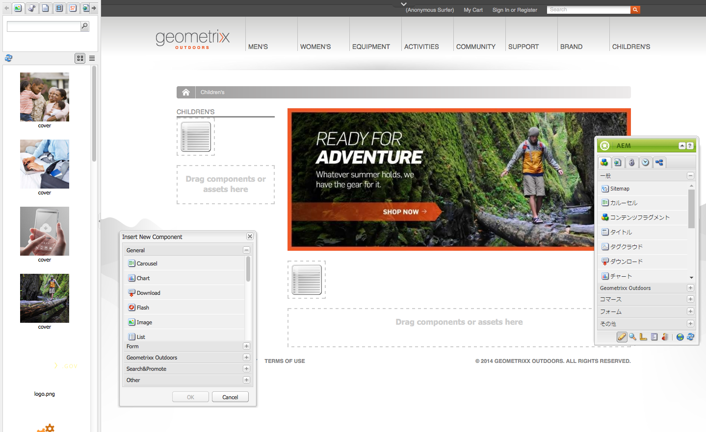
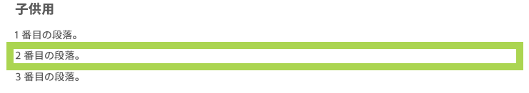
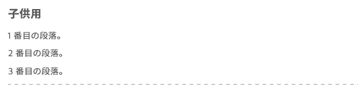
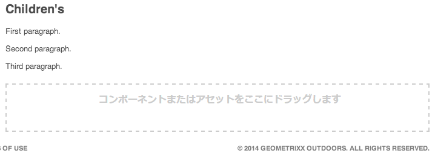
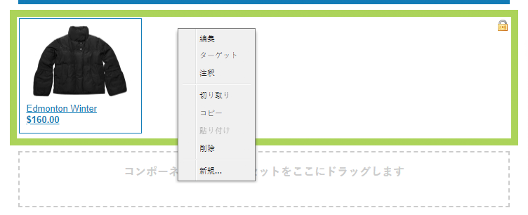
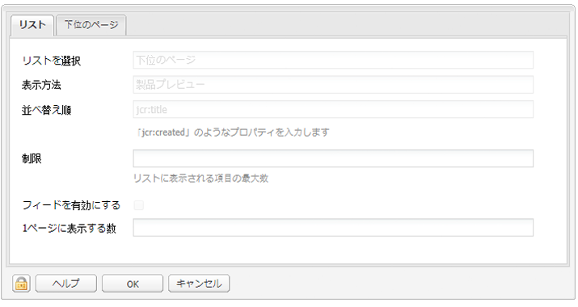
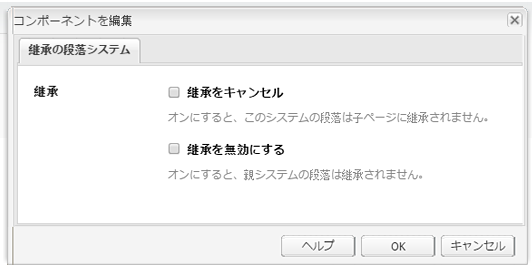
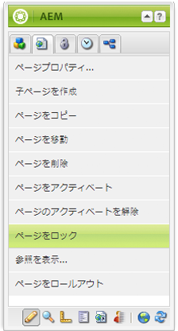
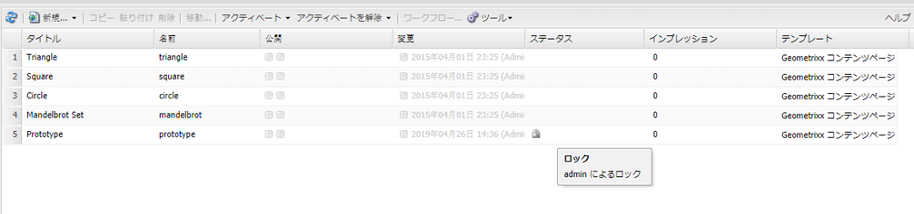

# ページのコンテンツの編集{#editing-page-content}

ページが作成されたら（新規作成、またはローンチやライブコピーの一部として作成）、コンテンツを編集して、必要な更新をおこなうことができます。

コンテンツは、ページにドラッグ可能な[コンポーネント](/help/sites-classic-ui-authoring/classic-page-author-default-components.md)（コンテンツのタイプに適したもの）を使用して追加されます。コンポーネントはその後、そのまま編集したり、移動や削除をおこなったりすることができます。

>[!NOTE]
>
>[適切なアクセス権](/help/sites-administering/security.md)と、ページ編集（コンポーネントの追加、編集または削除、注釈、ロック解除など）のための[権限](/help/sites-administering/security.md#permissions)を持つアカウントが必要です。
>
>問題が発生した場合は、システム管理者にお問い合わせください。

## サイドキック {#sidekick}

サイドキックはページのオーサリングをおこなう際の重要なツールです。ページのオーサリング中はフローティングされるので、常に表示されます。

次のような複数のタブとアイコンを利用できます。

* コンポーネント
* ページ
* 情報
* バージョン管理
* ワークフロー
* モード
* 基礎モード
* ClientContext
* Web サイト

これらのタブやアイコンから、次のような幅広い機能にアクセスできます。

* [コンポーネントの選択](/help/sites-classic-ui-authoring/classic-page-author-env-tools.md#sidekick)
* [参照の表示](/help/sites-classic-ui-authoring/classic-page-author-env-tools.md#showing-references)
* [監査ログへのアクセス](/help/sites-classic-ui-authoring/classic-page-author-env-tools.md#audit-log)
* [モードの切り替え](/help/sites-classic-ui-authoring/classic-page-author-env-tools.md#page-modes)
* バージョンの[作成](/help/sites-classic-ui-authoring/classic-page-author-work-with-versions.md#creating-a-new-version)、[復元](/help/sites-classic-ui-authoring/classic-page-author-work-with-versions.md#restoring-a-page-version-from-sidekick)および[比較](/help/sites-classic-ui-authoring/classic-page-author-work-with-versions.md#comparing-with-a-previous-version)

* ページの[公開](/help/sites-classic-ui-authoring/classic-page-author-publish-pages.md#publishing-a-page)、[非公開](/help/sites-classic-ui-authoring/classic-page-author-publish-pages.md#unpublishing-a-page)

* [ページプロパティの編集](/help/sites-classic-ui-authoring/classic-page-author-edit-page-properties.md)

* [基礎モード](/help/sites-authoring/scaffolding.md)

* [ClientContext](/help/sites-administering/client-context.md)

## コンポーネントの挿入 {#inserting-a-component}

### コンポーネントの挿入 {#inserting-a-component-1}

ページを開いたら、コンテンツの追加を開始できます。コンテンツの追加をおこなうには、コンポーネント（「段落」とも呼ばれる）を追加します。

新しいコンポーネントを挿入するには：

1. 挿入する段落のタイプを選択するには、次のようないくつかの方法があります。

   * 「**コンポーネントまたはアセットをここにドラッグします**」というラベルが付いた領域をダブルクリックします。**新規コンポーネントを挿入**&#x200B;ツールバーが開きます。コンポーネントを選択して、「**OK**」をクリックします。

   * サイドキックと呼ばれるフローティングツールバーからコンポーネントをドラッグして、新しい段落を挿入します。
   * 既存の段落を右クリックして、「**新規**」を選択します。新規コンポーネントを挿入ツールバーが開きます。コンポーネントを選択して、「**OK**」をクリックします。

   

1. サイドキックと&#x200B;**新規コンポーネントを挿入**&#x200B;ツールバーの両方で、使用可能なコンポーネント（段落タイプ）のリストが表示されます。これらの段落タイプは様々なセクション（「一般」、「列」など）に分類されていて、必要に応じて展開できます。

   実稼動環境によって、表示されるオプションは異なります。コンポーネントについて詳しくは、[デフォルトコンポーネント](/help/sites-classic-ui-authoring/classic-page-author-default-components.md)を参照してください。

1. ページに必要なコンポーネントを挿入します。次に、段落をダブルクリックすると、段落を設定しコンテンツを追加するためのウィンドウが開きます。

### コンテンツファインダーを使用したコンポーネントの挿入 {#inserting-a-component-using-the-content-finder}

[コンテンツファインダー](/help/sites-classic-ui-authoring/classic-page-author-env-tools.md#the-content-finder)からアセットをドラッグして、ページに新しいコンポーネントを追加することもできます。この操作により、アセットが格納される適切なタイプの新しいコンポーネントが自動的に作成されます。

これは次のアセットタイプに有効です（一部はページや段落システムに依存します）。

| アセットタイプ | 結果のコンポーネントの種類 |
|---|---|
| 画像 | 画像 |
| ドキュメント | ダウンロード |
| 製品 | 製品 |
| ビデオ | Flash |

>[!NOTE]
>
>この動作は使用しているインストール環境で設定できます。詳しくは、[アセットをドラッグするとコンポーネントインスタンスが作成されるように段落システムを設定](/help/sites-developing/developing-components.md#configuring-a-paragraph-system-so-that-dragging-an-asset-creates-a-component-instance)を参照してください。

前述のいずれかのアセットタイプをドラッグしてコンポーネントを作成するには：

1. ページが&#x200B;[**編集**&#x200B;モード](/help/sites-classic-ui-authoring/classic-page-author-env-tools.md#page-modes)であることを確認します。
1. [コンテンツファインダー](/help/sites-classic-ui-authoring/classic-page-author-env-tools.md#the-content-finder)を開きます。
1. 必要なアセットを必要な位置までドラッグします。[コンポーネントプレースホルダー](#componentplaceholder)にコンポーネントの配置先が表示されます。

   アセットタイプに適したコンポーネントが、必要な場所に作成されます。これには選択したアセットが含まれます。

1. 必要に応じて、コンポーネントを[編集](#editmovecopypastedelete)します。

## コンポーネント（コンテンツとプロパティ）の編集 {#editing-a-component-content-and-properties}

既存の段落を編集するには、次のいずれかの操作を実行します。

* 段落を&#x200B;**ダブルクリック**&#x200B;して開きます。段落を作成したときと同じウィンドウと、既存のコンテンツが表示されます。変更をおこない、「**OK**」をクリックします。

* 段落を&#x200B;**右クリック**&#x200B;して、「**編集**」をクリックします。

* 段落を 2 回&#x200B;**クリック**（ゆっくりダブルクリック）して、インプレース編集モードを開始します。ページ上のテキストを、ダイアログウィンドウ内ではなく直接編集できます。このモードでは、ページ最上部にツールバーが表示されます。変更をおこなうと、その内容は自動的に保存されます。

## コンポーネントの移動 {#moving-a-component}

段落を移動するには：

>[!NOTE]
>
>[切り取りと貼り付け](#cut-copy-paste-a-component)を使用して、コンポーネントを移動することもできます。

1. 移動する段落を選択します。

   

1. 段落を新しい場所にドラッグします。段落を移動可能な場所が緑のチェックマークで示されます。目的の場所にドロップします。
1. 段落が移動されます。

   

## コンポーネントの削除 {#deleting-a-component}

段落を削除するには：

1. 段落を選択し、**右クリック**&#x200B;します。

   

1. メニューから「**削除**」を選択します。AEM WCM で、段落を削除することを確認するメッセージが表示されます。削除の操作を元に戻すことはできません。
1. 「**OK**」をクリックします。

>[!NOTE]
>
>[グローバル編集ツールバーを表示するためのユーザープロパティ](/help/sites-classic-ui-authoring/author-env-user-props.md)を設定している場合、表示される「**コピー**」、「**切り取り**」、「**貼り付け**」、「**削除**」の各ボタンを使用して、段落に対する特定の操作を実行できます。
>
>様々な[キーボードショートカット](/help/sites-classic-ui-authoring/classic-page-author-keyboard-shortcuts.md)も利用できます。

## コンポーネントの切り取り／コピー／貼り付け {#cut-copy-paste-a-component}

[コンポーネントの削除](#deleting-a-component)と同様に、コンテキストメニューを使用してコンポーネントのコピー、切り取り、貼り付けをおこなうことができます。

>[!NOTE]
>
>[グローバル編集ツールバーを表示するためのユーザープロパティ](/help/sites-classic-ui-authoring/author-env-user-props.md)を設定している場合、表示される「**コピー**」、「**切り取り**」、「**貼り付け**」、「**削除**」の各ボタンを使用して、段落に対する特定の操作を実行できます。
>
>様々な[キーボードショートカット](/help/sites-classic-ui-authoring/classic-page-author-keyboard-shortcuts.md)も利用できます。

>[!NOTE]
>
>コンテンツの切り取り、コピーおよび貼り付けは、同じページ内でのみサポートされています。

## 継承されたコンポーネント {#inherited-components}

継承されたコンポーネントは、次のような様々なシナリオによって生成されます。

* [複数サイト管理](/help/sites-administering/msm.md)。[基礎モード](/help/sites-classic-ui-authoring/classic-feature-scaffolding.md#scaffolding-with-msm-inheritance)と組み合わせて使用されます。

* [ローンチ](/help/sites-classic-ui-authoring/classic-launches.md)（ライブコピーをベースとしている場合）
* 特定のコンポーネント（Geometrixx 内の継承された段落システムなど）

継承はキャンセル（その後再度有効化）できます。コンポーネントによって、次の場所から操作できます。

1. **ライブコピー**

   コンポーネントがライブコピーまたはローンチに含まれている場合は、南京錠アイコンによりそのことが示されます。この南京錠アイコンをクリックして継承をキャンセルできます。

   * 南京錠アイコンは、コンポーネントの選択時に、次のように表示されます。

   

   * また、次に示すように、南京錠アイコンはコンポーネントのダイアログにも表示されます。

   

1. **継承された段落システム**

   設定ダイアログです。例えば、Geometrixx 内の継承された段落システムと同様です。

   

## 注釈の追加 {#adding-annotations}

[注釈](/help/sites-classic-ui-authoring/classic-page-author-annotations.md)を使用すると、他の作成者がコンテンツに関するフィードバックを提供できます。注釈は、レビューや検証の目的でよく使用されます。

## ページのプレビュー {#previewing-pages}

ページのプレビューに重要な 2 つのアイコンがサイドキックの下部にあります。

* 鉛筆のアイコンは、現在のモードが編集モードであり、コンテンツを追加、変更、移動または削除できることを示します。

   

* 拡大鏡アイコンを使用すると、プレビューモードを選択できます。プレビューモードでは、ページがパブリッシュ環境とまったく同じ形式で表示されます（ページの更新が必要になる場合があります）。

   

   プレビューモードでは、サイドキックが縮小されます。下向き矢印アイコンをクリックすると、編集モードに戻ります。

   

## 検索と置換 {#find-replace}

同じフレーズを大量に編集する場合、「**[検索と置換](/help/sites-classic-ui-authoring/author-env-search.md#find-and-replace)**」メニューオプションで、Web サイトの特定のセクション内で特定の文字列を持つ複数のインスタンスを検索して置換できます。

## ページのロック {#locking-a-page}

AEM では、他のユーザーによるコンテンツの変更を防ぐためにページをロックすることができます。ページのロックは、1 つの特定のページで大量の編集作業をおこなう場合や、短期間ページを凍結する必要がある場合に便利です。

>[!CAUTION]
>
>ページをロックしたユーザー（または管理者権限を持つアカウント）しかそのページをロック解除できないので、ページのロック機能は慎重に使用してください。

ページをロックするには：

1. 「**Web サイト**」タブで、ロックするページを選択します。
1. ページをダブルクリックして、編集用に開きます。
1. サイドキックの「**ページ**」タブで、「**ページをロック**」を選択します。

   

   他のユーザーに対して、ページがロックされているというメッセージが表示されます。さらに、**Web サイト**&#x200B;コンソールの右側のパネルで、このページがロック済みとして表示され、ページをロックしたユーザーが示されます。

   

## ページのロック解除 {#unlocking-a-page}

ページのロックを解除するには：

1. 「**Web サイト**」タブで、ロックを解除するページを選択します。
1. ページをダブルクリックして開きます。
1. サイドキックの「**ページ**」タブで、「**ページのロックを解除**」を選択します。

## ページ編集の取り消しとやり直し {#undoing-and-redoing-page-edits}

ページのコンテンツフレームにフォーカスがあるときに、次のキーボードショートカットを使用します。

* 取り消し：Ctrl + Z（Windows）または Cmd + Z（Mac）
* やり直し：Ctrl + Y（Windows）または Cmd + Y（Mac）

1 つ以上の段落の削除、追加、再配置の取り消しまたはやり直しを実行すると、影響される段落は点滅表示されます（デフォルトの動作）。

>[!NOTE]
>
>ページ編集の取り消しとやり直しによって実行可能なことについて詳しくは、[ページ編集の取り消しとやり直し - 理論](#undoing-and-redoing-page-edits-the-theory)を参照してください。

## ページ編集の取り消しとやり直し - 理論 {#undoing-and-redoing-page-edits-the-theory}

>[!NOTE]
>
>システム管理者は、インスタンスの要件に従って[取り消しおよびやり直し機能の様々な面を設定できます](/help/sites-administering/config-undo.md)。

AEM では、ユーザーが実行するアクションの履歴と、それらのアクションを実行した順序が保存されます。そのため、複数のアクションの取り消しは、ユーザーが実行した順序でおこなわれます。その後、やり直しを使用して、1 つ以上のアクションを再適用できます。

コンテンツページ上の要素が選択されている場合、取り消しおよびやり直しコマンドは選択されている項目（テキストコンポーネントなど）に適用されます。

取り消しおよびやり直しコマンドの動作は、他のソフトウェアプログラムの動作と類似しています。これらのコマンドを使用すると、コンテンツに関する決定をおこなう中で、Web ページの最新の状態に復元できます。例えば、テキスト段落をページ上の別の場所に移動した場合に、取り消しコマンドを使用して、その段落を元の場所に戻すことができます。その後、段落を再度移動することを決定した場合は、やり直しコマンドを使用します。

>[!NOTE]
>
>以下の操作を実行できます。
>
>* 取り消しを使用してからページの編集をおこなっていない限り、アクションをやり直すことができます。
>* 最大 20 回の編集アクションを取り消すことができます（デフォルト設定）。
>* 様々な[キーボードショートカット](/help/sites-classic-ui-authoring/classic-page-author-keyboard-shortcuts.md)を利用して取り消しとやり直しをおこなうこともできます。

>

取り消しおよびやり直しは、次のようなページの変更に対して使用できます。

* 段落の追加、編集、削除および移動
* 段落コンテンツのインプレース編集
* ページ内部での項目のコピー、カットおよび貼り付け
* ページ間でのアイテムのコピー、切り取り、貼り付け
* ファイルおよび画像の追加、削除および変更
* 注釈およびスケッチの追加、削除および変更
* 基礎モードに対する変更
* 参照の追加と削除
* コンポーネントのダイアログボックスでのプロパティ値の変更

フォームコンポーネントがレンダリングするフォームフィールドは、ページのオーサリング中に指定された値を持つことにはなりません。そのため、取り消しおよびやり直しコマンドは、それらのタイプのコンポーネントの値に対しておこなった変更には影響を与えません。例えば、ドロップダウンリスト内の値の選択を取り消すことはできません。

>[!NOTE]
>
>ファイルと画像に対する変更の取り消しおよびやり直しには、特別な権限が必要になります。また、ファイルと画像に対する変更の取り消し履歴は、少なくとも数時間保管されます。この時間を経過すると、変更の取り消しは保証されません。管理者が、権限の付与および 10 時間というデフォルト時間の変更をおこなうことができます。
