# ページオーサリング用コンポーネント{#components-for-page-authoring}

次のコンポーネントは、標準 Web ページ用のコンテンツをオーサリングする際の使用を目的としています。 コンポーネントは、AEMの標準インストールですぐに使用できるコンポーネントのサブセットを形成します。

サイドキックからすぐに使用できるものもあれば、 [デザインモード](/help/sites-classic-ui-authoring/classic-page-author-design-mode.md) をクリックして有効/無効にします。

>[!CAUTION]
>
>このセクションでは、標準のAEMインストールで標準で使用できるコンポーネントについてのみ説明します。
>
>インスタンスによっては、要件に合わせて明示的に開発されたカスタマイズコンポーネントが存在する場合があります。 これらのカスタムコンポーネントは、ここで説明する一部のコンポーネントと同じ名前を持つ場合もあります。

コンポーネントは、サイドキックの「**コンポーネント**」タブと「**新規コンポーネントを挿入**」セレクターで[ページを編集](/help/sites-classic-ui-authoring/classic-page-author-edit-content.md)するときに（「**コンポーネントまたはアセットをここにドラッグ**」領域でダブルクリックしたとき）使用できます。

コンポーネントを選択してページ上の必要な場所にドラッグしてから、[コンテンツとプロパティを編集](/help/sites-classic-ui-authoring/classic-page-author-edit-content.md#editing-a-component-content-and-properties)します。

コンポーネントは、（ページオーサリング用に）以下を含む様々なカテゴリ（コンポーネントグループ）に従って並べ替えられます。

* [一般](#general):テキスト、画像、テーブル、グラフなどの基本的なコンポーネントが含まれます。
* [列](#columns):コンテンツのレイアウトの構成に必要なコンポーネントが含まれます。
* [フォーム](#formgroup):フォームの作成に必要なすべてのコンポーネントが含まれます。

## 一般 {#general}

一般コンポーネントは、コンテンツの作成に使用する基本コンポーネントです。

### アカウント項目 {#account-item}

タイトルと説明を含むリンクを定義できます。


### アダプティブ画像 {#adaptive-image}

アダプティブ画像の基盤コンポーネントは、Web ページが開かれているウィンドウに合わせてサイズが調整された画像を生成します。 このコンポーネントを使用するには、ファイルシステムまたは DAM から画像リソースを提供します。 Web ページを開くと、現在のウィンドウに適したサイズに変更された画像のコピーが Web ブラウザーによってダウンロードされます。

ウィンドウのサイズは、次の特性によって決まります。

* デバイス画面：モバイルデバイスは通常、web ページを画面全体に展開して表示します。
* Web ブラウザーウィンドウのサイズ：ノートパソコンとデスクトップコンピュータのユーザーは、Web ブラウザーのウィンドウのサイズを変更できます。

例えば、Web ページを携帯電話で開くときは小さい画像を生成し、タブレットで開くと中サイズの画像を生成します。 ノート PC では、最大化された Web ブラウザーでページを開くと、コンポーネントは大きな画像を作成して配信します。 Web ブラウザーが画面の一部に合わせてサイズ変更されると、コンポーネントは小さい画像を配信して調整し、ビューを更新します。

#### サポートされる画像形式 {#supported-image-formats}

アダプティブ画像コンポーネントでは、次のファイル名拡張子を持つ画像ファイルを使用できます。

* .jpg
* .jpeg
* .png
* .gif &#42;&#42;

>[!CAUTION]
>
>&#42;&#42;アダプティブレンディション用のアニメーション .gif ファイルは AEM でサポートされていません。

#### 画像のサイズと画質 {#images-sizes-and-quality}

次の表に、指定したビューポート幅に対して生成される画像の幅を示します。 生成される画像の高さは、一定の縦横比を維持するように計算され、画像のエッジ内に空白は発生しません。 切り抜きを使用して、空白を防ぐことができます。

イメージがJPEGイメージの場合、ビューポートサイズもJPEG品質に影響します。 次のJPEG品質が可能です。

* 低 (0.42)
* 中 (0.82)
* 高 (1.00)

| ビューポートの幅の範囲（ピクセル） | 画像の幅（ピクセル） | JPEG 画質 | ターゲットデバイスタイプ |
|---|---|---|---|
| width &lt;= 319 | 320 | 低 |  |
| width = 320 | 320 | 中 | 携帯電話（縦置き） |
| 320 &lt; 幅 &lt; 481 | 480 | 中 | 携帯電話（横向き） |
| 480 &lt; 幅 &lt; 769 | 476 | 高 | タブレット（縦置き） |
| 768 &lt; 幅 &lt; 1025 | 620 | 高 | タブレット（横置き） |
| width &lt;= 1025 | フル（元のサイズ） | 高 | デスクトップ |

#### プロパティ {#properties}

ダイアログを使用すると、アダプティブ画像コンポーネントのインスタンスのプロパティを編集できます。プロパティの多くは、基本となる画像コンポーネントと共通しています。プロパティは次の 2 つのタブに表示されます。

* **画像**

   * **画像**
コンテンツファインダーから画像をドラッグするか、クリックして画像を読み込む参照ウィンドウを開くことができます。画像を読み込んだ後は、画像の切り抜き、回転または削除を行うことができます。画像のズームインおよびズームアウトを行うには、画像の下（「OK」および「キャンセル」ボタンの上）のスライドバーを使用します。

   * **切り抜き**
画像の一部をクリップアウトできます。 境界線をドラッグして画像を切り抜きます。

   * **回転**
画像が目的の向きになるまで「回転」を繰り返しクリックします。

   * **消去**
現在の画像を削除します。

* **詳細**

   * **タイトル**
アダプティブ画像コンポーネントではこのプロパティは使用しません。

   * **代替テキスト**
画像に使用する代替テキストです。

   * **リンク先**
アダプティブ画像コンポーネントではこのプロパティは使用しません。

   * **説明**
アダプティブ画像コンポーネントではこのプロパティは使用しません。

#### アダプティブ画像コンポーネントの拡張 {#extending-the-adaptive-image-component}

アダプティブ画像コンポーネントのカスタマイズについて詳しくは、 [アダプティブ画像コンポーネントについて](/help/sites-developing/responsive.md#using-adaptive-images).

### カルーセル {#carousel}

カルーセルコンポーネントを使用すると、個々のページに関連付けられた画像を表示できます。

* 一度に 1 つ
* 短時間
* 指定した順序で
* 指定した時間遅延で

また、クリック可能なコントロールを使用すると、ユーザーは表示されたページをリアルタイムでオンデマンドで切り替えることができます。 現在表示されているページ画像を選択すると、そのページに移動します。 つまり、カルーセルはナビゲーションコントロールとして機能します。

#### プロパティ {#properties-1}

プロパティは、次の 2 つのタブで使用できます。

* **カルーセル**
ここでは、カルーセルの動作方法を指定します。

   * 再生速度
次のスライドが表示されるまでの時間（ミリ秒単位）。
   * 切り替え時間 2 つのスライド間の切り替えにかかる時間（ミリ秒単位）です。
   * コントロールのスタイル
プルダウンメニューから、「前へ／次へボタン」、「上部右スイッチ」など、様々なオプションを選択可能。

* **リスト**
ページをカルーセルに含める方法を指定します。

   * **次を使用してリストを作成**
ページリストを作成する方法はいくつかあります。子ページ、固定リスト、検索、詳細検索（以下で説明します）。 どの方法を選択した場合でも、リストに含めるページには、それぞれページに関連付けられた画像が既に存在する必要があります。 この画像はカルーセルに表示されます。 そのページのページプロパティの下にページの画像がない場合は、開始する前にページに画像を関連付ける必要があります。 それ以外の場合、カルーセルには空白のページが表示されます。 詳しくは、 [ページプロパティの編集](/help/sites-classic-ui-authoring/classic-page-author-edit-page-properties.md).
選択した項目に応じて、新しいパネルが表示されます。

      * **子ページのオプション**

         * **親ページ**
手動で、またはセレクターを使用して、パスを指定します。現在のページを親として使用するには、空のままにします。
      * **固定リストのオプション**

         * **ページ**
ページのリストを選択します。 
エントリを追加するには `+` を、順序を調整するには上下のボタンを使用します。
      * **検索のオプション**

         * **開始**
手動で、またはセレクターを使用して、開始パスを入力します。

         * **検索クエリ**
プレーンテキストの検索クエリを入力できます。
      * **詳細検索のオプション**

         * **QueryBuilder 述語の表記**
「QueryBuilder 述語の表記」を使用して検索クエリを入力できます。例えば、「fulltext=Marketing」と入力すると、コンテンツに「Marketing」が含まれるすべてのページがカルーセルに表示されます。
クエリ式とその他の例の詳細は、[QueryBuilder API](/help/sites-developing/querybuilder-api.md) を参照してください。
   * **並べ替え順**
 
`jcr:title`、`jcr:created`、`cq:lastModified`、または `cq:template` をドロップダウンメニューから選択します。

   * **制限**
オプション。 カルーセルで使用する項目の最大数です。


>[!NOTE]
>
>AEM DAM にデジタルアセットを表示するAdobe Experience Manager用のカスタムカルーセルコンポーネントを作成できます。

### グラフ {#chart}

グラフコンポーネントを使用して、棒グラフ、折れ線グラフまたは円グラフを追加できます。 指定したデータからAEMがグラフを作成します。 「データ」タブに直接入力するか、スプレッドシートをコピー&amp;ペーストしてデータを指定します。

* **データ**

   * **チャートデータ**
チャートデータを入力するには、CSV（コンマ区切り値）形式を使用します。CSV 形式では、コンマ（「,」）をフィールドの区切り記号として使用します。

* **詳細**

   * **チャートのタイプ**
「円グラフ」、「折れ線グラフ」および「棒グラフ」から選択します。

   * **代替テキスト**
グラフの代わりに表示されるテキスト。

   * **幅**
グラフの幅をピクセル単位で指定します。

   * **高さ**
グラフの高さ（ピクセル単位）。

グラフデータと結果の棒グラフの例は次のとおりです。

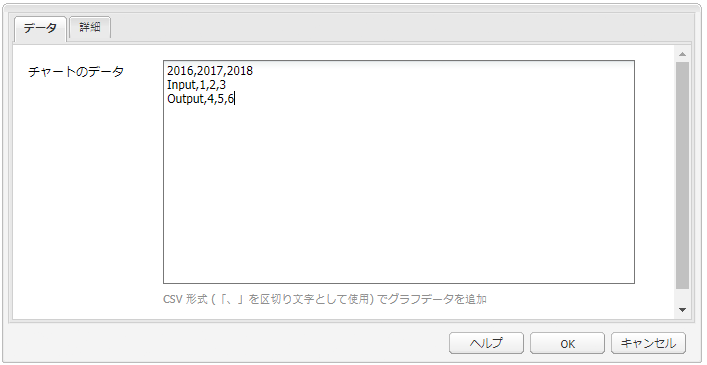 


### コンテンツフラグメント {#content-fragment}

>[!CAUTION]
>
>コンテンツフラグメント管理のすべての機能は、タッチ操作向け UI でのみ使用できます。
>
>コンテンツフラグメントコンポーネントは、クラシック UI のサイドキックに表示されますが、その他の機能は使用できません。

[コンテンツフラグメント](/help/sites-classic-ui-authoring/classic-page-author-content-fragments.md) は、ページに依存しないアセットとして作成および管理されます。 その後、コンテンツページをオーサリングする際に、これらのフラグメントとそれらのバリエーションを使用できます。

### デザインインポーター {#design-importer}

デザインパッケージを含む zip ファイルをアップロードできます。

### ダウンロード {#download}

ダウンロードコンポーネントは、選択した Web ページに、特定のファイルをダウンロードするためのリンクを作成します。 コンテンツファインダーからアセットをドラッグするか、ファイルをアップロードできます。

* **ダウンロード**

   * **説明**
ダウンロードリンクに対して表示される短い説明。

   * **ファイル**
生成される Web ページでダウンロード可能なファイル。 コンテンツファインダーからアセットをドラッグするか、ダウンロード可能にするファイルをアップロードできる領域を選択します。

Geometrixx でのダウンロードコンポーネントの例は次のとおりです。


### 外部 web アプリケーション {#external}

外部アプリケーション統合コンポーネント（**External**）を使用すると、iframe を使用して外部アプリケーションを AEM ページに埋め込むことができます。

* **外部 web アプリケーション**

   * **対象アプリケーション**

      統合する Web アプリケーションの URL を指定します。例：

      ```
      https://en.wikipedia.org/wiki/Main_Page
      ```

   * **パスパラメーター**

      必要に応じて、「 」チェックボックスをオンにして、アプリケーションに渡すパラメーターを選択します。

   * **幅と高さ**

      iframe のサイズを定義します。

外部アプリケーションは AEM ページの段落システムに統合されます。例えば、`https://en.wikipedia.org/wiki/Main_Page` の対象アプリケーションを使用している場合は、次のようになります。

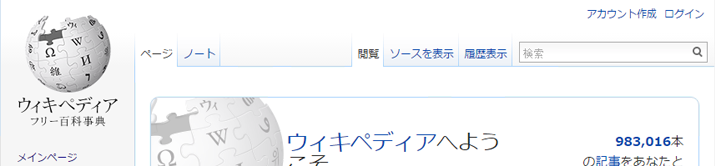

>[!NOTE]
>
>ユースケースに応じて、外部アプリケーションの統合に他のオプションを使用できます ( 例： [ポートレットの統合](/help/sites-administering/aem-as-portal.md).

### Flash {#flash}

Flashコンポーネントを使用すると、ムービーを読み込むことがFlashできます。 Flash アセットをコンテンツファインダーからコンポーネントにドラッグするか、ダイアログを使用します。

* **Flash**

   * **Flash ムービー**

      Flash ムービーファイル。 コンテンツファインダーからアセットをドラッグするか、クリックして参照ウィンドウを開きます。

   * **サイズ**

      ムービーを保持する表示領域の寸法（ピクセル単位）。

* **代替イメージ**

   表示する代替画像。

* **詳細**

   * **コンテキストメニュー**

      コンテキストメニューを表示するか非表示にするかを示します。

   * **ウィンドウモード**

      不透明、透明、枠付きウィンドウなど、ウィンドウの表示方法。

   * **背景色**

      提示される色見本から選択した背景色。

   * **最低バージョン**

      ムービーの実行に必要なAdobeFlash Playerの最小バージョン。 デフォルトは 9.0.0 です。

   * **属性**

      その他の属性が必要です。

### 画像 {#image}

画像コンポーネントによって、指定したパラメーターに従って、画像とそれに付随するテキストが表示されます。

画像をアップロードした後、編集および操作できます（例えば、切り抜き、回転、リンク/タイトル/テキストの追加）。

画像は、 [コンテンツファインダー](/help/sites-classic-ui-authoring/classic-page-author-env-tools.md#the-content-finder) を直接コンポーネントまたはその編集ダイアログに追加します。 編集ダイアログの中央の領域をダブルクリックして、ローカルファイルシステムを参照し、画像をアップロードすることもできます。 編集ダイアログの 2 つのタブで、画像の定義と操作をすべて制御することもできます。

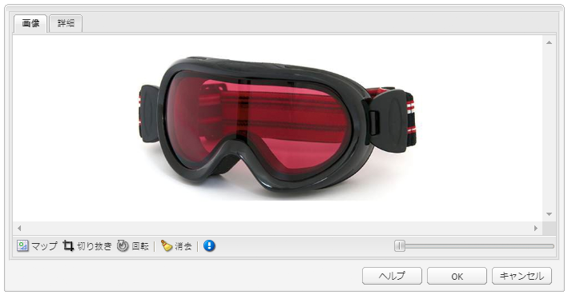

>[!NOTE]
>
>Internet Explorer では、アップロードの進行状況を監視できません。
>
>Internet Explorer ユーザーは、画像をアップロードし、「 **Ok**&#x200B;次に、画像を再度開いて、アップロードされたファイルをプレビューで確認し、変更（切り抜き）を実行できるようにします。
>
>AEM で使用される HTML5 の機能について詳しくは、[認定プラットフォーム](/help/release-notes/release-notes.md#certifiedplatforms)を参照してください。

画像を読み込む際は、次の設定が可能です。

* **マップ**

   画像をマップするには、「マップ」を選択します。画像マップの作成方法（長方形、多角形など）を指定し、領域が指す位置を指定します。

* **切り抜き**

   「切り抜き」を選択して、画像の一部を切り抜くことができます。 マウスを使用して画像を切り抜きます。

* **回転**

   画像を回転するには、「回転」を選択します。画像が目的の向きになるまで繰り返し使用します。

* **消去**

   現在の画像を削除します。

* **ズームバー**

   画像のズームインおよびズームアウトを行うには、画像の下（「OK」および「キャンセル」ボタンの上）のスライドバーを使用します。

* **タイトル**

   画像のタイトル。

* **代替テキスト**

   アクセシブルなコンテンツを作成する際に使用する代替テキスト。

* **リンク先**

   web サイト内のアセットまたはその他のページへのリンクを作成します。

* **説明**

   画像の説明。

* **サイズ**

   画像の高さと幅を設定します。

最終的な画像（**タイトル**&#x200B;と&#x200B;**説明**&#x200B;を含む）は、次のように表示されます。


### レイアウトコンテナ {#layout-container}

>[!CAUTION]
>
>レイアウトコンテナコンポーネントはクラシック UI で使用できますが、完全な機能はタッチ操作対応 UI でのみ使用できます。 詳しくは、 [レスポンシブレイアウト](/help/sites-classic-ui-authoring/classic-page-author-responsive-layout.md).

### リスト {#list}

リストコンポーネントを使用すると、リストを表示するための検索条件を設定できます。

* **リスト**

   * **リストを選択**

      ここで、リストがコンテンツを取得する場所を指定します。 次の方法があります。

   * 選択した項目に応じて、新しいパネルが表示されます。

      * **子ページのオプション**

         * **親**（親ページ）
手動で、またはセレクターを使用して、パスを指定します。現在のページを親として使用するには、空のままにします。
      * **固定リストのオプション**

         * **ページ**

            ページのリストを選択します。エントリを追加するには + を、順序を調整するには上下ボタンを使用します。
      * **検索のオプション**

         * **開始**

            手動で、またはセレクターを使用して、開始パスを入力します。

         * **検索クエリー**

            プレーンテキストの検索クエリーを入力できます。
      * **詳細検索のオプション**

         * **Querybuilder 述語の表記**

            「QueryBuilder 述語の表記」を使用して検索クエリーを入力できます。例えば、「fulltext=Marketing」と入力すると、コンテンツに「Marketing」を含むすべてのページがカルーセルに表示されます。

            クエリー式とその他の例の詳細は、[QueryBuilder API](/help/sites-developing/querybuilder-api.md) を参照してください。
      * **タグ**

         次を指定： **親ページ**, **タグ/キーワード**、および必要な一致条件が含まれます。
   * **表示方法**

      リンク、ティーザー、ニュースなどの項目のリストを表示する方法。

   * **並べ替え順**

      リストを並べ替えるかどうか。並べ替える場合は、並べ替えに使用する条件も指定します。 条件を入力するか、表示されるドロップダウンリストから条件を選択できます。

   * **制限**

      リストに表示する項目の最大数を指定します。

   * **フィードを有効にする**

      そのリストで RSS フィードを有効化するかどうかを示します。

   * **1 ページに表示する数**

      ここでは、一度に表示するリスト項目の数を指定できます。 指定した数より多い項目を含むリストでは、ページネーションを使用して、リストを複数の部分に表示します。


次の例は、 **リスト** 子ページのリストを表示する方法のコンポーネント（デザインは、サイトデザインのカスタム CSS 定義によって制御されます）。


### ログイン {#login}

「ユーザー名」フィールドと「パスワード」フィールドを指定します。

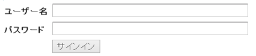

次の項目を設定できます。

* ログイン

   * セクションラベル

      入力フィールドの導入部テキスト。

   * ユーザー名ラベル

      ユーザー名フィールドにラベルを付けるテキスト。

   * パスワードラベル

      パスワードフィールドにラベルを付けるテキスト。

   * ログインボタンのラベル

      ログインボタンのテキスト。

   * リダイレクト先

      ユーザーがログインしたときに開く Web サイト上のページを指定できます。

* ログイン済み

   * 続行ボタンのラベル

      ユーザーが既にログオンしていることを示すテキスト。

### 注文ステータス {#order-status}

* **タイトル**

   * **タイトル**

      表示するタイトルテキストを指定します。

   * **リンク**

      どのページ（製品）の注文ステータスを表示するかを指定します。

   * **種類／サイズ**

      用意された選択肢からを選択します。

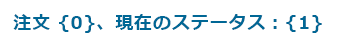

### 参照 {#reference}

この **参照** コンポーネントを使用すると、（現在のインスタンス内の）AEM Web サイトの別のページからテキストを参照できます。 参照先の段落の内容は、現在のページ上にあるかのように表示されます。 ソース段落が変更されると、コンテンツが更新されます（ページの更新が必要になる場合があります）。

* **段落参照**

   * **参照**

      参照するページと段落のパスを指定します（コンテンツを含む）。

段落のパスを指定するには、（ページへの）パスに次のサフィックスを付ける必要があります。

`.../jcr:content/par/<paragraph-ID>`

次に例を示します。

`/content/geometrixx-outdoors/en/equipment/biking/cajamara/jcr:content/par/similar-products`

特定の段落を参照する以外に、パスを変更して par-system 全体を指定することもできます。 パスに次のサフィックスを付けます。

`/jcr:content/par`

次に例を示します。

`/content/geometrixx-outdoors/en/equipment/biking/cajamara/jcr:content/par`

設定後、コンテンツはソースページと同じように表示されます。 参照であるという事実は、編集用にコンポーネントを開いた場合にのみ表示されます。

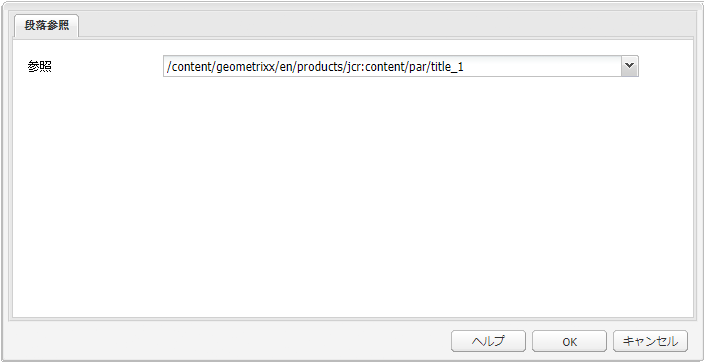

### 検索 {#searching}

検索コンポーネントで、ページに検索機能を追加します。

次の項目を設定できます。

* 検索

   * **ノードタイプ**

      検索を特定のノードタイプに制限する場合は、ここにリストします（例：`cq:Page`）。

   * **検索場所のパス**

      検索するブランチのルートページを指定します。

   * **「検索」ボタンのテキスト**

      実際の検索ボタンに表示する名前。

   * **統計テキスト**

      検索結果の上に表示するテキスト。

   * **結果テキストがありません**

      結果がない場合、ここに入力したテキストが表示されます。

   * **テキストをスペルチェック**

      誰かが類似の用語を入力すると、その用語の前にこのテキストが表示されます。
例えば、 `Geometrixxe`」と表示されます。 Geometrixx&quot;.

   * **同様のページテキスト**

      類似のページの結果の横に表示されるテキスト。 画像の一部をクリップアウトするには、このリンクをクリックします。

   * **関連する検索テキスト**

      検索の横に表示される、関連する用語とトピックのためのテキスト。

   * **検索トレンドのテキスト**

      ユーザーが入力する検索用語の上のタイトル。

   * **結果ページラベル**

      このリストの下部に表示するテキスト。他の結果ページへのリンクが設定されます。

   * **前のラベル**

      前の検索ページへのリンクに表示される名前。

   * **次のラベル**

      次の検索ページへのリンクに表示される名前。

次の例は、検索コンポーネントで標準インストールのルートディレクトリから *`geometrixx`* という単語を検索した後の状態を示しています。また、結果のページネーションも示します。


次に、スペルミスがあり使用できない検索用語の例を示します。

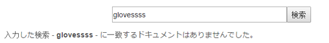

### サイトマップ {#sitemap}

自動サイトマップリスト。（デフォルト設定で）現在の Web サイトのすべてのページが（アクティブなリンクとして）一覧表示されます。 例えば、次のような抽出があります。


必要に応じて、次の項目を設定できます。

* **サイトマップ**

   * **ルートパス**

      リストを開始するパス。

### Slideshow {#slideshow}

このコンポーネントを使用すると、一連の画像を読み込んで、ページにスライドショーとして表示できます。 画像を追加または削除し、それぞれにタイトルを割り当てることができます。 「詳細」では、表示領域のサイズも指定できます。

次の項目を設定できます。

* **スライド**

   * **新しいスライド**

      「**追加**」（および「**削除**」）ボタンを使用して、スライドを選択して指定できます。

   * **タイトル**

      必要に応じてタイトルを指定します。 このタイトルは、該当するスライドに重ねて表示されます。

* **詳細**

   * **サイズ**

      幅と高さをピクセル単位で指定します。

次に、スライドショーコンポーネントは、次のスライドにフェードインする前に、それぞれを短時間連続して繰り返し表示します。


### テーブル {#table}

>[!NOTE]
>
>この **テーブル** コンポーネントは [リッチテキストエディター](/help/sites-classic-ui-authoring/classic-page-author-rich-text-editor.md)、 **[テキスト](#text)** コンポーネント。
>
>Adobeでは、 **テーブル** テーブルのコンポーネント ( ただし、 **テキスト** コンポーネント。

この **テーブル** コンポーネントは、テーブルの作成、塗りつぶし、書式設定を行うために事前に設定されています。 このダイアログを使用すると、テーブルを設定してコンテンツを一から作成したり、Excel、OpenOffice、メモ帳などの外部エディターからスプレッドシートやテーブルをコピー&amp;ペーストしたりできます。

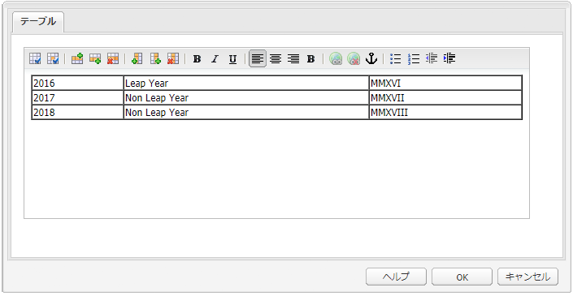

次の画面ショットは、テーブルコンポーネントの例を示します。サイト専用の CSS でデザインを決定しています。


### タグクラウド {#tag-cloud}

タグクラウドは、Web サイト内のコンテンツに適用されたタグのグラフィカルな選択範囲を表示します。


タグクラウドコンポーネントを設定する場合、次の情報を指定できます。

* **表示するタグ**
表示するタグを収集する場所。ページ（すべての子またはすべてのタグを含むページ）から選択します。

* **ページ**
参照するページを選択します。

* **タグにリンクがありません**
表示するタグがリンクとして機能するかどうかを指定します。

タグの適用について詳しくは、 [タグの使用](/help/sites-classic-ui-authoring/classic-feature-tags.md).

### テキスト {#text}

>[!NOTE]
>
>この **テキスト** コンポーネントは [リッチテキストエディター](/help/sites-classic-ui-authoring/classic-page-author-rich-text-editor.md)、 **[テーブル](#table)** コンポーネント。
>
>Adobeでは、 **テーブル** テーブルのコンポーネント ( ただし、 **テキスト** コンポーネント。

テキストコンポーネントを使用すると、WYSIWYG エディターを使用してテキストブロックを入力できます。このエディターには、 [リッチテキストエディター](/help/sites-classic-ui-authoring/classic-page-author-rich-text-editor.md).選択可能なアイコンにより、フォントの特性、配置、リンク、リスト、インデントなど、テキストの書式を設定できます。

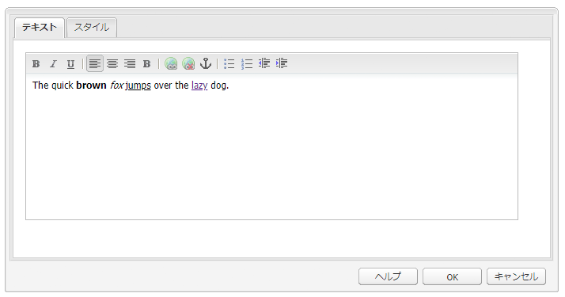

を開くと、 **スタイル** タブ **編集** ダイアログでは、次の設定も可能です。

* **スペーサー**
* **テキストスタイル**

書式設定されたテキストがページに表示されます。 実際のデザインはサイトの CSS に応じて異なります。


テキストコンポーネントおよびリッチテキストエディターの機能について詳しくは、[リッチテキストエディター](/help/sites-classic-ui-authoring/classic-page-author-rich-text-editor.md)のページを参照してください。

#### インプレース編集 {#inplace-editing}

ダイアログベースのリッチテキスト編集モードに加えて、AEMには次の機能があります。 [インプレース編集](/help/sites-authoring/editing-content.md)：ページのレイアウトに表示されるテキストを直接編集できます。

### テキストと画像 {#text-image}

テキストと画像コンポーネントは、テキストブロックと画像を追加します。 また、テキストと画像を個別に追加および編集することもできます。 詳しくは、 [テキスト](#text) および [画像](#image) コンポーネントを参照してください。

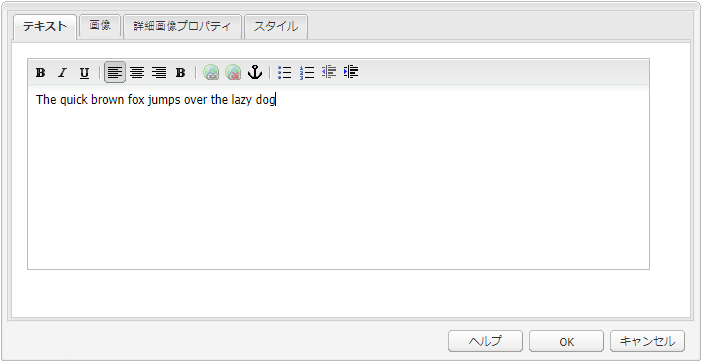 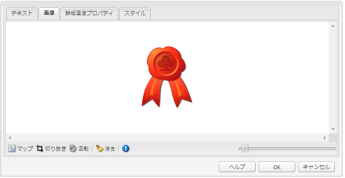

次の項目を設定できます。

* **コンポーネントスタイル**（**スタイル**）

   ここで画像を左揃えまたは右揃えにすることができます。デフォルトは、画像を左に配置する「**左**」です。

* **画像のプロパティ**（**詳細画像プロパティ**）

   以下を指定できます。

   * **画像アセット**

      必要な画像をアップロードします。

   * **タイトル**

      ブロックのタイトル。 マウスオーバーで表示されます。

   * **代替テキスト**

      画像を表示できない場合に表示する代替テキスト。 空白の場合、タイトルが使用されます。

   * **リンク先**

      ターゲットパスを指定します。

   * **説明**

      画像の説明。

   * **サイズ**

      画像の高さと幅を設定します。

次の例は、画像を左揃えで表示するテキスト画像コンポーネントを示しています。


### タイトル {#title}

タイトルコンポーネントは、次のいずれかを実行できます。

* 「タイトル」フィールドを空白のままにして、現在のページの名前を表示します。
* 「タイトル」フィールドに指定したテキストを表示します。

次の項目を設定できます。

* **タイトル**

   ページタイトル以外の名前を使用する場合は、ここに入力します。

* **リンク**

   タイトルがリンクとして動作する場合の URI。

* **種類／サイズ**

   ドロップダウンリストから「小」または「大」を選択します。 小は画像として生成されます。 「大」はテキストとして生成されます。

次の例は、 **タイトル** 表示されるコンポーネント。デザインはサイト固有の CSS で決まります。


### ビデオ {#video}

この **ビデオ** コンポーネントを使用すると、事前に定義された標準提供ビデオ要素をページに配置できます。

関連トピック [ビデオプロファイルの設定](/help/sites-administering/config-video.md#configuringvideoprofiles) HTML5 要素で使用

ページにコンポーネントのインスタンスを配置した後、次の設定をおこなうことができます。

* ビデオ

   * **ビデオアセット**

      ビデオアセットをアップロードまたはドロップします。

   * **サイズ**

      ビデオのネイティブサイズ ( 幅 x 高さ（ピクセル単位）) は、「サイズ」の横のボックスに表示されます（上記を参照）。 ビデオのネイティブ寸法を上書きする場合は、幅と高さの寸法を手動で入力します。選択 **OK** ダイアログを閉じます。

>[!NOTE]
>
>サポートされている形式は次のとおりです。
>
>* `.mp4`
>* `Ogg`
>* `FLV` （Flash ビデオ）
>


## 列 {#columns}

列は、AEMのコンテンツのレイアウトを制御するメカニズムです。 標準のインストールでは、2 列または 3 列を作成するためのコンポーネントが提供されます。

次の例は、2 つの列と 3 つの列のコンポーネントが使用されている状態を示しています。 新しいコンポーネントのプレースホルダーを使用できます。

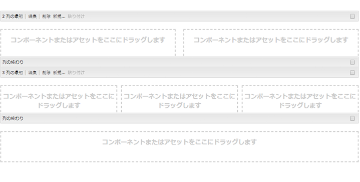

### 2 列 {#columns-1}

2 つの等しい列をデフォルトに設定する列制御コンポーネント。

### 3 列 {#columns-2}

3 つの等しい列をデフォルトに設定する列制御コンポーネント。

### 列の制御 {#column-control}

列の制御コンポーネントを使用すると、Web ページのメインパネルのコンテンツを複数の列に分割する方法を選択できます。 ユーザーは、必要な列数（事前定義済みのリストから）を選択し、各列内でコンテンツを作成、削除または移動できます。

* **列の制御**

   * **列のレイアウト**

      レンダリングする列数を選択します。 作成した各列には、コンテンツの追加時にコンポーネントやアセットをドラッグするための独自のリンクがあります。

## フォーム {#form}

フォームコンポーネントは、訪問者が入力を送信するためのフォームを作成するために使用します。 Formsおよびフォームコンポーネントを使用して、ユーザーのフィードバック（例えば、顧客満足度アンケート）やユーザー情報（例えば、ユーザー登録）などの情報を収集できます。

>[!NOTE]
>
>詳しくは、 [AEM Forms Help](/help/forms/home.md) AEM Formsの詳細

Formsは、次の複数の異なるコンポーネントから構築されています。

* **フォーム**

   フォームコンポーネントは、ページ上の新しいフォームの開始と終了を定義します。 その後、テーブルやダウンロードなど、他のコンポーネントをこれらの要素の間に配置できます。

* **フォームのフィールドと要素**

   フォームのフィールドと要素には、テキストボックス、ラジオボタン、画像を含めることができます。 多くの場合、ユーザーは、テキストの入力など、フォームフィールド内のアクションを完了します。 詳しくは、個々のフォームエレメントを参照してください。

* **プロファイルコンポーネント**

   プロファイルコンポーネントは、訪問者のパーソナライゼーションが必要なソーシャルコラボレーションやその他の領域に使用される訪問者プロファイルに関連しています。

次に、フォームの例を示します。 これは、 **フォーム** コンポーネント（開始および終了）、2 つ **フォーム** **テキスト** 入力に使用するフィールド **一般** **テキスト** リードインテキストと **送信** 」ボタンをクリックします。


>[!NOTE]
>
>フォームの開発とカスタマイズに関する情報については、 [Formsページの開発](/help/sites-developing/developing-forms.md). このフォームのカスタマイズには、アクション、制約、プリロードフィールドの追加、スクリプトを使用したサービスのアクション呼び出しなどが含まれます。

### （多数の）フォームコンポーネントに共通の設定 {#settings-common-to-many-form-components}

各フォームコンポーネントの目的は異なりますが、多くのコンポーネントは同様のオプションとパラメーターで構成されています。

フォームコンポーネントを設定する際に、ダイアログで次のタブを使用できます。

* **タイトルとテキスト**

   ここでは、フォームのタイトルや付随するテキストなど、基本情報を指定する必要があります。 また、必要に応じて、フィールドが複数選択可能かどうかや、選択可能な項目など、他の重要な情報を定義できます。

* **初期値**

   デフォルト値を指定できます。

* **制約**

   ここでは、フィールドが必須かどうかを指定し、数値などの制約をそのフィールドに配置できます。

* **スタイル設定**

   フィールドのサイズとスタイルを示します。

>[!NOTE]
>
>表示されるフィールドは、個々のコンポーネントによって大きく異なります。

これらのタブには、必要なパラメーターが表示されます。 タブは、個々のコンポーネントタイプに応じて異なりますが、次のタブを含めることができます。

* **タイトルとテキスト**

   * **要素名**

      フォーム要素の名前。 リポジトリ内でデータが格納される場所を示します。
このフィールドは必須で、次の文字のみを含める必要があります。

      * 英数字
      * `_ . / : -`
   * **タイトル**

      フィールドと共に表示されるタイトル。 空白の場合、デフォルトのタイトルが表示されます。

   * **説明**

      必要に応じて、ユーザーに追加情報を提供できます。 フォームでは、この説明がフィールドの下に、タイトルよりも小さいフォントで表示されます。

   * **表示／非表示**

      フィールドを表示するタイミングを指定します。


* **初期値**

   * **デフォルト値**

      フォームが開かれたときにフィールドに表示される値。 つまり、ユーザーが入力を行う前です。

* **制約**

   * **必須**

      この制約は、フォームコンポーネントのタイプに依存しますが、このフィールドが必須であるか、このフィールドの特定の部分が必須であることを示す 1 つ以上のクリックボックスが用意されています。

   * **必須メッセージ**

      このフィールドが必須であることをユーザーに通知するメッセージです。 必須フィールドにはアスタリスクが付いています。

   * **制約**

      選択に使用できる制約は、フォームコンポーネントのタイプによって異なります。

   * **制約メッセージ**

      どの入力が必須かをユーザーに知らせるメッセージ。

* **スタイル設定**

   * **サイズ**

      行数と列数。

   * **幅**

      ピクセル数。

   * **CSS**

### フォーム（コンポーネント） {#form-component}

フォームコンポーネントは、 **フォーム開始** および **フォーム終了** 要素。 フォームが正しく定義されるよう、開始要素と終了要素が常にペアになっています。

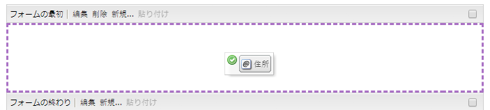

フォームの開始と終了の間に、ユーザーが実際に入力するフィールドを定義するフォームコンポーネントを追加できます。

#### フォームの最初 {#start-of-form}

この必要なコンポーネントは、ページ上の新しいフォームの開始を定義します。 次の項目を設定できます。

* **フォーム**

   * **Thank You ページ**

      訪問者に入力を求める際に、感謝の意を表すために参照されるページ。 空白の場合、フォームは送信後に再表示されます。

   * **ワークフローを開始**

      フォームが送信されるとトリガーされるワークフローを決定します。

* **詳細**

   * **アクションタイプ**

      フォームにはアクションが必要です。アクションは、ユーザーから送信されたデータによってトリガーされ実行される処理を定義します（HTML の action= に似ています）。対応する&#x200B;**アクションの設定**&#x200B;が必要です。

      標準の AEM インストールには、次のアクションタイプが含まれます。

      * **アカウントリクエスト**
      * **コンテンツを作成**
      * **リードを作成**
      * **アカウントを作成および更新**
      * **メールサービス : 購読者を作成してリストに追加**
      * **メールサービス : 自動応答のメールを送信**
      * **メールサービス : リストのユーザーの購読を解除**
      * **コミュニティを編集**
      * **リソースを編集**
      * **ワークフロー制御リソースの編集**
      * **メール**
      * **注文の詳細**
      * **プロファイルの更新**
      * **パスワードをリセット**
      * **パスワードを設定**
      * **コンテンツを格納**

         デフォルトのアクションタイプ。

      * **コンテンツをアップロードで保存**
      * **注文を送信**
      * **購読者の登録を解除**
      * **注文を更新**
   * **フォーム識別子**

      フォーム識別子は、フォームを一意に識別します。1 つのページに複数のフォームがある場合、フォーム識別子を使用します。フォームごとに異なる識別子が使用されていることを確認します。

   * **読み込み元パス**

      フォームフィールドに定義済みの値を読み込むために使用されるノードプロパティへのパス。
このフィールドはオプションで、リポジトリ内のノードへのパスを指定します。 このノードにフィールド名と一致するプロパティがある場合、フォーム上の適切なフィールドには、これらのプロパティの値がプリロードされます。 一致が存在しない場合、フィールドにはデフォルト値が使用されます。
**読み込み元パス**&#x200B;を使用して、フォームの必須フィールドに値をプリロードすることができます。[フォーム値のプリロード](/help/sites-developing/developing-forms.md#preloading-form-values)を参照してください。

   * **クライアントの検証**

      このフォームでクライアントの検証が必須かどうかを示します（サーバーの検証は常に行われます）*。*&#x200B;検証は、 **Forms Captcha** コンポーネント。

   * **検証リソースタイプ**

      （それぞれのフィールドではなく）フォーム全体を検証する場合、フォームの検証リソースのタイプを定義します。フォーム全体を検証する場合は、次のいずれかも含めます。

      * クライアントの検証用スクリプト：

         `/apps/<myApp>/form/<myValidation>/formclientvalidation.jsp`

      * サーバー側の検証用スクリプト：

         `/apps/<myApp>/form/<myValidation>/formservervalidation.jsp`
   * **アクションの設定**

      で使用できるオプション **アクションの設定** 選択した項目に基づく **アクションタイプ**:

      * **アカウントリクエスト**

         * **アカウントページを作成**
アカウントの作成時に使用されるページ。
      * **コンテンツを作成**

         * コンテンツのパス
フォームがダンプするコンテンツのコンテンツパス。スラッシュ（`/`）で終わるパスを入力します。スラッシュは、フォームのポートごとに、特定の場所に新しいノードが作成されることを意味します。例は次のとおりです。
            `/forms/feedback/`

         * **タイプ**

            必要な種類を選択します。

         * **フォーム**

            フォームを指定します。

         * **次を使用してレンダリング**

            リストから必要なオプションを選択します。

         * **リソースタイプ**

            設定した場合、各コメントには次のように追加されます。 `sling:resourceType`

         * **表示セレクター**
      * **リードを作成**

         * **このリストにリードが追加されます**
必要なリードリストを指定します。
      * **アカウントを作成および更新**

         * **初期グループ**

            新しいユーザーを割り当てるグループ。

         * **ホーム**

            ログイン成功後に表示するページ。

         * **パス**

            新しいアカウントが作成され、保存される場所の相対パス。

         * **データを表示...**

            「 」ボタンを選択して、Bulk Editor でフォームの結果に関する情報にアクセスできます。 ここから情報を `.tsv`（タブ区切り）ファイルに書き出すことができます（このファイルは Excel スプレッドシートなどで使用することができます）。
      * **メール**

         * **送信元**

            電子メールの送信元の電子メールアドレスを入力します。

         * **宛先**

            フォームの送信先の電子メールアドレスを 1 つ以上入力します。

         * **CC**

            1 つ以上の CC 電子メールアドレスを入力します。

         * **BCC**

            1 つ以上の BCC 電子メールアドレスを入力します。

         * **件名**

            電子メールの件名を入力します。
      * **パスワードのリセット**

         * **パスワード変更ページ**

            パスワードの変更時に使用するページ。
      * **コンテンツの格納**

         * **コンテンツのパス**

            フォームがダンプするコンテンツのコンテンツパス。スラッシュ（`/`）で終了するパスを入力します。スラッシュは、フォームのポートごとに、特定の場所に新しいノードが作成されることを意味します。例は次のとおりです。
            `/forms/feedback/`

         * **データを表示...**

            「 」ボタンを選択して、Bulk Editor でフォームの結果に関する情報にアクセスできます。 ここから情報を .tsv（タブ区切り）ファイルに書き出すことができます（Excel スプレッドシートなどで使用するため）。
      * **コンテンツをアップロードデータと共に保存**

         と同じオプションがあります **コンテンツを保存**.

      * **購読者の登録を解除**

         * **このリストからリードが削除されます**

            必要なリードリストを指定します。


#### フォームの終わり {#end-of-form}

フォームの終わりを示します。 次の項目を設定できます。

* **フォーム終了**

   * **「送信」ボタンを表示**

      [ 送信 ] ボタンを表示するかどうかを示します。

   * **送信名**

      フォームで複数の送信ボタンを使用する場合の識別子。

   * **送信タイトル**

      「送信」や「送信」など、ボタンに表示される名前です。

   * **「リセット」ボタンを表示**

      このチェックボックスを選択すると、リセットボタンが表示されます。

   * **リセットタイトル**

      [ リセット ] ボタンに表示される名前です。

   * **説明**

      ボタンの下に表示される情報。

### アカウント名 {#account-name}

ユーザーはアカウント名を入力できます。


### アドレス {#address}

以下の形式の国際住所フィールドを追加できます。

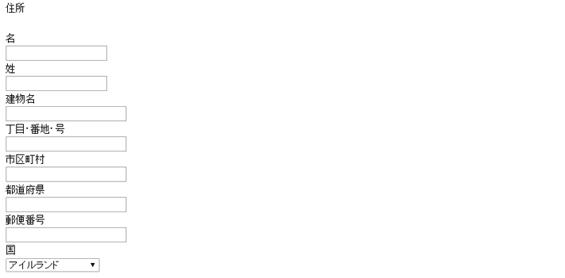

コンポーネントはすぐに使用できるように設定されていますが、必要に応じて設定を変更できます。 例えば、アドレスの個々の要素に対して制約を追加できます。 フィールドを空のままにすると、デフォルト設定が使用されます。

### Captcha {#captcha}

Captcha コンポーネントでは、画面に表示される英数字の文字列を入力する必要があります。 文字列は、更新するたびに変更されます。


このコンポーネントの様々なパラメーターを設定できます。例えば、Captcha 文字列が無効な場合に表示するメッセージを設定できます。

### チェックボックスグループ {#checkbox-group}

チェックボックスを使用すると、1 つ以上のチェックボックスのリストを構築できます。チェックボックスでは同時に複数の項目を選択できます。

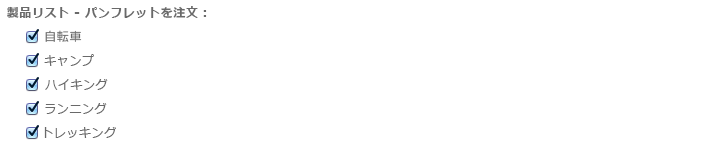

タイトル、説明、要素名など、様々なパラメーターを指定できます。 「+」ボタンと「 — 」ボタンを使用して、項目の追加や削除を行い、上下の矢印で配置します。

>[!NOTE]
>
>使用 **項目読み込みパス** チェックボックスグループのリストに値をプリロードできます。
>
>[フォームフィールドへの複数値のプリロード](/help/sites-developing/developing-forms.md#preloading-form-fields-with-multiple-values)を参照してください。

### クレジットカードの詳細 {#credit-card-details}

クレジットカードの詳細を入力するために必要なフィールドを指定できます。 受け入れるカードのタイプと必要な情報（セキュリティコードなど）を指定するように設定できます。


### ドロップダウンリスト {#dropdown-list}

ドロップダウンリストは、使用する選択肢の値の範囲を設定できます。


リストに表示するタイトルと項目を指定できます。 「+」ボタンと「 — 」ボタンを使用して、リスト項目の追加や削除を行い、上下のボタンを使用して配置します。 ユーザーがリストから複数の項目を選択できるかどうか、およびリストを初めて開いたときに自動的に選択される項目（初期値）を指定できます。

>[!NOTE]
>
>使用 **項目読み込みパス** ドロップダウンリストに値をプリロードできます。
>
>[フォームフィールドへの複数値のプリロード](/help/sites-developing/developing-forms.md#preloading-form-fields-with-multiple-values)を参照してください。

### ファイルのアップロード {#file-upload}

ファイルのアップロードコンポーネントを使用すると、ユーザーがファイルを選択してアップロードできるようになります。

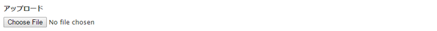


### 非表示のフィールド {#hidden-field}

このコンポーネントを使用すると、非表示のフィールドを作成できます。 これらの非表示フィールドは、様々な目的に使用できます。例えば、フォームの送信後にアクションを実行する必要がある場合や、後処理で非表示のデータが必要な場合などです。


>[!NOTE]
>
>また、フォーム内の他のフィールドの値に応じて、特定のフォームコンポーネントの表示と非表示を切り替えるようにフォームをカスタマイズすることもできます。 フォームフィールドの表示/非表示を変更すると、特定の条件でのみフィールドが必要な場合に便利です。
>
>詳しくは、 [フォームコンポーネントの表示と非表示](/help/sites-developing/developing-forms.md#showing-and-hiding-form-components).

### 画像ボタン {#image-button}

画像ボタンを使用すると、独自の画像とテキストを含むボタンを作成できます。


### 画像のアップロード {#image-upload}

画像のアップロードコンポーネントを使用すると、ユーザーが画像ファイルを選択してアップロードできるようになります。


### リンクフィールド {#link-field}

ユーザーは、リンクフィールドを使用して URL を指定できます。


最も一般的に使用されるのはカレンダーイベントフォームです。このフォームはイベントの URL/リンクフィールドに使用されます。

### パスワードフィールド {#password-field}

ユーザーが自分のパスワードを入力できるようにします。


### パスワードリセット {#password-reset}

このコンポーネントは、次の 2 つのフィールドをユーザーに提供します。

* パスワードの入力
* 入力が正しいことを確認するために、パスワードを繰り返し入力しました。

デフォルト設定では、コンポーネントは次のように表示されます。


### ラジオグループ {#radio-group}

ラジオグループは、1 つ以上のラジオチェックボックスのリストを提供します。特定の時点で選択できるのは、そのうち 1 つのみです。

要素名とタイトルおよび説明を指定できます。 必要に応じて、「+」ボタンと「 — 」ボタンを使用して、項目の追加や削除、上下の矢印による配置、デフォルト値の指定を行うことができます。


>[!NOTE]
>
>**項目読み込みパス**&#x200B;を使用して、ラジオグループと値をプリロードすることができます。
>
>[フォームフィールドへの複数値のプリロード](/help/sites-developing/developing-forms.md#preloading-form-fields-with-multiple-values)を参照してください。

### 送信ボタン {#submit-button}

このコンポーネントを使用すると、デフォルトのテキストを指定した送信ボタンを作成できます。


または、独自のテキストも指定できます。

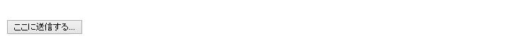

### タグフィールド {#tags-field}

このフィールドでは、タグを選択できます。


専用のタブを使用して、使用できる名前空間など、様々なパラメーターを指定できます。

* **タグフィールド**

   * **許可された名前空間**

      * **Geometrixx Outdoors**
      * **ワークフロー**
      * **フォーラム**
      * **フォトグラフィー**
      * **Geometrixx Media**
      * **標準タグ**
      * **マーケティング**
      * **アセットのプロパティ**
   * **ピクセル単位の幅**
   * **ポップアップのサイズ**


### テキストフィールド {#text-field}

標準テキストフィールドは、必要なサイズに合わせて設定でき、メッセージ内の独自のリードを使用できます。


### ワークフロー送信ボタン {#workflow-submit-button-s}

ワークフローで使用する「送信」ボタンを作成できます。


