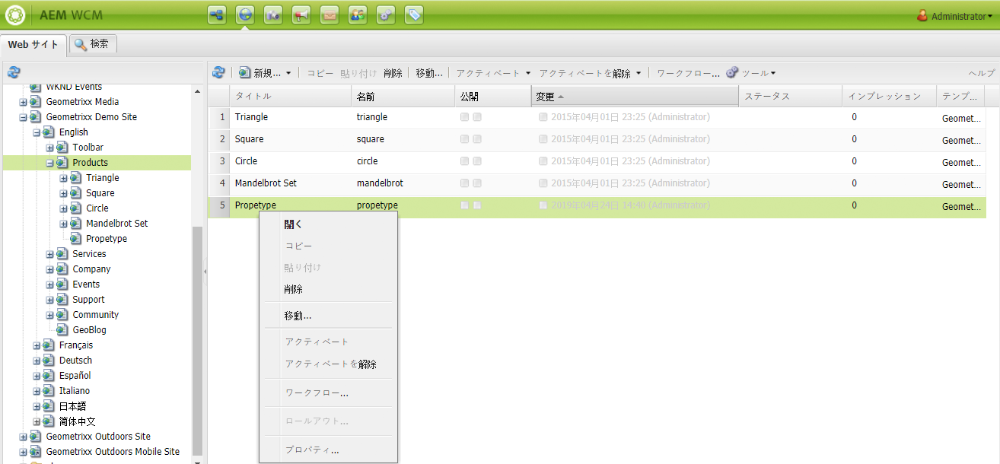
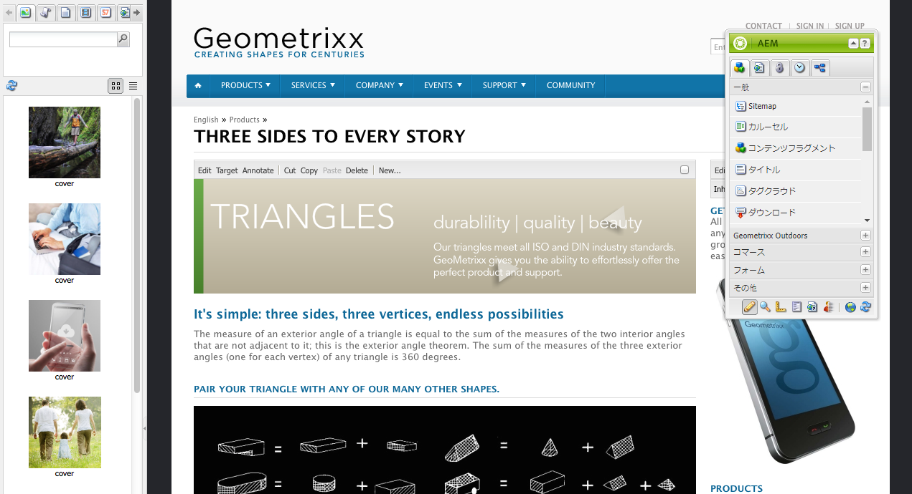
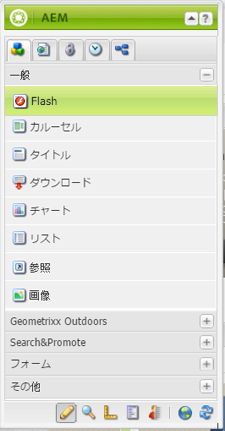
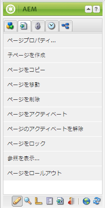
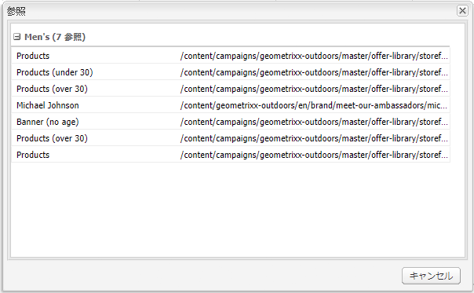
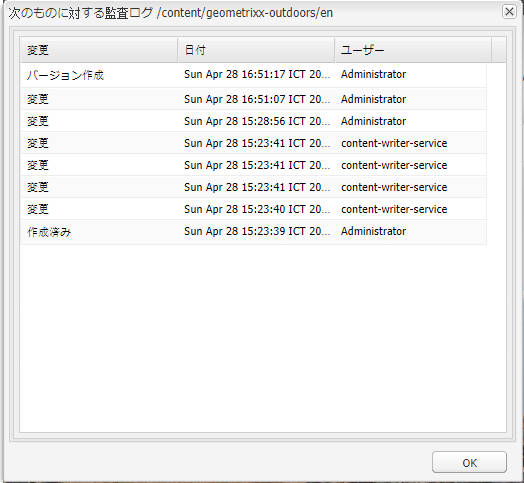

# オーサリング - 環境とツール {#authoring-the-environment-and-tools}

AEM のオーサリング環境は、コンテンツを編成および編集するための様々なメカニズムを提供しています。提供されるツールには、様々なコンソールおよびページエディターからアクセスします。

## サイト管理 {#site-administration}

**Web サイト**&#x200B;コンソールを使用すると、Web サイトを管理したり、Web サイト内を移動したりできます。2 つのペインを使用して、Web サイトの構造を拡張したり、必要な要素に対しアクションをおこなうことができます。

## ページコンテンツの編集 {#editing-your-page-content}

クラシック UI には、コンテンツファインダーとサイドキックを利用する個別のページエディターがあります。

`https://localhost:4502/cf#/content/geometrixx/en/products/triangle.html`

## ヘルプへのアクセス {#accessing-help}

AEM から様々な&#x200B;**ヘルプ**&#x200B;リソースに直接アクセスできます。

[コンソールツールバーからヘルプに](/help/sites-classic-ui-authoring/author-env-basic-handling.md#accessing-help)アクセスするほかにも、サイドキックから（？アイコンを使用して）ページ編集中にアクセスできます。

または、特定のコンポーネントの編集ダイアログの&#x200B;**ヘルプ**&#x200B;ボタンを使用してアクセスできます。これにより、コンテキスト依存のヘルプが表示されます。

## サイドキック {#sidekick}

サイドキックの「**コンポーネント**」タブでは、現在のページに追加可能なコンポーネントを閲覧できます。目的のグループを展開して、コンポーネントをページ上の必要な位置までドラッグできます。

## コンテンツファインダー {#the-content-finder}

コンテンツファインダーを使用すると、ページを編集しているときに、リポジトリ内のアセットやコンテンツをすばやく簡単に見つけることができます。

コンテンツファインダーを使用して、幅広いリソースを検索できます。適宜、次の項目をドラッグしてページ上の段落にドロップできます。

* [画像](#finding-images)
* [ドキュメント](#finding-documents)
* [ムービー](#finding-movies)
* [Scene 7 メディアブラウザー](/help/sites-administering/scene7.md#scene7contentbrowser)
*  [ページ](/help/sites-classic-ui-authoring/classic-page-author-env-tools.md#finding-pages)

* [段落](#referencing-paragraphs-from-other-pages)
* [製品](/help/sites-classic-ui-authoring/classic-page-author-env-tools.md#products)
* または、[リポジトリ構造から Web サイトを参照](#the-content-finder)できます

すべてのオプションについて、[特定の項目を検索](#the-content-finder)できます。

### 画像の検索 {#finding-images}

このタブには、リポジトリ内の画像が一覧表示されます。

ページで画像の段落を作成したら、その段落に項目をドラッグ＆ドロップできます。

### ドキュメントの検索 {#finding-documents}

このタブには、リポジトリ内のドキュメントが一覧表示されます。

ページでダウンロードの段落を作成したら、その段落に項目をドラッグ＆ドロップできます。

### ムービーの検索 {#finding-movies}

このタブには、リポジトリ内のムービー（Flash 項目など）が一覧表示されます。

ページで適切な段落（Flash など）を作成したら、その段落に項目をドラッグ＆ドロップできます。

### 製品 {#products}

このタブには、商品が一覧表示されます。ページで適切な段落（商品など）を作成したら、その段落に項目をドラッグ＆ドロップできます。

### ページの検索 {#finding-pages}

このタブには、すべてのページが表示されます。任意のページを重複クリックして、編集用に開きます。

### 他のページからの段落の参照 {#referencing-paragraphs-from-other-pages}

このタブを使用すると、他のページを検索できます。そのページのすべての段落が一覧表示されます。段落を現在のページにドラッグできます。これにより、元の段落への参照が作成されます。

### リポジトリの一覧表示の使用 {#using-the-full-repository-view}

このタブには、リポジトリ内のすべてのリソースが一覧表示されます。

### コンテンツブラウザーでの検索の使用 {#using-search-with-the-content-browser}

すべてのオプションについて、特定の項目を検索できます。検索パターンに一致するタグとリソースが一覧表示されます。

検索にワイルドカードを使用することもできます。サポートされているワイルドカードは、次のとおりです。

* `*`0 個または 1 個以上の連続した文字に一致します。

* `?`1 個の文字に一致します。

>[!NOTE]
>
>ワイルドカード検索を実行するには、擬似プロパティの「name」を使用する必要があります。

例えば、次の名前の画像がある場合、

`ad-nmvtis.jpg`

以下の検索パターンで、この画像（およびこのパターンに一致するその他の画像）が見つかります。

* `name:*nmv*`
* `name:AD*`
文字の一致では ** 、大文字と小文字が区別されません。

* `name:ad?nm??is.*`
クエリには、任意の数のワイルドカードを使用できます。

>[!NOTE]
>
>You can also use [SQL2](https://helpx.adobe.com/experience-manager/6-5/sites/developing/using/reference-materials/javadoc/org/apache/jackrabbit/commons/query/sql2/package-summary.html) search.

## 参照の表示 {#showing-references}

AEM では、現在作業しているページにリンクしているページを表示できます。

直接ページ参照を表示するには：

1. サイドキックで、「**ページ**」タブのアイコンを選択します。

   

1. Select **Show References...** AEM opens the References window and displays which pages refer to the selected page, including their paths.

   

状況によっては、サイドキックから次のようなアクションを追加で実行できます。

* [ローンチ](/help/sites-classic-ui-authoring/classic-launches.md)
* [ライブコピー](/help/sites-administering/msm.md)

* [ブループリント](/help/sites-administering/msm-best-practices.md)

その他の[ページ間の関係は Web サイトコンソールから確認できます](/help/sites-classic-ui-authoring/author-env-basic-handling.md#page-information-on-the-websites-console)。

## 監査ログ {#audit-log}

**監査ログ**&#x200B;には、サイドキックの「**情報**」タブからアクセスできます。ここには、現在のページで実行された最近のアクションが一覧表示されます。次に例を示します。

## ページ情報 {#page-information}

The Website console also [provides information about the current status of the page](/help/sites-classic-ui-authoring/author-env-basic-handling.md#page-information-on-the-websites-console) such as publication, modification, locked, livecopy, etc.

## ページモード {#page-modes}

クラシック UI でページを編集中に、サイドキックの下部のアイコンを使用して次のモードにアクセスできます。

サイドキックの下部に並ぶ 1 行のアイコンは、ページを操作するモードの切り替えに使用します。

* [編集](/help/sites-classic-ui-authoring/classic-page-author-edit-mode.md)
デフォルトのモードであり、ページの編集、コンポーネントの追加または削除、およびその他の変更をおこなうことができます。

* [プレビュー](/help/sites-classic-ui-authoring/classic-page-author-edit-content.md#previewing-pages)
このモードを使用すると、ページが Web サイトで最終的にどのように表示されるかをプレビューできます。

* [デザイン](/help/sites-classic-ui-authoring/classic-page-author-design-mode.md#main-pars-procedure-0)
このモードでは、アクセス可能なコンポーネントを設定して、ページのデザインを編集できます。

>[!NOTE]
>
>その他に次のオプションも利用できます。

>* [基礎モード](/help/sites-classic-ui-authoring/classic-feature-scaffolding.md)
>* [ClientContext](/help/sites-administering/client-context.md)
* Web サイト - Web サイトコンソールを開きます。
* 再読み込み - ページを更新します。

## キーボードショートカット {#keyboard-shortcuts}

様々な[キーボードショートカット](/help/sites-classic-ui-authoring/classic-page-author-keyboard-shortcuts.md)を利用できます。
