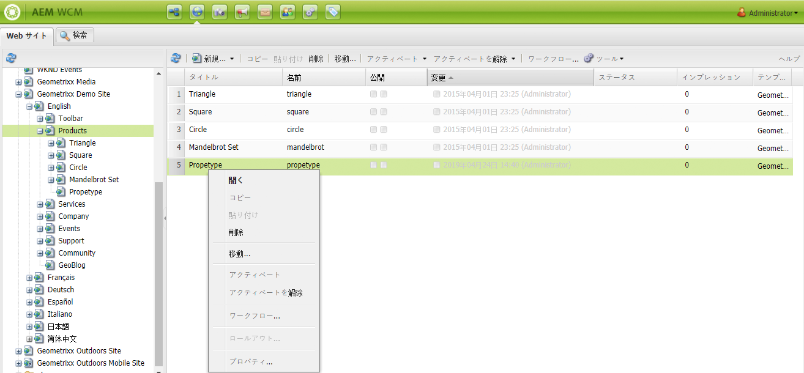
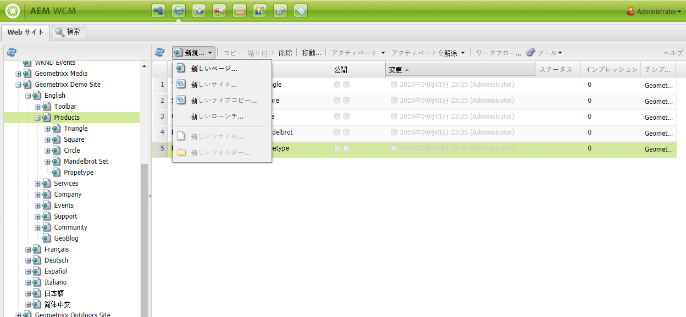
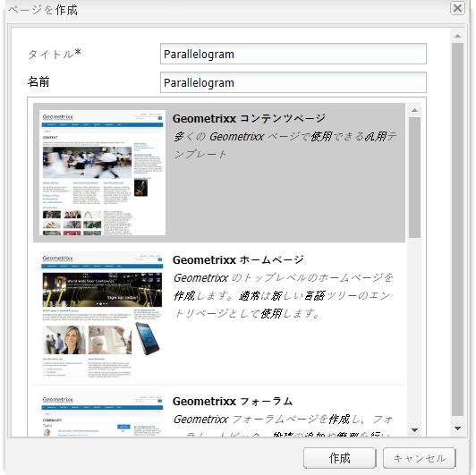
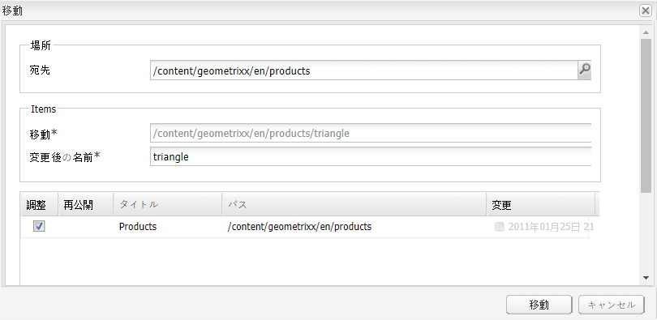
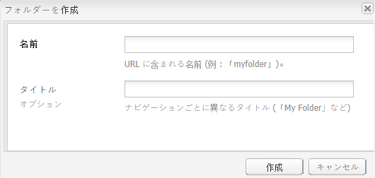

# ページの作成と整理 {#creating-and-organizing-pages}

この節では、Adobe Experience Manager（AEM）でページを作成および管理して、それらのページの[コンテンツを作成](/help/sites-classic-ui-authoring/classic-page-author-edit-content.md)できるようにする方法について説明します。

>[!NOTE]
>
>[適切なアクセス権](/help/sites-administering/security.md)と、ページに対するアクション（作成、コピー、移動、編集、削除など）を実行するための[権限](/help/sites-administering/security.md#permissions)を持つアカウントが必要です。
>
>問題が発生した場合は、システム管理者にお問い合わせください。

## Web サイトの整理 {#organizing-your-website}

作成者は、AEM 内で web サイトを整理する必要があります。この作業中に、次の目的でコンテンツページを作成して名前を付けます。

* 作成者がオーサー環境でコンテンツページを容易に検索できるようにする
* サイトへの訪問者がパブリッシュ環境でコンテンツページを容易に閲覧できるようにする

コンテンツの整理に役立つ[フォルダー](#creating-a-new-folder)を使用することもできます。

Web サイトの構造は、コンテンツページを保持する「*ツリー構造*」と見なすことができます。これらのコンテンツページの名前は、URL の形成に使用されます。一方でタイトルは、ページコンテンツを表示したときに表示されます。

以下は、Geometrixx サイトからの引用です。例として、`Triangle` ページにアクセスする場合を示しています。

* オーサー環境

  `http://localhost:4502/cf#/content/geometrixx/en/products/triangle.html`

* パブリッシュ環境

  `http://localhost:4503/content/geometrixx/en/products/triangle.html`

  インスタンスの設定によっては、パブリッシュ環境での `/content` の利用は必須ではありません。

```xml
  /content
    /geometrixx
      /en
        /toolbar...
        /products
          /triangle
            /overview
            /features
          /square...
          /circle...
          /...
        /...
      /fr...
      /de...
      /es...
      /...
    /...
```

この構成は web サイトのコンソールで表示できます。このコンソールを使用して、[ツリー構造内を移動](/help/sites-classic-ui-authoring/author-env-basic-handling.md#main-pars-text-15)できます。



### ページ命名規則 {#page-naming-conventions}

ページを作成する際の主要なフィールドは 2 つあります。

* **[タイトル](#title)**：

   * これはコンソール内のユーザーに、編集中のページコンテンツの上部に表示されます。
   * このフィールドは必須です。

* **[名前](#name)**：

   * これは URI の生成に使用されます。
   * このフィールドへの入力はオプションです。指定しない場合、名前はタイトルから派生します。

ページを作成するとき、AEM では AEM と JCR によって課された[規則に基づいてページ名が検証](/help/sites-developing/naming-conventions.md)されます。

許可された実装と文字の一覧は UI によってわずかに異なります（タッチ操作対応 UI のほうがより広範）。最小限許可される文字は次のとおりです。

* 「a」から「z」
* 「A」から「Z」
* 「0」から「9」
* _（アンダースコア）
* `-`（ハイフン／マイナス記号）

これらの文字のみを使用すれば、その名前は確実に受け入れられ、使用されます（許可されるすべての文字の完全な詳細が必要な場合は、[命名規則](/help/sites-developing/naming-conventions.md)を参照してください）。

#### タイトル {#title}

ページを作成するときにページの&#x200B;**タイトル**&#x200B;のみを指定した場合、AEM ではページの&#x200B;**名前**&#x200B;がこの文字列から派生され、AEM と JCR によって課された[規則に基づいてページ名が検証](/help/sites-developing/naming-conventions.md)されます。両方の UI とも、「**タイトル**」フィールドに無効な文字を含めることはできますが、派生した名前の無効な文字は別の文字に置き換えられます。例：

| タイトル | 派生した名前 |
|---|---|
| Schön | schoen.html |
| SC%&amp;&amp;ast;ç+ | sc---c-.html |

#### 名前 {#name}

ページを作成するときにページの&#x200B;**名前**&#x200B;を指定すると、AEM では AEM と JCR によって課された[規則に基づいてページ名が検証](/help/sites-developing/naming-conventions.md)されます。

クラシック UI では、「**名前**」フィールドに&#x200B;**無効な文字は入力できません**。

>[!NOTE]
>タッチ操作対応 UI では、「**名前**」フィールドに&#x200B;**無効な文字は指定できません**。AEM で無効な文字が検出されると、そのフィールドは強調表示され、対象の文字を削除または置換する必要があることを示す説明メッセージが表示されます。

>[!NOTE]
>
>ISO-639-1 で定義されているように、2 文字のコードは、それが言語ルートである場合以外は使用しないでください。
>
>詳しくは、[翻訳するコンテンツの準備](/help/sites-administering/tc-prep.md)を参照してください。

### テンプレート {#templates}

AEM では、テンプレートはページの特殊なタイプを指定します。テンプレートは、作成中のあらゆる新規ページの基礎として使用されます。

テンプレートによって、サムネール画像やその他のプロパティなどの、ページの構造が定義されます。例えば、製品ページ、サイトマップおよび問い合わせ先に、それぞれ別のテンプレートを使用することができます。テンプレートは、[コンポーネント](#components)で構成されています。

AEM では、複数のテンプレートが標準提供されています。使用するテンプレートは、個々の Web サイトや、（新しいページの作成時に）指定する必要のある情報によって異なり、また使用される UI によっても異なります。主なフィールドは次のとおりです。

* **タイトル**：生成される Web ページに表示されるタイトルです。

* **名前**：ページに名前を付ける際に使用されます。

* **テンプレート**：新しいページを生成する際に使用できるテンプレートのリストです。

### コンポーネント {#components}

コンポーネントは、AEM で提供される、特定のタイプのコンテンツを追加できる要素です。AEM には、すぐに使用できるコンポーネントが幅広く付随しており、次のような包括的な機能が提供されています。

* テキスト
* 画像
* スライドショー
* ビデオ
* その他

ページを作成して開くと、[サイドキック](/help/sites-classic-ui-authoring/classic-page-author-env-tools.md#sidekick)から使用可能な[コンポーネントを使用してコンテンツを追加](/help/sites-classic-ui-authoring/classic-page-author-edit-content.md#insertinganewparagraph)できます。

## ページの管理 {#managing-pages}

### 新しいページの作成 {#creating-a-new-page}

コンテンツの作成を開始する前に、事前に各ページが作成されていない場合は、ページを作成する必要があります。

1. **Web サイト**&#x200B;コンソールから、ページを作成するレベルを選択します。

   次の例では、左側のパネルに表示される&#x200B;**製品**&#x200B;レベルの下にページを作成します。右側のパネルでは、**製品**&#x200B;レベルに既に存在しているページが表示されます。

   

1. **新規...** メニュー（「**新規...**」の横の矢印をクリック）で、「**新しいページ...**」を選択します。**ページを作成**&#x200B;ウィンドウが開きます。

   「**新規**」自体をクリックして、「**新しいページ**」オプションを直接開くこともできます。

1. **ページを作成**&#x200B;ダイアログでは次の操作を実行できます。

   * 「**タイトル**」を入力します。この項目はユーザーに表示されます。
   * 「**名前**」を入力します。この項目は URI の生成に使用されます。指定しない場合、名前はタイトルから派生します。

      * ページを作成するときにページの&#x200B;**名前**&#x200B;を指定すると、AEM では AEM と JCR によって課された[規則に基づいてページ名が検証](/help/sites-developing/naming-conventions.md)されます。
      * クラシック UI では、「**名前**」フィールドに&#x200B;**無効な文字は入力できません**。

   * 新しいページの作成に使用するテンプレートをクリックします。

     テンプレートは、例えばコンテンツページの基本レイアウトを決定するための、新しいページの基礎として使用します。

   >[!NOTE]
   >
   >[ページ命名規則](#page-naming-conventions)を参照してください。

   ページの作成に必要となる最小限の情報は、**タイトル**&#x200B;と必要なテンプレートです。

   

   >[!NOTE]
   >
   >URL 内に Unicode 文字を使用する場合は、「エイリアス」（`sling:alias`）プロパティ（[ページプロパティ](/help/sites-classic-ui-authoring/classic-page-author-edit-page-properties.md)）を設定します。

1. 「**作成**」をクリックしてページを作成します。**Web サイト**&#x200B;コンソールに戻ると、新しいページのエントリを確認できます。

   このコンソールでは、ページに関する情報（最終編集日時や編集者など）が表示されます。この情報は必要に応じて更新されます。

   >[!NOTE]
   >
   >また、既存のページの編集中にページを作成することもできます。サイドキックの「**ページ**」タブにある「**子ページを作成**」を使用すると、編集中のページ直下にページが作成されます。

### ページを開いて編集 {#opening-a-page-for-editing}

次のいずれかの方法で、ページを[編集用](/help/sites-classic-ui-authoring/classic-page-author-edit-content.md#editing-a-component-content-and-properties)に開くことができます。

* **Web サイト**&#x200B;コンソールから、ページタイトルを&#x200B;**ダブルクリック**&#x200B;してページを編集用に開くことができます。

* **web サイト**&#x200B;コンソールから、ページ項目を&#x200B;**右クリック**&#x200B;して（コンテキストメニューを表示し）、メニューから「**開く**」を選択できます。

* ページを開いた後で、ハイパーリンクをクリックすると、サイト内の他のページに移動できます（その後、編集できます）。

### ページのコピーと貼り付け {#copying-and-pasting-a-page}

コピーできる対象は次のいずれかです。

* 単一のページ
* ページとそのすべてのサブページ

1. **Web サイト**&#x200B;コンソールで、コピーするページを選択します。

   >[!NOTE]
   >
   >この段階では、コピーする対象が単独のページかそのサブページかは関係ありません。

1. 「**コピー**」をクリックします。

1. 新しい場所に移動して、次のいずれかをクリックします。

   * **ペースト**：ページとそのすべてのサブページをペーストします。
   * **Shift キーを押しながら「ペースト」**：選択したページのみをペーストします。

   ページが新しい場所にペーストされます。

   >[!NOTE]
   >
   >同じ名前のページが既に存在する場合は、ペーストしたページの名前が自動的に調整されます。

   >[!NOTE]
   >
   >サイドキックの「**ページ**」タブから「**ページをコピー**」を使用することもできます。ダイアログボックスが開き、宛先などを指定できます。

### ページの移動または名前の変更 {#moving-or-renaming-page}

>[!NOTE]
>
>ページ名の変更で新しいページ名を指定する際にも、[ページ命名規則](#page-naming-conventions)に従います。

ページの移動や名前変更の手順は同じです。同じアクションで以下を実行できます。

* 新しい場所へのページの移動
* 同じ場所でのページの名前変更
* 新しい場所へのページの移動と名前変更の同時実行

AEM には、名前変更または移動が行われるページへの内部リンクを更新する機能が用意されています。この機能はページ単位で実行できるので、非常に柔軟性があります。

ページの移動や名前変更を行うには：

1. 移動を開始するには、次のような様々な方法があります。

   * **web サイト**&#x200B;コンソールで、クリックしてページを選択し、「**移動...**」を選択します。
   * **Web サイト**&#x200B;コンソールで、ページ項目を選択して&#x200B;**右クリック**&#x200B;し、「**移動**」を選択することもできます。
   * ページの編集時に、サイドキックの「**ページ**」タブから「**ページを移動**」を選択できます。

1. **移動**&#x200B;ウィンドウが開きます。ここでは、新しい場所を指定するか、ページの新しい名前を入力するか、その両方を行うことができます。

   

   このページには、移動するページを参照しているページのリストが表示されます。参照元のページのステータスに応じて、リンクの調整やページの再公開を行うことができます。

1. 以下のフィールドを適宜入力します。

   * **移動先**

     サイトマップ（ドロップダウンセレクターで表示）を使用して、ページの移動先の場所を選択します。

     ページの名前変更のみを行う場合は、このフィールドを無視してください。

   * **移動**

     移動するページを指定します。通常はデフォルトで、移動操作の開始方法と開始場所に応じて、移動するページが入力されています。

   * **変更後の名前**

     現在のページラベルがデフォルトで表示されます。必要に応じて、新しいページラベルを指定します。

   * **調整**

     リストに示されているページに、移動するページを指すリンクがある場合は、そのリンクを更新します。例えば、ページ A にページ B へのリンクがある場合、ページ B を移動するとページ A のリンクが自動的に調整されます。

     この項目は、参照元のページごとに選択または選択解除できます。

   * **再公開**

     参照しているページを再発行します。この項目も、ページごとに選択または選択解除できます。

   >[!NOTE]
   >
   >既にアクティベートされているページを移動すると、自動的にアクティベートが解除されます。デフォルトでは、移動が完了すると再アクティベートされますが、これは&#x200B;**移動**&#x200B;ウィンドウでページの&#x200B;**再公開**&#x200B;フィールドのチェックをオフにすることによって変更できます。

1. 「**移動**」をクリックします。確認が必要です。「**OK**」をクリックして確定します。

   >[!NOTE]
   >
   >ページタイトルは更新されません。

### ページの削除 {#deleting-a-page}

1. 次のような様々な場所で、ページを削除できます。

   * **Web サイト**&#x200B;コンソール内で、ページをクリックして選択し、右クリックして表示されるメニューから「**削除**」を選択します。
   * **Web サイト**&#x200B;コンソール内で、ページをクリックして選択し、ツールバーメニューの「**削除**」を選択します。
   * サイドキック内で、「**ページ**」タブを使用して「**ページを削除**」を選択します。現在開いているページが削除されます。

1. ページの削除を選択した場合は、その要求を確認する必要があります。削除の操作を元に戻すことはできないからです。

   >[!NOTE]
   >
   >削除後にページを公開した場合は、最新の（または特定の）バージョンを復元できますが、前回のバージョンからさらに変更があった場合は、前回のバージョンとまったく同じコンテンツにはならない可能性があります。詳しくは、[ページの復元方法](/help/sites-classic-ui-authoring/classic-page-author-work-with-versions.md#restoringpages)を参照してください。

>[!NOTE]
>
>既にアクティベートされているページは、削除前に自動的にアクティベート解除されます。

### ページのロック {#locking-a-page}

コンソールから、または個々のページの編集時に[ページをロック／ロック解除](/help/sites-classic-ui-authoring/classic-page-author-edit-content.md#locking-a-page)できます。ロックされたページに関する情報も、両方の場所で示されます。

### 新しいフォルダーの作成 {#creating-a-new-folder}

>[!NOTE]
>
>フォルダーに新しいフォルダー名を指定する際にも、[ページ命名規則](#page-naming-conventions)に従います。

1. **Web サイト**&#x200B;コンソールを開いて、必要な場所まで移動します。
1. **新規...**&#x200B;メニュー（**新規...**&#x200B;の横の矢印をクリック）で、「**新規フォルダー...**」を選択します。
1. **フォルダーを作成**&#x200B;ダイアログボックスが開きます。ここで「**名前**」と「**タイトル**」を入力できます。

   

1. 「**作成**」を選択してフォルダーを作成します。
