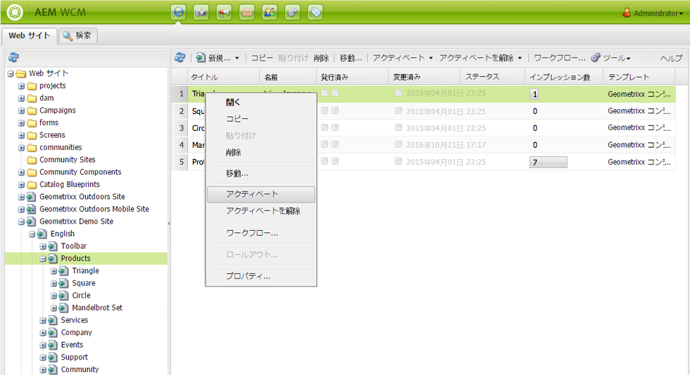
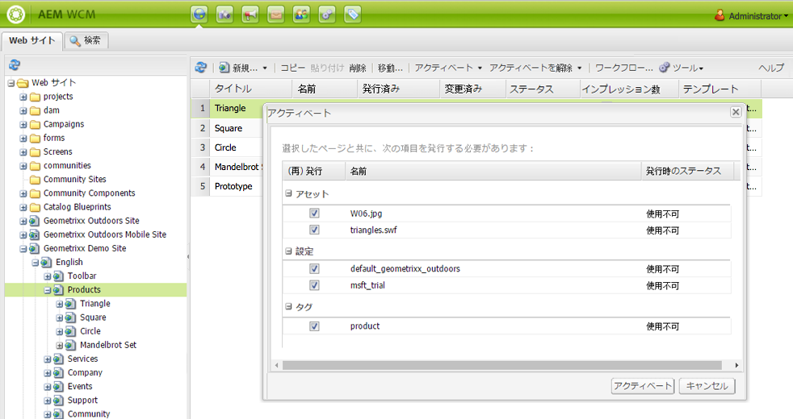
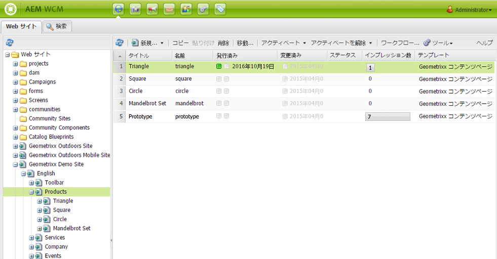
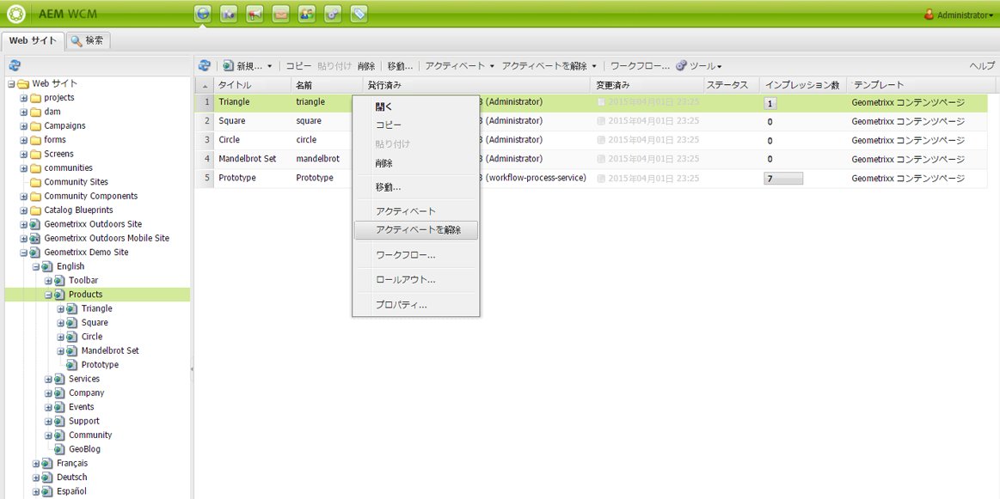
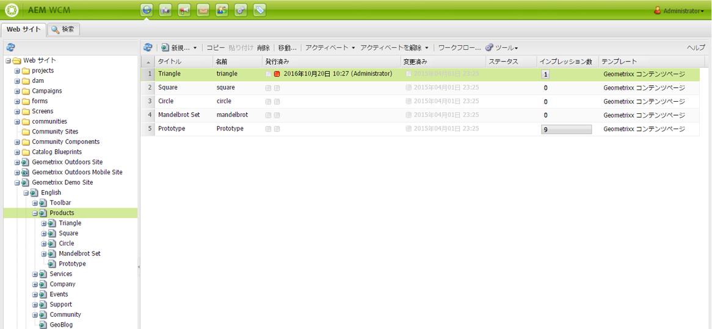
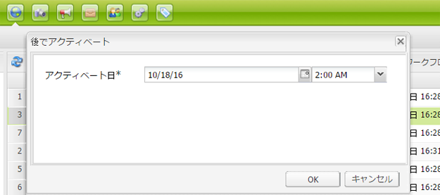
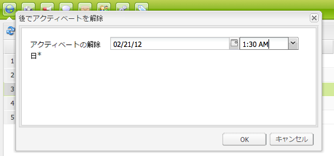
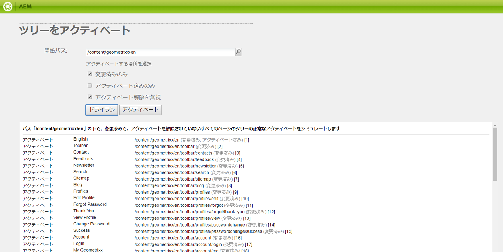

# ページの公開{#publishing-pages}

オーサー環境でコンテンツを作成およびレビューした後は、公開 Web サイト（パブリッシュ環境）でコンテンツを利用できるようにすることが目標となります。

この操作は、ページの公開と呼ばれます。パブリッシュ環境からページを削除する場合は、ページの非公開と呼ばれます。ページは、公開／非公開を切り替えても、削除するまでは、さらなる変更に備えてオーサー環境で使用できます。

また、ページの公開または非公開は、即座におこなうことも、後で事前定義済みの日時におこなうこともできます。

>[!NOTE]
>
>公開に関する用語には、紛らわしいものがあります。
>
>* **公開／非公開**
   >  環境でコンテンツを公開する（または非公開にする）アクションに対して主に使用される用語です。
   >
   >
* **アクティブ化／非アクティブ化**
   >  公開／非公開と同義です。
   >
   >
* **レプリケート／レプリケーション**
   >  これらは、ユーザーコメントの発行時や逆複製時など、ある環境から別のユーザーへのデータ（ページコンテンツ、ファイル、コード、ユーザーコメントなど）の移動を説明する技術用語です。
>

>[!NOTE]
>
>特定のページを公開するために必要な特権がない場合。
>
>* ワークフローがトリガーされ、公開リクエストの適切なユーザーに通知されます。
>* 自分に対する通知のメッセージが（短期間）表示されます。

>

## ページの公開 {#publishing-a-page}

ページをアクティベートするには、以下の 2 つの方法があります。

* [Web サイトコンソールから](#activating-a-page-from-the-websites-console)
* [ページ自体のサイドキックから](#activating-a-page-from-sidekick)

>[!NOTE]
>
>また、ツールコンソールの「[ツリーをアクティベート](#howtoactivateacompletesectiontreeofyourwebsite)」を使用して、複数ページのサブツリーをアクティベートすることもできます。

### Web サイトコンソールでのページのアクティベート {#activating-a-page-from-the-websites-console}

Web サイトコンソールで、ページをアクティベートできます。ページを開いてそのコンテンツを変更したら、Web サイトコンソールに戻ります。

1. Web サイトコンソールで、アクティベートするページを選択します。
1. トップメニューまたは選択したページ項目のドロップダウンメニューから、「**アクティベート**」を選択します。

   ページおよびそのすべてのサブページのコンテンツをアクティベートするには、[**ツール**&#x200B;コンソールを使用します](/help/sites-classic-ui-authoring/classic-page-author-publish-pages.md#howtoactivateacompletesectiontreeofyourwebsite)。

   

   >[!NOTE]
   >
   >必要な場合は、ページにリンクされているアセットのアクティベートまたは再アクティベートをおこなうように求められます。チェックボックスをオンまたはオフにして、それらのアセットをアクティベートできます。

1. 必要な場合は、ページにリンクされているアセットのアクティベートまたは再アクティベートをおこなうように求められます。チェックボックスをオンまたはオフにして、それらのアセットをアクティベートできます。

   

1. AEM WCM によって、選択したコンテンツがアクティベートされます。公開されたページが、コンテンツをアクティベートしたユーザーや日時と共に、[Web サイトコンソール](/help/sites-classic-ui-authoring/author-env-basic-handling.md#page-information-on-the-websites-console)（緑でマーク）に表示されます。

   

### サイドキックでのページのアクティベート {#activating-a-page-from-sidekick}

また、ページを編集するために開いた際にも、ページをアクティベートできます。

ページを開いてそのコンテンツを変更した後、以下を実行します。

1. サイドキックで、「**ページ**」タブを選択します。
1. 「**ページをアクティベート**」をクリックします。ウィンドウの右上に、ページがアクティベートされたことを確認するメッセージが表示されます。

## ページの非公開 {#unpublishing-a-page}

パブリッシュ環境からページを削除するには、そのコンテンツをアクティベート解除します。

ページのアクティベートを解除するには：

1. Web サイトコンソールで、アクティベートを解除するページを選択します。
1. トップメニューまたは選択したページ項目のドロップダウンメニューから、「**アクティベートを解除**」を選択します。削除を確認するメッセージが表示されます。

   

1. [Web サイトコンソール](/help/sites-classic-ui-authoring/author-env-basic-handling.md#page-information-on-the-websites-console)を更新すると、コンテンツは赤でマークされ、公開されていないことが示されます。

   

## 後でアクティベート／後でアクティベートを解除 {#activate-deactivate-later}

### 後でアクティベート {#activate-later}

後でアクティベートするようにスケジュールを設定するには：

1. Web サイトコンソールで、**アクティベート**&#x200B;メニューの「**後でアクティベート**」を選択します。
1. In the dialog that opens you provide the date and time for activation and click **OK**. This creates a version of the page that is activated at the specified time.

   

後でアクティベートすることにより、このページのバージョンを指定した時間にアクティベートするワークフローが開始されます。逆に、後でアクティベートを解除することにより、このページのバージョンを指定した時間にアクティベート解除するワークフローが開始されます。

このアクティベートまたはアクティベートの解除をキャンセルする場合は、[ワークフローコンソール](/help/sites-administering/workflows-administering.md#main-pars_title_3-yjqslz-refd)に移動して、対応するワークフローを終了します。

### 後でアクティベートを解除 {#deactivate-later}

後でアクティベートを解除するようにスケジュールを設定するには：

1. In the Website console, go to the **Deactivate** menu, and select **Deactivate later**.

1. In the dialog that opens you provide the date and time for deactivation and click **OK**.

   

「**後でアクティベートを解除**」によって、このページのバージョンを指定した時間にアクティベート解除するワークフローが開始されます。

このアクティベートの解除をキャンセルする場合は、[ワークフローコンソール](/help/sites-administering/workflows-administering.md#main-pars_title_3-yjqslz-refd)に移動して、対応するワークフローを終了します。

## アクティベート／アクティベート解除のスケジュール設定（オンタイム／オフタイム） {#scheduled-activation-deactivation-on-off-time}

ページの公開または非公開をおこなう時間をスケジュール設定することができます。そのためには、**ページプロパティ**&#x200B;で定義できる「**オンタイム**」と「[オフタイム](/help/sites-classic-ui-authoring/classic-page-author-edit-page-properties.md)」を使用します。

### ページパブリケーションステータスの判別 {#determining-page-publication-status-classic-ui}

[Web サイトコンソール](/help/sites-classic-ui-authoring/author-env-basic-handling.md#page-information-on-the-websites-console)からステータスを確認できます。色の違いにより公開ステータスが示されます。

## Web サイトのセクション全体（ツリー）のアクティベート {#activating-a-complete-section-tree-of-your-website}

「**Web サイト**」タブから、個々のページをアクティベートできます。多数のコンテンツページを入力または更新した場合、これらのページがすべて同じルートページの下にあれば、ツリー全体を 1 回の操作で簡単にアクティベートできます。また、ドライランを実行してアクティベートをエミュレートし、アクティベートされたページをハイライト表示することもできます。

1. Open the **Tools** console by selecting it from the **Welcome** page and then double-click **Replication** to open the console ( `https://localhost:4502/etc/replication.html`).

   

1. **レプリケーション**&#x200B;コンソールで、「**ツリーをアクティベート**」をクリックします。

   The following window ( `https://localhost:4502/etc/replication/treeactivation.html`) will be displayed.

   

1. Enter the **Start Path**. This specifies the path to the root of the section you want to activate (publish). This page and all pages underneath are considered for activation (or used in the emulation if a Dry Run is selected).
1. 必要に応じて、次の選択基準のチェックをオンにします。

   * **変更済みのみ**：変更されたページのみアクティベートします。
   * **アクティベート済みのみ**：（既に）アクティベートされたことのあるページのみアクティベートします。再アクティベートの形式で動作します。
   * **アクティベート解除を無視**：アクティベート解除されたすべてのページを無視します。

1. 実行するアクションを選択します。

   1. Select **Dry Run** if you want to check which pages *would* be activated. This is only an emulation, no pages will be activated.

   1. Select **Activate** if you want to activate the pages.
