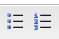
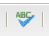

# リッチテキストエディター {#rich-text-editor}

リッチテキストエディターは、AEMにテキストコンテンツを入力するための基本的な構成要素です。 これは、次のような様々なコンポーネントの基礎となります。

* テキスト
* テキスト画像
* テーブル

## リッチテキストエディター {#rich-text-editor-1}

WYSIWYG 編集ダイアログには、次のような様々な機能が用意されています。

>[!NOTE]
>
>利用できる機能は、個別のプロジェクトごとに設定できるので、インストールによって異なる可能性があります。

## インプレース編集 {#in-place-editing}

ダイアログベースのリッチテキスト編集モードに加えて、AEMにはインプレース編集モードも用意されています。このモードでは、ページのレイアウトに表示されているテキストを直接編集できます。

段落を 2 回クリック（ゆっくりダブルクリック）して、インプレース編集モードに入ります（コンポーネントの境界線がオレンジ色になります）。

ページ上のテキストを、ダイアログウィンドウ内ではなく直接編集できます。変更を行うと、その内容は自動的に保存されます。

>[!NOTE]
>
>コンテンツファインダーを開いている場合、（上記のように）RTE フォーマットオプションを含むツールバーがタブの上部に表示されます。
>
>コンテンツファインダーが開いていない場合、ツールバーは表示されません。

現在、インプレース編集モードは、 **テキスト** および **タイトル** コンポーネント。

>[!NOTE]
>
>この [!UICONTROL タイトル] コンポーネントは、改行のない短いテキストを含むように設計されています。 インプレース編集モードでタイトルを編集する場合、改行を入力すると新しい **テキスト** コンポーネントをタイトルの下に追加します。

## リッチテキストエディターの機能 {#features-of-the-rich-text-editor}

リッチテキストエディターには様々な機能があり、機能は個々のコンポーネントの[設定によって異なります](/help/sites-administering/rich-text-editor.md)。これらの機能は、タッチ操作向け UI とクラシック UI の両方で利用できます。

### 基本的な文字形式 {#basic-character-formats}

ここでは、選択した（ハイライト表示された）文字に書式を適用できます。一部のオプションには、ショートカットキーもあります。

* 太字 (Ctrl+B)
* 斜体 (Ctrl+I)
* 下線 (Ctrl+U)
* 下付き文字
* 上付き文字

すべてがトグルとして機能するので、再選択すると形式が削除されます。

### 定義済みのスタイルと形式 {#predefined-styles-and-formats}

インストールには、定義済みのスタイルと書式を含めることができます。 これらは、 **[!UICONTROL スタイル]** および **[!UICONTROL 形式]** ドロップダウンリストと、選択したテキストに適用できます。

スタイルは、特定の文字列に適用できます（スタイルは CSS に関連付けられます）。

これに対して、書式はテキストの段落全体に適用されます（書式は HTML ベースです）。

特定の形式は変更のみ可能です ( デフォルトは **[!UICONTROL 段落]**) をクリックします。

スタイルは削除できます。スタイルが適用されたテキスト内にカーソルを置き、削除アイコンをクリックします。

>[!CAUTION]
>
>実際にスタイルが適用されているテキストを再選択しないでください。選択しないと、アイコンが非アクティブになります。

### 切り取り、コピー、貼り付け {#cut-copy-paste}

の標準的な機能 **[!UICONTROL 切り取り]** および **[!UICONTROL コピー]** が使用可能です。 のいくつかの味 **[!UICONTROL 貼り付け]** は、様々な形式に対応するために提供されています。

* 切り取り（Ctrl+X）
* コピー（Ctrl + C）
* 貼り付け
コンポーネント用のデフォルトの貼り付けメカニズム（Ctrl+V）です。追加設定なしのインストールでは、これには、「[!UICONTROL Word から貼り付け]」が設定されます。

* テキストとして貼り付け：すべてのスタイルおよび書式を削除して、プレーンテキストのみを貼り付けます。

* Word から貼り付け：HTML としてコンテンツを貼り付けます（必要に応じて書式が再設定されます）。

### 取り消し、やり直し {#undo-redo}

AEMは、現在のコンポーネントの最近 50 個のアクションを時系列で記録します。 必要に応じて、これらのアクションを完全に元に戻す（その後、やり直す）ことができます。

>[!CAUTION]
>
>履歴は、現在の編集セッションに対してのみ保持されます。 コンポーネントを開いて編集するたびに再開します。

>[!NOTE]
>
>デフォルトのタスク数は 50 です。 これは、インストールによって異なる場合があります。

### 整列 {#alignment}

テキストは、左揃え、中央揃えまたは右揃えにできます。

### インデント {#indentation}

段落のインデントは、増減できます。 選択した段落はインデントされ、新しく入力されたテキストは現在のインデントレベルを保持します。

### リスト {#lists}

テキスト内には、箇条書きリストと番号付きリストの両方を作成できます。 リストの種類を選択し、入力を開始するか、変換するテキストをハイライト表示します。 どちらの場合も、改行は新しいリスト項目を開始します。

ネストされたリストは、1 つ以上のリスト項目をインデントすることで実現できます。

リストのスタイルは、カーソルをリスト内に置いてから別のスタイルを選択するだけで変更できます。 サブリストは、含まれるリストとは異なるスタイルを持つこともできます。 これは、サブリストが作成された後（インデント別）に適用できます。

### リンク {#links}

URL（web サイト内または外部の場所）へのリンクを生成するには、必要なテキストをハイライト表示してハイパーリンクアイコンをクリックします。

ダイアログではターゲット URL を指定でき、その URL を新しいウィンドウで開くかどうかも指定できます。

以下の操作を実行できます。

* URI を直接入力する
* Web サイト内のページを選択するためにサイトマップを使用する
* URI を入力し、ターゲットアンカーを追加します。例： `www.TargetUri.org#AnchorName`
* アンカーのみを入力します（「現在のページ」を参照する場合）（例：`#anchor`）
* コンテンツファインダーでページを検索し、ページアイコンをハイパーリンクダイアログにドラッグ＆ドロップします

>[!NOTE]
>
>URI の先頭には、インストールで設定された任意のプロトコルを付加できます。標準的なインストールの場合、`https://`、`ftp://` および `mailto:` です。お使いのインストール用に設定されていないプロトコルは拒否され、無効とマークされます。

リンクを解除するには、リンクテキスト内にカーソルを置き、 [!UICONTROL リンク解除] アイコン：

### アンカー {#anchors}

アンカーは、カーソルを置くか、テキストを選択することで、テキスト内の任意の場所に作成できます。 次に、 **アンカー** アイコンをクリックしてダイアログを開きます。

アンカーの名前を入力し、「 **OK** 保存します。

アンカーは、コンポーネントの編集中に表示され、リンクのターゲットとして使用できます。

### 検索と置換 {#find-and-replace}

AEMは **検索** および **置換** （検索と置換）関数を使用します。

両方に **次を検索** ボタンを使用して、開いているコンポーネントで指定したテキストを検索します。 また、大文字と小文字を一致させる必要があるかどうか（大文字/小文字）を指定することもできます。

検索は、常にテキスト内の現在のカーソル位置から開始します。 コンポーネントの終わりに達すると、次の検索操作が上から開始することを示すメッセージが表示されます。

「**置換**」オプションを使用すると、**検索**&#x200B;してから、指定したテキストで個別のインスタンスを&#x200B;**置換**&#x200B;したり、現在のコンポーネントのインスタンスを&#x200B;**すべて置換**&#x200B;することができます。

### 画像 {#images}

画像をコンテンツファインダーからドラッグして、テキストに追加できます。

>[!NOTE]
>
>AEM では、さらに詳細な画像設定のための専用コンポーネントも提供しています。例えば、**画像**&#x200B;コンポーネントと&#x200B;**テキスト画像**&#x200B;コンポーネントを使用できます。

### スペルチェッカー {#spelling-checker}

スペルチェッカーは、現在のコンポーネントのすべてのテキストをチェックします。

正しくないスペルは、次のようにハイライト表示されます。

>[!NOTE]
>
>スペルチェッカーは、サブツリーの言語プロパティを取得するか、URL から言語を抽出することにより、web サイトの言語で動作します。例えば、英語の場合は `en` ツリー分岐、ドイツ語の場合は `de` ツリー分岐がチェックされます。

### テーブル {#tables}

テーブルは次の両方を使用できます。

* を **テーブル** コンポーネント

  

* **テキスト**&#x200B;コンポーネント内から

  

  >[!NOTE]
  >
  >テーブルは RTE で使用できますが、テーブルの作成時は&#x200B;**テーブル**&#x200B;コンポーネントを使用することをお勧めします。

テーブル機能は、**テキスト**&#x200B;コンポーネントと&#x200B;**テーブル**&#x200B;コンポーネントの両方において、テーブル内で（通常、マウスの右ボタンを）クリックして表示されるコンテキストメニューから利用できます。以下に例を示します。

>[!NOTE]
>
>内 **テーブル** コンポーネント、様々な標準のリッチテキストエディター機能や、テーブル固有の関数のサブセットなど、専用のツールバーも使用できます。

テーブル固有の関数は次のとおりです。

* [テーブルのプロパティ](#table-properties)
* [セルのプロパティ](#cell-properties)
* [行の追加または削除](#add-or-delete-rows)
* [列の追加または削除](#add-or-delete-columns)
* [すべての行またはすべての列の選択](#selecting-entire-rows-or-columns)
* [セルの統合](#merge-cells)
* [セルの分割](#split-cells)
* [ネストされたテーブル](#creating-nested-tables)
* [テーブルの削除](#remove-table)

#### テーブルのプロパティ {#table-properties}

テーブルの基本的なプロパティを設定できます。その後、「**OK**」をクリックして保存します。

* **幅**：テーブル全体の幅です。

* **高さ**：テーブル全体の高さです。

* **ボーダー**：テーブルのボーダーのサイズです。

* **セル内の余白**：セルコンテンツとそのボーダーの間の空白を定義します。

* **セルの間隔**：セル間の距離を定義します。

>[!NOTE]
>
>幅や高さなど、一部のセルプロパティは、ピクセルまたはパーセンテージで定義できます。

>[!CAUTION]
>
>テーブルの幅を定義することをお勧めします。

#### セルのプロパティ {#cell-properties}

次に示すように、特定のセルまたは一連のセルのプロパティを設定できます。

* **幅**
* **高さ**
* **水平方向の位置揃え** - 左、中央または右
* **垂直方向の位置揃え** - 上、中央、下またはベースライン
* **セルのタイプ** - データまたはヘッダー
* **適用先：** 単一のセル、行全体、列全体

#### 行の追加または削除 {#add-or-delete-rows}

行は、現在の行の上または下に追加できます。

現在の行も削除できます。

#### 列の追加または削除 {#add-or-delete-columns}

列は、現在の列の左または右に追加できます。

現在の列は削除することもできます。

#### すべての行またはすべての列の選択 {#selecting-entire-rows-or-columns}

現在の行または列全体を選択します。 その後、特定のアクション（結合など）を使用できます。

#### セルの統合 {#merge-cells}

 

* セルのグループを選択した場合は、それらを 1 つに結合できます。
* 1 つのセルのみを選択した場合、右または下のセルと結合できます。

#### セルの分割 {#split-cells}

1 つのセルを選択して分割します。

* セルを水平に分割すると、現在の列内で、現在のセルの右側に新しいセルが生成されます。
* セルを縦に分割すると、現在のセルの下、現在の行内に新しいセルが生成されます。

#### ネストされた表の作成 {#creating-nested-tables}

ネストされたテーブルを作成すると、現在のセル内に、自己完結型の新しいテーブルが作成されます。

>[!NOTE]
>
>その他の動作には、ブラウザーによって異なるものがあります。
>
>* Windows IE:複数のセルを選択するには、Ctrl キーを押しながらマウスの主ボタン（通常は左）を押しながらクリックします。
>* Firefox：ポインターをドラッグして、セルの範囲を選択します。

#### テーブルの削除 {#remove-table}

**[!UICONTROL Text]** コンポーネント内からテーブルを削除するオプションを使用します。

### 特殊文字 {#special-characters}

特殊文字は、リッチテキストエディターで使用できます。これらは、インストールによって異なる場合があります。

マウスオーバーを使用して文字の拡大版を表示し、クリックすると、文字がテキストの現在の位置に含まれます。

### ソース編集モード {#source-editing-mode}

ソース編集モードを使用すると、コンポーネントの基になるHTMLを表示および編集できます。

テキストは次のようになります。

ソースモードでは次のように表示されます（多くの場合、ソースは長くなるので、スクロールする必要があります）。

>[!CAUTION]
>
>ソースモードを終了する際に、AEMは特定の検証チェックを行います（例えば、テキストがブロック内に正しく含まれている、またはネストされていることを確認します）。 その結果、編集内容が変更される場合があります。
