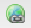

# リッチテキストエディター {#rich-text-editor}

リッチテキストエディターは、AEM にテキストコンテンツを入力するための基本的な構成要素です。以下を含む、様々なコンポーネントの基礎となります。

* テキスト
* テキスト画像
* テーブル

## リッチテキストエディター {#rich-text-editor-1}

WYSIWYG 編集ダイアログは、様々な機能を提供します。

>[!NOTE]
>
>利用できる機能は、個別のプロジェクトごとに設定できるので、インストールによって異なる可能性があります。

## インプレース編集 {#in-place-editing}

ダイアログベースのリッチテキスト編集モードに加えて、AEM には、ページのレイアウトどおりに表示されたテキストを直接編集できる、インプレース編集モードも用意されています。

段落を 2 回クリック（ゆっくりダブルクリック）して、インプレース編集モードに切り替えます（コンポーネントのボーダーがオレンジになります）。

ページ上のテキストを、ダイアログウィンドウ内ではなく直接編集できます。変更をおこなうと、その内容は自動的に保存されます。

>[!NOTE]
>
>コンテンツファインダーを開いている場合は、リッチテキストエディターの書式設定オプションがタブの上部に表示されます（上記を参照）。
>
>コンテンツファインダーを開いていない場合は、ツールバーは表示されません。

現在、インプレース編集モードは、**テキスト**&#x200B;および&#x200B;**タイトル**&#x200B;コンポーネントで生成されたページ要素に対して有効です。

>[!NOTE]
>
>[!UICONTROL タイトル]コンポーネントは、改行がない短いテキストを含むものとして設計されています。インプレース編集モードでタイトルを編集するときに、改行を入力すると、タイトルの下に新しい&#x200B;**テキスト**&#x200B;コンポーネントが開きます。

## リッチテキストエディターの機能 {#features-of-the-rich-text-editor}

The Rich Text Editor provides a range of featues, these [depend on the configuration](/help/sites-administering/rich-text-editor.md) of the individual component. The features are available for both the touch-optimized and classic UI.

### 基本文字形式 {#basic-character-formats}

以下に、選択した（ハイライト表示された）文字に適用できる書式を示します。ショートカットキーのあるオプションもあります。

* 太字（Ctrl + B）
* イタリック（Ctrl + I）
* 下線（Ctrl + U）
* 下付き文字
* 上付き文字

すべてオン／オフ切り替えとして動作するので、再選択すると書式が削除されます。

### 事前定義済みのスタイルおよび書式 {#predefined-styles-and-formats}

インストールには、事前定義済みのスタイルおよび書式を含めることができます。これらは、**[!UICONTROL スタイル]**&#x200B;および&#x200B;**[!UICONTROL フォーマット]**&#x200B;ドロップダウンリストで利用でき、選択したテキストに対して適用できます。

スタイルは、特定の文字列に対して適用できます（スタイルは CSS に関連付けられます）。

これに対して、書式は、テキスト段落全体に対して適用されます（書式は HTML ベースです）。

個別の書式は、変更のみできます（デフォルトは「**[!UICONTROL 段落]**」です）。

スタイルは、削除できます。スタイルが適用されたテキスト内にカーソルを置き、次の削除アイコンをクリックします。

>[!CAUTION]
>
>スタイルを適用したテキストを実際に再選択しないでください。再選択してしまうと、アイコンが非アクティブ化されます。

### 切り取り、コピー、貼り付け {#cut-copy-paste}

「**[!UICONTROL 切り取り]**」および「**[!UICONTROL コピー]**」の標準的な機能が利用できます。「**[!UICONTROL 貼り付け]**」には、書式の違いに対応するためにいくつかの種類があります。

* 切り取り（Ctrl + X）
* コピー（Ctrl + C）
* Paste
This is the default paste mechanism (Ctrl-V) for the component; when installed out-of-the-box this is configured to be [!UICONTROL Paste from Word].

* テキストとして貼り付け：すべてのスタイルと書式を削除して、プレーンテキストのみを貼り付けます。

* Wordから貼り付け：これにより、コンテンツがHTMLとして貼り付けられます（形式変更が必要になります）。

### 元に戻す、やり直し {#undo-redo}

AEM は、現在のコンポーネントについて直近の 50 の操作を記録し、時間順に保持されます。これらの操作は、厳密な順序で、元に戻す（およびその後やり直す）ことができます。

>[!CAUTION]
>
>履歴は現在の編集セッションに対してのみ保持されます。コンポーネントを開いて編集するたびに再開されます。

>[!NOTE]
>
>デフォルトのタスク数は 50 です。これはインストールによって異なる場合があります。

### 整列 {#alignment}

テキストは、左揃え、中央揃えまたは右揃えにすることができます。

### インデント {#indentation}

段落のインデントを増やしたり減らしたりできます。選択された段落がインデントされ、新しいテキストが入力されると、現在のインデントレベルが保持されます。

### リスト {#lists}

テキスト内で、箇条書きおよび番号リストの両方を作成できます。リストの種類を選択してから入力するか、変換するテキストをハイライト表示します。どちらの場合も、改行により新しいリスト項目が開始されます。

1 つ以上のリスト項目をインデントすることで、リストをネストできます。

リストのスタイルは、カーソルをリスト内に置いて別のスタイルを選択することによって変更できます。サブリストでは、含まれているリストを異なるスタイルにすることもできます。これは（インデントによって）サブリストを作成すると適用できます。

### リンク {#links}

（Webサイト内または外部の場所内の）URLへのリンクを生成するには、必要なテキストをハイライト表示し、ハイパーリンクアイコンをクリックします。

ダイアログでは、ターゲット URL を指定でき、また、それを新しいウィンドウで開くかどうかを指定できます。

以下の操作を実行できます。

* URIを直接入力する
* サイトマップを使用して、Webサイト内のページを選択します
* Enter the URI, then append the target anchor; e.g. `www.TargetUri.org#AnchorName`
* Enter an anchor only (to reference &quot;the current page&quot;); For example, `#anchor`
* コンテンツファインダーでページを検索し、ページアイコンをハイパーリンクダイアログにドラッグ&amp;ドロップします

>[!NOTE]
>
>URI の先頭には、インストールで設定された任意のプロトコルを付加できます。In a standard installation these are `https://`, `ftp://`, and `mailto:`. インストールで設定されなかったプロトコルは、拒否され、無効としてマークされます。

リンクを解除するには、リンクテキスト内にカーソルを置いて、次の[!UICONTROL リンク解除]アイコンをクリックします。

### アンカー {#anchors}

アンカーは、テキスト内のどこにでも作成できます。カーソルを置くか、テキストを選択して、**アンカー**&#x200B;アイコンをクリックして、ダイアログを開きます。

アンカーの名前を入力し、「**OK**」をクリックして保存します。

アンカーは、コンポーネントの編集中に表示され、リンクのターゲットとして使用できます。

### 検索および置換 {#find-and-replace}

AEM には、**検索**&#x200B;および&#x200B;**置換**&#x200B;の両方の機能（「検索と置換」）があります。

どちらにも「**次を検索**」ボタンがあり、開いているコンポーネントに対して、指定したテキストを検索します。また、大文字／小文字が一致する必要があるかどうかも指定できます。

検索は、常に、テキスト内の現在のカーソル位置から開始します。コンポーネントの最後に達したら、次の検索処理がコンポーネントの最初から開始されることを示すメッセージが表示されます。

**置換**&#x200B;オプションは、**検索**&#x200B;してから個別のインスタンスを指定したテキストで&#x200B;**置換**&#x200B;したり、現在のコンポーネントのインスタンスを&#x200B;**すべて置換**&#x200B;することができます。

### 画像 {#images}

画像は、コンテンツファインダーからドラッグしてテキストに追加することができます。

>[!NOTE]
>
>AEM では、さらに詳細な画像設定のための専用コンポーネントも提供しています。For example the **Image** and **Text Image** components are available.

### スペルチェッカー {#spelling-checker}

スペルチェッカーは、現在のコンポーネントのすべてのテキストをチェックします。

正しくないスペルは、ハイライト表示されます。

>[!NOTE]
>
>スペルチェッカーは、サブツリーの言語プロパティを取得するか、URL から言語を抽出することにより、Web サイトの言語で動作します。例えば、英語の場合は `en` ブランチ、ドイツ語の場合は `de` ブランチがチェックされます。

### 表 {#tables}

表は、次のどちらかの方法によって利用できます。

* **テーブル**&#x200B;コンポーネントとして

   

* **テキスト**&#x200B;コンポーネント内から

   

   >[!NOTE]
   >
   >Although tables are available in the RTE, it is recommended to use the **Table** component when creating tables.

テーブル機能は、**テキスト**&#x200B;および&#x200B;**テーブル**&#x200B;コンポーネントの両方で、テーブル内で（通常、マウスの右ボタンを）クリックして表示されるコンテキストメニューから利用できます。以下に例を示します。

>[!NOTE]
>
>**表**&#x200B;コンポーネントでは、様々な標準的なリッチテキストエディター機能、および表に特有の機能のサブセットを含む専用のツールバーも使用できます。

表に特有の機能を以下に示します。

* [テーブルのプロパティ](#table-properties)
* [セルのプロパティ](#cell-properties)
* [行の追加または削除](#add-or-delete-rows)
* [列の追加または削除](#add-or-delete-columns)
* [すべての行またはすべての列の選択](#selecting-entire-rows-or-columns)
* [セルの統合](#merge-cells)
* [セルの分割](#split-cells)
* [ネストされたテーブル](#creating-nested-tables)
* [テーブルの削除](#remove-table)

#### テーブルのプロパティ {#table-properties}

テーブルの基本的なプロパティを設定できます。その後、「**OK**」をクリックして保存します。

* **幅**:テーブルの全幅。

* **高さ**:テーブルの高さの合計。

* **境界線**:テーブルの境界線のサイズ。

* **セルのパディング**:セルのコンテンツと境界線の間の空白を定義します。

* **セル内間隔**:これにより、セル間の距離が定義されます。

>[!NOTE]
>
>幅や高さなど、一部のセルプロパティは、ピクセルまたはパーセントで定義できます。

>[!CAUTION]
>
>Adobeでは、テーブルの幅を定義することをお勧めします。

#### セルのプロパティ {#cell-properties}

特定のセルまたは一連のセルのプロパティを設定できます。

* **幅**
* **高さ**
* **水平方向揃え** — 左揃え、中央揃え、右揃え
* **垂直方向揃え** — 上揃え、中央揃え、下揃え、またはベースライン
* **セルの種類**— データまたはヘッダー
* **適用先：** 単一のセル、行全体、列全体

#### 行の追加または削除 {#add-or-delete-rows}

行は、現在の行の上または下に追加できます。

現在の行を削除することもできます。

#### 列の追加または削除 {#add-or-delete-columns}

列は、現在の列の左または右に追加できます。

現在の列を削除することもできます。

#### すべての行またはすべての列の選択 {#selecting-entire-rows-or-columns}

現在の行全体または列全体を選択できます。その後、特定のアクション（例：マージ）を適用できます。

#### セルの統合 {#merge-cells}

 

* セルのグループを選択した場合、それらを 1 つにマージできます。
* 1 つのセルのみを選択した場合、右または下のセルとマージできます。

#### セルの分割 {#split-cells}

単一のセルを選択して分割します。

* 「左右にセルを分割」は、現在の列内の、現在のセルの右側に新しいセルを生成します。
* 「上下にセルを分割」は、現在の行内の、現在のセルの下に新しいセルを生成します。

#### ネストされたテーブルの作成 {#creating-nested-tables}

「ネストされた表を作成」は、現在のセル内に、新しい、独立した表を作成します。

>[!NOTE]
>
>追加動作の中には、ブラウザーによって異なるものがあります。
>
>* Windows IE：Ctrl キーを押しながらマウスの主ボタン（通常は左）を押して、複数のセルを選択します。
>* Firefox:ポインターをドラッグして、セル範囲を選択します。

#### テーブルの削除 {#remove-table}

このオプションを使用して、 **[!UICONTROL Text]** コンポーネント内から表を削除します。

### 特殊文字 {#special-characters}

特殊文字は、リッチテキストエディターで使用できます。インストールによって、使用できる特殊文字が異なる可能性があります。

マウスオーバーを使用して拡大された文字を表示し、クリックしてテキストの現在の位置に追加します。

### ソース編集モード {#source-editing-mode}

ソース編集モードでは、コンポーネントの基になる HTML を表示および編集できます。

例えば、次のテキストは、

ソースモードでは次のように表示されます（多くの場合、ソースは長くなるので、スクロールする必要があります）。

>[!CAUTION]
>
>ソースモードを終えるときに、AEM は特定の検証チェックをおこないます（例えば、テキストがブロックに適切に格納／ネストされていることを確認します）。これによって、編集結果が変更されることがあります。
