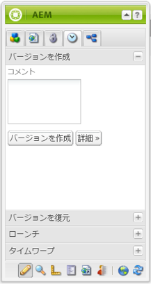
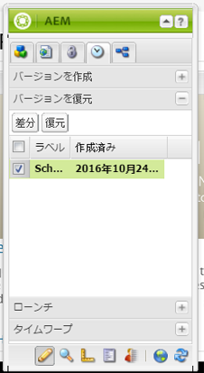
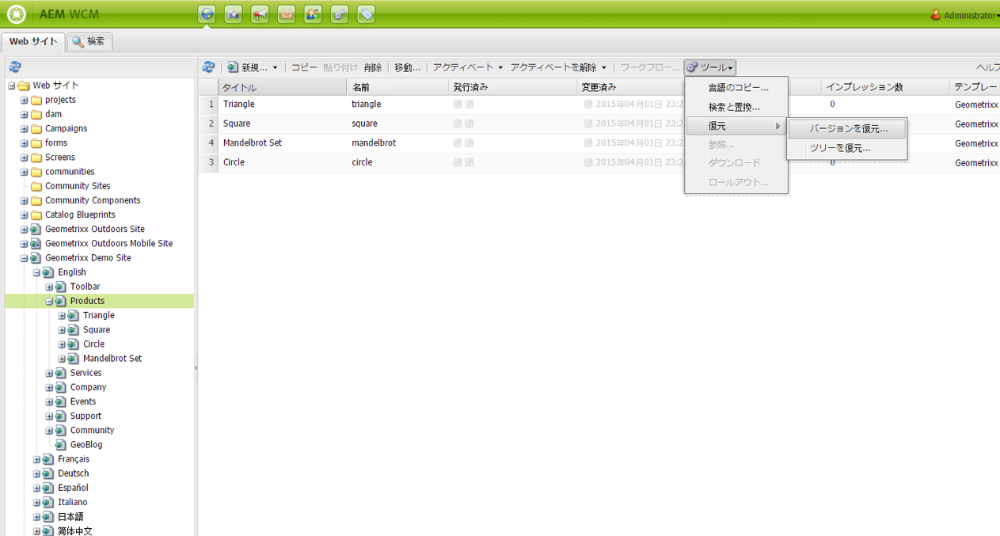
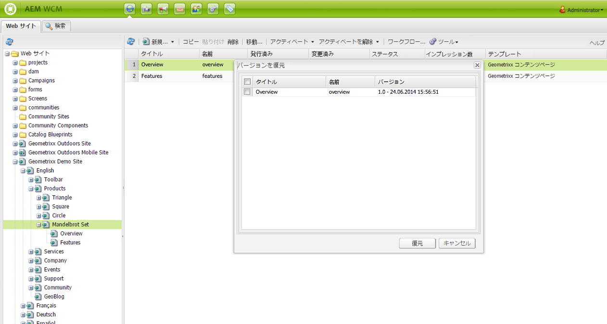
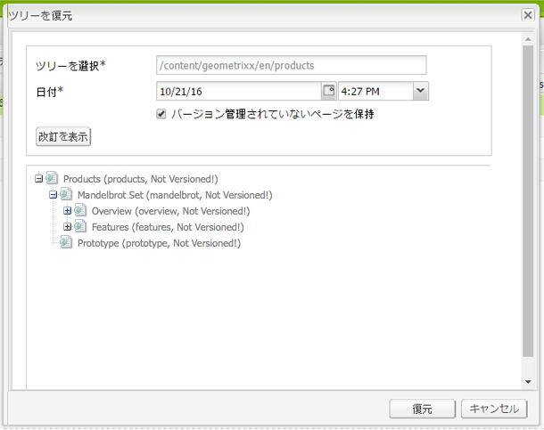
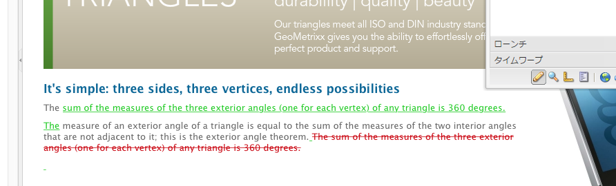
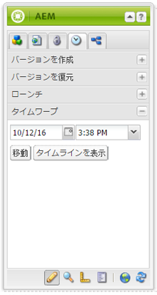
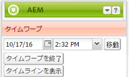
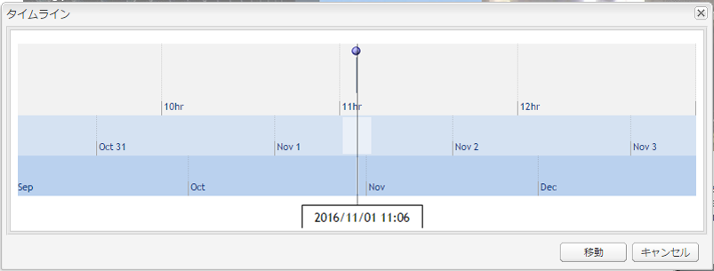
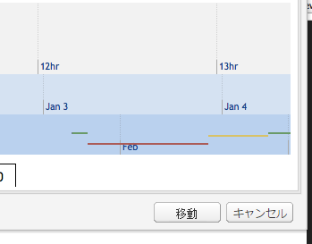

# ページバージョンの処理{#working-with-page-versions}

バージョン管理では、特定の時点でのページの「スナップショット」が作成されます。バージョン管理を使用すると、以下の操作を実行できます。

* ページのバージョンを作成する。
* （例えば、ページに対しておこなった変更を取り消すために）ページを以前のバージョンに復元する。
* ハイライト表示されたテキストおよび画像の違いについて、現在のページのバージョンを以前のバージョンと比較する。

## 新しいバージョンの作成 {#creating-a-new-version}

ページの新しいバージョンを作成するには：

1. ブラウザーで、新しいバージョンを作成するページを開きます。
1. サイドキックで、「**バージョン管理**」タブを選択してから、「**バージョンを作成**」サブタブを選択します。

   

1. 「**コメント**」を入力します（オプション）。
1. To set a label to the version (optional), click the **More >>** button and set the **Label** to name the version. If the label is not set, the version is an automatically incremented number.
1. Click **Create Version**. グレーのメッセージが表示されます。以下に例を示します。
Version 1.2 created for: Shirts.

>[!NOTE]
>
>ページがアクティベートされると、バージョンが自動的に作成されます。

## サイドキックからページのバージョンを復元する {#restoring-a-page-version-from-sidekick}

以前のバージョンにページを復元するには：

1. 以前のバージョンに復元するページを開きます。
1. サイドキックで、「**バージョン管理**」タブを選択してから、「**バージョンを復元**」サブタブを選択します。

   

1. 復元するバージョンを選択して、「**復元**」を選択します。

## コンソールからページのバージョンを復元する {#restoring-a-page-version-from-the-console}

この方法は、特定のページバージョンを復元するために使用できます。また、以前に削除されたページを復元するためにも使用できます。

1. **Web サイト**&#x200B;コンソールで、復元するページに移動し、そのページを選択します。
1. 最上部のメニューから「**ツール**」を選択し、次に「**復元**」を選択します。

   

1. 「**バージョンを復元...**」を選択すると、現在のフォルダーにドキュメントのバージョンのリストが表示されます。ページが削除されている場合でも、その最後のバージョンがリストに表示されます。

   

1. 復元するバージョンを選択して、「**復元**」をクリックします。AEM によって、選択したバージョン（またはツリー）が復元されます。

### コンソールからツリーを復元する {#restoring-a-tree-from-the-console}

この方法は、特定のページバージョンを復元するために使用できます。また、以前に削除されたページを復元するためにも使用できます。

1. **Web サイト**&#x200B;コンソールで、復元するフォルダーに移動し、そのフォルダーを選択します。
1. 最上部のメニューから「**ツール**」を選択し、次に「**復元**」を選択します。
1. 「**ツリーを復元**」を選択するとダイアログが開き、復元するツリーを選択できます。

   

1. 「**復元**」をクリックします。AEM によって、選択したツリーが復元されます。

## 以前のバージョンとの比較 {#comparing-with-a-previous-version}

ページの現在のバージョンを以前のバージョンと比較するには：

1. ブラウザーで、以前のバージョンと比較するページを開きます。
1. In the Sidekick, select the **Versioning** tab, then the **Restore Versio** n sub tab.

   

1. 比較するバージョンを選択して、「**差分**」ボタンをクリックします。
1. 現在のバージョンと選択したバージョンの違いは、次のように表示されます。

   * 削除されたテキストは赤で示され、打ち消し線が付けられます。
   * 追加されたテキストは緑で示され、ハイライト表示されます。
   * 追加または削除された画像には緑の枠が付けられます。

   

1. サイドキックで、「**バージョンを復元**」サブタブを選択し、「**&lt;&lt;戻る**」ボタンをクリックして現在のバージョンを表示します。

## タイムワープ {#timewarp}

タイムワープは、過去の特定の時間にページが&#x200B;***公開された***&#x200B;状態をシミュレートするために設計された機能です。

選択した時点で公開された Web サイトを追跡できるようにすることが目的です。発行環境の状態を判断するために、ページのアクティベートが使用されます。

次の手順を実行します。

* システムで、選択した時間にアクティブであったページバージョンが検索されます。
* つまり、タイムワープで選択した時点より前に作成またはアクティベートされたバージョンが表示されます。**
* 移動先が削除済みのページである場合も、このページの古いバージョンがリポジトリ内で有効であれば、このページのレンダリングがおこなわれます。
* 発行されたバージョンが見つからない場合、作成者環境の現在のページの状態に戻ります（これは、閲覧できないことを示すエラー（404）ページが表示されないようにするためです）。

>[!NOTE]
>
>バージョンがリポジトリから削除された場合、Timewarp で正しい表示を行うことができません。また、Web サイトのレンダリングに使用する要素（コード、CSS、画像など）を変更した場合、これらのアイテムはリポジトリ内でバージョン化されないので、元の表示と異なる表示になります。

### Timewarp カレンダーの使用 {#using-the-timewarp-calendar}

Timewarp はサイドキックから使用できます。

カレンダーでのバージョンは、特定の日について表示する場合に使用します。

1. 「**バージョン管理**」タブを開き、「**タイムワープ**」（サイドキックの下部）をクリックします。次のようなダイアログが表示されます。

   

1. 日付と時間のセレクターを使用して目的の日付や時間を指定し、「**移動**」をクリックします。

   Timewarp で、選択した日付またはそれより前に発行された状態のページが表示されます。

   >[!NOTE]
   >
   >Timewarp は対象のページが以前に発行されている場合のみ完全に機能します。まだ公開されていない場合は、オーサー環境の現在のページが表示されます。

   >[!NOTE]
   >
   >リポジトリから削除されたページに移動する場合、このページの古いバージョンがリポジトリ内で有効であれば正しくレンダリングされます。

   >[!NOTE]
   >
   >ページの古いバージョンを編集することはできません。古いバージョンは表示のみ可能です。古いバージョンを復元する場合は、[復元](/help/sites-classic-ui-authoring/classic-page-author-work-with-versions.md#restoring-a-page-version-from-sidekick)を使用して手動でおこなう必要があります。

1. ページの表示が完了したら、次のオプションをクリックします。

   * 終了して現在の作成者ページに戻る場合は、「**タイムワープを終了**」をクリックします。
   * タイムラインを表示する場合は、「[タイムラインを表示](#using-the-timewarp-timeline)」をクリックします。

   

### タイムワープタイムラインの使用 {#using-the-timewarp-timeline}

タイムラインでのバージョンは、ページの発行アクティビティの概要を表示する場合に使用します。

ドキュメントのタイムラインを表示する場合、次の手順を行います。

1. タイムラインを表示するには、次のいずれかを行います。

   1. 「**バージョン管理**」タブを開き、「**タイムワープ**」（サイドキックの下部）をクリックします。

   1. [タイムワープカレンダーの使用](#using-the-timewarp-calendar)後に表示されるサイドキックダイアログを使用します。

1. 「**タイムラインを表示**」をクリックすると、ドキュメントのタイムラインが次のように表示されます。

   

1. タイムラインを選択して動かし（クリックしながらドラッグ）、ドキュメントのタイムライン内を移動します。

   * 線はすべて発行済みのバージョンを示します。ページがアクティベートされると、新しい線が始まります。ドキュメントが編集されるたびに、新しい色が表示されます。以下の例では、赤い線は最初の緑のバージョンの期間中にページが編集されたことを示し、黄色の線は赤のバージョン中のいずれかの時間にページが編集されたことを示す、というようになります。

   

1. クリック:

   1. 選択した時点に公開されたページのコンテンツを表示するには、「**移動**」をクリックします。
   1. そのコンテンツを表示しているときは、「**タイムワープを終了**」を使用すると、終了して現在の作成者ページに戻ります。

### タイムワープの制限事項 {#timewarp-limitations}

タイムワープでは、選択した時点のページを再現するために最大限の努力をします。ただし、AEM でのコンテンツの継続的なオーサリングは複雑な作業なので、これが常に可能とは限りません。タイムワープを使用する際は、以下の制限事項に留意してください。

* **タイムワープは、公開されたページに基づいて機能する** - タイムワープは対象のページが既に公開されている場合にのみ完全に機能します。まだ公開されていない場合は、オーサー環境の現在のページが表示されます。
* **タイムワープではページのバージョンを使用する** - リポジトリから削除されたページに移動する場合、このページの古いバージョンがリポジトリ内でまだ有効であれば正しくレンダリングされます。
* **削除されたバージョンがタイムワープに影響を及ぼす** - バージョンがリポジトリから削除された場合、タイムワープで正しい表示をおこなうことができません。

* **タイムワープは読み取り専用** - ページの古いバージョンを編集することはできません。古いバージョンは表示のみ可能です。古いバージョンを復元する場合は、[復元](#main-pars-title-1)を使用して手動でおこなう必要があります。

* **タイムワープはページのコンテンツにのみ基づく** - Web サイトのレンダリングに使用する要素（コード、CSS、アセット／画像など）を変更した場合、これらのアイテムはリポジトリ内でバージョン化されないので、元の表示と異なる表示になります。

>[!CAUTION]
>
>Timewarpは、作成者がコンテンツを理解し、作成できるようにするツールとして設計されています。 監査ログや法的な目的のためのものではありません。
