# Adobe Campaign 6.1 および Adobe Campaign Standard の使用{#working-with-adobe-campaign-and-adobe-campaign-standard}

AEM で電子メールコンテンツを作成して、Adobe Campaign の電子メールで処理することができます。これを実行するには、次の手順に従う必要があります。

1. AEM で、Adobe Campaign 固有のテンプレートから新しいニュースレターを作成します。
1. コンテンツを編集する前に、すべての機能にアクセスするために [Adobe Campaign サービス](#selectingtheadobecampaigncloudservice)を選択します。
1. コンテンツを編集します。
1. コンテンツを検証します。

これで、コンテンツを Adobe Campaign での配信と同期できるようになります。詳細な手順についてはこのドキュメントで説明します。

>[!NOTE]
>
>この機能を使用するには、AEM を [Adobe Campaign](/help/sites-administering/campaignonpremise.md) または [Adobe Campaign Standard](/help/sites-administering/campaignstandard.md) と連携するように設定する必要があります。

## Adobe Campaign を使用した電子メールコンテンツの送信 {#sending-email-content-via-adobe-campaign}

AEM と Adobe Campaign を設定すると、電子メール配信コンテンツを AEM 内で直接作成した後に、それを Adobe Campaign 内で処理できます。

AEMでAdobe Campaignコンテンツを作成する場合、Adobe Campaignサービスにリンクしてからコンテンツを編集し、すべての機能にアクセスする必要があります。

次の 2 つのケースが考えられます。

* コンテンツを Adobe Campaign からの配信と同期する場合。この場合は、AEM コンテンツを配信に使用できます。
* （オンプレミスの Adobe Campaign のみ）コンテンツを Adobe Campaign に直接送信する場合。この場合は、Adobe Campaign が新しい電子メール配信を自動的に生成します。このモードには制限事項があります。

詳細な手順についてはこのドキュメントで説明します。

### 新しい電子メールコンテンツの作成 {#creating-new-email-content}

>[!NOTE]
>
>When adding email templates, be sure to add them under **/content/campaigns** to make them available.

1. In AEM, select the **Websites** folder then browse your explorer to find where your email campaigns are managed. In the following example, the node concerned is **Websites** > **Campaigns** > **Geometrixx Outdoors** > **Email Campaigns**.

   >[!NOTE]
   >
   >[電子メールのサンプルは、Geometrixx でのみ使用できます](/help/sites-developing/we-retail.md#weretail)。パッケージ共有からサンプルGeometrixxコンテンツをダウンロードしてください。

   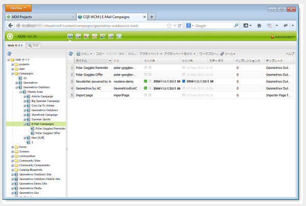

1. Select **New** > **New Page** to create new email content.
1. Adobe Campaign 固有の使用可能なテンプレートのいずれかを選択し、ページの一般的なプロパティを入力します。デフォルトでは、次の 3 つのテンプレートが使用可能です。

   * **Adobe Campaign電子メール(AC 6.1)**:配信用にAdobe Campaign6.1にコンテンツを送信する前に、事前定義済みのテンプレートにコンテンツを追加できます。
   * **Adobe Campaign電子メール(ACS)**:配信用にAdobe Campaign Standardにコンテンツを送信する前に、事前定義済みのテンプレートにコンテンツを追加できます。

   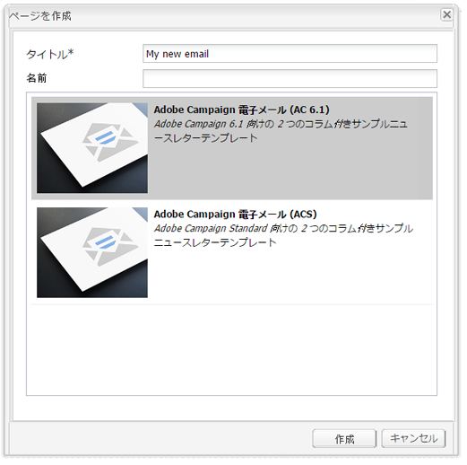

1. Click **Create** to create your email or newsletter.

### Adobe Campaign クラウドサービスおよびテンプレートの選択 {#selecting-the-adobe-campaign-cloud-service-and-template}

Adobe Campaign と統合するには、Adobe Campaign クラウドサービスをページに追加する必要があります。これにより、パーソナライズ機能や他の Adobe Campaign 情報にアクセスできるようになります。

さらに、Adobe Campaign テンプレートを選択し、件名を変更したり、HTML 表示を使用しない受信者向けのプレーンテキストのコンテンツを追加したりすることが必要な場合もあります。

1. Select the **Page** tab in the sidekick, then select **Page properties.**
1. In the **Cloud services** tab in the pop-up window, select **Add Service** to add the Adobe Campaign service and click **OK**.

   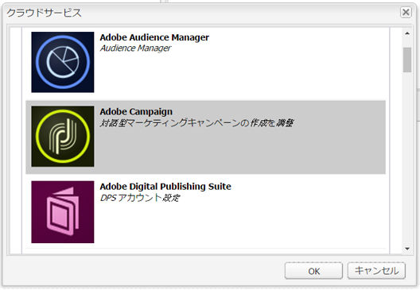

1. Select the configuration that matches your Adobe Campaign instance from the drop-down list, then click **OK**.

   >[!NOTE]
   >
   >クラウドサービスを追加した後、必ず「**OK**」または「**適用**」をタップまたはクリックしてください。そうすると、「**Adobe Campaign**」タブが正しく機能するようになります。

1. If you would like to apply a specific email delivery template (from Adobe Campaign), other than the default **mail** template, select **Page properties** again. In the **Adobe Campaign** tab, enter the email delivery template&#39;s internal name in the related Adobe Campaign instance.

   Adobe Campaign Standard では、このテンプレートは「**AEM コンテンツで配信**」です。Adobe Campaign 6.1 では、このテンプレートは「**AEM コンテンツで E メール配信**」です。

   When you select the template, AEM automatically enables the **Adobe Campaign Newsletter** components.

### 電子メールコンテンツの編集 {#editing-email-content}

クラシック UI またはタッチ操作向け UI のどちらでも、電子メールコンテンツを編集できます。

1. Enter the subject and the text version of the email by selecting **Page properties** > **Email** from the toolbox.

   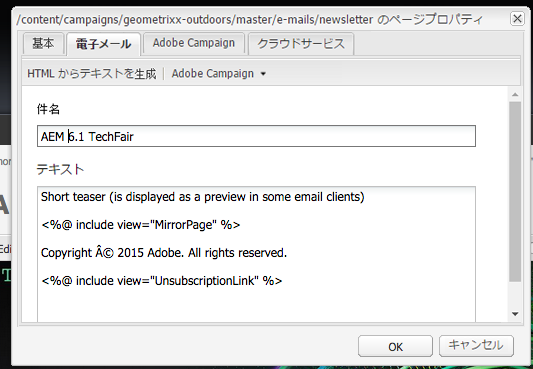

1. サイドキックから要素を適宜追加して、電子メールコンテンツを編集します。要素を追加するにはドラッグ＆ドロップします。その後、編集する要素をダブルクリックします。

   例えば、パーソナライゼーションフィールドを含むテキストを追加できます。

   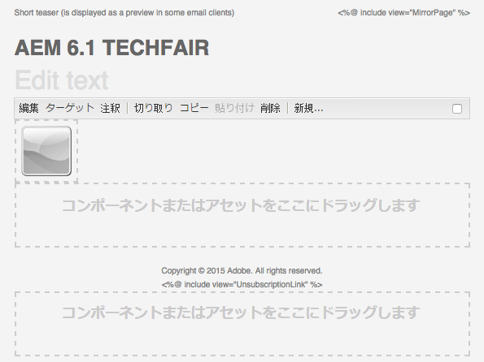

   Adobe Campaign のニュースレターまたは電子メールキャンペーンに使用できるコンポーネントについては、[Adobe Campaign コンポーネント](/help/sites-classic-ui-authoring/classic-personalization-ac-components.md)を参照してください。

   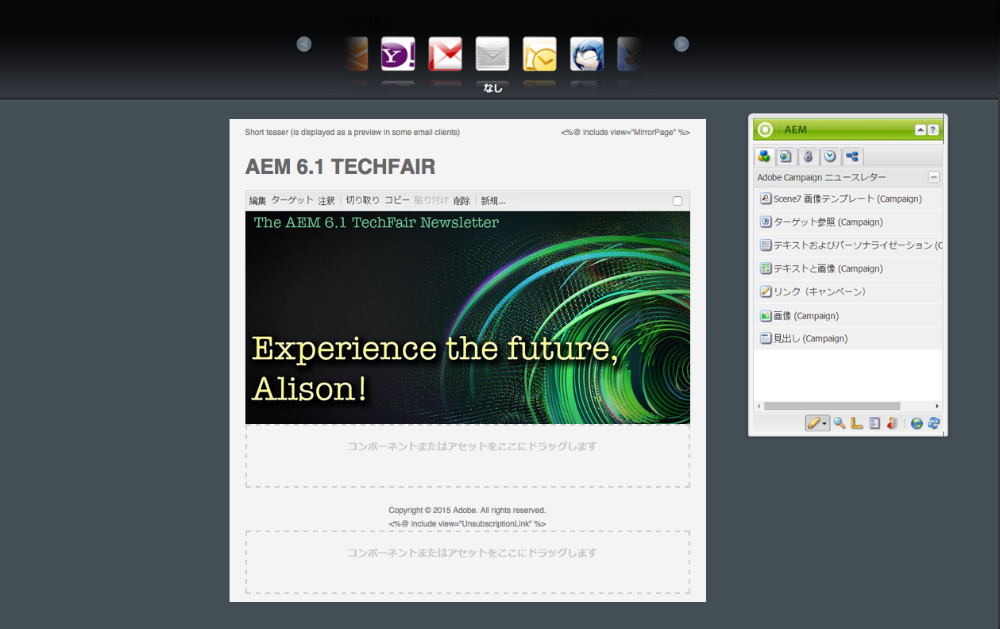

### パーソナライゼーションの挿入 {#inserting-personalization}

コンテンツを編集するとき、次のものを挿入できます。

* Adobe Campaign コンテキストフィールド。これらは、受信者のデータ(名、姓、ターゲットディメンションのデータなど)に応じてテキスト内に挿入できるフィールドです。
* Adobe Campaign パーソナライゼーションブロック。これらは、ブランドロゴやミラーページへのリンクなど、受信者のデータとは関係のない事前定義済みコンテンツのブロックです。

Adobe Campaign コンテンツの詳細については、[Adobe Campaign コンポーネント](/help/sites-classic-ui-authoring/classic-personalization-ac-components.md)を参照してください。

>[!NOTE]
>
>* Adobe Campaign の「**プロファイル**」ターゲティングディメンションのフィールドのみが考慮されます。
>* When viewing Properties from **Sites**, you do not have access to the Adobe Campaign context fields. これらのフィールドには編集時に電子メール内から直接アクセスできます。

>

1. Insert a new **Newsletter** > **Text &amp; Personalization (Campaign)** component.
1. ダブルクリックしてコンポーネントを開きます。**編集**&#x200B;ウィンドウには、パーソナライゼーション要素を挿入できる機能があります。

   >[!NOTE]
   >
   >使用可能なコンテキストフィールドは、Adobe Campaign の「**プロファイル**」ターゲティングディメンションに対応しています。
   >
   >See [Linking an AEM page to an Adobe Campaign email](/help/sites-classic-ui-authoring/classic-personalization-ac-campaign.md#linkinganaempagetoanadobecampaignemail).

   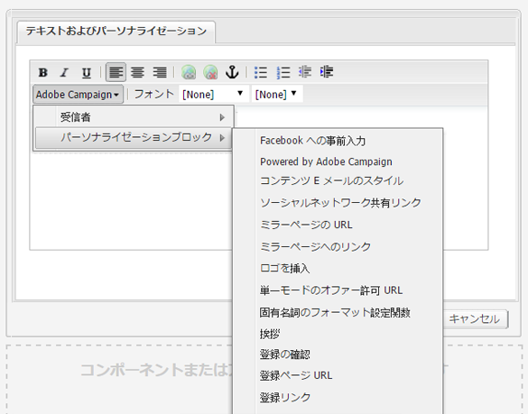

1. Select **Client Context** in the sidekick to test the personalization fields using the data in the persona profiles.

   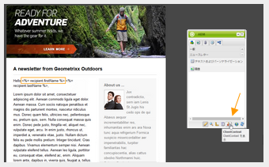

1. ウィンドウが表示され、適切なペルソナを選択できます。パーソナライゼーションフィールドの値は、選択したプロファイルのデータで自動的に置き換えられます。

   

### ニュースレターのプレビュー {#previewing-a-newsletter}

パーソナライゼーションと同様に、ニュースレターもプレビューすることができます。

1. プレビューするニュースレターを開き、プレビュー（虫眼鏡アイコン）をクリックすると、サイドキックが小さく折りたたまれます。
1. 電子メールクライアントのアイコンをクリックすると、各電子メールクライアントでニュースレターがどのように表示されるかを確認できます。

   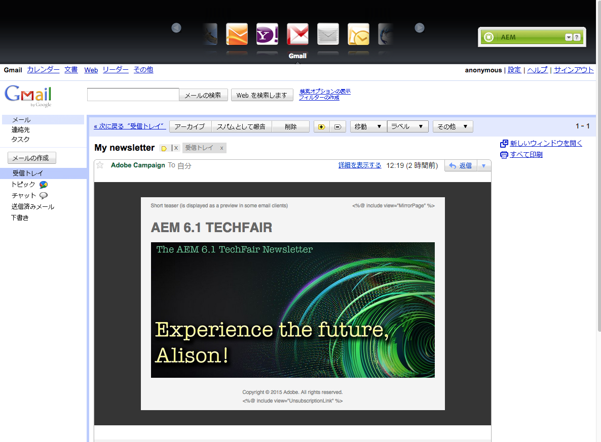

1. 編集を再開するには、サイドキックを展開します。

### AEM でのコンテンツの承認 {#approving-content-in-aem}

コンテンツの作成が完了したら、承認プロセスを開始できます。Go to the **Workflow** tab of the toolbox and select the **Approve for Adobe Campaign** workflow.

この既製のワークフローには、改訂して承認または改訂して拒否という 2 つのステップがあります。このワークフローを拡張して、より複雑なプロセスに適合させることができます。

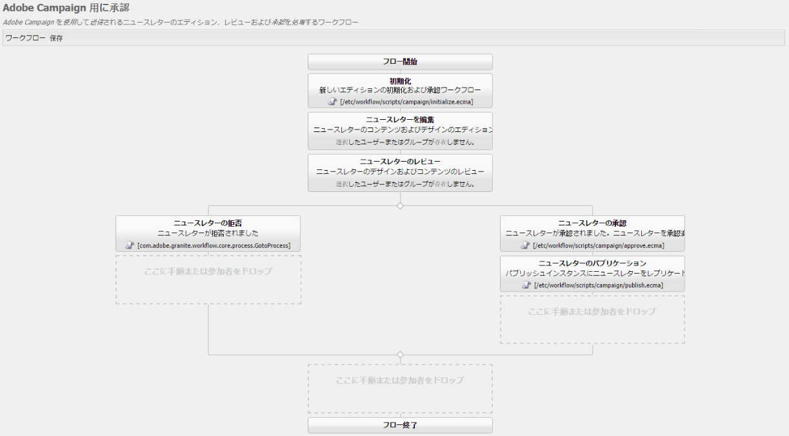

To approve content for Adobe Campaign, apply the workflow by selecting **Workflow** in the sidekick and selecting **Approve for Adobe Campaign** and click **Start Workflow**. 手順に従って、コンテンツを承認します。 ワークフローの最後のステップで、「**承認**」の代わりに「**拒否**」を選択して、コンテンツを拒否することもできます。

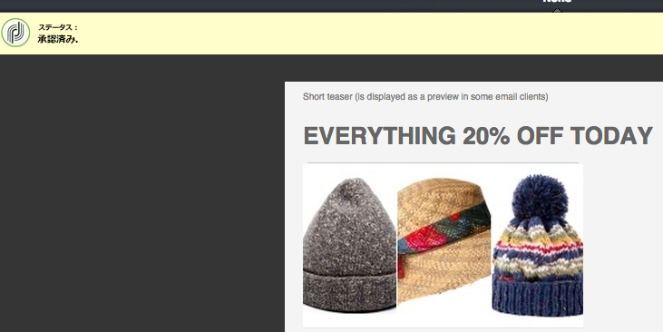

コンテンツを承認すると、承認済みとして Adobe Campaign に表示されます。すると、電子メールを送信できるようになります。

Adobe Campaign Standard の場合：

Adobe Campaign 6.1 の場合：

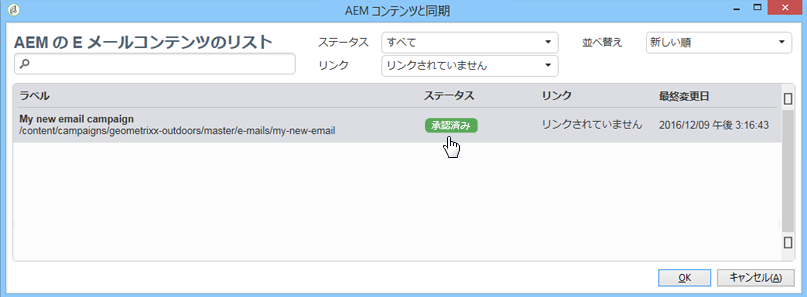

>[!NOTE]
>
>未承認のコンテンツは、Adobe Campaign の配信と同期できますが、配信を実行することはできません。Adobe Campaign の配信を使用して送信できるのは、承認済みのコンテンツだけです。

## AEM と Adobe Campaign Standard および Adobe Campaign 6.1 のリンク {#linking-aem-with-adobe-campaign-standard-and-adobe-campaign}

>[!NOTE]
>
>See [Linking AEM with Adobe Campaign Standard and Adobe Campaign 6.1](/help/sites-authoring/campaign.md#linking-aem-with-adobe-campaign-standard-and-adobe-campaign-classic) under [Working with Adobe Campaign 6.1 and Adobe Campaign Standard](/help/sites-authoring/campaign.md) in the standard authoring docurmentation for details.

