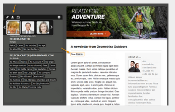

# Adobe Campaign 6.1 および Adobe Campaign Standard の使用 {#working-with-adobe-campaign-and-adobe-campaign-standard}

AEM でメールコンテンツを作成して、Adobe Campaign のメールで処理することができます。これを実行するには、次の手順に従う必要があります。

1. AEMでAdobe Campaign固有のテンプレートからニュースレターを作成します。
1. 選択 [Adobe Campaignサービス](#selectingtheadobecampaigncloudservice) コンテンツを編集してすべての機能にアクセスする前に、
1. コンテンツを編集します。
1. コンテンツを検証します。

その後、Adobe Campaignの配信とコンテンツを同期できます。 詳細な手順については、このドキュメントを参照してください。

>[!NOTE]
>
>この機能を使用する前に、AEMを [Adobe Campaign](/help/sites-administering/campaignonpremise.md) または [Adobe Campaign Standard](/help/sites-administering/campaignstandard.md).

## Adobe Campaign経由での電子メールコンテンツの送信 {#sending-email-content-via-adobe-campaign}

AEMとAdobe Campaignを設定した後、E メール配信コンテンツをAEMで直接作成し、Adobe Campaignで処理できます。

Adobe Campaign のコンテンツを AEM 内で作成する場合は、すべての機能にアクセスするために、コンテンツを編集する前に Adobe Campaign サービスにリンクする必要があります。

次の 2 つの場合が考えられます。

* コンテンツは、Adobe Campaignからの配信と同期できます。 これにより、配信でAEMコンテンツを使用できます。
* (Adobe Campaignオンプレミスのみ ) コンテンツをAdobe Campaignに直接送信し、新しい E メール配信を自動的に生成できます。 このモードには制限があります。

詳細な手順については、このドキュメントを参照してください。

### 新しいメールコンテンツの作成 {#creating-new-email-content}

>[!NOTE]
>
>メールテンプレートを追加する場合は、テンプレートを使用可能にするために、必ず **/content/campaigns** の下に追加してください。
>

1. AEM で、**Websites** フォルダーを選択してから、エクスプローラーを参照して、メールキャンペーンを管理している場所を探します。次の例では、関係するノードは **Web サイト**／**Campaigns**／**Geometrixx Outdoors**／**メールキャンペーン**&#x200B;です。

   >[!NOTE]
   >
   >[メールのサンプルは、Geometrixx でのみ使用できます](/help/sites-developing/we-retail.md#weretail)。サンプルGeometrixxコンテンツをパッケージ共有からダウンロードします。

   

1. **新規**／**新しいページ**&#x200B;を選択して、新しいメールコンテンツを作成します。
1. Adobe Campaign専用の使用可能なテンプレートの 1 つを選択し、ページの一般的なプロパティを入力します。 デフォルトでは、次の 3 つのテンプレートを使用できます。

   * **Adobe Campaign メール（AC 6.1）**：コンテンツを定義済みのテンプレートに追加してから、配信のために Adobe Campaign 6.1 に送信します。
   * **Adobe Campaign メール（ACS）**：コンテンツを定義済みのテンプレートに追加してから、配信のために Adobe Campaign Standard に送信します。

   

1. 「**作成**」をクリックして、メールまたはニュースレターを作成します。

### Adobe Campaign Cloud Service とテンプレートの選択 {#selecting-the-adobe-campaign-cloud-service-and-template}

Adobe Campaignと統合するには、ページにAdobe Campaignクラウドサービスを追加する必要があります。 これにより、パーソナライゼーションやその他のAdobe Campaign情報にアクセスできます。

また、Adobe Campaignテンプレートを選択し、件名を変更し、HTMLで E メールを表示しないユーザー向けにプレーンテキストコンテンツを追加する必要が生じる場合もあります。

1. サイドキックで「**ページ**」タブを選択し、「**ページのプロパティ**」を選択します。
1. ポップアップウィンドウの「**クラウドサービス**」タブで、「**サービスを追加**」を選択して Adobe Campaign サービスを追加し、「**OK**」をクリックします。

   

1. 使用している Adobe Campaign インスタンスに一致する設定をドロップダウンリストから選択し、「**OK**」をクリックします。

   >[!NOTE]
   >
   >必ず「 **OK** または **適用** クラウドサービスを追加した後。 これにより、 **Adobe Campaign** 」タブが正しく機能しない問題を修正しました。

1. デフォルトの&#x200B;**メール**&#x200B;テンプレート以外の、（Adobe Campaign の）特定のメール配信テンプレートを適用したい場合は、「**ページのプロパティ**」を再度選択します。「**Adobe Campaign**」タブで、関連する Adobe Campaign インスタンス内でのメール配信テンプレートの内部名を入力します。

   Adobe Campaign Standardでは、テンプレートは **AEM Content での配信**. Adobe Campaign 6.1 では、テンプレートは次のようになります。 **AEMコンテンツを含む E メール配信**.

   このテンプレートを選択すると、**Adobe Campaign ニュースレター**&#x200B;コンポーネントが自動的に有効になります。

### E メールコンテンツの編集 {#editing-email-content}

電子メールコンテンツは、クラシック UI またはタッチ操作向け UI で編集できます。

1. ツールボックスから&#x200B;**ページのプロパティ**／**メール**&#x200B;を選択して、メールの件名とテキストバージョンを入力します。

   

1. サイドキックで使用可能な要素から目的の要素を追加して、E メールコンテンツを編集します。 これをおこなうには、ドラッグ&amp;ドロップします。 次に、編集する要素をダブルクリックします。

   例えば、パーソナライゼーションフィールドを含むテキストを追加できます。

   

   Adobe Campaign のニュースレターまたはメールキャンペーンに使用できるコンポーネントの説明については、[Adobe Campaign コンポーネント](/help/sites-classic-ui-authoring/classic-personalization-ac-components.md)を参照してください。

   

### パーソナライゼーションの挿入 {#inserting-personalization}

コンテンツの編集時に、以下を挿入できます。

* Adobe Campaign コンテキストフィールド。これらは、受信者のデータ（名、姓またはターゲットディメンションの任意のデータなど）に応じてテキスト内に適応させるために挿入できるフィールドです。
* Adobe Campaign パーソナライゼーションブロック。これらは、ブランドロゴやミラーページへのリンクなど、受信者のデータとは関係のない定義済みコンテンツのブロックです。

詳しくは、 [Adobe Campaign Components](/help/sites-classic-ui-authoring/classic-personalization-ac-components.md) を参照してください。

>[!NOTE]
>
>* Adobe Campaignのフィールドのみ **プロファイル** ターゲティングディメンションが考慮されます。
>* プロパティを「**サイト**」から表示すると、Adobe Campaign コンテキストフィールドにアクセスできません。これらのフィールドには編集時にメール内から直接アクセスできます。
>

1. 新しい&#x200B;**ニュースレター**／**テキストおよびパーソナライゼーション（キャンペーン）**&#x200B;コンポーネントを挿入します。
1. コンポーネントをダブルクリックして開きます。 The **編集** ウィンドウには、パーソナライゼーション要素を挿入できる機能があります。

   >[!NOTE]
   >
   >使用可能なコンテキストフィールドは、 **プロファイル** Adobe Campaignのターゲティングディメンション。
   >
   >[Adobe Campaign メールへの AEM ページのリンク](/help/sites-classic-ui-authoring/classic-personalization-ac-campaign.md#linkinganaempagetoanadobecampaignemail)を参照してください。

   

1. ペルソナプロファイルのデータを使用してパーソナライゼーションフィールドをテストするには、サイドキックで「**ClientContext**」を選択します。

   

1. ウィンドウが表示され、目的のペルソナを選択できます。 パーソナライゼーションフィールドは、選択したプロファイルのデータに自動的に置き換えられます。

   

### ニュースレターのプレビュー {#previewing-a-newsletter}

ニュースレターの外観とパーソナライゼーションのプレビューをプレビューできます。

1. プレビューするニュースレターを開き、プレビュー（虫眼鏡）アイコンをクリックすると、サイドキックが小さく折りたたまれます。
1. メールクライアントのアイコンをクリックすると、各メールクライアントでニュースレターがどのように表示されるかを確認できます。

   

1. サイドキックを展開して、編集を再開します。

### AEMでのコンテンツの承認 {#approving-content-in-aem}

コンテンツの作成が完了したら、承認プロセスを開始できます。 ツールボックスの「**ワークフロー**」タブに移動して、「**Adobe Campaign 用に承認**」ワークフローを選択します。

そのまま使用できるこのワークフローには、リビジョンと承認、またはリビジョンと却下の 2 つのステップがあります。 ただし、このワークフローは、より複雑なプロセスに拡張し、適応させることができます。

Adobe Campaign 用にコンテンツを承認するには、サイドキックで「**ワークフロー**」を選択し、「**Adobe Campaign 用に承認**」を選択し、「**ワークフローを開始**」をクリックします。ステップを実行して、コンテンツを承認します。ワークフローの最後のステップで、「**承認**」の代わりに「**拒否**」を選択して、コンテンツを拒否することもできます。

コンテンツが承認されると、Adobe Campaignに承認済みと表示されます。 その後、E メールを送信できます。

ADOBE CAMPAIGN STANDARD:

Adobe Campaign 6.1 の場合：

>[!NOTE]
>
>未承認のコンテンツは、Adobe Campaignの配信と同期できますが、配信を実行できません。 承認済みコンテンツのみキャンペーン配信経由で送信できます。

## AEMとAdobe Campaign StandardおよびAdobe Campaign 6.1 のリンク {#linking-aem-with-adobe-campaign-standard-and-adobe-campaign}

>[!NOTE]
>
>詳しくは、標準のオーサリングドキュメントの [Adobe Campaign 6.1 および Adobe Campaign Standard の使用](/help/sites-authoring/campaign.md)にある [AEM と Adobe Campaign Standard および Adobe Campaign 6.1 のリンク](/help/sites-authoring/campaign.md#linking-aem-with-adobe-campaign-standard-and-adobe-campaign-classic)を参照してください。
