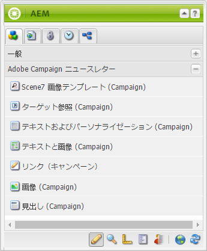
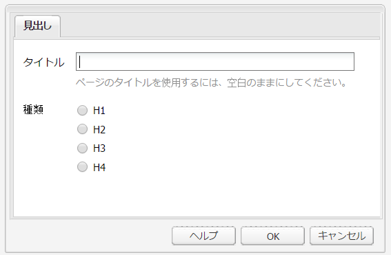
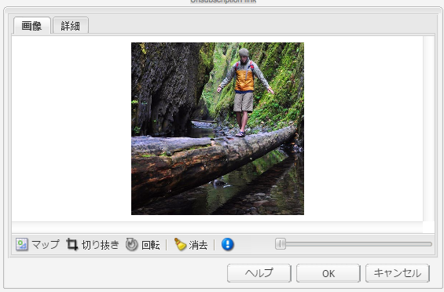
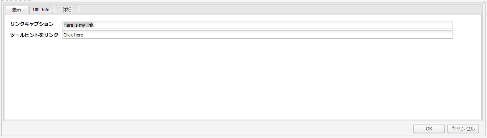
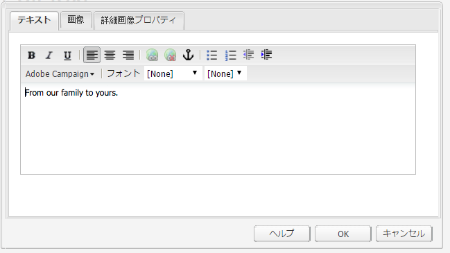
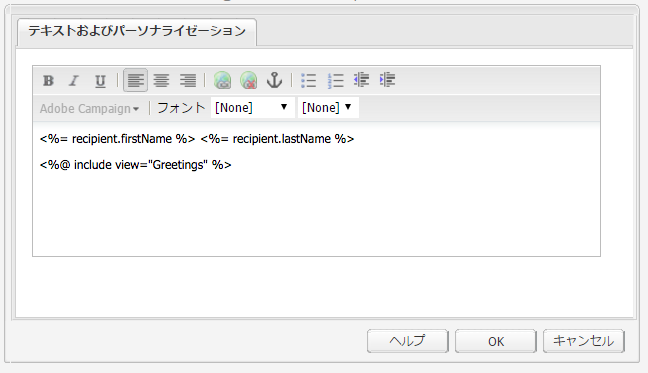
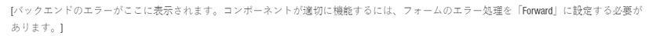
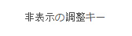
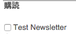
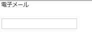

# Adobe Campaign コンポーネント{#adobe-campaign-components}

Adobe Campaignと統合すると、ニュースレターやフォームを扱う際に使用できるコンポーネントが用意されます。 このドキュメントでは、両方について説明します。

>[!CAUTION]
>
>AEM メールコンポーネントは非推奨（廃止予定）となりました。コンテンツとスタイルを結合するメールの性質上、AEM で標準で提供されるメールコンポーネントは、プロジェクトで必要なすべてのコンポーネントにカスタムスタイルを実装する必要があるので、顧客による再利用の機会は限られています。
>
>メールコンポーネントはプロジェクトレベルで実装できます。その方法は、非推奨の AEM メールコンポーネントを見ればわかります。ただし、これらの非推奨コンポーネントは、プロジェクトでは使用しないでください。

## Adobe Campaign ニュースレターコンポーネント {#adobe-campaign-newsletter-components}

すべての Adobe Campaign コンポーネントは、[メールテンプレートのベストプラクティス](/help/sites-administering/best-practices-for-email-templates.md)で大まかに説明されているベストプラクティスに従います。また、Adobe マークアップ言語 [HTL](https://helpx.adobe.com/jp/experience-manager/htl/using/overview.html) をベースとしています。

Adobe Campaign と連携するように設定されているニュースレターまたはメールを開くと、「**Adobe Campaign ニュースレター**」セクションに以下のコンポーネントが表示されます。

* 見出し (Campaign)
* 画像 (Campaign)
* リンク（Campaign）
* Scene7 画像テンプレート (Campaign)
* ターゲット参照 (Campaign)
* テキストと画像 (Campaign)
* テキストおよびパーソナライゼーション（Campaign）

これらのコンポーネントの説明は、次の節で説明します。

### 見出し (Campaign) {#heading-campaign}

見出しコンポーネントでは、次のいずれかを実行できます。

* 現在のページの名前を表示するには、 **タイトル** フィールドが空白です。
* 指定したテキストを **タイトル** フィールドに入力します。

次を編集： **見出し (Campaign)** コンポーネントを直接使用します。 ページのタイトルを使用するには、空白のままにしてください。

次の項目を設定できます。

* **タイトル**
ページタイトル以外の名前を使用する場合は、ここに入力します。

* **見出しレベル（1、2、3、4）**
HTML の見出しサイズ 1～4 に基づいた見出しレベル。

見出し（Campaign）コンポーネントの表示例を以下に示します。

### 画像 (Campaign) {#image-campaign}

画像（キャンペーン）コンポーネントには、指定したパラメーターに従って、画像と付属のテキストが表示されます。

画像をアップロードした後、編集および操作できます（例えば、切り抜き、回転、リンク/タイトル/テキストの追加）。

画像をアップロードした後に、編集および操作できます（切り抜き、回転、リンク／タイトル／テキストの追加など）。画像は、 [コンテンツファインダー](/help/sites-authoring/author-environment-tools.md#thecontentfinderclassicui) を直接コンポーネントまたはその編集ダイアログに追加します。 編集ダイアログの中央の領域をダブルクリックして、ローカルファイルシステムを参照し、画像をアップロードすることもできます。 編集ダイアログの 2 つのタブで、画像の定義と操作をすべて制御することもできます。

画像を読み込む際は、次の設定が可能です。

* **マップ**
画像をマップするには、「マップ」を選択します。画像マップの作成方法（長方形、多角形など）を指定し、領域が指す位置を指定します。

* **切り抜き**
「切り抜き」をクリックして画像を切り抜きます。マウスを使用して画像を切り抜きます。

* **回転**
画像を回転するには、「回転」を選択します。画像が目的の向きになるまで繰り返し使用します。

* **消去**
現在の画像を削除します。

* ズームバー（クラシックのみ）
画像のズームインおよびズームアウトを行うには、画像の下（「OK」および「キャンセル」ボタンの上）のスライドバーを使用します。
* **タイトル**
画像のタイトル。

* **代替テキスト**
アクセス可能なコンテンツを作成する際に使用する代替テキスト。

* **リンク先**
Web サイト内のアセットまたはその他のページへのリンクを作成します。

* **説明**
画像の説明。

* **サイズ**
画像の高さと幅を設定します。

>[!NOTE]
>
>「**詳細**」タブの「**代替テキスト**」フィールドに情報を入力する必要があります。入力しない場合は画像を保存できず、次のエラーメッセージが表示されます。
>
>`Validation failed. Verify the values of the marked fields.`

画像（Campaign）コンポーネントの表示例を以下に示します。

### リンク（Campaign） {#link-campaign}

リンク（キャンペーン）コンポーネントを使用して、ニュースレターにリンクを追加できます。 このコンポーネントは、タッチ操作向け UI で追加し、互換性モードで開くことができますが、クラシック UI でのみ使用できます。

以下の項目を「**表示**」、「**URL 情報**」または「**詳細**」タブで設定できます。

* **リンクキャプション**
リンクのキャプション。ユーザーに表示されるテキストです。

* **リンクツールチップ**
リンクの使用方法に関する追加情報を付加します。

* **LinkType**
ドロップダウンリストで、 
**カスタム URL** および **アダプティブドキュメント**。このフィールドは必須です. 「カスタム URL 」を選択した場合は、リンク URL を指定できます。 「アダプティブドキュメント」を選択した場合は、ドキュメントのパスを指定できます。

* **追加の URL パラメーター**
追加の URL パラメーターがあれば追加します。「項目を追加」をクリックして、複数の項目を追加します。

>[!NOTE]
>
>「**URL 情報**」タブの「**リンクタイプ**」フィールドに情報を入力する必要があります。入力しない場合はコンポーネントを保存できず、次のエラーメッセージが表示されます。
>
>`Validation failed. Verify the values of the marked fields.`

リンク（Campaign）コンポーネントの表示例を以下に示します。

### ターゲット参照 (Campaign) {#targeted-reference-campaign}

ターゲット参照 (Campaign) コンポーネントを使用して、ターゲット段落への参照を作成できます。

このコンポーネントでは、ターゲットの段落に移動して選択します。

ドロップダウンメニューをクリックして、参照する段落に移動します。 終了したら、 **OK**.

### テキストと画像 (Campaign) {#text-image-campaign}

テキストと画像 (Campaign) コンポーネントは、テキストブロックと画像を追加します。

テキストおよびパーソナライゼーション（Campaign）コンポーネントや画像（Campaign）コンポーネントと同様に、次の項目を設定できます。

* **テキスト**
テキストを入力します。ツールバーを使用して、書式設定の変更、リストの作成およびリンクの追加を行います。

* **画像**
コンテンツファインダーから画像をドラッグするか、クリックして画像を参照します。必要に応じて、切り抜きや回転を行います。

* **画像のプロパティ**（**詳細画像プロパティ**）
次の項目を指定できます。

   * **タイトル**
ブロックのタイトル。マウスポインターを置くと表示されます。

   * **代替テキスト**
画像を表示できない場合に表示する代替テキスト。

   * **リンク先**
web サイト内のアセットまたはその他のページへのリンクを作成します。

   * **説明**
画像の説明。

   * **サイズ**
画像の高さと幅を設定します。

>[!NOTE]
>
>「**詳細**」タブの「**代替テキスト**」フィールドは必須です。入力されていない場合、コンポーネントを保存できず、次のエラーメッセージが表示されます。
>
>`Validation failed. Verify the values of the marked fields.`

テキストと画像（Campaign）コンポーネントの表示例を以下に示します。

### テキストおよびパーソナライゼーション（Campaign） {#text-personalization-campaign}

テキストおよびパーソナライゼーション（Campaign）コンポーネントを使用すると、[リッチテキストエディター](/help/sites-authoring/rich-text-editor.md)の機能を備えた WYSIWYG エディターでテキストブロックを入力できます。さらに、このコンポーネントでは、Adobe Campaign のコンテキストフィールドとパーソナライゼーションブロックを使用できます。[パーソナライゼーションの挿入](/help/sites-classic-ui-authoring/classic-personalization-ac-campaign.md#inserting-personalization)も参照してください。

フォントの文字、配置、リンク、リスト、インデントなど、多様なアイコンでテキストの書式を設定できます。

通常のリッチテキストエディターでの操作と同様に、テキストを追加します。 Adobe Campaignドロップダウンを選択し、必要に応じてフィールドを選択して、パーソナライゼーションを追加します。

テキストフィールド、コンテキストフィールド、パーソナライゼーションブロックを追加して、コンテンツを作成します。 次に、「 ClientContext 」を選択して、ペルソナプロファイル内のデータをテストします。 ペルソナを選択すると、パーソナライゼーションフィールドは、選択したプロファイルのデータに自動的に置き換えられます。

>[!NOTE]
>
>**nms:seedMember** スキーマまたはその拡張で定義されているフィールドのみが考慮されます。`nms:seedMember` にリンクしているテーブルの属性は使用できません。

## Adobe Campaign フォームコンポーネント {#adobe-campaign-form-components}

Adobe Campaignコンポーネントを使用して、ユーザーがニュースレターの購読、ニュースレターの購読解除またはユーザープロファイルの更新を行うために入力するフォームを作成します。 詳しくは、 [Adobe Campaign Formsの作成](/help/sites-classic-ui-authoring/classic-personalization-ac-forms.md) を参照してください。

各コンポーネントフィールドは、 Adobe Campaignデータベースフィールドにリンクできます。 使用可能なフィールドは、の節で説明しているように、含まれるデータのタイプに応じて異なります [コンポーネントとデータタイプ](#components-and-data-type). Adobe Campaignで受信者スキーマを拡張する場合、データタイプが一致するコンポーネントで新しいフィールドが使用可能になります。

Adobe Campaign と統合するように設定されているフォームを開くと、「**Adobe Campaign**」セクションに以下のコンポーネントが表示されます。

* チェックボックス （Campaign）
* 日付フィールド (Campaign) と日付フィールド/HTML5 (Campaign)
* 暗号化されたプライマリキー (Campaign)
* エラー表示 (Campaign)
* 非表示の紐付けキー（Campaign）
* 数値フィールド （Campaign）
* オプションフィールド （Campaign）
* 購読チェックリスト（Campaign）
* テキストフィールド （Campaign）

ここでは、各コンポーネントについて詳しく説明します。

### コンポーネントとデータタイプ {#components-and-data-type}

次の表に、Adobe Campaignプロファイルデータの表示と変更に使用できるコンポーネントを示します。 各コンポーネントをAdobe Campaignプロファイルフィールドにマッピングして、値を表示し、フォームの送信時にフィールドを更新できます。 異なるコンポーネントは、適切なデータタイプのフィールドにのみ一致させることができます。

<table>
 <tbody>
  <tr>
   <td>
<strong>コンポーネント</strong>
 </td>
   <td>
<strong>Adobe Campaign フィールドのデータタイプ</strong>
 </td>
   <td>
<strong>フィールドの例</strong>
 </td>
  </tr>
  <tr>
   <td>
チェックボックス （Campaign）
 </td>
   <td>
ブール値
 </td>
   <td>
今後の連絡は不要（すべてのチャネル）
 </td>
  </tr>
  <tr>
   <td>
日付フィールド （Campaign）
 
日付フィールド / HTML 5 （Campaign）
 </td>
   <td>
date
 </td>
   <td>
生年月日
 </td>
  </tr>
  <tr>
   <td>
数値フィールド （Campaign）
 </td>
   <td>
数値 (byte、short、long、double)
 </td>
   <td>
年齢
 </td>
  </tr>
  <tr>
   <td>
オプションフィールド （Campaign）
 </td>
   <td>
関連する値のバイト
 </td>
   <td>
性別
 </td>
  </tr>
  <tr>
   <td>
テキストフィールド （Campaign）
 </td>
   <td>
文字列
 </td>
   <td>
メール
 </td>
  </tr>
 </tbody>
</table>

### ほとんどのコンポーネントに共通の設定 {#settings-common-to-most-components}

Adobe Campaignコンポーネントには、すべてのコンポーネントで共通の設定があります ( 暗号化されたプライマリキーと非表示の紐付けキーコンポーネントを除く )。

ほとんどのコンポーネントでは、次の設定を行うことができます。

#### タイトルとテキスト {#title-and-text}

* **タイトル**
要素名以外の名前を使用する場合は、ここに入力します。

* **タイトルを非表示にする**
タイトルを表示しない場合は、このチェックボックスをオンにします。

* **説明**
フィールドに説明を追加して、ユーザーに詳しい情報を提供します。

* **値の表示のみ**
値が存在する場合、その値を表示します。

#### Adobe Campaign {#adobe-campaign}

次の項目を設定できます。

* **マッピング**
必要に応じて、Adobe Campaign パーソナライゼーションフィールドを選択します。

* **紐付けキー**
このフィールドを紐付けキーの一部にする場合は、このチェックボックスをオンにします。

#### 制約 {#constraints}

* **必須** - このチェックボックスをオンにすると、このコンポーネントが必須になります。つまり、ユーザーは値を入力しなければならなくなります。
* **必須メッセージ** - オプションで、このフィールドが必須であることを示すメッセージを追加します。

#### スタイル設定 {#styling}

* **CSS**
このコンポーネントに使用する CSS クラスを入力します。

### チェックボックス （Campaign） {#checkbox-campaign}

チェックボックス (Campaign) コンポーネントを使用すると、ブール型データタイプのAdobe Campaignプロファイルフィールドをユーザーが変更できます。 例えば、受信者がどのチャネルからも連絡を受けたくないことを指定できるチェックボックス（キャンペーン）コンポーネントがあるとします。

以下が可能です。 [ほとんどのAdobe Campaignコンポーネントに共通の設定を構成](#settings-common-to-most-components) 」をクリックします。

次の例は、チェックボックス (Campaign) コンポーネントの表示を示しています。

### 日付フィールド (Campaign) と日付フィールド/HTML5 (Campaign) {#date-field-campaign-and-date-field-html-campaign}

日付フィールドを使用して、受信者に日付の指定を許可します。例えば、受信者に生年月日を指定してもらいたい場合があります。 日付形式は、Adobe Campaignインスタンスで使用されている形式と一致します。

[大部分の Adobe Campaign コンポーネントに共通の設定](#settings-common-to-most-components)に加え、次の項目を設定できます。

* **制約 - 制約** - 「**なし**」または「**日付**」を選択して、日付の制約を追加するかどうかを設定できます。「日付」を選択した場合、ユーザーはこのフィールドに日付形式で値を入力する必要があります。

* **制約メッセージ** - さらに、ユーザーに回答の適切な形式を示す、制約メッセージを追加できます。
* **スタイル設定 - 幅**「**+**」アイコンと「**-**」アイコンをクリックまたはタップするか、数字を入力して、フィールドの幅を調整します。

幅が調整された日付フィールド（Campaign）コンポーネントの表示例を以下に示します。

### 暗号化されたプライマリキー (Campaign) {#encrypted-primary-key-campaign}

このコンポーネントは、Adobe Campaignプロファイル (**メインリソース識別子** または **暗号化されたプライマリキー** ( それぞれAdobe Campaign Standardと 6.1)。

Adobe Campaignプロファイルデータの表示と変更を行う各フォーム **必須** 暗号化されたプライマリキーコンポーネントを含めます。

暗号化プライマリキー (Campaign) コンポーネントで、次の設定をおこなえます。

* **タイトルとテキスト - 要素名** - デフォルト値は encryptedPK です。要素名は、フォーム上の別の要素の名前と競合する場合にのみ変更する必要があります。 同じ要素名を持つフォームフィールドは 2 つありません。
* **Adobe Campaign - URL パラメーター** - EPK 用の URL パラメーターを追加します。例えば、 **epk**.

次の例は、暗号化されたプライマリキー (Campaign) コンポーネントの表示を示しています。

### エラー表示 (Campaign) {#error-display-campaign}

このコンポーネントを使用すると、バックエンドエラーを表示できます。 コンポーネントを正しく機能させるには、フォームのエラー処理を「Forward」に設定する必要があります。

次の例は、エラー表示 (Campaign) コンポーネントの表示を示しています。

### 非表示の紐付けキー（Campaign） {#hidden-reconciliation-key-campaign}

非表示の紐付けキー（Campaign）コンポーネントを使用して、非表示のフィールドを紐付け整キーの一部としてフォームに追加できます。

非表示の紐付けキー（Campaign）コンポーネントでは、次の項目を設定できます。

* **タイトルとテキスト - 要素名** - デフォルト値は reconcilKey です。要素名は、フォーム上の別の要素の名前と競合する場合にのみ変更する必要があります。 同じ要素名を持つフォームフィールドは 2 つありません。
* **Adobe Campaign - マッピング** - Adobe Campaign パーソナライゼーションフィールドにマッピングします。

非表示の紐付けキー（Campaign）コンポーネントの表示例を以下に示します。

### 数値フィールド （Campaign） {#numeric-field-campaign}

数値フィールドを使用して、受信者が年齢などの数値を入力できるようにします。

[大部分の Adobe Campaign コンポーネントに共通の設定](#settings-common-to-most-components)に加え、次の項目を設定できます。

* **制約 - 制約**ドロップダウン
「**なし**」または「**数値**」を選択して、数値の制約を追加するかどうかを設定できます。「数値」を選択した場合、ユーザーはこのフィールドに数値で回答を入力する必要があります。

* **制約メッセージ** - さらに、ユーザーに回答の適切な形式を示す、制約メッセージを追加できます。
* **スタイル設定 - 幅**「**+**」アイコンと「**-**」アイコンをクリックまたはタップするか、数字を入力して、フィールドの幅を調整します。

幅が設定された数値フィールド（Campaign）コンポーネントの表示例を以下に示します。

### オプションフィールド （Campaign） {#option-field-campaign}

このドロップダウンリストで、オプションを選択できます。例えば、受信者の性別やステータスなどです。

以下が可能です。 [ほとんどのAdobe Campaignコンポーネントに共通の設定を構成](#settings-common-to-most-components) をクリックします。 ドロップダウンリストに値を入力するには、Adobe Campaign記号をクリックまたはタップして、Adobe Campaignのパーソナライゼーションフィールドの適切なフィールドを選択し、そのフィールドに移動します。

オプションフィールド（Campaign）コンポーネントの表示例を以下に示します。

### 購読チェックリスト（Campaign） {#subscriptions-checklist-campaign}

**購読チェックリスト（Campaign）**&#x200B;コンポーネントを使用して、Adobe Campaign プロファイルに関連付けられた購読を変更できます。

このコンポーネントをフォームに追加すると、利用可能なすべての購読がチェックボックスとして表示されるので、ユーザーに目的の購読を選択させることができます。ユーザーがフォームを送信すると、フォームのアクションタイプ（「**Adobe Campaign：サービスに登録**」または「**Adobe Campaign：サービスの登録解除**」）に応じて、選択されたサービスにユーザーが登録されるか、ユーザーの登録が解除されます。

>[!NOTE]
>
>このコンポーネントは、ユーザーがどのサービスを購読または購読解除しているかを確認しません。

以下が可能です。 [ほとんどのAdobe Campaignコンポーネントに共通の設定を構成](#settings-common-to-most-components) 購読チェックリスト (Campaign) コンポーネント内。 ( このコンポーネントで使用できるAdobe Campaign設定はありません。)

次に、購読チェックリスト (Campaign) コンポーネントの表示例を示します。

### テキストフィールド （Campaign） {#text-field-campaign}

テキストフィールド (Campaign) コンポーネントを使用して、名、姓、住所、電子メールアドレスなどの文字列タイプのデータを入力できます。

[大部分の Adobe Campaign コンポーネントに共通の設定](#settings-common-to-most-components)に加え、次の項目を設定できます。

* **制約 - 制約**&#x200B;ドロップダウン - 「**なし**」、「**メール**」または「**名前**（ウムラウトなし）」を選択して、メールアドレスまたは名前の制約を追加するかどうかを設定できます。「メール」を選択した場合、ユーザーはこのフィールドにメールアドレスを入力する必要があります。「名前」を選択した場合は、名前を入力する必要があります（ウムラウトは使用できません）。

* **制約メッセージ** - さらに、ユーザーに回答の適切な形式を示す、制約メッセージを追加できます。
* **スタイル設定 - 幅**「**+**」アイコンと「**-**」アイコンをクリックまたはタップするか、数字を入力して、フィールドの幅を調整します。

テキストフィールド（Campaign）コンポーネントの表示例を以下に示します。

