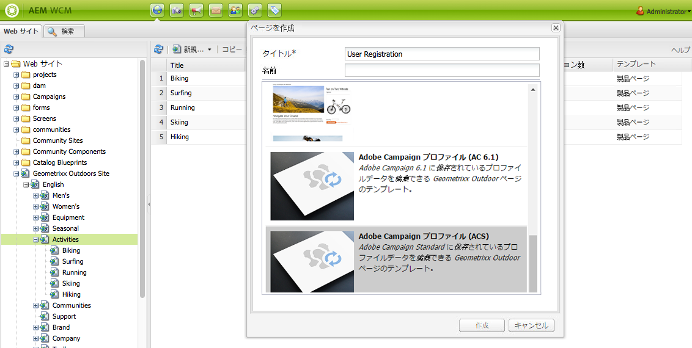
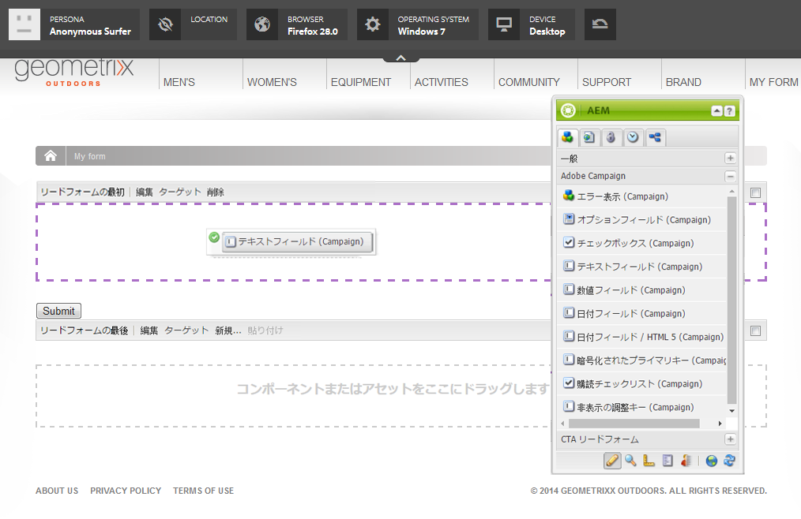

# AEM での Adobe Campaign フォームの作成{#creating-adobe-campaign-forms-in-aem}

AEM では、Web サイト上で Adobe Campaign と連携するフォームを作成できます。特定のフィールドをフォームに挿入して、Adobe Campaign データベースにマップできます。

新しい連絡先の購読、購読解除、ユーザープロファイルデータを管理しつつ、そのデータを Adobe Campaign データベースに統合できます。

Adobe Campaign フォームを AEM で使用するには、このドキュメントで説明する以下のステップを実行する必要があります。

1. テンプレートを使用可能にします。
1. フォームを作成します。
1. フォームコンテンツを編集します。

デフォルトでは、Adobe Campaign 固有の次の 3 種類のフォームを使用できます。

* プロファイルを保存
* サービスを購読
* サービスの購読を解除

これらのフォームは、Adobe Campaign プロファイルの暗号化されたプライマリキー（EPK）を受け入れる URL パラメーターを定義します。フォームはこの URL パラメーターに基づいて、関連付けられている Adobe Campaign プロファイルのデータを更新します。

一般的な使用事例では、これらのフォームを別々に作成しますが、ニュースレターのコンテンツ内にフォームページへのパーソナライズされたリンクを組み込み、受信者がそのリンクを開いて自分のプロファイルデータを調整（購読解除、購読またはプロファイル更新）できるようにします。

フォームは、ユーザーに基づいて自動的に更新されます。詳しくは、[フォームコンテンツの編集](#editing-form-content)を参照してください。

## テンプレートを使用可能にする {#making-a-template-available}

Adobe Campaign 固有のフォームを作成するには、まず、様々なテンプレートを AEM アプリケーションで使用可能にする必要があります。

To do this, see the [Templates documentation](/help/sites-developing/page-templates-static.md#templateavailability).

まず、オーサーインスタンスおよびパブリッシュインスタンスと Adobe Campaign の間の接続が有効なことを確認します。[Adobe Campaign Standard との統合](/help/sites-administering/campaignstandard.md)または [Adobe Campaign 6.1 との統合](/help/sites-administering/campaignonpremise.md)を参照してください。

>[!NOTE]
>
>Adobe Campaign 6.1.x または Adobe Campaign Standard を使用する場合は、ページの **jcr:content** ノードの **acMapping** プロパティがそれぞれ **mapRecipient** または **profile** に設定されていることを確認してください。

### フォームの作成 {#creating-a-form}

1. サイト管理者として開始します。
1. ツリー構造をたどって、選択した Web サイト内のフォームを作成したい場所に移動します。
1. **新規** / **新規ページ…を選択します。**.
1. Select either **Adobe Campaign Profile (AC 6.1)** or **Adobe Campaign Profile (ACS)** template and enter the page properties.

   >[!NOTE]
   >
   >If the template is not available, refer to the [Making a template available](/help/sites-classic-ui-authoring/classic-personalization-ac.md#activatingatemplate) section.

1. Click **Create** to create the form.

   

   これで[フォームのコンテンツを編集および設定](#editing-form-content)できます。

## フォームコンテンツの編集 {#editing-form-content}

Adobe Campaign 専用のフォームには、固有のコンポーネントがあります。これらのコンポーネントでは、フォームの各フィールドを Adobe Campaign データベースのフィールドにリンクすることができます。

>[!NOTE]
>
>If the desired template is not available, see [Making a template available](/help/sites-classic-ui-authoring/classic-personalization-ac.md#activatingatemplate).

このセクションでは、Adobe Campaign へのリンクのみを取り上げます。For more information on a more general overview of how to use forms in Adobe Experience Manager, see [Editmode components](/help/sites-classic-ui-authoring/classic-page-author-edit-mode.md).

1. 編集するフォームに移動します。
1. In the toolbox, select **Page** > **Page Properties...** then go to the **Cloud Services** tab of the pop-up window.
1. Add the Adobe Campaign service by clicking **Add service**, and then selecting the configuration that corresponds to your Adobe Campaign instance in the service&#39;s drop down list. この設定は、インスタンスとの間の接続を設定すると実行されます。For more information, see [Connecting AEM to Adobe Campaign](/help/sites-administering/campaignonpremise.md#connecting-aem-to-adobe-campaign).

   >[!NOTE]
   >
   >必要に応じて、南京錠アイコンをクリックして設定をロック解除し、Adobe Campaign サービスを追加します。

1. Access the form&#39;s general parameters using the **Edit** button found at the start of the form. The **Form** tab allows you to select a thank you page to which the user will be redirected after having validated the form.

   The **Advanced** form allows you to select the type of form. The **Post Options** field gives you the choice between three types of Adobe Campaign forms:

   * **Adobe Campaign：プロファイルを保存**：Adobe Campaign で受信者を作成または更新できます（デフォルト値）。
   * **Adobe Campaign：サービスを購読**：Adobe Campaign で受信者の購読を管理できます。
   * **Adobe Campaign：サービスの購読を解除**：Adobe Campaign で受信者の購読をキャンセルできます。

   The **Action Configuration** field lets you specify whether or not you would like to create the recipient profile in the Adobe Campaign database if it does not yet exist. To do this, check the **Create user if not existing** option.

1. 選択したコンポーネントをツールボックスからフォームにドラッグ＆ドロップして追加します。使用可能な Adobe Campaign 固有コンポーネントについては、[Adobe Campaign フォームコンポーネント](/help/sites-classic-ui-authoring/classic-personalization-ac-components.md)を参照してください。

   

1. 追加したフィールドをダブルクリックして設定します。The **Adobe Campaign** tab lets you link the field to a field in the Adobe Campaign recipient table. さらに、このフィールドを、Adobe Campaign データベース内の既存の受信者を認識するための調整キーの一部にするかどうかを指定できます。

   >[!CAUTION]
   >
   >The **Element Name** must be different for each form field. 必要に応じて変更してください。
   >
   >Each form must contain an **Encrypted Primary Key** component in order to correctly manage recipients in the Adobe Campaign database.

1. Activate the page by selecting **Page** > **Activate Page** in the toolbox. ページがサイト上でアクティベートされます。AEM のパブリッシュインスタンスに移動すると、ページを見ることができます。フォームが検証されると、Adobe Campaign データベースのデータが更新されます。

## フォームのテスト {#testing-a-form}

フォームを作成してフォームのコンテンツを編集したら、そのフォームが想定どおりに機能することを手動でテストできます。

>[!NOTE]
>
>You must have an **Encryted Primary Key** component on each form. 「コンポーネント」で、「Adobe Campaign」を選択して、これらのコンポーネントのみを表示します。
>
>この手順では暗号化されたプライマリキー（EPK）の番号を手動で入力しますが、実際には、ニュースレター内にこのページへの（購読解除、購読またはプロファイル更新をおこなうための）リンクが表示されます。EPK はユーザーに基づいて自動的に更新されます。
>
>To create that link, you use the variable **Main resource identifier**(Adobe Campaign Standard) or **Encrypted identifier** (Adobe Campaign 6.1) (for example, in a **Text &amp; Personalization (Campaign)** component), which links to the epk in Adobe Campaign.

そのためには、Adobe Campaign プロファイルの EPK を手動で取得して、URL に付加する必要があります。

1. Adobe Campaign プロファイルの暗号化されたプライマリキー（EPK）を取得するには：

   * In Adobe Campaign Standard - Navigate to **Profiles and Audiences** > **Profiles**, which lists the existing profiles. Make sure the table displays the **Main Resource Identifier** field in a column (This can be configured by clicking/tapping **Configure list**). 目的のプロファイルのメインリソース識別子をコピーします。
   * In Adobe Campaign 6.11, go to **Profiles and Targets** >  **Recipients**, which lists the existing profiles. Make sure the table displays the **Encrypted identifier** field in a column (This can be configured by right-clicking on an entry and selecting **Configure list...**). 目的のプロファイルの暗号化された識別子をコピーします。

1. In AEM, open the form page on the publish instance and append the EPK from step 1 as a URL parameter: use the same name that you previously defined in the EPK component when authoring the form (for example: `?epk=...`)
1. これで、フォームを使用して、リンクされている Adobe Campaign プロファイルに関連付けられたデータと購読を変更できるようになりました。一部のフィールドを変更してフォームを送信したら、Adobe Campaign で適切なデータが更新されていることを確認できます。

フォームが検証されると、Adobe Campaign データベースのデータが更新されます。
