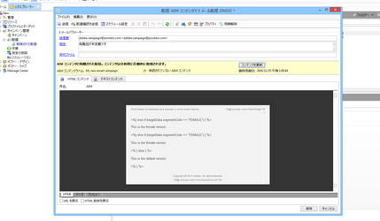

# Adobe Campaign のターゲット設定 {#targeting-your-adobe-campaign}

Adobe Campaign のニュースレターのターゲット設定を行うには、まずセグメント化を設定する必要があります（セグメント化の設定は、クラシック UI でのみ使用可能です）。その後、Adobe Campaign をターゲットにしたエクスペリエンスを作成できます。

## AEM でのセグメント化の設定 {#setting-up-segmentation-in-aem}

セグメント化の設定には、セグメント、ブランド、キャンペーンおよびエクスペリエンスの作成が含まれます。クラシック UI で作成できるのはセグメントのみです。ブランド、キャンペーンおよびエクスペリエンスは、タッチ操作向け UI で作成できます。

>[!NOTE]
>
>セグメント ID は、Adobe Campaign 側のセグメント ID にマップする必要があります。

### セグメントの作成 {#creating-segments}

セグメントは次の手順で作成します。

1. **&lt;host>:&lt;port>/miscadmin#/etc/segmentation** で[セグメント化コンソール](http://localhost:4502/miscadmin#/etc/segmentation)を開きます。
1. ページを作成してタイトル（「**AC Segments**」など）を入力し、**セグメント（Adobe Campaign）**&#x200B;テンプレートを選択します。
1. 左側のツリー表示で、作成したページを選択します。
1. セグメントを作成し（例えば、男性ユーザーをターゲットにするセグメントを作成するには、作成した「Male」というセグメントの下にページを作成します）、**セグメント（Adobe Campaign）**&#x200B;テンプレートを選択します。
1. 作成したセグメントページを開き、サイドキックからそのページに&#x200B;**セグメント ID** をドラッグ＆ドロップします。
1. 特性をダブルクリックし、このセグメント（この例では、Adobe Campaign で定義されている男性セグメント）を表す ID（「**MALE**」など）を入力して、「**OK**」をクリックします。次のメッセージ「`targetData.segmentCode == "MALE"`」が表示されます。
1. 同じステップを繰り返して、別のセグメント（例えば女性ユーザーをターゲットにするセグメント）を作成します。

### ブランドの作成 {#creating-a-brand}

レポートは次の手順で作成します。

1. 「**Sites**」で **Campaigns** フォルダー（We.Retail 内など）に移動します。
1. 「**ページを作成**」をクリックし、ページのタイトル（「We.Retail Brand」など）を入力して、**ブランド**&#x200B;テンプレートを選択します。

### キャンペーンの作成 {#creating-a-campaign}

キャンペーンは次の手順で作成します。

1. 作成した&#x200B;**ブランド**&#x200B;ページを開きます。
1. 「**ページを作成**」をクリックし、ページのタイトル（「We.Retail Campaign」など）を入力し、**キャンペーン**&#x200B;テンプレートを選択して、「**作成**」をクリックします。

### エクスペリエンスの作成 {#creating-experiences}

セグメントのエクスペリエンスは次の手順で作成します。

1. 作成した&#x200B;**キャンペーン**&#x200B;ページを開きます。
1. 「**ページを作成**」をクリックし、ページのタイトル（この例では男性セグメント用のエクスペリエンスを作成するので「Male」など）を入力してセグメント用のエクスペリエンスを作成し、**エクスペリエンス**&#x200B;テンプレートを選択します。
1. 作成したエクスペリエンスページを開きます。
1. 「**編集**」をクリックして、「セグメント」の下の「**項目を追加**」をクリックします。
1. 男性セグメントへのパス（`/etc/segmentation/ac-segments/male` など）を入力し、「**OK**」をクリックします。次のメッセージ「*エクスペリエンスは次を対象としています：男性*」が表示されます。
1. ここまでのステップを繰り返して、すべてのセグメント（女性をターゲットにするセグメントなど）用のエクスペリエンスを作成します。

## ターゲットコンテンツを使用したニュースレターの作成 {#creating-a-newsletter-with-targeted-content}

セグメント、ブランド、キャンペーンおよびエクスペリエンスを作成したら、ターゲットコンテンツを使用してニュースレターを作成できます。作成したエクスペリエンスを、セグメントにリンクさせます。

ターゲットコンテンツを使用したニュースレターは、タッチ操作向け UI とクラシック UI のどちらでも作成できます。このドキュメントでは、タッチ操作向け UI での手順を説明します。

ターゲットコンテンツを使用してニュースレターを作成するには：

1. ターゲットコンテンツを使用してニュースレターを作成します。Geometrixx Outdoors の「メールキャンペーン」で、**作成**／**ページ**&#x200B;をクリックし、Adobe Campaign メールテンプレートのいずれかを選択します。

   >[!NOTE]
   >
   >[メールのサンプルは、Geometrixx でのみ使用できます](/help/sites-developing/we-retail.md#weretail)。Geometrixx のサンプルコンテンツをパッケージ共有からダウンロードしてください。

1. ニュースレターに、テキストとパーソナライズ機能のコンポーネントを追加します。
1. テキストとパーソナライズ機能のコンポーネントに「これはデフォルトです」などのテキストを追加します。
1. 「**編集**」の横の矢印をクリックし、「**ターゲティング**」を選択します。
1. ブランドのドロップダウンメニューからブランドを選択し、キャンペーンを選択します（前に作成したブランドとキャンペーンです）。
1. 「**ターゲティングを開始**」をクリックします。セグメントが「オーディエンス」領域に表示されます。定義済みのセグメントに一致するものがない場合は、デフォルトのエクスペリエンスが使用されます。

   >[!NOTE]
   >
   >AEM に付属している電子メールサンプルでは、デフォルトで、Adobe Campaign がターゲティングエンジンとして使用されます。カスタムニュースレターでは、Adobe Campaign をターゲティングエンジンとして明示的に選択しなければならないことがあります。その場合は、ターゲット設定時にツールバーの「+」をクリックし、新しいアクティビティのタイトルを入力して、ターゲティングエンジンとして「**Adobe Campaign**」を選択します。

1. 「**デフォルト**」をクリックし、追加したテキストおよびパーソナライゼーションコンポーネントをクリックすると、矢が刺さった的のアイコンが表示されます。コンポーネントのターゲットを設定するには、このアイコンをクリックします。

   

1. 別のセグメント（Male）に移動し、「**オファーを追加**」をクリックして、プラス（+）アイコンをクリックします。次に、オファーを編集します。
1. 別のセグメント（Female）に移動し、「**オファーを追加**」をクリックして、プラス（+）アイコンをクリックします。次に、このオファーを編集します。
1. 「**次へ**」をクリックしてマッピングを表示し、「**次へ**」をクリックして設定を確認し（この設定は Adobe Campaign に適用されません）、「**保存**」をクリックします。

   Adobe Campaign 内でこのコンテンツが配信に使用されると、Adobe Campaign 用の正しいターゲット設定コードが自動的に生成されます。

1. Adobe Campaign で配信を作成します（「**AEM コンテンツでメール配信**」を選択し、必要に応じてローカル AEM アカウントを選択して、変更を確認します）。

   HTML 表示では、ターゲットコンポーネントの様々なエクスペリエンスが、Adobe Campaign ターゲット設定コード内に含まれています。

   

   >[!NOTE]
   >
   >Adobe Campaign でもセグメントを設定している場合は、「**プレビュー**」をクリックすると、各セグメントのエクスペリエンスが表示されます。
