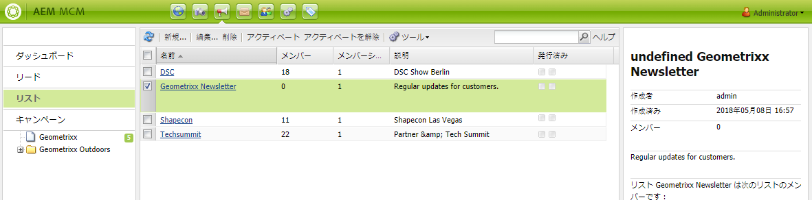
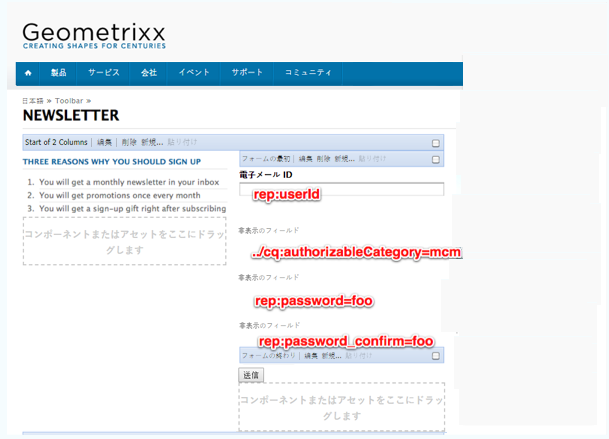
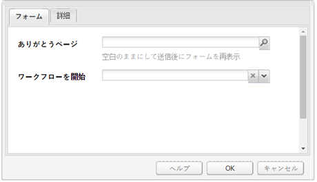
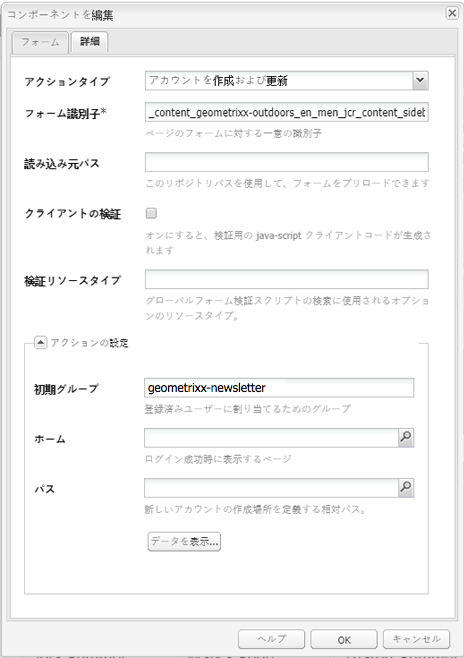
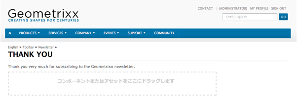
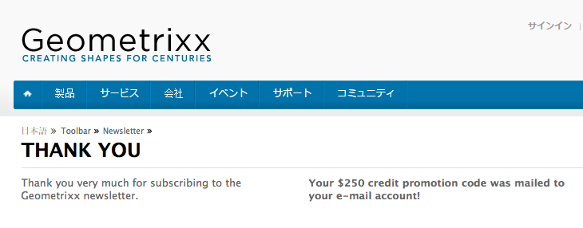

# 効果的なニュースレターのランディングページの作成{#creating-an-effective-newsletter-landing-page}

効果的なニュースレターのランディングページは、ニュースレター（または他の電子メールマーケティングキャンペーン）に新規登録するユーザーを増やすことができます。ニュースレターの新規登録で収集する情報は、見込み客の獲得に利用できます。

効果的なニュースレターのランディングページを作成するには、以下を実行する必要があります。

1. ユーザーがニュースレターを購読できるように、ニュースレターのリストを作成します。
1. 登録フォームを作成します。その際に、ニュースレターを登録するユーザーを見込み客のリストに自動追加するワークフロー手順を追加します。
1. ユーザーの登録への謝意を伝える確認ページを作成します。必要に応じて宣伝を記載します。
1. ティーザーを追加します。

>[!NOTE]
>
>この機能（リードおよびリストの管理）がさらに強化される予定はありません。
>[Adobe Campaign や AEM との統合を利用](/help/sites-administering/campaign.md)することをお勧めします。

## ニュースレター用リストの作成 {#creating-a-list-for-the-newsletter}

リストを作成します（例えば、MCM で、ユーザーが購読する必要のあるニュースレター用の **Geometrixx Newsletter** など）。リストの作成については、[リストの作成](/help/sites-classic-ui-authoring/classic-personalization-campaigns.md#creatingnewlists)を参照してください。

リストの例を以下に示します。

## 登録フォームの作成 {#create-a-sign-up-form}

ユーザーがタグを購読できるニュースレター登録フォームを作成します。サンプルの Geometrixx Web サイトでは、Geometrixx ツールバーにニュースレターページが用意されており、フォームを作成できます。

独自のニュースレターフォームを作成するには、[Forms ドキュメント](/help/sites-authoring/default-components.md#form)のフォーム作成に関する情報を参照してください。ニュースレターでは、タグライブラリのタグを使用します。タグを追加するには、[タグ管理](/help/sites-authoring/tags.md#tagadministration)を参照してください。

以下の例の非表示フィールドには、必要最小限の情報（電子メール）が示されます。また、後でフィールドを追加することもできますが、その場合は変換速度に影響があります。

次の例は、https://localhost:4502/cf#/content/geometrixx/en/toolbar/newsletter.htmlに作成されたフォームです。

1. フォームを作成します。

   

1. フォームコンポーネントの「**編集**」をクリックして、ありがとうページに移動するようにフォームを設定します（「[ありがとうページの作成](#creating-a-thank-you-page)」を参照）。

   

1. フォームアクション（フォームを送信したときに実行されるアクション）を設定し、作成済みのリストに登録ユーザーを割り当てるためのグループを設定します（例：geometrixx-newsletter）。

   

### ありがとうページの作成 {#creating-a-thank-you-page}

ユーザーが「**Subscribe Now**」をクリックしたら、ありがとうページが自動的に開くようにします。Geometrixx Newsletter ページのありがとうページを作成します。ニュースレターフォームを作成したら、フォームコンポーネントを編集し、Thank You ページへのパスを追加します。

要求を送信すると、**Thank You** ページに移動し、ユーザーに電子メールが送信されます。このありがとうページは、/content/geometrixx/en/toolbar/newsletter/thank_you に作成されました。

### ティーザーの追加 {#adding-teasers}

特定のユーザーを対象とする[ティーザー](/help/sites-classic-ui-authoring/classic-personalization-campaigns.md#teasers)を追加します。例えば、Thank You ページとニュースレターの登録ページに Teaser を追加できます。

Teaser を追加して効果的なニュースレターのランディングページを作成するには：

1. 登録プレゼントの Teaser 段落を作成します。方法として「**第 1**」を選択し、贈られるプレゼントを知らせる文章を入力します。

   

1. ありがとうページのティーザー段落を作成します。方法として「**第 1**」を選択し、プレゼントが送付されることを知らせるテキストを含めます。

   

1. 2 つの Teaser があるキャンペーンを作成します。1 つには business タグを付け、もう 1 つにはタグを付けません。

### 購読者へのコンテンツのプッシュ  {#pushing-content-to-subscribers}

MCM のニュースレター機能を使用して、すべての変更をページにプッシュします。次に、更新したコンテンツを購読者にプッシュします。

「[ニュースレターの送信](/help/sites-classic-ui-authoring/classic-personalization-campaigns.md#newsletters)」を参照してください。
