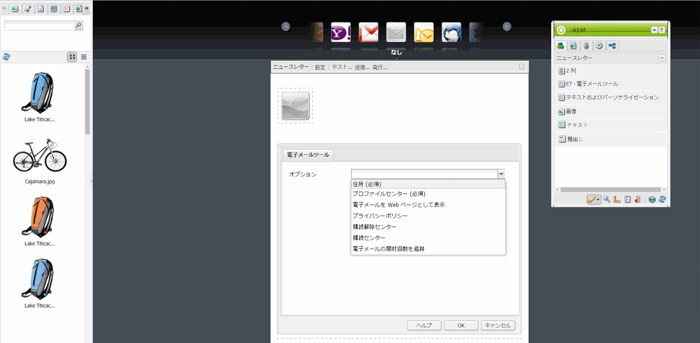
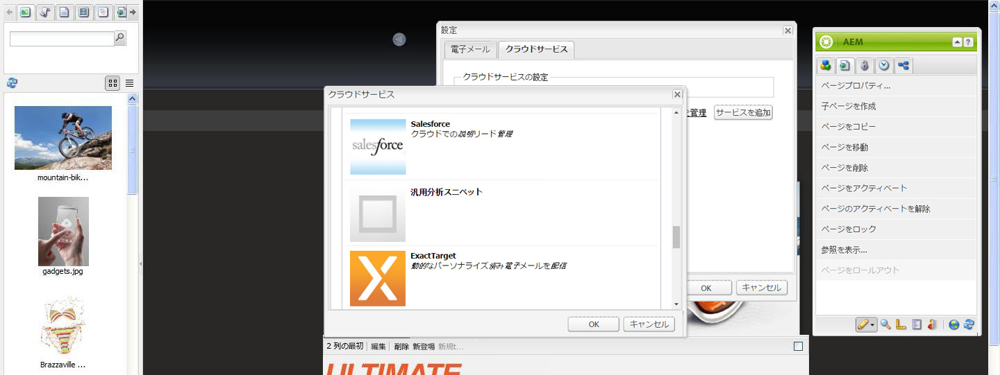
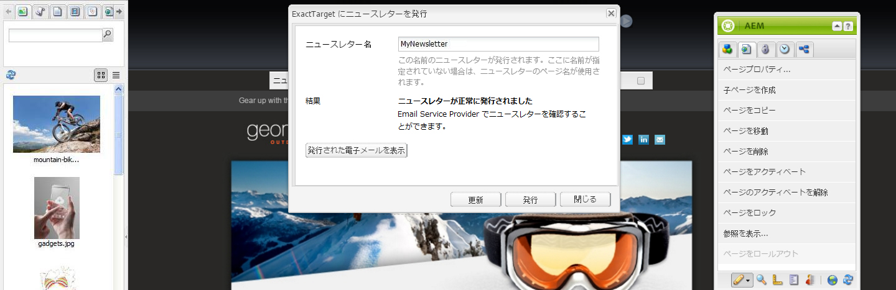

# 電子メールサービスプロバイダーへの電子メールの公開{#publishing-an-email-to-email-service-providers}

ニュースレターを ExactTarget や Silverpop Engage などの電子メールサービスに公開することができます。このドキュメントでは、これらの電子メールサービスにニュースレターを公開するように AEM を設定する方法を説明します。

>[!NOTE]
>
>電子メールを作成して公開できるようにするには、サービスプロバイダーを設定する必要があります。See [Configuring ExactTarget](/help/sites-administering/exacttarget.md) and [Configuring Silverpop Engage](/help/sites-administering/silverpop.md) for more information.

電子メールサービスプロバイダーに電子メールを公開するには、次の手順を実行する必要があります。

1. 電子メールを作成します。
1. 電子メールに電子メールサービスの設定を適用します。
1. 電子メールを公開します。

>[!NOTE]
>
>電子メールプロバイダーを変更した場合は、ニュースレターが先にパブリッシュインスタンスに公開されていないか、パブリッシュインスタンスが使用できない状態で、フライトテストを実行するか、ニュースレターを送信すると、これらの操作が失敗します。ニュースレターが確実に公開されていることと、パブリッシュインスタンスが稼動していることを確認してください。

## 電子メールの作成 {#creating-an-email}

An email or newsletter that you want to publish to an e-mail service can be created under a campaign using the **Geometrixx Newsletter** template. You can also use the **Geometrixx Outdoors E-Mail** template. Sample email/newsletter-based on the **Geometrixx Outdoors E-Mail** template are available at `https://<hostname>:<port>/cf#/content/campaigns/geometrixx-outdoors/e-mails.html`.

設定済みの電子メールサービスに発行される新しい電子メールを作成するには：

1. Go to **Websites** and then **Campaigns**. キャンペーンを選択します。
1. 「**新規**」をクリックして、**ページを作成**&#x200B;ウィンドウを開きます。
1. タイトルと名前を入力し、利用可能なテンプレートから「**Geometrixx ニュースレター**」テンプレートを選択します。
1. 「**作成**」をクリックします。
1. 作成した電子メールを開きます。
1. デザインモードに切り替えて、サイドキックに表示するコンポーネントを選択します。
1. Switch to edit mode and start adding content (text, images, [email tools](#adding-exacttarget-email-tools-to-your-email), [personalization variables](#adding-text-and-personalization-tool-to-your-e-mail), and so on) to your email.

### ExactTarget 電子メールツールを電子メールに追加 {#adding-exacttarget-email-tools-to-your-email}

>[!NOTE]
>
>このセクションは、ExactTarget サービスに固有です。

The **Email Tools** component for ExactTarget can add more email functionality to your email/newsletter.

1. ExactTarget に公開する電子メールを開きます。
1. サイドキックを使用して、「**ET - 電子メールツール**」コンポーネントをページに追加します。コンポーネントを編集モードで開きます。

   

1. **オプション**&#x200B;メニューからオプションを選択します。

<table>
 <tbody>
  <tr>
   <td>住所 (必須)</td>
   <td>このコンポーネントによって、貴社の住所が電子メールに挿入されます。</td>
  </tr>
  <tr>
   <td>プロファイルセンター (必須)</td>
   <td>プロファイルセンターは、貴社が購読者について保持する個人情報を購読者が入力および管理する Web ページです。</td>
  </tr>
  <tr>
   <td>電子メールを Web ページとして表示</td>
   <td>このコンポーネントによって、ユーザーが電子メールを Web ページとして表示できます。。</td>
  </tr>
  <tr>
   <td>プライバシーポリシー</td>
   <td>このコンポーネントによって、プライバシーポリシーへのリンクが電子メールに挿入されます。  </td>
  </tr>
  <tr>
   <td>購読解除センター</td>
   <td>ユーザーがメーリングリストの購読解除を選択できます。。</td>
  </tr>
  <tr>
   <td>購読センター</td>
   <td>購読センターはWebページで、加入者が組織から受け取るメッセージを制御できます。</td>
  </tr>
  <tr>
   <td>電子メールの開封回数を追跡</td>
   <td>ExactTarget の追跡機能を使用できるようにする、非表示のコンポーネントです。  </td>
  </tr>
 </tbody>
</table>

>[!NOTE]
>
>**オプション**&#x200B;ドロップダウンメニューは、ExactTarget 設定が電子メールに適用されている場合のみ表示されます。See [Applying Email Service Configuration to Email Settings](#applying-e-mail-service-configuration-to-e-mail-settings) for more information.

1. ExactTarget に電子メールを公開します。

   電子メールツールを使用した電子メールは、設定済みの ExactTarget アカウントでの使用で利用可能です。

>[!NOTE]
>
>* The URLs within the email tools are replaced (in the received email) by their actual values only when an email is sent using **Simple Send** or **Guided Send** but not **Test Send**.
   >
   >
* 電子メールツールのうち、「**住所 (必須)**」と「**プロファイルセンター (必須)**」の 2 つは必須です。電子メールが ExactTarget に公開されると、これら 2 つの電子メールツールがデフォルトですべての電子メールの下部に追加されます。

>

### テキストおよびパーソナライゼーションツールを電子メールに追加 {#adding-text-and-personalization-tool-to-your-e-mail}

**テキストおよびパーソナライゼーション**&#x200B;コンポーネントをページに追加して、パーソナライズされたフィールドを電子メールに追加できます。

1. 電子メールサービスに公開する電子メールを開きます。
1. 電子メールサービスのパーソナライゼーションフィールドを有効にするには、電子メールサービスの設定時にフレームワーク設定を追加します。See [configuring Silverpop Engage](/help/sites-administering/silverpop.md) and [configuring Exact Target](/help/sites-administering/exacttarget.md) for more information.
1. Add the component **Text &amp; Personalization** from the sidekick. このコンポーネントはニュースレターグループの一部です。このコンポーネントを編集モードで開きます。

   

1. ドロップダウンメニューからフィールドを選択し、「**挿入**」をクリックして、必要なパーソナライズフィールドをテキストに追加します。
1. 「**OK**」をクリックして終了します。

## 電子メールサービス設定の電子メール設定への適用 {#applying-e-mail-service-configuration-to-e-mail-settings}

電子メールサービス設定をニュースレターに適用するには：

1. 電子メールサービス設定を作成します。
1. 電子メールまたはニュースレターを開きます。
1. Open the email/newsletter settings by either clicking **Settings** or by clicking **Page Properties in** the sidekick.
1. 「**クラウドサービス**」タブの「**サービスを追加**」をクリックします。サービスのリストが表示されます。ドロップダウンリストの一覧から必要な設定（「**ExactTarget**」または「**Silverpop**」）を選択します。

   

1. 「**OK**」をクリックします。

## 電子メールサービスへの電子メールの公開 {#publishing-emails-to-email-service}

次の手順を実行して、電子メールまたはニュースレターを電子メールサービスに公開できます。

1. 電子メールを開きます。
1. 電子メールを公開する前に、正しい設定が電子メールに適用されていることを確認してください。
1. 「**公開**」をクリックします。This opens the **Publish Newsletter To E-mail Service Provider** window.
1. 「**ニュースレター名**」フィールドに入力します。電子メール／ニュースレターは、この名前で電子メールサービスプロバイダーに公開されます。電子メール名が指定されていない場合は、AEMのニュースレターのページ名を使用して電子メールが公開されます。
1. 「**発行**」をクリックします。

   

   処理が正常に終了したら、ExactTarget または Silverpop Engage で電子メールを参照できることの確認を AEM によって求められます。

   In the case of ExactTarget the published email can ve viewed by clicking **View Published Email**. This takes you directly to the published newsletter in the ExactTarget ([https://members.exacttarget.com/](https://members.exacttarget.com/).).

>[!NOTE]
>
>電子メールまたはニュースレターが既に公開済みのものと同じ名前で公開された場合、以前の電子メール／ニュースレターは置き換えられません。その場合は、新しい電子メール／ニュースレターは同じ名前（ただし、異なる ID）で作成されます。
>
>電子メールまたはニュースレターを電子メールサービスプロバイダーに公開すると、AEM パブリッシュインスタンスにも公開されます。

### 公開された電子メールの更新 {#updating-a-published-e-mail}

The **Update** button on the Publish dialog box lets you update a newsletter already published to an E-mail Service Provider. ニュースレターがまだ公開されていない状態で「**更新**」ボタンをクリックすると、「**ニュースレターは公開されません**」メッセージが表示されます。

公開済みの電子メールを更新するには：

1. 電子メールサービスプロバイダーに公開されている電子メールまたはニュースレターの中から、変更して再公開したいものを開きます。
1. 「**公開**」をクリックします。The **Publish Newsletter to Email Service Provider** window displays. 「**更新**」をクリックします。

   To check if the email/newsletter has been updated on ExactTarget, click **View Published Email**. クリックすると、ExactTarget で公開された電子メールに移動します。

   電子メールまたはニュースレターが Silverpop 電子メールサービスで更新されたかどうかを確認するには、Silverpop Engage のサイトにアクセスします。

