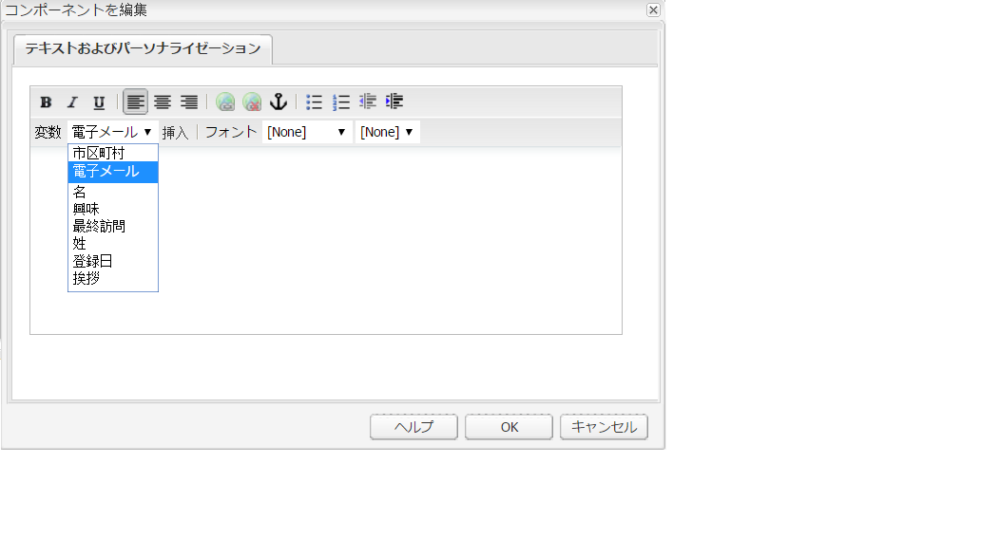

# メールサービスプロバイダーへのメールの公開 {#publishing-an-email-to-email-service-providers}

ExactTarget や Silverpop Engage などのメールサービスに、ニュースレターを公開できます。このドキュメントでは、これらのメールサービスにニュースレターを公開するように AEM を設定する方法について説明します。

>[!NOTE]
>
>メールを作成して公開できるようにするには、サービスプロバイダーを設定する必要があります。詳しくは、[ExactTarget の設定](/help/sites-administering/exacttarget.md)および [Silverpop Engage の設定](/help/sites-administering/silverpop.md)を参照してください。

メールをメールサービスプロバイダーに公開するには、以下の手順を実行する必要があります。

1. メールを作成します。
1. メールにメールサービスの設定を適用します。
1. メールを公開します。

>[!NOTE]
>
>メールプロバイダーを変更した場合は、ニュースレターが先にパブリッシュインスタンスに公開されていないか、パブリッシュインスタンスが使用できない状態で、フライトテストを実行するか、ニュースレターを送信すると、これらの操作が失敗します。ニュースレターが確実に公開されていることと、パブリッシュインスタンスが稼動していることを確認してください。

## メールの作成 {#creating-an-email}

メールサービスに公開するメールまたはニュースレターは、**Geometrixx ニュースレター**&#x200B;テンプレートを使用してキャンペーンで作成できます。また、**Geometrixx Outdoors メール**&#x200B;テンプレートも使用できます。**Geometrixx Outdoors メール**&#x200B;テンプレートに基づくメールまたはニュースレターのサンプルは、`https://<hostname>:<port>/cf#/content/campaigns/geometrixx-outdoors/e-mails.html` で入手できます。

設定済みのメールサービスに公開するメールを作成するには、以下の手順を実行します。

1. **Web サイト**／**Campaigns** の順に移動します。キャンペーンを選択します。
1. 「**新規**」をクリックして、**ページを作成**&#x200B;ウィンドウを開きます。
1. タイトルと名前を入力し、利用可能なテンプレートのリストから **Geometrixx ニュースレター**&#x200B;テンプレートを選択します。
1. 「**作成する**」をクリックします。
1. 作成したメールを開きます。
1. デザインモードに切り替えて、サイドキックに表示するコンポーネントを選択します。
1. 編集モードに切り替えて、コンテンツ（テキスト、画像、[メールツール](#adding-exacttarget-email-tools-to-your-email)、[パーソナライゼーション変数](#adding-text-and-personalization-tool-to-your-e-mail)など）のメールへの追加を開始します。

### ExactTarget メールツールをメールに追加 {#adding-exacttarget-email-tools-to-your-email}

>[!NOTE]
>
>この節は、ExactTarget サービスに固有の内容です。

ExactTarget 用の&#x200B;**メールツール**&#x200B;コンポーネントによって、メールまたはニュースレターにメール機能を追加できます。

1. ExactTarget に公開するメールを開きます。
1. サイドキックを使用して、「**ET - メールツール**」コンポーネントをページに追加します。コンポーネントを編集モードで開きます。

   

1. **オプション**&#x200B;メニューからオプションを選択します。

<table>
 <tbody>
  <tr>
   <td>住所 （必須）</td>
   <td>このコンポーネントによって、貴社の住所がメールに挿入されます。</td>
  </tr>
  <tr>
   <td>プロファイルセンター （必須）</td>
   <td>プロファイルセンターは、貴社が購読者について保持する個人情報を購読者が入力および管理する web ページです。</td>
  </tr>
  <tr>
   <td>メールを web ページとして表示</td>
   <td>このコンポーネントによって、ユーザーがメールを web ページとして表示できます。</td>
  </tr>
  <tr>
   <td>プライバシーポリシー</td>
   <td>このコンポーネントによって、プライバシーポリシーへのリンクをメールに挿入します。  </td>
  </tr>
  <tr>
   <td>購読解除センター</td>
   <td>ユーザーがメーリングリストの購読解除を選択できます。</td>
  </tr>
  <tr>
   <td>購読センター</td>
   <td>購読センターは、登録者が受け取るメッセージを制御できる web ページです。</td>
  </tr>
  <tr>
   <td>メールの開封回数を追跡</td>
   <td>ExactTarget の追跡機能を使用できるようにする、非表示のコンポーネントです。  </td>
  </tr>
 </tbody>
</table>

>[!NOTE]
>
>**オプション**&#x200B;ドロップダウンメニューは、ExactTarget 設定がメールに適用されている場合にのみ表示されます。詳しくは、[メールサービス設定のメール設定への適用](#applying-e-mail-service-configuration-to-e-mail-settings)を参照してください。

1. ExactTarget にメールを公開します。

   メールツールを含むメールは、設定済みの ExactTarget アカウントで使用できます。

>[!NOTE]
>
>* メールツール内の URL は、**テスト送信**&#x200B;ではなく、**簡単送信**&#x200B;または&#x200B;**ガイド付き送信**&#x200B;を使用してメールが送信された場合にのみ、（受信されたメール内で）実際の値に置き換えられます。
>
>* メールツールのうち、「**住所 （必須）**」と「**プロファイルセンター （必須）**」の 2 つは必須です。メールが ExactTarget に公開されると、これら 2 つのメールツールがデフォルトですべてのメールの下部に追加されます。
>

### メールへのテキストおよびパーソナライゼーションツールの追加 {#adding-text-and-personalization-tool-to-your-e-mail}

**テキストおよびパーソナライゼーション**&#x200B;コンポーネントをページに追加して、パーソナライズされたフィールドをメールに追加できます。

1. メールサービスに公開するメールを開きます。
1. メールサービスのパーソナライゼーションフィールドを有効にするには、メールサービスの設定時にフレームワーク設定を追加します。詳しくは、[Silverpop Engage の設定](/help/sites-administering/silverpop.md)および [ExactTarget の設定](/help/sites-administering/exacttarget.md)を参照してください。
1. サイドキックから&#x200B;**テキストおよびパーソナライゼーション**&#x200B;コンポーネントを追加します。このコンポーネントは、ニュースレターグループの一部です。このコンポーネントを編集モードで開きます。

   

1. ドロップダウンメニューからフィールドを選択し、「**挿入**」をクリックして、必要なパーソナライズフィールドをテキストに追加します。
1. 「**OK**」をクリックして終了します。

## メールサービス設定のメール設定への適用 {#applying-e-mail-service-configuration-to-e-mail-settings}

メールサービス設定をニュースレターに適用するには：

1. メールサービス設定を作成します。
1. メールまたはニュースレターを開きます。
1. 「**設定**」をクリックするか、サイドキックの「**ページプロパティ**」をクリックして、メール設定またはニュースレター設定を開きます。
1. 「**クラウドサービス**」タブの「**サービスを追加**」をクリックします。サービスのリストが表示されます。ドロップダウンリストの一覧から必要な設定（「**ExactTarget**」または「**Silverpop**」）を選択します。

   

1. 「**OK**」をクリックします。

## メールサービスへのメールの公開 {#publishing-emails-to-email-service}

次の手順を実行して、メールまたはニュースレターをメールサービスに公開できます。

1. メールを開きます。
1. メールを公開する前に、正しい設定がメールに適用されていることを確認してください。
1. 「**公開する**」をクリックします。これによって、**メールサービスプロバイダーにニュースレターを公開**&#x200B;ウィンドウが開きます。
1. 「**ニュースレター名**」フィールドに入力します。メール／ニュースレターは、この名前でメールサービスプロバイダーに公開されます。メール名を指定しなかった場合、メールは AEM でのニュースレターのページ名を使用して公開されます。
1. 「**公開する**」をクリックします。

   

   処理が正常に終了したら、ExactTarget または Silverpop Engage でメールを参照できるかどうか確認されます。

   ExactTarget の場合、「**公開されたメールを表示**」をクリックして、公開されたメールを表示できます。クリックすると、ExactTarget で公開されたニュースレター（[https://members.exacttarget.com/](https://members.exacttarget.com/)）に直接移動します。

>[!NOTE]
>
>メールまたはニュースレターが既に公開済みのものと同じ名前で公開されても、以前のメール／ニュースレターは置き換えられません。その場合は、新しいメール／ニュースレターは同じ名前（ただし、異なる ID）で作成されます。
>
>メールやニュースレターをメールサービスプロバイダーに公開すると、AEM パブリッシュインスタンスにも公開されます。
>

### 公開されたメールの更新 {#updating-a-published-e-mail}

公開ダイアログボックスの「**更新**」ボタンを使用すると、既にメールサービスプロバイダーに公開されているニュースレターを更新できます。ニュースレターがまだ公開されていない状態で「**更新**」ボタンをクリックすると、「**ニュースレターは公開されていません**」というメッセージが表示されます。

公開されたメールを更新するには：

1. メールサービスプロバイダーに公開中のメールまたはニュースレターの中から、変更して再公開したいものを開きます。
1. 「**公開する**」をクリックします。**メールサービスプロバイダーにニュースレターを公開する**&#x200B;ウィンドウが表示されます。「**更新**」をクリックします。

   メールまたはニュースレターが ExactTarget で更新されたかどうかを確認するには、「**公開されたメールを表示**」をクリックします。クリックすると、ExactTarget で公開されたメールに移動します。

   メールまたはニュースレターが Silverpop メールサービスで更新されたかどうかを確認するには、Silverpop Engage のサイトにアクセスします。
