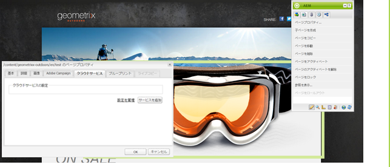

# 購読の管理{#managing-subscriptions}

>[!NOTE]
>
>Adobeは、この機能をさらに強化する予定はありません(リードとリストの管理)。
>推奨事項は、 [Adobe CampaignとAEM統合の活用](/help/sites-administering/campaign.md)。

Users can be asked to subscribe to **Email Service Provider&#39;s** mailing lists with the help of the **Form** component used on an AEM web page. 電子メールサービスのメーリングリストの購読用のサインアップフォームを使用して AEM ページを準備するには、対応するサービス設定を潜在的購読者が訪問する AEM ページに適用する必要があります。

## 電子メールサービス設定のページへの適用 {#applying-email-service-configuration-to-a-page}

AEM ページを設定するには：

1. 「**Web サイト**」タブに移動します。
1. このサービス用に設定する必要があるページを選択します。Right-click the page and select **Properties**.

1. Select **Cloud Services** then **Add Service**. 利用可能な設定のリストから設定を選択します。

   

1. 「**OK**」をクリックします。

## AEM ページ上でのリストの購読／購読解除用サインアップフォームの作成 {#creating-a-sign-up-form-on-an-aem-page-for-subscribing-unsubscribing-to-lists}

サインアップフォームを作成して、電子メールサービスプロバイダーのメーリングリストの購読用に設定するには：

1. ユーザーが訪問する AEM ページを開きます。
1. ページに電子メールサービスプロバイダーの設定を適用します。

1. サイドキックから&#x200B;**フォーム**&#x200B;コンポーネントをドラッグして、ページに追加します。このコンポーネントが利用できない場合は、デザインモードに切り替えて、**フォーム**&#x200B;グループを有効にします。
1. Click **Edit** in the **Start of Form** bar and navigate to the **Advanced** tab.
1. In the **Form** drop-down menu, select **E-mail Service: Create Subscriber** and add to list.
1. At the bottom of the dialog box, open the **Action Configuration** drop-down, which allows you to select one or more subscription lists.
1. 「**リストを選択**」で、ユーザーに購読を求めるリストを選択します。「＋」ボタン（「**項目を追加**」）を使用して、複数のリストを追加できます。

   

   >[!NOTE]
   >
   >表示されるダイアログボックスの内容は、電子メールサービスプロバイダーによって異なる場合があります。

1. 「**フォーム**」タブで、フォームの送信後に表示するありがとうページを選択します（この設定を空白のままにすると、送信時にフォームが再表示されます）。「**OK**」をクリックします。**電子メール ID** コンポーネントがフォームに表示されます。この ID を使用して、メーリングリストを購読または購読解除するためにユーザーが電子メールアドレスを送信できるフォームを作成できます。
1. サイドキックの「**フォーム**」セクションから、**送信**&#x200B;ボタンコンポーネントを追加します。

   フォームの準備ができました。上述の手順で設定したページをありがとうページと共にパブリッシュインスタンスに対して公開します。****&#x200B;このページの訪問者は誰でも、フォームに入力して、提供されるリストを購読できます。

   >[!NOTE]
   >
   >フォームの購読を正しく機能させるには、[オーサーインスタンスから暗号化キーを書き出して、パブリッシュインスタンス上で読み込む](#exporting-keys-from-author-and-importing-on-publish)必要があります。

## オーサーインスタンスからキーを書き出して、パブリッシュインスタンスで読み込む {#exporting-keys-from-author-and-importing-on-publish}

サインアップフォームを使用した電子メールサービスの購読および購読解除をパブリッシュインスタンス上で機能させるには、以下の手順を実行することが必要です。

1. オーサーインスタンス上でパッケージマネージャーに移動します。
1. 新しいパッケージを作成します。Set the filter as `/etc/key`.
1. パッケージを構築してダウンロードします。
1. パブリッシュインスタンス上でパッケージマネージャーに移動して、このパッケージをアップロードします。
1. パブリッシュインスタンスの OSGi コンソールに移動して、「**Adobe Granite Crypto Support**」という名前のバンドルを再起動します。

## リストのユーザーの購読解除 {#unsubscribing-users-from-lists}

リストのユーザーの購読を解除するには：

1. リードの購読を解除するサインアップフォームがある AEM ページのページプロパティを開きます。
1. ページにサービス設定を適用します。
1. ページ上にサインアップフォームを作成します。
1. While configuring the component, select the action **E-mail Service**: **Unsubscribe user from list.**
1. ドロップダウンメニューから、購読解除時にユーザーが削除されるリストを選択します。

   

1. オーサーインスタンスからパブリッシュインスタンスにキーを書き出します。

## 電子メールサービス用の自動応答電子メールの設定 {#configuring-auto-responder-emails-for-email-service}

購読者への自動応答電子メールを設定するには：

1. リードの自動応答を設定するためのサインアップフォームを含むAEMページのページプロパティを開きます。
1. ページに ExactTarget 設定を適用します。

1. サイドキックから&#x200B;**フォーム**&#x200B;コンポーネントをドラッグして、ページに追加します。このコンポーネントが利用できない場合は、デザインモードに切り替えて、**フォーム**&#x200B;グループを有効にします。
1. Click **Edit** in the **Start of Form** bar and navigate to the **Advanced** tab.
1. In the **Form** drop-down menu, select **E-mail Service: Send auto responder email.**
1. **電子メールを選択します** （これは、自動応答用の電子メールとして送信される電子メールです）。

1. **「分類** 」を選択します（この分類は電子メールの送信に使用されます）。
1. Select the **Thank you** page (the page where users are directed to once they submit the form).

   In the **Form** tab, select the thank you page you want users to go to after they submit the form. (If left blank, the form redisplays upon submission.) 「**OK**」をクリックします。

1. オーサーインスタンスからパブリッシュインスタンスにキーを書き出します。
1. サイドキックの「**フォーム**」セクションから、**送信**&#x200B;ボタンコンポーネントを追加します。

   サインアップフォームの準備ができました。上述の手順で設定したページをありがとうページと共にパブリッシュインスタンスに対して公開します。****&#x200B;ページを訪問する潜在的購読者は誰でもフォームに入力でき、フォームを送信すると、フォームに入力された電子メール ID に基づき自動応答電子メールが訪問者に送信されます。

   >[!NOTE]
   >
   >サインアップフォームの購読を正しく機能させるには、[オーサーインスタンスから暗号化キーを書き出して、パブリッシュインスタンス上で読み込む](#exporting-keys-from-author-and-importing-on-publish)必要があります。

   

