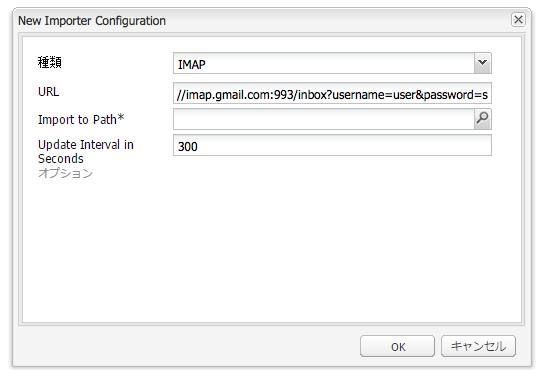

# バウンス（配信不能）電子メールの追跡{#tracking-bounced-emails}

>[!NOTE]
>
>Adobeは、AEM SMTPサービスから送信される開封済み/バウンス済み電子メールの追跡をさらに強化する予定はありません。
>
>Adobe CampaignとAEM統合の [活用を推奨](/help/sites-administering/campaign.md)。

多数のユーザーにニュースレターを送信する場合、一般的に、リスト内に無効な電子メールアドレスが一部含まれています。それらのアドレスにニュースレターを送信すると、配信不能として戻ってきます。AEM にはそうしたバウンスを管理する機能があり、バウンスカウンターの設定値を超えると、それらのアドレスへのニュースレターの送信を停止できます。デフォルトでは、バウンス率は 3 ですが、設定可能です。

AEM でバウンス電子メールを追跡するには、バウンス電子メールが受信される既存のメールボックス（通常は、ニュースレターの送信元を示す「送信元」の電子メールアドレス）をポーリングするように AEM をセットアップする必要があります。AEM はこのインボックスをポーリングし、ポーリング設定で指定されたパスの下のすべての電子メールを読み込みます。次に、ワークフローがトリガーされ、バウンスした電子メールアドレスがユーザー内で検索され、それに応じてユーザーのbounceCounterプロパティ値が更新されます。 設定された最大バウンス数を超えると、そのユーザーはニュースレターのリストから削除されます。

## Feed Importer の設定 {#configuring-the-feed-importer}

フィードインポーターを使用すると、外部ソースからリポジトリにコンテンツを繰り返し読み込むことができます。Feed Importer のこの設定を使用して、AEM は送信者のメールボックスをチェックしてバウンス電子メールを探します。

バウンス電子メールを追跡するように Feed Importer を設定するには：

1. 「**ツール**」で、「Feed Importer」を選択します。

1. 「**追加**」をクリックして、新しい設定を作成します。

   

1. タイプを選択し、ポーリング URL の情報を追加して、ホストとポートを設定することで、新しい設定を追加します。また、URL クエリに対する、メールおよびプロトコル固有のパラメーターをいくつか追加する必要があります。最低 1 日に 1 回はポーリングを行うように設定します。

   すべての設定で、ポーリング URL 内に以下に関する情報が必要です。

   `username`: 接続のために使用するユーザー名

   `password`: 接続のために使用するパスワード

   また、プロトコルによっては、特定の設定を指定することができます。

   **POP3 設定のプロパティ：**

   `pop3.leave.on.server`:メッセージをサーバーに残すかどうかを定義します。 サーバーにメッセージを残す場合は true を、そうでない場合は false を設定します。デフォルトは true です。

   **POP3 の例：**

   | pop3s://pop.gmail.com:995/INBOX?username=user&amp;password=secret | SSL 経由の POP3 を使用して、ポート 995 で GMail に接続（user と secret を使用）すると、デフォルトでサーバー上にメッセージが残されます。 |
   |---|---|
   | pop3s://pop.gmail.com:995/INBOX?username=user&amp;password=secret&amp;pop3.leave.on.server=false | pop3s://pop.gmail.com:995/INBOX?username=user&amp;password=secret&amp;pop3.leave.on.server=false |

   **IMAP 設定のプロパティ：**

   検索するフラグを設定できます。

   `imap.flag.SEEN`：新しい/未表示のメッセージの場合はfalseに設定し、既読のメッセージの場合はtrueに設定します

   See [https://java.sun.com/products/javamail/javadocs/javax/mail/Flags.Flag.html](https://java.sun.com/products/javamail/javadocs/javax/mail/Flags.Flag.html) for the full list of flags.

   **IMAP の例：**

   | imaps://imap.gmail.com:993/inbox?username=user&amp;password=secret | SSL 経由の IMAP を使用して、ポート 993 で GMail に接続（user と secret を使用）します。デフォルトで、新規のメッセージのみが取得されます。 |
   |---|---|
   | imaps://imap.gmail.com:993/inbox?username=user&amp;password=secret&amp;imap.flag.SEEN=true | SSL 経由の IMAP を使用して、ポート 993 で GMail に接続（user と secret を使用）すると、既読のメッセージのみが取得されます。 |
   | imaps://imap.gmail.com:993/inbox?username=user&amp;password=secret&amp;imap.flag.SEEN=true&amp;imap.flag.SEEN=false | SSL 経由の IMAP を使用して、ポート 993 で GMail に接続（user と secret を使用）すると、既読または新規のメッセージが取得されます。 |

1. 設定を保存します。

## ニュースレターサービスコンポーネントの設定 {#configuring-the-newsletter-service-component}

フィードインポーターを設定したら、「送信元」アドレスとバウンスカウンターを設定する必要があります。

ニュースレターサービスを設定するには：

1. In the OSGi console at `<host>:<port>/system/console/configMgr` and navigate to **MCM Newsletter**.

1. サービスを設定して、終了したら変更を保存します。

   

   動作を調整するために、以下の設定を指定できます。

   | バウンスカウンターの最大値（max.bounce.count） | ニュースレターの送信時に、ユーザーがスキップされるまでのバウンス回数を定義します。この値を 0 に設定すると、バウンスのチェックが完全に無効になります。 |
   |---|---|
   | アクティビティをキャッシュしない（sent.activity.nocache） | ニュースレターの送信アクティビティに対して使用するキャッシュの設定を定義します。 |

   設定が保存されると、ニュースレター MCM サービスは次の動作を行います。

   * ニュースレター送信の正常終了時に、users の非表示ストリームにアクティビティを書き込みます。
   * バウンスが検出された場合、および users のバウンスカウンターが変化した場合に、アクティビティを書き込みます。
