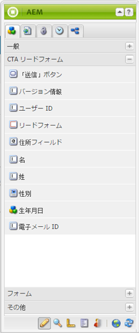

# ランディングページ{#landing-pages}

ランディングページ機能を使用すると、デザインとコンテンツをすばやく簡単に、AEM ページに直接読み込むことができます。Web 開発者は、ページ全体またはページの一部分として読み込める HTML とその他のアセットを準備できます。この機能は、期間限定でアクティブにするマーケティングランディングページをすばやく作成する必要がある場合に有効です。

このページでは次の内容について説明します。

* AEM でのランディングページの表示例（使用可能なコンポーネントを含む）
* ランディングページの作成方法およびデザインパッケージの読み込み方法
* AEM でのランディングページの使用方法
* モバイルランディングページの設定方法

読み込むデザインパッケージの準備については、[デザインインポーターの拡張と設定](/help/sites-administering/extending-the-design-importer-for-landingpages.md)で説明します。Adobe Analytics との統合については、「[ランディングページと Adobe Analytics の統合](/help/sites-administering/integrating-landing-pages-with-adobe-analytics.md)」で説明します。

>[!CAUTION]
>
>ランディングページの読み込みに使用されていたデザインインポーターは、[AEM 6.5 で廃止されました。](/help/release-notes/deprecated-removed-features.md#deprecated-features)

>[!CAUTION]
>
>Because the Design Importer requires access to `/apps`, it will not work in containerized cloud environments where `/apps` is immutable.

## What are Landing Pages? {#what-are-landing-pages}

ランディングページとは、電子メール、アドワーズやバナー、ソーシャルメディアといったマーケティング活動の「エンドポイント」となる単一または複数ページのサイトです。ランディングページは様々な用途に対応しますが、すべての用途で共通することは、訪問者がタスクを最後まで実行するとランディングページの成功と判断されることです。

AEM のランディングページ機能によって、マーケティング担当者が代理店の Web デザイナーや社内のクリエイティブチームと共同作業してページデザインを作成できます。このページデザインは AEM に簡単に読み込むことができ、引き続きマーケティング担当者が編集し、AEM によるその他のサイトと同じガバナンスに基づいて公開することができます。

AEM では、次の手順を実行してランディングページを作成します。

1. AEM で、ランディングページキャンバスを含むページを作成します。AEM には「**インポーターページ**」というサンプルが同梱されています。

1. [HTML とアセットを準備します。](/help/sites-administering/extending-the-design-importer-for-landingpages.md)
1. リソースを ZIP ファイルにパッケージ化します。ここでは、このファイルを「デザインパッケージ」と呼びます。
1. デザインパッケージをインポーターページにインポートします。
1. ページを編集し、発行します。

### デスクトップランディングページ {#desktop-landing-pages}

以下は、AEM のランディングページの例です。

### モバイルランディングページ {#mobile-landing-pages}

ランディングページに、そのページのモバイルバージョンを作成することもできます。To have a separate mobile version of the landing page the import design has to have two html files: *index.htm(l)* and *mobile.index.htm(l)*.

このランディングページの読み込み手順は、通常のランディングページの読み込み手順と同じです。ランディングページデザインには、モバイルランディングページに対応する追加の HTML ファイルが含まれます。この HTML ファイルも、デスクトップランディングページの HTML と同様にキャンバス `div` と `id=cqcanvas` を含める必要があり、デスクトップランディングページ用に記述されたすべての編集可能なコンポーネントがサポートされます。

モバイルランディングページはデスクトップランディングページの子ページとして作成されます。モバイルランディングページを開くには、「Web サイト」でランディングページを表示し、子ページを開きます。

>[!NOTE]
>
>デスクトップランディングページが削除またはアクティベート解除されると、モバイルランディングページも削除またはアクティベート解除されます。

## ランディングページのコンポーネント {#landing-page-components}

読み込まれた HTML のパーツを AEM 内で編集可能にするために、ランディングページの HTML 内のコンテンツを直接 AEM コンポーネントにマッピングできます。デザインインポーターは、デフォルトで次のコンポーネントを認識します。

* テキスト（あらゆるテキスト）
* タイトル（H1 ～ H6 タグ内のコンテンツ）
* 画像（交換可能な仕様で作成された画像）
* コールトゥアクション：

   * クリックスルーリンク
   * グラフィックリンク

* CTA リードフォーム（ユーザー情報取得用）
* 段落システム（Parsys）（あらゆるコンポーネントの追加や上記のコンポーネントの変換を可能にする）

さらに、デザインインポーターを拡張してカスタムコンポーネントに対応することもできます。ここでは、これらのコンポーネントについて詳しく説明します。

### テキスト {#text}

テキストコンポーネントを使用すると、WYSIWYG エディターを使用してテキストブロックを入力できます。詳しくは、[テキストコンポーネント](/help/sites-authoring/default-components.md#text)を参照してください。

以下はランディングページのテキストコンポーネントの例です。

#### タイトル {#title}

タイトルコンポーネントを使用して、タイトルを表示しサイズ（h1～h6）を設定することができます。詳しくは、[タイトルコンポーネント](/help/sites-authoring/default-components.md#title)を参照してください。

以下はランディングページのタイトルコンポーネントの例です。

#### 画像 {#image}

画像コンポーネントには画像が表示されます。この画像はコンテンツファインダーからドラッグ＆ドロップするか、クリックしてアップロードできます。詳しくは、[画像コンポーネント](/help/sites-authoring/default-components.md)を参照してください。

以下はランディングページの画像コンポーネントの例です。

#### Call to Action (CTA) {#call-to-action-cta}

ランディングページデザインには複数のリンクを含めることができ、その一部を「コールトゥアクション」とすることができます。

コールトゥアクション（CTA）は、「今すぐ購読」、「このビデオを見る」、「期間限定」など、ランディングページで訪問者に行動を呼びかけるために使用します。

* クリックスルーリンク：訪問者がクリックするとターゲット URL に移動するテキストリンクを追加できます。
* グラフィックリンク：訪問者がクリックするとターゲット URL に移動する画像を追加できます。

両方の CTA コンポーネントには、同様のオプションがあります。クリックスルーリンクには追加のリッチテキストオプションがあります。次の段落で、これらのコンポーネントについて詳しく説明します。

#### クリックスルーリンク {#click-through-link}

この CTA コンポーネントを使用して、ランディングページにテキストリンクを追加できます。このリンクをクリックすると、コンポーネントのプロパティで指定されたターゲット URL にユーザーを導くことができます。このコンポーネントは「コールトゥアクション」グループに含まれています。

**ラベル** ：ユーザーに表示されるテキストです。 リッチテキストエディターで書式設定を変更できます。

**ターゲットURL** ：ユーザーがテキストをクリックした場合に訪問するURIを入力します。

**レンダリングオプション** ：レンダリングオプションを示します。 選択できる項目は以下のとおりです。

* 新しいブラウザーウィンドウにページを読み込み
* 現在のウィンドウにページを読み込み
* 親フレームにページを読み込み
* すべてのフレームをキャンセルしてフルブラウザーウィンドウにページを読み込み

**CSS** :「スタイル」タブで、CSSスタイルシートへのパスを入力します。

**ID** [スタイル]タブで、コンポーネントを一意に識別するIDを入力します。

以下はクリックスルーリンクの例です。

#### グラフィックリンク {#graphical-link}

この CTA コンポーネントを使用して、リンク付きのグラフィック画像をランディングページに追加できます。この画像は単純なボタンや、背景としての任意のグラフィック画像として使用できます。画像をクリックすると、ユーザーはコンポーネントのプロパティで指定されたターゲット URL に誘導されます。このコンポーネントは **コールトゥアクション** グループに含まれています。

**ラベル** ：画像内に表示されるテキストです。 リッチテキストエディターで書式設定を変更できます。

**ターゲットURL** ：ユーザーが画像をクリックした場合に訪問するURIを入力します。

**レンダリングオプション** ：レンダリングオプションを示します。 選択できる項目は以下のとおりです。

* 新しいブラウザーウィンドウにページを読み込み
* 現在のウィンドウにページを読み込み
* 親フレームにページを読み込み
* すべてのフレームをキャンセルしてフルブラウザーウィンドウにページを読み込み

**CSS** :「スタイル」タブで、CSSスタイルシートへのパスを入力します。

**ID** [スタイル]タブで、コンポーネントを一意に識別するIDを入力します。

以下はグラフィックリンクの例です。

### コールトゥアクション（CTA）リードフォーム {#call-to-action-cta-lead-form}

リードフォームは、訪問者（リード）のプロファイル情報を収集するために使用するフォームです。この情報を保存して後で使用し、この情報に基づき効果的なマーケティングをおこなうことができます。この情報には通常、タイトル、名前、電子メール、生年月日、住所、興味などがあります。このコンポーネントは **CTA リードフォーム**&#x200B;グループに含まれています。

以下は CTA リードフォームの例です。

CTA リードフォームは様々なコンポーネントで構成されます。

* **リードフォーム** リードフォームコンポーネント 、ページの新しいリードフォームの始まりと終わりを定義します。これらの要素の間に、その他のコンポーネント（電子メール ID、名など）を配置できます。

* **フォームのフィールドと要素**
フォームのフィールドと要素には、テキストボックス、ラジオボタン、画像などを含めることができます。多くの場合、ユーザーは、テキストの入力などのアクションをフォームフィールドで完了します。詳しくは、個々のフォーム要素を参照してください。

* **プロファイルコンポーネント**
プロファイルコンポーネントは、訪問者に合わせた個人設定が必要な Social Collaboration や他の領域に使用する訪問者のプロファイルに関連しています。

The preceding shows an example form; it is comprised of the **Lead Form** component (start and end), with **First Name** and **Email Id** fields used for input and a **Submit** field

サイドキックから、次のコンポーネントを CTA リードフォームに使用できます。

#### 多くのリードフォームコンポーネントに共通の設定 {#settings-common-to-many-lead-form-components}

リードフォームコンポーネントはそれぞれ目的が異なりますが、その多くは類似するオプションおよびパラメーターで構成されています。

どのフォームコンポーネントを設定する場合も、ダイアログ内の次のタブを使用できます。

* **タイトルとテキスト**&#x200B;このタブでは、コンポーネントのタイトルや付随するテキストなど、基本情報を指定する必要があります。フィールドで複数選択が有効かどうかや、選択肢に使用できる項目など、その他の主要な情報を定義することもできます。

* **初期値**
デフォルト値を指定できます。

* **制約**
このタブでは、フィールドが必須かどうかを指定し、そのフィールドに制約を設定することができます（例えば、数値であることが必要など）。

* **スタイル設定**
フィールドのサイズとスタイル設定を示します。

>[!NOTE]
>
>表示されるフィールドは個別のコンポーネントによって変わります。
>
>すべてのオプションがすべてのリードフォームコンポーネントで使用できるわけではありません。これらの[共通設定](/help/sites-authoring/default-components.md#formsgroup)について詳しくは、「フォーム」を参照してください。

#### リードフォームコンポーネント {#lead-form-components}

ここでは、コールトゥアクションリードフォームで使用可能なコンポーネントについて説明します。

**情報** ：情報を追加できます。

**アドレスフィールド** ：ユーザーが住所情報を入力できます。 このコンポーネントを設定する場合、ダイアログの「エレメント名」に入力する必要があります。「エレメント名」はフォーム要素の名前です。リポジトリ内でデータが格納される場所を示します。

**生年月日** ：ユーザーは生年月日情報を入力できます。

**電子メールID** ：ユーザーが電子メールアドレス(ID)を入力できます。

**名** ：ユーザーが名を入力するためのフィールドです。

**性別** ：ユーザーは、ドロップダウンリストから性別を選択できます。

**姓** ユーザーは姓の情報を入力できます。

**リードフォーム** 追加このコンポーネントを使用して、ランディングページにリードフォームを追加します。 リードフォームには、「リードフォームの最初」フィールドと「リードフォームの終わり」フィールドが自動的に含まれます。これらのフィールドの間に、ここで説明しているリードフォームコンポーネントを追加できます。

The Lead Form component defines both the start and end of a form using the **Form Start** and **Form End** elements. フォームが確実に正しく定義されるように、これらの要素は常にペアとして使用されます。

リードフォームを追加した後で、フォームの開始またはフォームの終了の設定をおこなうには、対応するバーの「**編集**」をクリックします。

**リードフォームの最初**

「**フォーム**」と「**詳細**」の 2 つのタブを使用して設定できます。

**ありがとうページ**
訪問者の入力を歓迎するために参照されるページ。空にすると、送信後にフォームが再表示されます。

**開始ワークフロー** ：リードフォームの送信後にトリガーされるワークフローを決定します。

**投稿のオプション** ：次の投稿のオプションを使用できます。

* リードを作成
* 電子メールサービス：購読者を作成してリストに追加 - ExactTarget などの電子メールサービスプロバイダーを使用している場合に使用します。
* Email Service:自動応答電子メールを送信 — ExactTargetなどの電子メールサービスプロバイダーを使用している場合に使用します。
* Email Service:リストからユーザーを登録解除 — ExactTargetなどの電子メールサービスプロバイダーを使用する場合に使用します。
* ユーザーの購読を解除

**フォーム識別子** ：フォーム識別子は、リードフォームを一意に識別します。 1 つのページに複数のフォームがある場合、フォーム識別子を使用します。フォームごとに異なる識別子が使用されていることを確認します。

**ロードパス** ：リードフォームフィールドに定義済みの値をロードするために使用されるノードプロパティへのパスです。

これは、リポジトリ内のノードへのパスを指定するオプションのフィールドです。このノードに、フィールド名と一致するプロパティがある場合、フォーム上の適切なフィールドがそのプロパティの値が設定された状態でプリロードされます。一致が存在しない場合、フィールドにはデフォルト値が使用されます。

**クライアントの検証** ：このフォームにクライアントの検証が必要かどうかを示します（サーバーの検証は常に行われます）。 これは、Formsカプチャコンポーネントと組み合わせて実現できます。

**検証生産資源タイプ** ：個々のフィールドではなく、リード・フォーム全体を検証する場合に、フォーム検証生産資源タイプを定義します。

フォーム全体を検証する場合、さらに次のいずれかを含めます。

* クライアントの検証用スクリプト：
   ` /apps/<myApp>/form/<myValidation>/formclientvalidation.jsp`

* サーバー側の検証用スクリプト：
   ` /apps/<myApp>/form/<myValidation>/formservervalidation.jsp`

**アクションの設定** :「投稿オプション」での選択内容に応じて、アクションの設定が変更されます。 例えば、「リードを作成」を選択した場合、リードの追加先とするリストを設定できます。

* **「送信」ボタンを表示**
「送信」ボタンを表示するかどうかを示します。

* **名前を送信**
1 つのフォームに複数の「送信」ボタンを使用する場合の識別子。

* **タイトルを送信**
「送信」や「送る」など、ボタンに表示される名前。

* **「リセット」ボタンを表示**
「リセット」ボタンを表示するには、このチェックボックスを選択します。

* **タイトルをリセット**
「リセット」ボタンに表示する名前。

* **説明**
ボタンの下に表示する情報。

## ランディングページの作成 {#creating-a-landing-page}

ランディングページを作成する場合は、次の手順を実行する必要があります。

1. インポーターページを作成します。
1. [読み込む HTML を準備します。](/help/sites-administering/extending-the-design-importer-for-landingpages.md)
1. デザインパッケージを読み込みます。

### デザインインポーターの使用 {#use-of-the-design-importer}

ページの読み込みには、HTML の準備、検証、ページのテストが必要になるので、ランディングページの読み込みは管理タスクとして実行することを想定しています。As an admin, the users performing the import need read, write, create, and delete permissions on `/apps`. ユーザーにこれらの権限がない場合、読み込みは失敗します。

>[!NOTE]
>
>Because the design importer is intended as an admin tool requiring read, write, create, and delete permissions on `/apps`, Adobe does not recommend using the design importer in production.

デザインインポーターは、ステージングインスタンスで使用することをお勧めします。ステージングインスタンスでは、実稼働インスタンスへのコードのデプロイを担当する開発者が、読み込みのテストおよび検証をおこなうことができます。

### インポーターページの作成 {#creating-an-importer-page}

ランディングページデザインをインポートする前に、キャンペーンなどにインポーターページを作成する必要があります。インポーターページテンプレートを使用して、HTML ランディングページ全体を読み込むことができます。このページにはドロップボックスが含まれていて、ドラッグ＆ドロップによってこのボックスにランディングページデザインパッケージを読み込むことができます。

>[!NOTE]
>
>By default, an Importer Page can only be created under campaigns, but you can also overlay this template in order to create a landing page under `/content/mysite`.

新しいランディングページを作成するには：

1. **Web サイト**&#x200B;コンソールに移動します。
1. 左側のウィンドウでキャンペーンを選択します。
1. 「**新規**」をクリックして、**ページを作成**&#x200B;ウィンドウを開きます。
1. 「**インポーターページ**」テンプレートを選択して、タイトルと名前（オプション）を追加し、「**作成**」をクリックします。

   

   新しいインポーターページが表示されます。

### 読み込み用の HTML の準備 {#preparing-the-html-for-import}

デザインパッケージを読み込む前に、HTML を準備する必要があります。詳しくは、[デザインインポーターの拡張と設定](/help/sites-administering/extending-the-design-importer-for-landingpages.md)を参照してください。

### デザインパッケージの読み込み {#importing-the-design-package}

インポーターページが作成されたら、そのページにデザインパッケージを読み込むことができます。デザインパッケージの作成とその推奨される構造について詳しくは、[デザインインポーターの拡張と設定](/help/sites-administering/extending-the-design-importer-for-landingpages.md)で説明します。

デザインパッケージの準備ができたら、次の手順を実行して、デザインパッケージをインポーターページに読み込みます。

1. [前に作成した](#creatingablankcanvaspage)インポーターページを開きます。

   

1. デザインパッケージをドロップボックスにドラッグ＆ドロップします。パッケージがこのボックスにドラッグされたとき、矢印の方向が変わります。
1. ドラッグ＆ドロップをおこなうと、インポーターページの代わりにランディングページが表示されます。HTMLランディングページが正常に読み込まれました。

   

>[!NOTE]
>
>読み込み時に、セキュリティ上の理由から、また、無効なマークアップが読み込まれて公開されないように、マークアップがサニタイズ削除されます。この場合、HTML のみのマークアップと、その他のあらゆる形式の要素（インライン SVG や Web コンポーネントなど）が除外されることを前提としています。

>[!NOTE]
>
>デザインパッケージの読み込みで問題が発生した場合は、[トラブルシューティング](/help/sites-administering/extending-the-design-importer-for-landingpages.md#troubleshooting)を参照してください。

## ランディングページの使用 {#working-with-landing-pages}

ランディングページに使用するデザインおよびアセットは通常、（おそらく代理店の）デザイナーが、使い慣れている Adobe Photoshop や Adobe Dreamweaver などのツールで作成します。デザインが完成すると、デザイナーはすべてのアセットを含めた zip ファイルをマーケティング部門に送信します。マーケティング部門の担当者は zip ファイルを AEM にドロップし、コンテンツを公開します。

さらにデザイナーは、ランディングページの読み込み後に、コンテンツを編集または削除したりコールトゥアクションコンポーネントを設定したりして、そのページを変更する必要がある場合があります。最後に、マーケティング担当者はランディングページをプレビューしてからキャンペーンをアクティベートすることで、ランディングページの公開を確実におこなうことができます。

ここでは、次の操作を実行する方法について説明します。

* ランディングページの削除
* デザインパッケージのダウンロード
* 読み込み情報の表示
* ランディングページのリセット
* [CTA コンポーネントの設定と、ページへのコンテンツの追加](#call-to-action-cta)
* ランディングページのプレビュー
* ランディングページのアクティベートまたは公開

デザインパッケージを読み込むと、ページの設定メニューで「**デザインをクリア**」と「**読み込まれた zip ファイルをダウンロード**」が使用可能になります。

### 読み込まれたデザインパッケージのダウンロード {#downloading-the-imported-design-package}

zip ファイルをダウンロードすると、特定のランディングページに対して読み込まれた zip ファイルを記録することができます。ただし、ページ上でおこなった変更は zip ファイルに追加されません。

読み込まれたデザインパッケージをダウンロードするには、ランディングページツールバーで「**ZIP ファイルをダウンロード**」をクリックします。

### 読み込み情報の表示 {#viewing-import-information}

いつでも、クラシックユーザーインターフェイスのランディングページの上部にある青い感嘆符をクリックして、最後のインポートに関する情報を表示できます。

読み込まれたデザインパッケージに問題がある場合（例えばパッケージ内に存在しない画像またはスクリプトが参照されている場合など）、デザインインポーターはこれらの問題をリスト形式で表示します。問題のリストを表示するには、クラシックユーザーインターフェイスのランディングページツールバーにある問題のリンクをクリックします。In the following image, clicking on **Issues** link opens the Import Issues window.

### ランディングページのリセット {#resetting-a-landing-page}

変更をおこなった後でランディングページデザインパッケージを再インポートする場合は、クラシックユーザーインターフェイスのランディングページの上部にある「**消去**」をクリックして、ランディングページを「消去」したり、タッチ最適化ユーザーインターフェイスの設定メニューで「消去」をクリックしたりすることができます。読み込むと、読み込んだランディングページが削除され、空白のインポーターページが作成されます。

ランディングページの消去時にコンテンツの変更内容を削除することができます。If you click **No**, then the content changes are preserved, that is, the structure under `jcr:content/importer`is preserved and only the importer page component and the resources in `etc/design` are removed. Whereas, if you click **Yes**, the `jcr:content/importer` is also removed.

>[!NOTE]
>
>コンテンツの変更内容を削除する場合、「**消去**」をクリックすると、読み込まれたランディングページ上で行われたすべての変更、およびすべてのページプロパティが失われます。

### ランディングページ上でのコンポーネントの編集と追加 {#modifying-and-adding-components-on-a-landing-page}

ランディングページ上のコンポーネントを編集するには、コンポーネントをダブルクリックして開き、他のコンポーネントの場合と同じように編集します。

コンポーネントをランディングページに追加するために、コンポーネントを（クラシックユーザーインターフェイスのサイドキックから、またはタッチ最適化ユーザーインターフェイスのコンポーネントウィンドウから）ランディングページにドラッグ&amp;ドロップし、適切に編集します。

>[!NOTE]
>
>ランディングページ上のコンポーネントを編集できない場合は、[HTML ファイルを変更](/help/sites-administering/extending-the-design-importer-for-landingpages.md)してから zip ファイルを再読み込みする必要があります。つまり、編集できないパーツは、読み込み時に AEM コンポーネントに変換されなかったものです。

### ランディングページの削除 {#deleting-a-landing-page}

ランディングページの削除は通常の AEM ページの削除に似ています。

唯一の例外は、デスクトップランディングページを削除すると対応するモバイルランディングページ（存在する場合）も削除されるが、その逆はないという点です。

### ランディングページの公開 {#publishing-a-landing-page}

通常のページを公開するのと同様に、ランディングページとその依存関係をすべて公開できます。

>[!NOTE]
>
>デスクトップランディングページを公開すると、対応するモバイルバージョン（存在する場合）も公開されます。ただし、モバイルランディングページを公開しても、デスクトップバージョンは公開されません。
