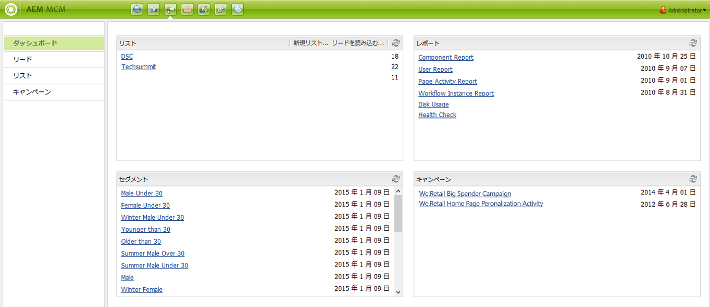
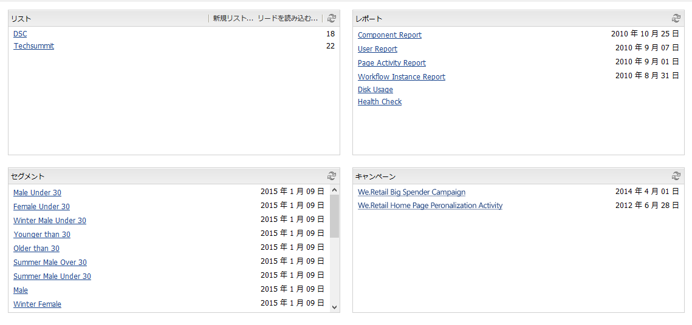
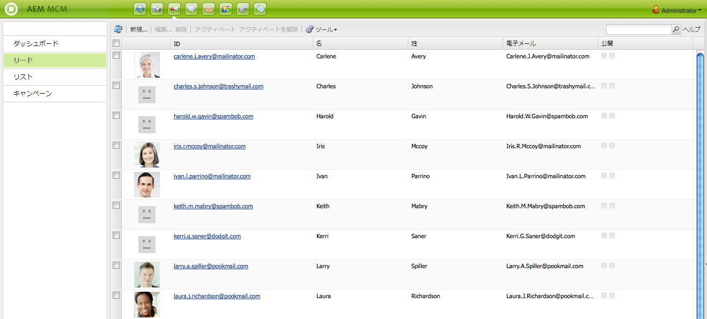
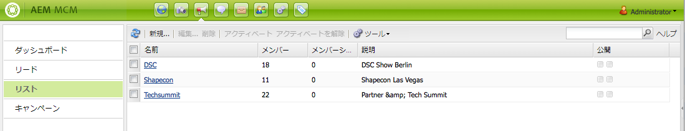
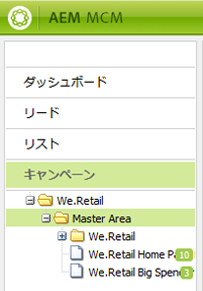
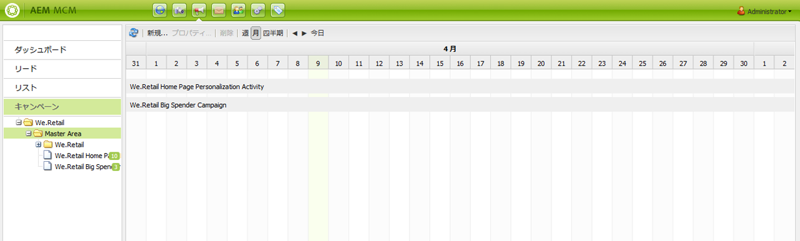
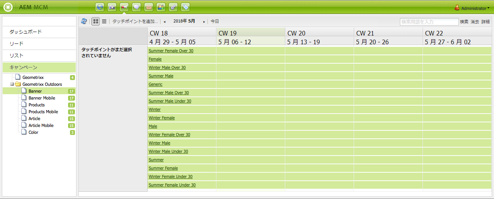
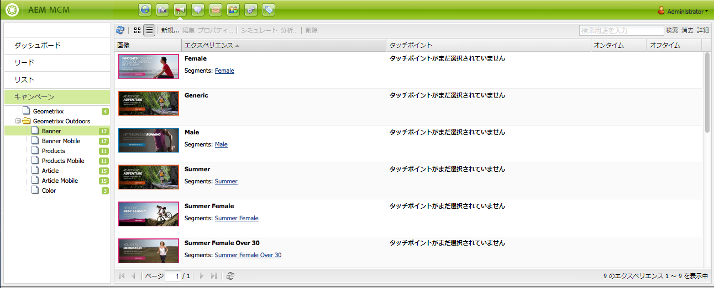
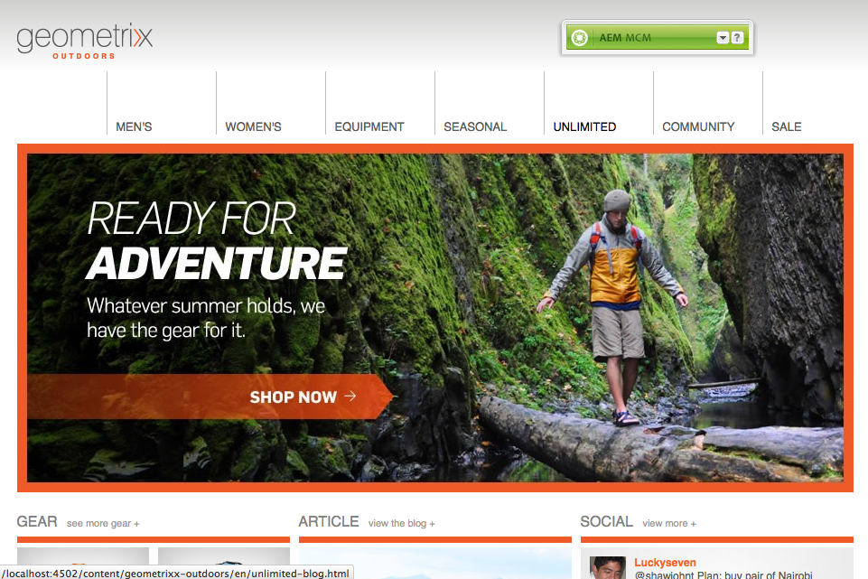
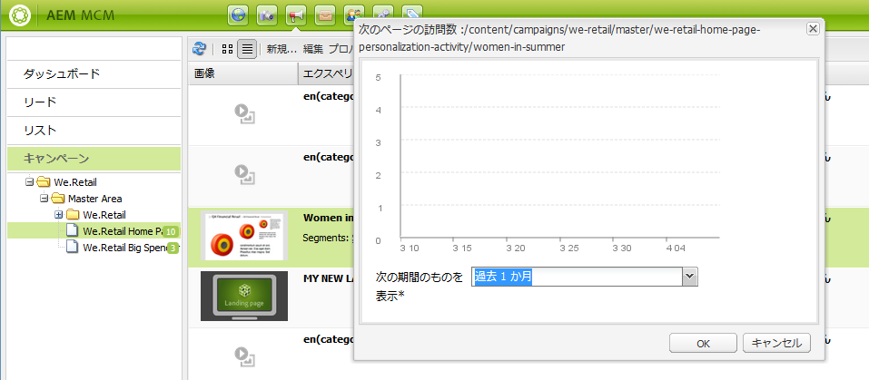

# Marketing Campaign Manager の使用{#working-with-the-marketing-campaign-manager}

AEM で、Marketing Campaign Manager（MCM）は、マルチチャネルのキャンペーンを管理できるコンソールです。このマーケティング自動化ソフトウェアを使用して、ブランド、キャンペーンおよびエクスペリエンスと、関連するセグメント、リスト、リードおよびレポートをすべて管理できます。

MCM は、AEM の様々な場所（スタートアップ画面など）から、キャンペーンアイコンや次の URL を使用してアクセスできます。

`https://<hostname>:<port>/libs/mcm/content/admin.html`

次に例を示します。

`https://localhost:4502/libs/mcm/content/admin.html`

MCM から、以下にアクセスできます。

* **[ダッシュボード](#dashboard)**&#x200B;以下の 4 つのウィンドウに分かれています。

   * [リスト](#lists)このウィンドウには作成済みのリストと、そのリスト内のリード数が表示されます。このウィンドウから直接新しいリストを作成したり、リードを読み込んで新しいリストを作成することができます。特定のリストを選択すると「[リスト](#lists)」セクションに移動し、リストの詳細が表示されます。

   * [セグメント](/help/sites-classic-ui-authoring/classic-personalization-campaigns.md#anoverviewofsegmentation)このウィンドウには定義済みのセグメントが表示されます。セグメントを使用して、特定の特性を共有する訪問者のコレクションに対してその特徴を設定できます。特定のセグメントを選択すると、セグメント定義ページが開きます。

   * [レポート](/help/sites-administering/reporting.md)インスタンスの状態を分析したり監視したりする際に役立つ各種のレポートが提供されます。この MCM ウィンドウにはレポートが一覧表示されます。レポートを選択すると、レポートページが開きます。

   * [キャンペーン](#campaigns)このウィンドウには[ニュースレター](/help/sites-classic-ui-authoring/classic-personalization-campaigns.md#newsletters)や[ティーザー](/help/sites-classic-ui-authoring/classic-personalization-campaigns.md#teasers)などのキャンペーンエクスペリエンスが一覧表示されます。

* **[リード](#leads)**&#x200B;このウィンドウでリードを管理できます。リードの作成または読み込みをおこなったり、個別のリードの詳細を編集したり、不要になった場合は削除したりできます。リードをリストと呼ばれる様々なグループに配置することもできます。**注意：**&#x200B;この機能がさらに強化される予定はありません。[Adobe Campaign や AEM との統合を利用](/help/sites-administering/campaign.md)することをお勧めします。

* **[リスト](#lists)**&#x200B;このウィンドウで（リードの）リストを管理できます。**注意：**&#x200B;この機能がさらに強化される予定はありません。[Adobe Campaign や AEM との統合を利用](/help/sites-administering/campaign.md)することをお勧めします。

* **[キャンペーン](#campaigns)**&#x200B;このウィンドウでブランド、キャンペーンおよびエクスペリエンスを管理できます。

## ダッシュボード {#dashboard}

ダッシュボードには、（リードの）リスト、セグメント、レポートおよびキャンペーンの概要を提供する 4 つのウィンドウが表示されます。ダッシュボードから、これらの基本機能にアクセスすることもできます。

### リード数 {#leads}

>[!NOTE]
>
>この機能（リードの管理）がさらに強化される予定はありません。
>[Adobe Campaign や AEM との統合を利用](/help/sites-administering/campaign.md)することをお勧めします。

AEM MCM では、リードの構成および追加ができます。これをおこなうには、リードを手動で入力するか、コンマ区切りのリスト（メーリングリストなど）を読み込みます。リードを生成する他の方法として、ニュースレターのサインアップやコミュニティのサインアップから生成する方法があります（設定済みであれば、これらのサインアップによってリードの情報を入力するワークフローを実行することができます）。通常、リードは分類され、リストに置かれます。これにより、リスト全体に対するアクションを後で実行することができます。例えば、特定のリストに対してカスタム電子メールを送信できます。

左側のウィンドウの「**リード**」では、リードの作成、読み込み、編集および削除を行い、必要に応じてアクティベートまたはアクティベート解除することができます。リードをリストに追加したり、リードが既に属しているリストを確認したりできます。

>[!NOTE]
>
>特定の作業について詳しくは、[リードの使用](/help/sites-classic-ui-authoring/classic-personalization-campaigns.md#workingwithleads)を参照してください。

### リスト {#lists}

>[!NOTE]
>
>この機能（リストの管理）がさらに強化される予定はありません。
>[Adobe Campaign や AEM との統合を利用](/help/sites-administering/campaign.md)することをお勧めします。

リストによって、リードをグループにまとめることができます。リストを使用すると、マーケティングキャンペーンの対象を、選択したリードのグループに設定できます。例えば、対象を設定したニュースレターをリストに送信することができます。

「**リスト**」では、リストの作成、読み込み、編集、統合および削除をおこないリストを管理します。これらのリストを必要に応じてアクティベートまたはアクティベート解除することができます。また、そのリスト内のリードを表示し、そのリストが別のリストのメンバーであるかを確認したり、詳細を表示することができます。

>[!NOTE]
>
>特定の作業について詳しくは、[リストの使用](/help/sites-classic-ui-authoring/classic-personalization-campaigns.md#workingwithlists)を参照してください。

### キャンペーン {#campaigns}

>[!NOTE]
>
>特定の作業について詳しくは、[ティーザーと戦略](/help/sites-classic-ui-authoring/classic-personalization-campaigns.md#workingwithlists)、[キャンペーンの設定](/help/sites-classic-ui-authoring/classic-personalization-campaigns.md#settingupyourcampaign)および[ニュースレター](/help/sites-classic-ui-authoring/classic-personalization-campaigns.md#newsletters)を参照してください。

既存のキャンペーンにアクセスするには、MCM で「**キャンペーン**」をクリックします。

* **左側のウィンドウ**：すべてのブランドとキャンペーンのリストが表示されます。ブランドをシングルクリックすると、次の両方の動作が行われます。

   * 左側のウィンドウでリストが展開され、関連するキャンペーンがすべて表示されます。このリストには、キャンペーンごとに存在するエクスペリエンスの数も表示されます。
   * 右側のウィンドウにブランドの概要が表示されます。

* **右側のウィンドウ**：ブランドごとにアイコンが表示されます（過去のキャンペーンは表示されません）。これらのアイコンをダブルクリックして、ブランドの概要を表示できます。

#### ブランドの概要 {#brand-overview}

ここから次の操作ができます。

* このブランドについて存在するキャンペーンおよびエクスペリエンスの数を表示します（左側のウィンドウに数が表示されます）。
* 「**新規...**」を選択してこのブランドの新しいキャンペーンを作成します。

* 表示されている期間を変更します。「**週**」、「**月**」または「**四半期**」を選択したり、矢印を使用して特定の期間を選択したり、「**今日**」に戻ったりします。

* （右側のウィンドウで）キャンペーンを選択し、次の操作をおこないます。

   * 「**プロパティ...**」を選択してプロパティを編集します。
   * 「**削除**」を選択してキャンペーンを削除します。

* キャンペーンの概要を表示します（右側のウィンドウでキャンペーンをダブルクリックするか、左側のウィンドウでシングルクリックします）。

#### キャンペーンの概要 {#campaign-overview}

個々のキャンペーンで、次の 2 つの表示を使用できます。

1. **カレンダー表示**

   次のアイコンを使用します。

   

   すべてのタッチポイント（グレー）のリストと、そのタッチポイントに関連付けられているエクスペリエンスの期間（緑）が横方向に表示されます。

   

   ここから次の操作ができます。

   * 矢印を使用して表示されている期間を変更したり、「**今日**」に戻ったりします。

   * 「**タッチポイントを追加...**」を使用して、既存のエクスペリエンスに対して新しいタッチポイントを追加します。

   * （右側のウィンドウで）ティーザーをクリックして、「**オンタイム**」および「**オフタイム**」を設定します。

1. **リスト表示**

   次のアイコンを使用します。

   

   選択したキャンペーンのすべてのエクスペリエンス（Teaser やニュースレターなど）が一覧表示されます。

   

   ここから次の操作ができます。

   * Create a **New...** experience; for example, Adobe Target offers, teasers and newsletters.
   * 「**編集**」を使用して、特定のティーザーページまたはニュースレターの詳細を編集します（ダブルクリックも使用できます）。
   * 「**プロパティ...**」を使用して、特定のティーザーページまたはニュースレターのプロパティを定義します。
   * 「**シミュレート**」を使用して、エクスペリエンス（ティーザーページやニュースレター）の外観と操作性をシミュレートします。シミュレートのページが表示されているとき、サイドキックを開いてそのページの編集モードに切り替えることができます。

   * 「**分析...**」を使用して、ページに対して生み出されたインプレッションを分析します。

   * 「**削除**」を使用して、不要になった項目を削除します。
   * 「**検索**」を使用して、テキストを検索します（エクスペリエンスのタイトルフィールドが検索されます）。
   * 「**詳細**」検索を使用して、検索結果にフィルターを適用します。

### キャンペーンエクスペリエンスのシミュレート {#simulating-your-campaign-experiences}

MCM で「**キャンペーン**」をクリックします。リスト表示がアクティブであることを確認し、必要なキャンペーンエクスペリエンスを選択して、「**シミュレート**」をクリックします。タッチポイント（ティーザーまたはニュースレターのページ）が開き、選択したエクスペリエンスが訪問者に表示されるとおりに表示されます。

ここからサイドキックを開き（小さい下向き矢印をクリック）、編集モードに変更してページを更新することもできます。

### キャンペーンエクスペリエンスの分析 {#analyzing-your-campaign-experiences}

MCM で「**キャンペーン**」をクリックします。リスト表示がアクティブであることを確認し、必要なキャンペーンエクスペリエンスを選択して、「**分析...**」を選択します。期間中のページの訪問数のグラフが表示されます。

